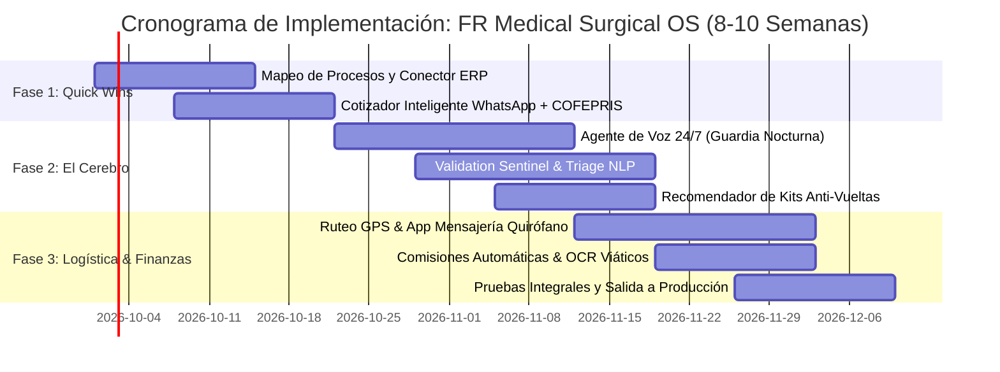

# 🧭 GUÍA EJECUTIVA: CÓMO EXPLICAR EL FLUJO DE PILARES Y DESARROLLO A FR MEDICAL
*Manual de Explicación en Vivo para Leonardo, María y Fabián durante el Taller.*

---

## 💡 1. LA ANALOGÍA MAESTRA (Para abrir en 30 segundos)

> *"Doctor, Licenciada: Imaginen que FR Medical hoy tiene un auto de carreras muy potente (sus productos de alta especialidad y su cartera de cirujanos), pero el motor se está sobrecalentando porque los cambios de velocidad los hacen a mano con una palanca rota (las cotizaciones lentas, la brecha de 12 a 7 AM, los mensajeros dando vueltas dobles y la contadora con calculadora física).  
> **Nosotros no venimos a cambiarles el auto ni a tirar su ERP.** Venimos a instalarles la computadora de viaje inteligente (**FR Medical Surgical OS**) que automatiza las cotizaciones, vigila las urgencias 24/7 y le da a sus mensajeros y doctores certeza quirúrgica."*

---

## 🔄 2. EL FLUJO DE LOS 4 PILARES EN LA VIDA REAL: "El Caso de las 2:15 AM"

Explíquenlo contando **una sola historia continua**. Esta historia une los 4 pilares de forma orgánica:

```
[ 2:15 AM: Llamada/WhatsApp ] 
       ↓ (Pilar 1: Frente Clínico)
[ Cotización oficial COFEPRIS en 1.8s + Semáforo Crédito ]
       ↓ (Pilar 2: Triage Quirúrgico)
[ Triage Código Rojo + Kit Anti-Vueltas + Ruta GPS ]
       ↓ (Pilar 3: Sentinel & ERP)
[ Auditoría en 0.8s + Cero Espera 7 AM + Sincronización ERP ]
       ↓ (Pilar 4: Living SOPs & Finanzas)
[ Entrega con Firma Digital + OCR Viáticos + Comisión Automática ]
```

### 📍 Paso 1: Pilar 1 (Speed-to-Quote & Captura 24/7)
*   **La Escena:** Es viernes a las 2:15 AM. Un cirujano en el Hospital Ángeles Pedregal necesita fijación costal (Stracos) para un paciente de trauma torácico urgente.
*   **Qué pasa con BluePixel:** La llamada entra al conmutador. Como es de madrugada, el **Agente de Guardia IA** contesta al 2do timbrazo con tono médico empático. Al mismo tiempo, si escriben por WhatsApp, atiende al instante.
*   **El Resultado:** En **1.8 segundos** genera la cotización PDF oficial con clave de catálogo y registro sanitario **COFEPRIS**.
*   **El Semáforo de Crédito:** Detecta que es el Hospital Ángeles (Convenio AAA) y autoriza el despacho inmediato contra folio hospitalario, sin trabar la cirugía pidiendo anticipos absurdos.

### 📍 Paso 2: Pilar 2 (Surgical Logistics & Route Dispatcher)
*   **La Escena:** El pedido ya está generado, pero no puede tratarse como un paquete común.
*   **Qué pasa con BluePixel:** El **Motor de Triage NLP** lee las notas del médico (*"paciente en sala de choque, tórax inestable"*) y clasifica la orden en automático como **CÓDIGO ROJO (< 2 horas)**.
*   **El Kit Anti-Vueltas:** La IA sabe que en fijación costal suelen requerirse tornillos adicionales o pinzas especiales; **añade el kit de respaldo en la misma orden**. Esto evita que a mitad de la cirugía el hospital llame exigiendo piezas extra y el mensajero tenga que dar una segunda o tercera vuelta a la CDMX.
*   **Logística Inteligente:** El optimizador ubica al mensajero de guardia más cercano y le manda la ruta optimizada con GPS. El cirujano recibe un link de rastreo con la hora exacta de llegada a quirófano.

### 📍 Paso 3: Pilar 3 (Validation Sentinel & ERP Sync Bridge)
*   **La Escena:** Históricamente, este pedido nocturno se quedaba "dormido" hasta las 7:00 AM esperando que un administrativo llegara a la oficina a revisarlo y meterlo al ERP.
*   **Qué pasa con BluePixel:** Entra en acción el **Validation Sentinel**. En **0.8 segundos**, la IA audita que los códigos existan, que los precios coincidan con el convenio del hospital y que haya stock físico en almacén.
*   **Auto-Aprobación Inmediata:** Despierta al mensajero en su celular con la orden ya aprobada a las 2:18 AM.
*   **Sincronización ERP en Vivo:** El conector ligero inyecta el pedido en el ERP actual de FR Medical en 0.5 segundos. Descuenta el inventario al momento (evita vender stock fantasma a otro hospital) y deja la remisión lista para timbrar CFDI 4.0 cuando el doctor firme de recibido.

### 📍 Paso 4: Pilar 4 (Living SOPs & Automatización Financiera)
*   **La Escena:** El mensajero llega a quirófano, entrega el material y regresa a base.
*   **Qué pasa con BluePixel:** El mensajero nuevo no tiene que memorizar procesos complejos; su celular le da el **Living SOP** paso a paso: *"Solicitar firma de remisión al instrumentista, tomar foto del kit abierto"*.
*   **Finanzas sin Calculadora:** El mensajero gasta $350 en gasolina y casetas; le toma una foto al ticket por WhatsApp y el **OCR de Viáticos** extrae el monto, RFC y concepto, cargándolo directo a la contabilidad.
*   **Comisión Automática:** La contadora ya no tiene que hacer sumatorias a fin de mes en una calculadora física; el sistema calcula la comisión exacta del vendedor según el margen del producto y la deja lista para pago en un clic.

---

## 🏗️ 3. EL FLUJO DEL DESARROLLO (Roadmap de Implementación)

Cuando el cliente pregunte: *"¿Cómo se construye esto? ¿Va a detener mi operación actual?"*, la respuesta de BluePixel es: **NO, se construye de manera modular en 3 etapas ágiles de 8 a 10 semanas sin tocar su operación diaria:**



### 🔹 Etapa 1: Quick Wins & Cimientos (Semanas 1 a 3)
*   **Objetivo:** Darles valor inmediato en menos de 20 días.
*   **Qué entregamos:**
    1. Conexión ligera y segura con la base de datos de su ERP actual.
    2. Cotizador inteligente en WhatsApp: cualquier vendedor o cliente puede cotizar con claves de catálogo y obtener el PDF con registros COFEPRIS en 30 segundos.
*   **Impacto para el cliente:** Alivio inmediato en la carga de trabajo del equipo de ventas; ya no pasan horas armando cotizaciones en Word/Excel.

### 🔹 Etapa 2: El Cerebro 24/7 & Validación Automática (Semanas 4 a 6)
*   **Objetivo:** Eliminar por completo la brecha de 12:00 AM a 7:00 AM y los pedidos congelados.
*   **Qué entregamos:**
    1. Agente de Voz telefónico 24/7 para el conmutador nocturno.
    2. Motor de Triage Quirúrgico (clasificación objetiva Código Rojo/Amarillo/Verde).
    3. Validation Sentinel (auto-aprobación de órdenes en 0.8s).
    4. Recomendador de Kits de Respaldo (Anti-Vueltas).
*   **Impacto para el cliente:** Cero llamadas perdidas; rescate de ventas nocturnas de $50k a $150k MXN; almacén despacha en 15 minutos en la madrugada.

### 🔹 Etapa 3: Logística GPS & Paz Contable (Semanas 7 a 10)
*   **Objetivo:** Blindar la entrega en quirófano y automatizar las comisiones y gastos.
*   **Qué entregamos:**
    1. Tablero logístico con optimización de rutas y tracking GPS en tiempo real para médicos y jefes de compras.
    2. Living SOPs: flujos guiados en WhatsApp y App para mensajeros.
    3. Módulo contable: cálculo automático de comisiones por margen y OCR de viáticos por foto de ticket.
*   **Impacto para el cliente:** Ahorro en gasolina y viáticos (fin a las vueltas dobles), reducción del estrés contable a fin de mes y trazabilidad total de entregas.

### 🔹 Fase Evolve (Acompañamiento Continuo post-lanzamiento)
*   Soporte técnico con SLA 99.9% de disponibilidad operativa.
*   Actualización continua de SKUs, fichas técnicas y normativas COFEPRIS.
*   Ajuste y reentrenamiento de los modelos de IA conforme FR Medical incorpore nuevas marcas o líneas de productos.

---

## 🎯 4. SCRIPT EN VIVO: CÓMO DECIRLO EN LA MESA AHORA MISMO

Si Leonardo o María toman la palabra en la mesa, este es el guion exacto:

> *"Para resumir cómo se vive esto en la práctica:
> 
> Imaginen que hoy un cirujano les llama a las 2:00 AM. Nadie contesta, o si contesta el vendedor, tiene que esperar hasta las 7:30 AM a que alguien revise si hay inventario y si el hospital tiene crédito. Para entonces, la cirugía ya pasó o compraron con otro proveedor.
> 
> Con **FR Medical Surgical OS**:
> 1. **A las 2:00 AM** atiende la IA por voz o WhatsApp, cotiza con registro COFEPRIS y valida el crédito del hospital en 2 segundos.
> 2. **El sistema detecta que es Código Rojo**, le agrega las grapas y tornillos de respaldo para que el mensajero no tenga que dar dos vueltas, y traza la ruta más rápida con GPS.
> 3. **El Validation Sentinel aprueba la orden en 0.8 segundos** y sincroniza el ERP al instante. El mensajero sale de inmediato con la ruta en su celular.
> 4. **A la entrega**, el doctor firma en pantalla, el mensajero le toma foto al ticket de gasolina y la contadora ya tiene el gasto conciliado y la comisión del vendedor calculada.
> 
> Y lo mejor de todo: **no tenemos que tirar su ERP ni parar la empresa un solo día.** En 8 a 10 semanas lo implementamos de forma modular, viendo resultados desde las primeras dos semanas con el cotizador automático.
> 
> ¿Hace sentido esta visión para blindar la operación de FR Medical?"*
