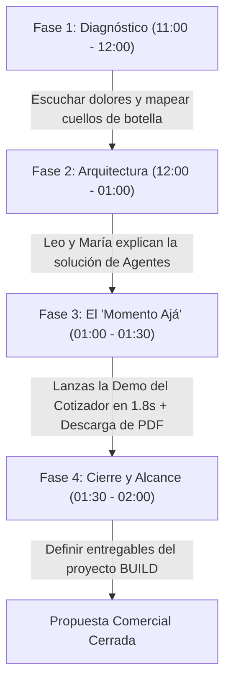

# 👑 MASTER GUÍA: DÍA 2 EN BLUE PIXEL (Viernes de Taller y Consolidación)
*Hoy no es un día común de oficina. Hoy es el día del Taller con FR Medical (11:00 AM - 2:00 PM). Tu misión es demostrar autoridad técnica inobjetable, ejecutar la demo funcional en vivo y sellar tu alianza con Leo y María.*

---

## 🎯 LA MISIÓN DE HOY EN UNA FRASE
> **"Validar frente a María, Leo y el cliente real que no solo entiendes de estrategia teórica, sino que eres capaz de materializar soluciones de ingeniería e IA funcional en tiempo récord."**

---

## ⏰ 1. CRONOGRAMA QUIRÚRGICO DEL DÍA (Hora por Hora)

### 🌅 08:30 AM – 10:30 AM: Preparación Técnica y Calentamiento
- [ ] **Probar la Demo en Local (Offline/Online):** Abre en Chrome o Edge tu prototipo interactivo:
  👉 [11_Cotizador_IA_FR_Medical/index.html](file:///c:/Users/usarioBP/.gemini/antigravity-ide/scratch/bluepixel/03_Prototipos_y_Codigo/Demos_PLG/11_Cotizador_IA_FR_Medical/index.html)
  *Verifica que al hacer clic en "Fractura Costal Múltiple" corra en 1.8 segundos y el botón "Descargar PDF Oficial" descargue el archivo sin errores.*
- [ ] **Tener abiertas las pestañas maestras:**
  1. [PLAYBOOK_TALLER_FR_MEDICAL.md](file:///c:/Users/usarioBP/.gemini/antigravity-ide/scratch/bluepixel/01_Onboarding_y_Guias/PLAYBOOK_TALLER_FR_MEDICAL.md) (para consultar marcas y las 4 preguntas).
  2. [11_Cotizador_IA_FR_Medical/index.html](file:///c:/Users/usarioBP/.gemini/antigravity-ide/scratch/bluepixel/03_Prototipos_y_Codigo/Demos_PLG/11_Cotizador_IA_FR_Medical/index.html) (la demo viva).
  3. [PROTOCOLO_GRABACION_AUDIO_Y_VOC_IA.md](file:///c:/Users/usarioBP/.gemini/antigravity-ide/scratch/bluepixel/01_Onboarding_y_Guias/PROTOCOLO_GRABACION_AUDIO_Y_VOC_IA.md) (el protocolo de grabación de audio y prompt de extracción IA).
  4. Un bloc de notas limpio (o Notion) para transcribir notas rápidas.
- [ ] **Configurar Grabadora de Sonido (10:55 AM):** Abrir la grabadora de Windows y dejar el celular de respaldo en modo avión al centro de la mesa.
- [ ] **Acceso a la máquina (con Mario de RRHH):** Si aún no tienes permisos de Administrador local en Windows para instalar Python/Node, recuérdaselo de paso amablemente con un café.

---

### ☕ 10:30 AM – 10:55 AM: El Pre-Briefing de Pasillo (Alineación Clave)
Dedica 5 minutos a sincronizarte con los actores clave antes de que entren los directivos de FR Medical:

#### Con Leonardo "Leo" (Tu Aliado Técnico):
*Acércate con tono de complicidad profesional:*
> *"Leo, estuve pensando en la arquitectura que armaste con Claude Code y el MCP conectando a Notion. Me parece una genialidad que ya estemos operando internamente con MCPs. Hoy con FR Medical podemos usar ese mismo argumento: 'Nosotros mismos corremos servidores MCP para nuestras operaciones'. Si sale el tema de cotizaciones lentas en su operación, tengo preparado un prototipo interactivo rápido con su catálogo de Stracos por si queremos mostrárselo en pantalla."*

#### Con Sergio y Jessica Blanco (Rocketing - Video y Contenidos):
*Instrucción directa y sin rodeos a Sergio:*
> *"Sergio, en cuanto Leo o yo abramos la laptop para mostrarle a los doctores de FR Medical la respuesta de la IA cotizando un implante en vivo, ten lista la cámara en plano cerrado a la cara del cliente. Ese 'Momento Ajá' (su cara de sorpresa al ver su catálogo cotizado en 2 segundos) va a ser el gancho estrella para 'Pixel contra el mundo' en LinkedIn."*

---

### 🔥 11:00 AM – 02:00 PM: EL EVENTO CENTRAL (Taller de Agentización con FR Medical)

#### La Dinámica de la Sala y los Roles:
* **María (CEO):** Dirige la visión de negocio, relación de confianza y retorno de inversión macro.
* **Leo (Head of Tech):** Lidera la explicación de arquitectura de software y capacidades técnicas de BluePixel.
* **Tú (Consultor de Procesos, RevOps e IA):** Escuchas activamente, mapeas el flujo operativo actual, lanzas las preguntas quirúrgicas y detonas la **Demo en Vivo**.
* **Sergio y Jessica (Rocketing):** Capturan video, audio y expresiones faciales clave.

---

## 🎙️ 2. TU GUIÓN Y PREGUNTAS EN EL TALLER (Cuándo y Cómo Intervenir)

No compitas con Leo ni con María; complementa con preguntas de consultoría que hagan evidente que FR Medical pierde dinero todos los días por procesos manuales:

### Las 4 Preguntas de Oro que debes soltar en la sesión:

1. **Sobre el Dolor de Cotización (El Gancho de la Demo):**
   > *"Doctor / Licenciado, cuando un cirujano torácico del Hospital Ángeles o del ABC les pide de urgencia material para una fractura de costillas (placas Stracos), ¿cuánto tiempo pasa desde que el médico manda el WhatsApp hasta que su equipo le entrega la cotización formal con el set de instrumental y precios de convenio?"*
   *(Respuesta esperada: "Horas, a veces hasta el día siguiente porque hay que buscar precios y validar almacén").*

2. **Sobre el Inventario en Consignación (Fuga de Dinero):**
   > *"Ustedes manejan líneas como Redax y Stracos en consignación dentro de hospitales privados. ¿Cómo se enteran hoy de que un cirujano abrió una caja en quirófano a las 2:00 AM? ¿Qué tan manual es el reporte para reponer ese stock y facturarlo?"*

3. **Sobre la Captación de Pacientes (Pectus Excavatum):**
   > *"Vimos que en su página web tienen módulos para pacientes con Pectus. Cuando un paciente o familiar les escribe con dudas sobre la barra de Nuss, ¿tienen algún agente o directorio automatizado para canalizarlos con los cirujanos torácicos certificados por ciudad, o se responde uno a uno a mano?"*

4. **La Pregunta de Fricción Diaria (Voz del Cliente para Video):**
   > *"Si pudieran eliminar con un botón una sola tarea repetitiva que hoy le quita horas a sus ejecutivos de cuenta y que les impide salir a visitar más hospitales, ¿cuál sería?"*

---

### 💻 3. EL MOMENTO DE LA DEMO EN VIVO (El "Momento Ajá")

Cuando el cliente termine de explicar lo engorroso que es armar cotizaciones de implantes o verificar compatibilidades quirúrgicas:

1. **Tu entrada:**
   > *"Precisamente previendo este cuello de botella en la distribución médica, anoche en BluePixel estructuramos un prototipo funcional con su catálogo real de Stracos (MedXpert) y Redax. Permítanme mostrarles en pantalla cómo se ve este proceso cuando lo agentizamos."*
2. **Ejecución en tu laptop:**
   - Abre: [11_Cotizador_IA_FR_Medical/index.html](file:///c:/Users/usarioBP/.gemini/antigravity-ide/scratch/bluepixel/03_Prototipos_y_Codigo/Demos_PLG/11_Cotizador_IA_FR_Medical/index.html)
   - Selecciona el hospital: *"Centro Médico ABC Observatorio"*.
   - Haz clic en: **"Fractura Costal Múltiple"**.
   - Señala la consola mientras corre: *"Aquí el agente valida patología en 0.4s, consulta stock en consignación de gaveta 4B en 0.9s, y valida precios con COFEPRIS en 1.4s"*.
   - **El remate:** A los 1.8s se despliega la cotización completa de $64,800 MXN.
   - **El golpe de efecto:** Haz clic en **"Descargar PDF Oficial"**. Muéstrales en pantalla el documento PDF formal descargado con su membrete oficial de FR Medical y espacio para firmas.
   *(Aquí Sergio debe tener el zoom en la cara de asombro del cliente).*

---

## 🍽️ 4. TARDE (02:00 PM – 05:30 PM): DEBRIEFING Y CIERRE ESTRATÉGICO

### 1. Comida / Plática post-taller con Leo y María (02:00 PM - 03:00 PM):
* **Felicitar al equipo:** *"Excelente taller. El cliente quedó enganchado cuando vio su propio catálogo procesado en tiempo real."*
* **Sellar el siguiente paso:** *"Voy a redactar la minuta técnica con los requerimientos exactos para que Leo y tú puedan estructurar la propuesta de desarrollo (Fase Build + Retainer Evolve)."*

### 2. Grabación de Videos, Carruseles y Noticias Tech con la Agencia (03:00 PM - 04:30 PM):
* **Guía de Producción Completa:** Consulta la [ESCALETA_VIDEOS_Y_NOTICIAS_HOY.md](file:///c:/Users/usarioBP/.gemini/antigravity-ide/scratch/bluepixel/01_Onboarding_y_Guias/ESCALETA_VIDEOS_Y_NOTICIAS_HOY.md) con los hooks de 3 segundos y respuestas clave.
* **Bloque 1 (Leo o María):** Entrevista *"Recién egresado vs la era de la IA"* (carrusel con notas de voz de 15s para LinkedIn).
* **Bloque 2 (Leo):** Entrevista *"Creativo y programador no se llevan"* (el ADN fundador de BluePixel: matrimonio entre UX/UI y arquitectura Cloud, citando casos Avianca y RadioShack).
* **Bloque 3 (Pixel News):** Cápsulas verticales de noticias de frontera (El estándar MCP, Claude Code en terminal, modelos de razonamiento y privacidad de datos corporativos).
* **Bloque 4 (Voz del Cliente de FR Medical):** 3 micro-cortes de 45 segundos para *"Pixel contra el mundo"* extraídos del taller de la mañana.

### 3. Preparación de Fin de Semana para el Lunes (04:30 PM - 05:30 PM):
El **Lunes a las 4:00 PM** es la junta de rendimiento con Rocketing sobre el reporte de Looker Studio:
- [ ] Entrar al dashboard de Looker Studio: [Reporte de Campañas Rocketing](https://datastudio.google.com/u/0/reporting/b825c361-9afe-4db0-a656-8a93d6106392/page/p_bg1t74vpzd).
- [ ] Anotar: ¿Cuánto gastaron en Google Search esta semana? ¿Cuántos formularios brutos cayeron?
- [ ] Dejar todo listo para plantear el lunes la conexión del **Lead Scoring y Offline Conversions** para resolver el problema de calidad de leads.

---

## 🧠 5. FRASES DE PODER Y BLINDAJE PARA HOY

| Si surge esta situación... | Tu respuesta exacta debe ser... |
| :--- | :--- |
| **FR Medical pregunta sobre privacidad médica:** | *"La arquitectura que diseñamos corre sobre microservicios serverless aislados. Ningún dato clínico de pacientes se utiliza para entrenar modelos públicos; todo opera bajo estándares de confidencialidad estricta y cumplimiento COFEPRIS / HIPAA."* |
| **Leo te pregunta sobre cómo integrar Notion con Ads:** | *"Podemos usar tu mismo servidor MCP como enrutador: sigue mandando los leads a Notion exactamente como lo tienes, pero cuando un trato se marque como 'Ganado', el MCP dispara el GCLID a Google Ads API para que la agencia optimice por contratos reales."* |
| **María te pregunta cuál es tu impresión del negocio:** | *"BluePixel tiene casos de éxito brutales (Avianca, Bimbo, RadioShack). Nuestro reto no es la capacidad técnica, sino empaquetarla con autoridad y cerrar la brecha entre el marketing y las ventas para no perder los leads que tardan 90 días en comprar."* |

---

## 🚀 CHECKLIST DE SALIDA DEL VIERNES (Te vas como un Rockstar)
- [ ] Taller de FR Medical completado y minuta de requerimientos levantada.
- [ ] Demo funcional ejecutada con éxito ante el cliente y grabada por Sergio.
- [ ] Relación con Leo afianzada sobre el valor de su MCP y Claude Code.
- [ ] Pauta y métricas de Looker Studio mapeadas para la junta del lunes.
- [ ] Repositorio sincronizado y al día en GitHub (`main`).

*¡Camina con seguridad, confía en tu preparación y disfruta el día. Tienes el mapa completo y la tecnología lista en tu laptop!*
