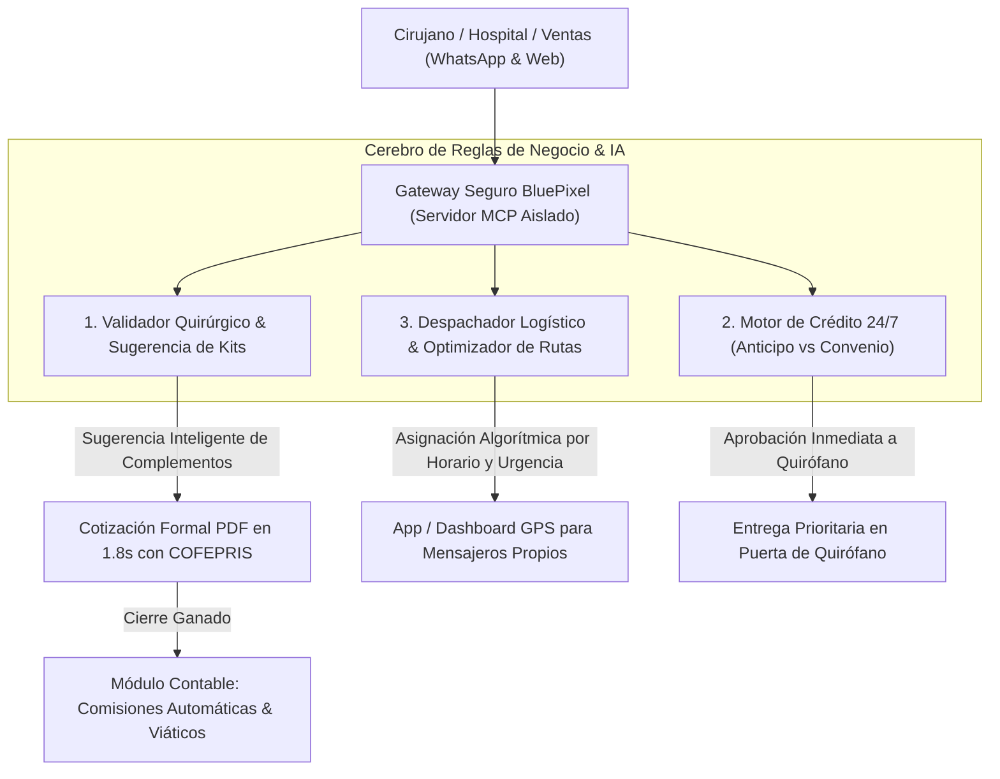

# 🏥 MINUTA TÉCNICA Y DIAGNÓSTICO OPERATIVO: TALLER CON FR MEDICAL
*Levantamiento Forense de Procesos, Cuellos de Botella Reales y Arquitectura de Solución con IA.*  
**Fecha:** Viernes, 11 de Septiembre de 2026 (11:00 AM – 2:00 PM)  
**Cliente:** FR Medical S.A. de C.V. (`frmedical.com.mx`)  
**Participantes:** Contadora y Equipo Administrativo/Comercial de FR Medical, Leonardo Flores, María, Fabián Flores, Jessica Blanco y Sergio Blanco (Rocketing).

---

## 🎯 1. RESUMEN EJECUTIVO DE LA SESIÓN

Durante las primeras dos horas de diagnóstico profundo, el equipo directivo y contable de FR Medical expuso que, aunque cuentan con algunas herramientas y procesos semiautomatizados, su operación diaria sufre de **vacíos de información, lentitud crítica en cotizaciones, descontrol logístico en quirófano y procesos financieros manuales con calculadora**.

La empresa opera 24/7 atendiendo cirugías cardiotorácicas y traumatológicas de alta especialidad (Stracos, Redax, Boston Medical), pero su infraestructura actual no distingue urgencias médicas de cotizaciones ordinarias, provocando **retrasos en cirugías, fletes dobles por mensajeros y fricción contable**.

---

## 🔬 2. RADIOGRAFÍA DE DOLORES OPERATIVOS (PAIN POINTS CONFESADOS)

### 2.1 La Cotización Quirúrgica es Pesada y se Opera "Por Suposiciones":
*   **Vacíos de Información:** Los ejecutivos emiten cotizaciones basadas en suposiciones porque no existe un repositorio unificado que valide compatibilidades quirúrgicas.
*   **Fichas Técnicas y Regulación COFEPRIS:** La cotización no incluye automáticamente los números de registro sanitario de COFEPRIS ni las fichas técnicas normadas que exige el hospital.
*   **Falta de SOPs Estandarizados:** Cada ejecutivo o administrativo cotiza con formatos distintos y criterios arbitrarios antes de emitir la orden.

### 2.2 El Desastre Logístico en Quirófano y las Múltiples Vueltas de Mensajeros:
*   **Pedidos Fragmentados:** Cuando un cirujano está en quirófano operando una fractura de costillas o una deformidad de Pectus, frecuentemente requiere **complementos de último minuto** (grapas de titanio adicionales, sondas de drenaje o instrumental especializado).
*   **Mensajeros Propios y Fletes Duplicados:** FR Medical cuenta con su propia plantilla de mensajeros. Al no existir una validación inteligente de pedidos, **los mensajeros se ven forzados a dar 2 o 3 vueltas al mismo hospital en el mismo día**, disparando costos de gasolina, viáticos y desgaste operativo.
*   **Falta de Mapeo de Tiempos y Ventanas de Quirófano:** No cuentan con un cálculo estimado de "tiempo de traslado/vuelo" desde que el hospital pide el material hasta que se entrega en la puerta de quirófano.

### 2.3 Automatización de Rutas y Horarios para Priorizar Entregas Críticas:
*   **Falta de Enrutamiento Inteligente:** Las entregas se asignan de forma reactiva sin optimización geográfica ni horaria en la CDMX y zona metropolitana.
*   **Necesidad de Priorización por Criticidad Quirúrgica:** Una cirugía de urgencia (trauma por accidente en Hospital Ángeles) debe tener prioridad absoluta de ruta sobre una reposición de stock programada para el lunes.
*   **Rastreo GPS y Dashboard Operativo:** Urge implementar un panel visual en tiempo real para rastrear la ubicación de los mensajeros, tiempos estimados de arribo (ETA) y confirmación digital de entrega en quirófano.

### 2.4 El Dilema Financiero: Cirugías 24 Horas con o sin Anticipo:
*   **Guardias 24/7 sin Reglas Claras:** El personal administrativo y de guardia recibe pedidos de madrugada sin saber si deben exigir anticipo o despachar el material de inmediato.
*   **Riesgo de Cartera Vencida vs. Vidas Humanas:** Si exigen anticipo a las 3:00 AM, pueden entorpecer una cirugía urgente; si despachan sin validar, arriesgan facturas no cobradas si el médico o paciente no tenían convenio autorizado.
*   **Evaluaciones Manuales de Clientes:** No hay un semáforo de riesgo crediticio que indique si el hospital tiene línea de crédito abierta o requiere pago previo.

### 2.5 Contabilidad, Comisiones en Calculadora y Viáticos:
*   **Cálculo de Comisiones a Mano:** La contadora realiza el cálculo de comisiones de los vendedores utilizando calculadora física y hojas de cálculo desvinculadas, generando reclamos y fricción a fin de mes.
*   **Falta de Plataforma Visual para Logros Comerciales:** Los vendedores no tienen visibilidad en tiempo real de sus metas cumplidas, comisiones acumuladas ni objetivos por línea de producto (Stracos vs Redax).
*   **Comprobación y Seguimiento de Viáticos:** El personal en campo y mensajeros generan comprobaciones de gastos manuales que sobrecargan al área contable en conciliaciones bancarias.

### 2.6 Proceso de Captación de Leads Indiscriminado:
*   **Tratamiento Plano sin Priorización:** Los formularios de contacto web no filtran por línea de producto ni por nivel de urgencia. Un jefe de compras corporativo recibe el mismo trato que un paciente que busca orientación general.

### 2.7 Llamadas Perdidas Fuera de Horario Laboral y Fuga de Ventas Nocturnas:
*   **El Teléfono que Nadie Contesta a las 2:00 AM:** Fuera del horario laboral (noches, madrugadas y fines de semana), entran llamadas de urgencia de hospitales o cirujanos y **no se alcanzan a contestar por falta de personal de guardia suficiente**.
*   **Pérdida Inmediata de Ventas High-Ticket:** Cuando un cirujano torácico o traumatólogo necesita un set de placas Stracos o un drenaje Redax para una cirugía nocturna en el Hospital Ángeles o Médica Sur y nadie responde, llama a otro distribuidor de la competencia. **FR Medical pierde en un minuto una venta de $50,000 a $150,000 MXN**.
*   **Requerimiento Vital:** Un **Bot Asistente de IA activo 24 horas** capaz de atender la llamada telefónica en lenguaje natural o recibir el mensaje por WhatsApp, cotizar en el acto y despachar el PDF formal sin depender de que un humano esté despierto al lado del conmutador.

### 2.8 El Síndrome de la "Urgencia en Texto Libre" (Ceguera y Subjetividad Operativa):
*   **Cero Datos Claros de Urgencia:** Actualmente no existen parámetros objetivos ni campos clínicos estructurados para determinar qué constituye una emergencia médica real.
*   **Todo Depende del Criterio del Vendedor:** La urgencia solo se marca si el vendedor decide escribir la palabra "urgente" dentro del campo de notas o *"información adicional"* durante el registro.
*   **Las Consecuencias Críticas de este Vacío:**
    1. *El fenómeno 'Si todo es urgente, nada es urgente':* Los vendedores tienden a etiquetar todo como urgente para que almacén procese sus pedidos primero, saturando la operación.
    2. *Dato Sepultado sin Automatización:* Al ser una simple nota de texto libre, el sistema no la reconoce como variable algorítmica: no detona alertas push, no enruta al mensajero más cercano ni reorganiza la fila de pedidos.
    3. *Riesgo Quirúrgico Severo:* Una fractura costal múltiple con paciente en quirófano anestesiado puede quedar formada detrás de una reposición rutinaria de stock, solo porque el administrativo no abrió la orden para leer el campo de notas.

---

## 🤖 3. ARQUITECTURA DE SOLUCIÓN PROPUESTA POR BLUEPIXEL

Para resolver de raíz estos 6 cuellos de botella, BluePixel propone un ecosistema modular de **Agentes de IA e Infraestructura Logística**:

### Módulo 1: Cotizador Quirúrgico con Sugerencia Automática de Kits (Anti-Vueltas)
*   **Cómo opera:** Al cotizar un procedimiento (ej. Fractura Costal Múltiple con placas Stracos), el agente no solo agrega las placas; **sugiere de inmediato el instrumental de fijación, tornillos de titanio y drenaje pleural Redax correspondiente**.
*   **Impacto directo:** Elimina de raíz la necesidad de que el mensajero dé una segunda vuelta al quirófano a mitad de la cirugía.
*   **Compliance:** Inserta automáticamente los números de registro sanitario autorizados por COFEPRIS y genera el PDF formal membretado en menos de 2 segundos.

### Módulo 2: Automatizador de Rutas, Horarios y Despacho Logístico (GPS Dashboard)
*   **Priorización Inteligente por Criticidad:**
    *   **Nivel 1 (Emergencia de Quirófano en Curso):** Despacho prioritario inmediato, asignación de mensajero más cercano y cálculo de ruta más rápida.
    *   **Nivel 2 (Cirugía Programada en 24-48 hrs):** Consolidación en rutas horarias optimizadas para minimizar consumo de gasolina.
    *   **Nivel 3 (Reabastecimiento de Gaveta / Consignación):** Rutas programadas en horarios valle.
*   **Tiempo de Vuelo/Traslado Estimado:** El sistema calcula el tiempo real de entrega considerando tráfico y ubicación del hospital (Ángeles Lomas, ABC Santa Fe, Médica Sur, etc.) y envía un link de rastreo GPS al cirujano o jefe de quirófano.
*   **Dashboard para Supervisión de Mensajería:** Panel visual para los administradores que monitorea pedidos en tránsito, paradas realizadas y confirmaciones de entrega con firma digital.

### Módulo 3: Motor de Reglas Financieras 24/7 y Crédito Hospitalario
*   **Semáforo de Autorización Nocturna:** El agente consulta la base de datos de convenios institucionales:
    *   *Hospital con convenio AAA (Ángeles, Médica Sur):* Se autoriza la salida inmediata del implante a las 3:00 AM con folio de quirófano sin requerir anticipo bancario en ese instante.
    *   *Médico particular / Hospital sin convenio previo:* El agente genera un link de pago digital de anticipo por WhatsApp o envía una alerta de validación urgente al directivo de guardia.

### Módulo 4: Portal Visual de Comisiones y Control de Gastos/Viáticos
*   **Liquidación Automática de Comisiones:** Cada orden facturada calcula la comisión exacta del representante según su cuota y meta mensual. Se elimina el uso de calculadoras físicas.
*   **Comprobación Rápida de Viáticos:** Los mensajeros y ejecutivos en campo suben fotografía de tickets de gasolina y casetas por WhatsApp; el sistema extrae montos mediante OCR y concilia automáticamente con la contabilidad.

### Módulo 5: Agente de Guardia 24/7 Multicanal (Voz IA Telefónica + WhatsApp)
*   **Atención Inmediata al Primer Timbrazo:** Si entra una llamada a las 2:00 AM y el conmutador o personal de guardia no responde en 3 timbrazos, el **Agente de Voz IA de BluePixel** atiende en lenguaje natural cálido y médico.
*   **Flujo Conversacional de Urgencia:**
    1. Pregunta: *"Buenas noches, está en la línea de urgencias de FR Medical. ¿De qué hospital nos llama y qué procedimiento o material requiere?"*
    2. Identifica hospital (ej. Ángeles Pedregal), cirujano y patología (ej. kit Stracos para tórax inestable).
    3. Valida en la base de datos si el hospital tiene convenio de crédito activo.
    4. **Genera la cotización formal en PDF en menos de 60 segundos y la envía al WhatsApp del médico.**
    5. Dispara una **llamada telefónica y notificación push de alta prioridad** al celular del mensajero de guardia para despachar el material de inmediato.
*   **Impacto de Negocio:** Cero llamadas perdidas en la noche, rescate de ventas de $50k - $150k MXN que antes se iban a la competencia por no contestar el teléfono.

### Módulo 6: Calendarizador Inteligente de Guardias y Turnos 24/7
*   **Asignación de Roles sin Confusión:** Matriz dinámica que calendariza turnos de ejecutivos comerciales y mensajeros de guardia para noches, fines de semana y días festivos.
*   **Re-enrutamiento Automático:** El conmutador telefónico y el bot de WhatsApp saben en cada segundo quién es el mensajero y el administrativo activo en turno, transfiriéndoles alertas prioritarias sin intermediarios humanos.

### Módulo 7: SOPs Digitales y Compliance de Privacidad Médica (Motor Zero-Assumption)
*   **Eliminación de Suposiciones y Vacíos:** La plataforma fuerza un Procedimiento Operativo Estandarizado (SOP) digital en 4 pasos obligatorios antes de liberar cualquier cotización formal (Hospital, Cirujano, Lateralidad/Patología, Clave de Instrumental).
*   **Privacidad por Diseño (COFEPRIS y LFPDPPP):**
    *   Arquitectura aislada en servidor MCP seguro: los datos de pacientes están disociados de la cotización comercial.
    *   Los mensajeros solo ven en su app la dirección de entrega hospitalaria y el contacto de recepción, sin acceso a diagnósticos ni datos clínicos confidenciales.
    *   Inclusión automática de sellos de Registro Sanitario COFEPRIS y fichas técnicas descargables en cada PDF.

### Módulo 8: OCR Móvil para Conciliación Express de Viáticos y Gastos
*   **Cero Tickets Perdidos:** Los mensajeros y representantes toman una fotografía de sus tickets de gasolina, casetas o estacionamientos directamente en el chat de WhatsApp interno.
*   **Extracción Contable Inteligente:** Un modelo de visión extrae automáticamente el monto, fecha, estación de servicio y RFC del emisor, insertándolos en la hoja de conciliación de la contadora y alertando sobre gastos duplicados o fuera de política.

### Módulo 9: Motor de Triage Quirúrgico y Priorización con NLP (Cero Subjetividad)
*   **De la Nota Oculta a la Variable Algorítmica:** Se eliminan los textos libres que nadie lee. El sistema estructura la urgencia mediante 3 variables clínicas objetivas:
    1. **Ventana de Tiempo Quirúrgico:** `Código Rojo: Cirugía en < 2 hrs` | `Código Amarillo: En < 6 hrs` | `Código Verde: Programada > 24 hrs`.
    2. **Estatus del Paciente:** `Paciente en Quirófano Abierto` | `Hospitalizado / UCI` | `Ambulatorio`.
    3. **Disponibilidad de Instrumental en Hospital:** `Requiere Set Completo` | `Solo Reposición de Placas/Drenaje`.
*   **Escaneo Semántico con NLP (Procesamiento de Lenguaje Natural):** Si el médico o vendedor escribe notas en WhatsApp o formulario (*"el paciente ya está en quirófano anestesiado"*, *"tórax inestable grave"*), la IA escanea el texto, detecta la urgencia médica real y **dispara automáticamente el Código Rojo sin esperar a que un humano lo reclasifique**.
*   **Protocolo de Despacho Rojo Inmediato:**
    *   La orden parpadea en **Rojo Pulsante** en el dashboard de almacén y pantalla de control.
    *   Salta automáticamente a la **posición #1 de la fila de despacho**, reordenando las entregas ordinarias.
    *   Detona alerta push con sonido de emergencia al mensajero propio mejor ubicado geográficamente.

---

## 💼 4. ALCANCE Y ESTRUCTURACIÓN COMERCIAL (FASE BUILD + EVOLVE)

*   **Fase Build (Desarrollo e Implementación Integral en 8 a 10 semanas):**
    *   Desarrollo del Servidor MCP y Agente Cotizador Quirúrgico con catálogo Stracos, Redax y Boston Medical.
    *   **Agente de Guardia 24/7 Multicanal (Voz IA Telefónica + WhatsApp)** para emergencias y cotizaciones nocturnas.
    *   **Motor de Triage Quirúrgico con NLP** y priorización visual objetiva de urgencias.
    *   **Optimizador de Rutas, Horarios y Despacho Logístico** con Dashboard y GPS para mensajeros propios.
    *   **Motor de Reglas de Crédito y Anticipo 24/7** con compliance COFEPRIS.
    *   **Portal Visual de Ventas y Cálculo Automático de Comisiones** (eliminando calculadoras).
    *   **SOPs Digitales Zero-Assumption** y Módulo OCR de Viáticos por WhatsApp.
    *   **Inversión Estimada:** $450,000 – $650,000 MXN.
*   **Fase Evolve (Acompañamiento y Retainer Mensual):**
    *   Mantenimiento de infraestructura, soporte a mensajería, ajuste de rutas, actualización de catálogos y entrenamiento continuo de modelos.
    *   **Inversión Mensual:** $75,000 – $95,000 MXN/mes.

---

## 🤝 5. PRÓXIMOS PASOS ACORDADOS

1.  **FR Medical:** Compartirá lista de precios oficial, catálogo de SKUs y plantilla actual de órdenes de servicio.
2.  **BluePixel:** Entregará la propuesta técnica y económica formal el **próximo jueves a las 11:00 AM** en sesión de revisión ejecutiva con María y Leo.
