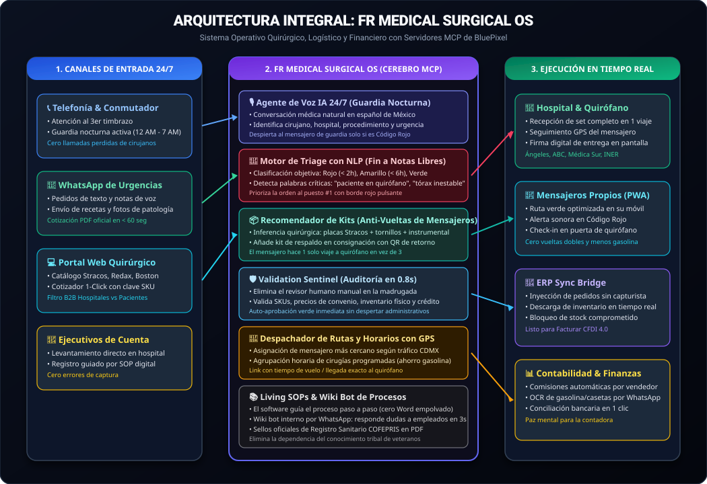
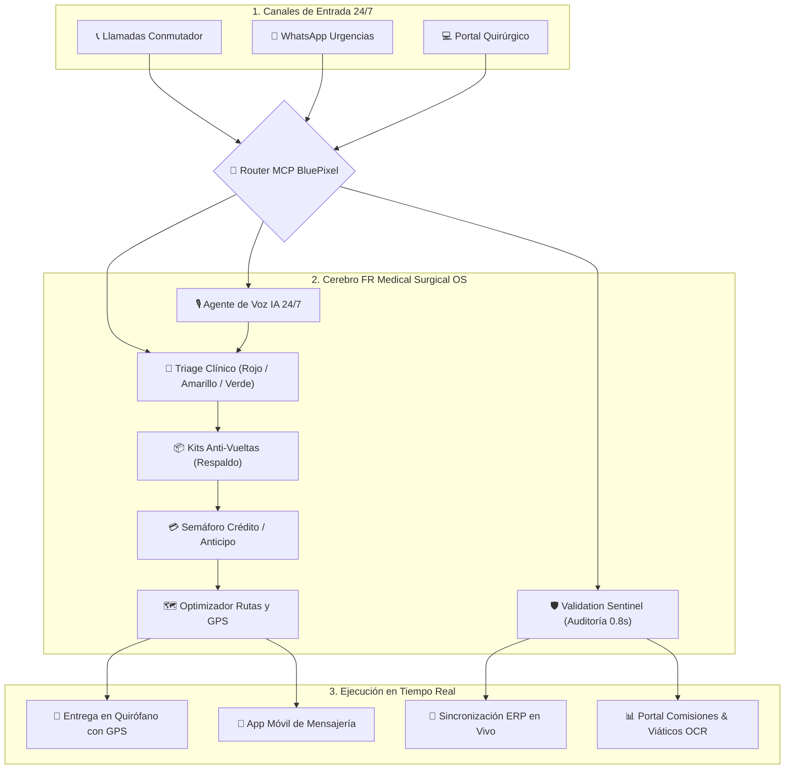
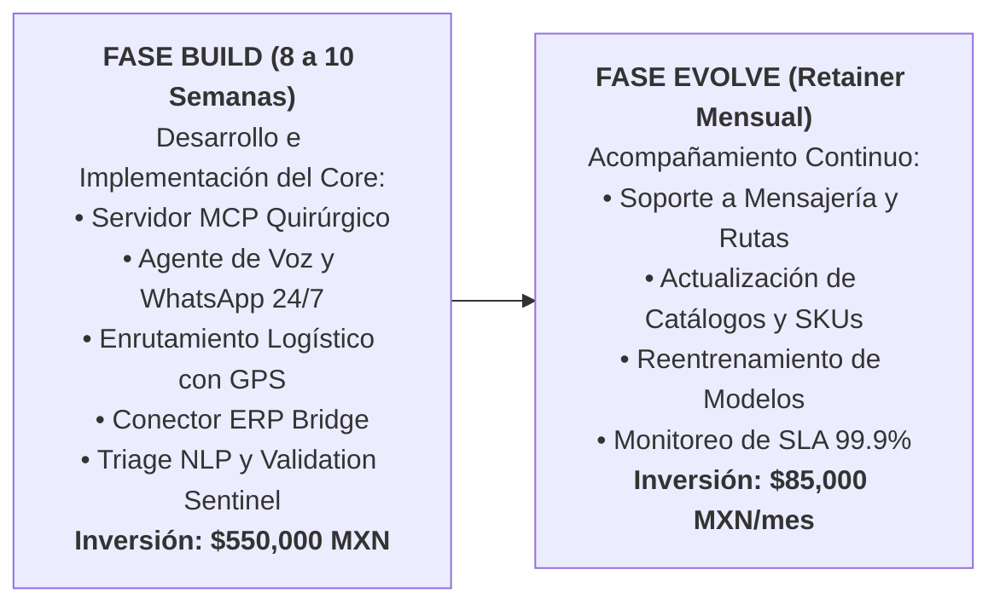

# 🚀 PROPUESTA INTEGRAL: "FR MEDICAL SURGICAL OS"
*Arquitectura de Transformación Digital, Logística de Quirófano y Automatización con IA para FR Medical S.A. de C.V.*  
**Diseñado por:** BluePixel (Leonardo Flores, María, Fabián Flores).  
**Fecha:** 11 de Septiembre de 2026.

---

## 🎯 LA GRAN TESIS DE LA SOLUCIÓN

FR Medical no necesita parchar su operación con 10 herramientas aisladas, ni necesita gastarse $1.5 millones de pesos en cambiar de ERP.  
Lo que FR Medical necesita es un **Sistema Operativo Quirúrgico Unificado (FR Medical Surgical OS)** montado sobre la arquitectura de **Servidores MCP de BluePixel**, que actúa como un cerebro inteligente por encima de su ERP actual, de su almacén, de sus mensajeros y de sus canales de atención.

### 🗺️ Mapa de Arquitectura de Alto Nivel

---

## 🏛️ LOS 4 PILARES DE LA SOLUCIÓN INTEGRAL

### 🔷 PILAR 1: "Speed-to-Quote & Atención de Urgencias 24/7" (El Frente Clínico)
*   **Agente de Guardia 24/7 (Voz Telefónica + WhatsApp):**
    *   Si entra una llamada a las 2:00 AM y nadie contesta en 3 timbrazos, la IA responde en tono médico cálido, captura el pedido y valida el convenio hospitalario.
    *   Cero llamadas perdidas; rescate de ventas de $50k – $150k MXN por evento.
*   **Cotizador Quirúrgico Inteligente con Kits de Respaldo (Anti-Vueltas):**
    *   Al seleccionar fijación costal (Stracos MedXpert) o drenaje (Redax), la IA añade automáticamente el instrumental y los tornillos de reserva necesarios.
    *   Genera el PDF membretado formal en 1.8 segundos con los registros sanitarios y leyendas normadas de **COFEPRIS**.
*   **Semáforo de Crédito y Anticipo 24/7:**
    *   Hospitales con convenio AAA (Ángeles, ABC, Médica Sur): Despacho inmediato con folio de quirófano sin anticipo.
    *   Casos particulares: Generación instantánea de liga de pago digital de anticipo por WhatsApp en 2 minutos.

---

### 🔷 PILAR 2: "Surgical Logistics & Route Dispatcher" (El Cerebro de Quirófano)
*   **Motor de Triage Quirúrgico con NLP (Fin a la Urgencia en Texto Libre):**
    *   Estructura la urgencia en variables objetivas: **Código Rojo (< 2 hrs / Quirófano Abierto)**, **Código Amarillo (< 6 hrs)** y **Código Verde (Programada)**.
    *   El motor NLP escanea notas libres (*"paciente anestesiado"*, *"tórax inestable"*), detecta la criticidad real y eleva la orden al puesto #1 de almacén de forma visual (borde rojo pulsante).
*   **Optimizador de Rutas y Horarios Logísticos:**
    *   Asigna automáticamente al mensajero más cercano y calcula la ruta más rápida considerando el tráfico de la CDMX.
    *   Consolida entregas de cirugías programadas en horarios valle para recortar gastos de combustible y viáticos.
*   **Rastreo GPS en Tiempo Real:**
    *   El cirujano o jefe de compras recibe un link con el tiempo estimado de arribo (ETA) en vivo del mensajero.
    *   El mensajero registra la entrega mediante firma digital en pantalla o fotografía de remisión.

---

### 🔷 PILAR 3: "Validation Sentinel & ERP Sync Bridge" (Blindaje Operativo sin Migración)
*   **Validation Sentinel (Fin al Revisor Manual y a la Brecha 12 AM – 7 AM):**
    *   La IA audita la orden en **0.8 segundos**: compatibilidad de SKUs, lista de precios de convenio, inventario físico y crédito.
    *   Emite auto-aprobación inmediata y despierta al mensajero de guardia para salir a quirófano en menos de 15 minutos, sin necesidad de despertar a ningún administrativo a medianoche.
*   **ERP Sync Bridge (Cero Doble Captura):**
    *   Conector ligero MCP que inyecta los pedidos del cotizador y WhatsApp directo al ERP actual en 0.5 segundos.
    *   Actualiza el inventario en tiempo real para evitar "vender piezas fantasma" que ya fueron enviadas a otro hospital.
    *   Cambia el estatus a *"Listo para Facturación CFDI 4.0"* en cuanto el mensajero entrega.

---

### 🔷 PILAR 4: "Living SOPs & Automatización Financiera" (Paz Contable y Procesos Vivos)
*   **Living SOPs & Copiloto Interno (FR Medical Wiki Bot):**
    *   Los procesos se ejecutan directamente en la interfaz (flujos guiados paso a paso para empleados nuevos).
    *   Bot interno de WhatsApp que responde cualquier duda operativa o política de devolución a mensajeros y administrativos en 3 segundos.
    *   Diagramas de procesos actualizados para auditorías de COFEPRIS y calidad hospitalaria.
*   **Liquidación Automática de Comisiones:**
    *   Se elimina el uso de calculadoras físicas. Las comisiones se calculan en automático según el margen de cada producto y objetivo mensual.
    *   Tablero visual para que los vendedores vean sus comisiones acumuladas en tiempo real.
*   **OCR de Viáticos por WhatsApp:**
    *   Los mensajeros fotografían sus tickets de gasolina y casetas por WhatsApp; la IA extrae montos y RFCs para conciliación contable automática.

---

## 💰 MODELO DE INVERSIÓN Y ENTREGABLES

---

## 🤝 EL PACTO COMERCIAL DE HOY (Script para Cerrar la Sesión):

Antes de pararse de la mesa a las 2:00 PM, Leonardo o María dicen:

> *"Doctor, Licenciada: Lo que acabamos de levantar hoy no se resuelve comprando una aplicación de mensajería o un bot suelto. Lo que FR Medical necesita para blindar su crecimiento es este **Sistema Operativo Quirúrgico**.
>
> Nuestro compromiso es estructurarles la propuesta formal de arquitectura con cronograma, costos e inversión para la **Fase Build** y la **Fase Evolve**.
>
> Para que no se enfríe y podamos arrancar de inmediato: **¿Les parece si agendamos de una vez el próximo jueves a las 11:00 AM para presentarles la propuesta ejecutiva completa?**"*
