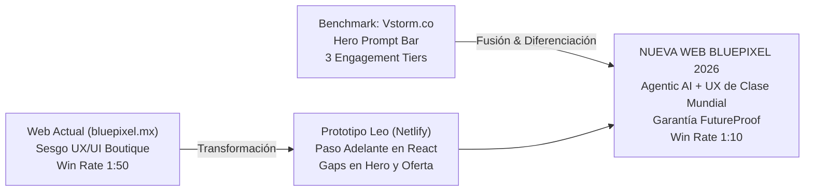
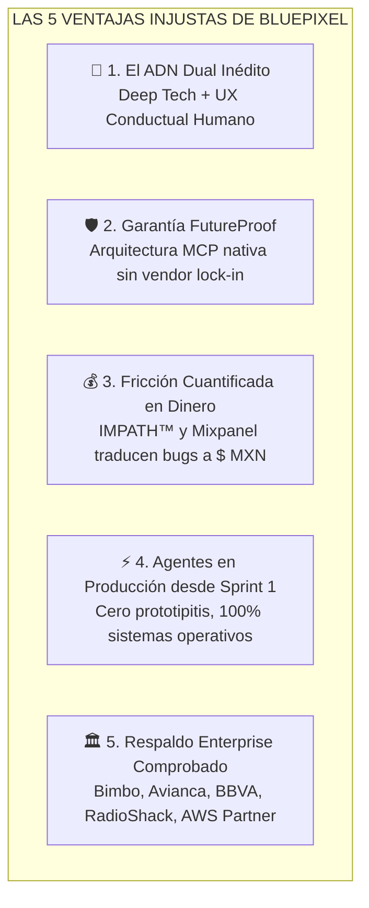
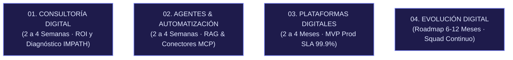
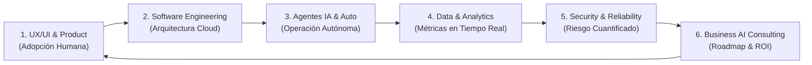
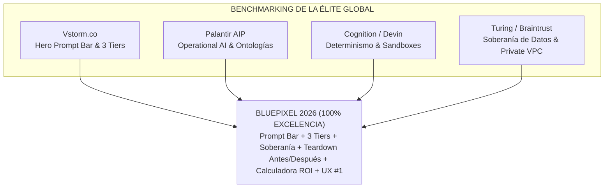
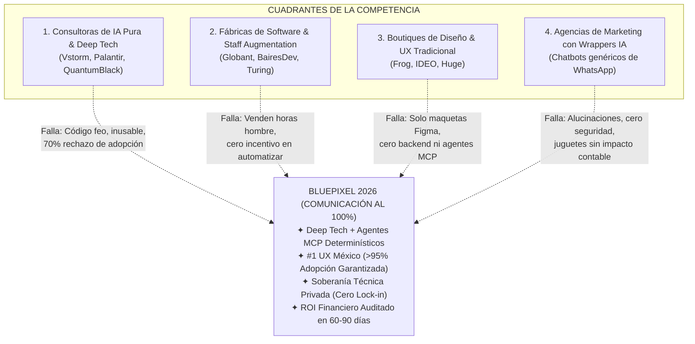

# 🌐 AUDITORÍA MAESTRA, BENCHMARKING Y PLAN DE REDISEÑO WEB BLUEPIXEL 2026
**De Despacho UX/UI a Consultora de Deep Tech, Ingeniería Agentica y Garantía FutureProof**

> **Documento Estratégico y Técnico de Alineación para Dirección General, Producto y Equipos Comerciales.**  
> *Versión:* 3.1 Canónica · *Fecha:* Septiembre 2026 · *Área:* Dirección de Estrategia, Tecnología y Producto B2B.

---



---

## 📑 ÍNDICE GENERAL

1. [El Diagnóstico Forense: El "Desfase de Información" y la Caída de Conversión](#1-el-diagnóstico-forense-el-desfase-de-información-y-la-caída-de-conversión)
2. [Benchmarking Competitivo de Frontera: Qué Tomar de Vstorm.co y Competidores Globales](#2-benchmarking-competitivo-de-frontera-qué-tomar-de-vstormco-y-competidores-globales)
3. [Auditoría Forense Cruzada: bluepixel.mx (Actual) vs. Prototipo Netlify de Leo](#3-auditoría-forense-cruzada-bluepixelmx-actual-vs-prototipo-netlify-de-leo)
4. [La Nueva Narrativa y Storytelling Estratégico: "Creativos Tecnológicos y Tecnológicos Creativos"](#4-la-nueva-narrativa-y-storytelling-estratégico-creativos-tecnológicos-y-tecnológicos-creativos)
5. [Propuesta Integral de Copywriting: Rewrite Sección por Sección (Antes vs. Después)](#5-propuesta-integral-de-copywriting-rewrite-sección-por-sección-antes-vs-después)
6. [El Nuevo Modelo de Contratación: "Tres Formas de Trabajar con BluePixel"](#6-el-nuevo-modelo-de-contratación-tres-formas-de-trabajar-con-bluepixel)
7. [Plan de Arquitectura UX / UI & Diseño de Interacción](#7-plan-de-arquitectura-ux--ui--diseño-de-interacción)
8. [Hoja de Ruta y Guion de Presentación para la Junta con Leo (Semana Próxima)](#8-hoja-de-ruta-y-guion-de-presentación-para-la-junta-con-leo-semana-próxima)

---

## 1. EL DIAGNÓSTICO FORENSE: EL "DESFASE DE INFORMACIÓN" Y LA CAÍDA DE CONVERSIÓN

### 1.1. El Síntoma Comercial Crítico
En las sesiones de diagnóstico de ventas con Pablo Gómez y José de Buen se identificó un colapso en la tasa de cierre:
*   **Inicio de 2026:** Tasa histórica de conversión de **1 de cada 10 prospectos** (10% Win Rate).
*   **Situación Actual:** Caída a **1 de cada 50 prospectos** (2% Win Rate). Se requiere quintuplicar el esfuerzo comercial para lograr un solo cierre.

### 1.2. La Causa Raíz: El Desfase entre la Realidad Interna y la Percepción Externa
BluePixel completó una mutación radical en sus capacidades técnicas: pasó de ser una agencia boutique de diseño de interfaces a convertirse en una firma de **Ingeniería Deep Tech**, arquitecturas serverless, agentes de IA autónomos corriendo en producción y protocolos de conectividad abierta (**MCP - Model Context Protocol**).

Sin embargo, los activos digitales públicos de la empresa comunican lo opuesto:
1.  **La página web actual (`bluepixel.mx`):** Presume con orgullo insignias como *"#1 UX/UI Company in Mexico by DesignRush"*, encabezados de diseño de productos digitales y un tono que atrae a clientes buscando *"pantallitas en Figma"* con presupuestos de $20,000 a $40,000 MXN.
2.  **El impacto con Tomadores de Decisión Corporativos (CTOs, COOs, VPs de Transformación):** Cuando un Director de Operaciones o un CTO con un problema de automatización de $100,000+ USD entra a `bluepixel.mx`, concluye de inmediato: *"Esta es una agencia de creativos visuales, no un partner que pueda meterle mano a mi ERP, a mis bases de datos transaccionales o a la seguridad de mis servidores"*.
3.  **El resultado:** Fricción doble. Los prospectos pequeños no pueden pagar el servicio de ingeniería, y los prospectos corporativos descartan a BluePixel por considerarla *"demasiado agencia de diseño"*.

### 1.3. La Misión del Nuevo Sitio Web de Leo
La nueva web no es una simple actualización cosmética de textos; es el **ancla de reposicionamiento institucional de BluePixel**. Debe:
*   Proyectar solvencia técnica de ingeniería pesada y agentes en producción desde el primer segundo.
*   Presentar al diseño UX/UI no como un adorno cosmético, sino como la **ventaja competitiva injusta** de BluePixel (hacer que la tecnología compleja sea adoptada por humanos reales).
*   Alimentar y dar coherencia a las campañas de pauta B2B (Meta, LinkedIn, Google Ads) que actualmente sufren por aterrizar tráfico en páginas desalineadas.

---

## 2. BENCHMARKING COMPETITIVO DE FRONTERA: QUÉ TOMAR DE VSTORM.CO Y COMPETIDORES GLOBALES

### 2.1. Deconstrucción de `vstorm.co` (Por qué funciona tan bien)

Analizando las capturas compartidas y el benchmark técnico del sitio de Vstorm:

| Elemento Clave | Cómo lo ejecuta Vstorm.co | Por qué es letal en B2B | Qué debemos adoptar en BluePixel |
| :--- | :--- | :--- | :--- |
| **Kicker / Categoría** | `• AGENTIC AI COMPANY` en monospaced rojo sutil sobre fondo blanco/rejilla. | Define la categoría en 3 palabras; cero ambigüedad. | Adoptar `• AGENTIC AI & FUTUREPROOF ENGINEERING`. Cero términos vagos como "agencia digital". |
| **Hero Headline** | *"We build AI agents that run in production."* | Corto, asertivo, ataca el mayor dolor corporativo (los demos de IA que nunca llegan a producción). | *"Construimos agentes de Inteligencia Artificial que operan en producción."* |
| **Interactive Hero Prompt Bar** | `[ 900 quote requests a month, retype... ↗ ]`<br/>*"You're chatting with an AI versed in our content."* | **Product-Led Growth (PLG) inmediato:** En vez de pedir que agenden una llamada genérica, le permite al visitante teclear su problema operativo y recibir una respuesta arquitectónica al instante. | **Implementar la barra interactiva en el Hero:** Permitir seleccionar o teclear casos típicos (cotizaciones, logística, soporte, reconciliación contable) y mostrar solución técnica + caso real análogo. |
| **Trust Bar / Hard Proof** | `30+ PRODUCTION DEPLOYMENTS \| OFFICIAL PYDANTIC PARTNER \| FIRST IN AGENTIC AI FOUNDATION` | Métricas técnicas verificables, no frases motivacionales. | `200+ PLATAFORMAS EN PRODUCCIÓN \| AWS CLOUD PARTNER \| MCP PROTOCOL NATIVE \| SISTEMAS DE ALTA DISPONIBILIDAD`. |
| **Los 4 Pilares Oficiales** | Divide la oferta en 4 modelos modulares: 01 Consultoría (2-4 sem), 02 Agentes (2-4 sem), 03 Plataformas (2-4 meses), 04 Evolución (6-12 m). | Resuelve la objeción de entrada. Un cliente escéptico entra por diagnóstico o agentes sobre stack actual sin comprometer contratos a ciegas. | **Estructurar la oferta de BluePixel en sus 4 Pilares Canónicos:**<br/>1. Consultoría Digital (2-4 sem)<br/>2. Agentes & Automatización (2-4 sem)<br/>3. Plataformas Digitales (2-4 meses)<br/>4. Evolución Digital (Roadmap 6-12 m). |
| **Diseño Visual** | Tipografía nítida, rejilla técnica con puntos, tarjetas con bordes finos, acentos de color sobrios (rojo/negro/blanco), **cero ilustraciones de IA con cerebros de neón**. | Comunica seriedad de ingeniería. No parece plantilla de ThemeForest ni render de Midjourney. | Mantener el dark mode sofisticado de Leo (`#080C16`), tipografía Inter/Onest + JetBrains Mono, líneas estructurales de 1px y diagramas interactivos de procesos. |

### 2.2. Benchmarking contra Otros Jugadores B2B de Frontera

*   **QuantumBlack (McKinsey) / BCG X:** Venden estrategia de IA a precios de $500k+ USD, pero su implementación técnica suele ser lenta y tercerizada en presentaciones ejecutivas. BluePixel gana en **velocidad de despliegue en producción (sprint 1)**, agilidad de ingeniería y costos 10x más eficientes.
*   **Braintrust / Turing AI:** Venden talento de desarrollo ("bodyshop" o asignación de horas de programadores). BluePixel no vende horas hombre ni desarrolladores sueltos; vende un **equipo interdisciplinario integrado con responsabilidad directa sobre el resultado y ROI del negocio**.
*   **Consultoras tradicionales de software (BairesDev, Globant, fábricas de software locales):** Hacen código a la medida pero son ciegas en UX y carecen de arquitectura agentica nativa: entregan sistemas toscos que los empleados rechazan y abandonan. BluePixel cuenta con 6 años de maestría en **psicología conductual y usabilidad (IMPATH / Mixpanel)** para asegurar que el sistema se use desde el día 1.
*   **Agencias Creativas y Boutiques de Diseño UX/UI:** Hacen maquetas visualmente atractivas en Figma, pero carecen por completo de músculo de ingeniería cloud, bases de datos o arquitectura de IA. Sus entregables son cascarones que colapsan al intentar conectarse a un ERP real.

---

### 2.3. Las 5 Ventajas Competitivas Injustas de BluePixel sobre la Competencia (Moats)

Esta matriz estratégica sintetiza por qué un tomador de decisión (CTO, COO, Director General) elige a BluePixel frente a cualquier alternativa del mercado:



| Dimensión de Negocio | 🏢 Consultoras de Estrategia (Big 4 / MBB) | 🤖 Consultoras Puras de IA (Python / ML) | 💻 Fábricas Tradicionales de Software | 🎨 Despachos y Agencias UX/UI | 🛡️ VENTAJA INJUSTA BLUEPIXEL |
| :--- | :--- | :--- | :--- | :--- | :--- |
| **1. Adopción del Usuario Final** | Nula (solo entregan diapositivas). | **Crítica (< 30%):** Interfaces toscas que los empleados rechazan para volver a Excel. | Baja: Sistemas rígidos y complejos con curvas de aprendizaje de meses. | Alta en pantalla, pero **no funciona en código real**. | **Extrema (> 95%):** Diseñado con psicología conductual para adopción inmediata sin manuales de 100 páginas. |
| **2. Conexión con Sistemas Reales** | Tercerizada o ausente. | Demos aislados en Jupyter Notebooks que no tocan producción. | Conexiones monolíticas caras y difíciles de mantener. | Cero capacidad de conexión a APIs o bases de datos. | **Nativa y Desacoplada (MCP):** Agentes conectados a SAP, Salesforce, ERPs y bancos sin alucinaciones. |
| **3. Obsolescencia Tecnológica** | No aplica. | Alta dependencia a librerías propietarias y wrappers frágiles. | **Alta deuda técnica:** Código spaghetti que se rompe al actualizar librerías. | No aplica (solo hacen diseño estático). | **Garantía FutureProof:** Arquitectura modular. Al salir un nuevo LLM (GPT-5, Claude 4), solo se conmuta una API key. |
| **4. Medición del Impacto Financiero** | Proyecciones teóricas a 3 años. | Métricas técnicas abstractas (F1-score, loss, latencia). | Horas hombre facturadas (incentivo perverso a demorar). | Métricas cosméticas (clicks, visitas, estética). | **ROI Cuantificado en Pesos:** IMPATH y Mixpanel miden el costo real de la fricción antes y el dinero liberado después. |
| **5. Tiempo de Despliegue en Producción** | 6 a 12 meses de diagnóstico. | Demos en semanas, **pero nunca llegan a producción**. | 6 a 9 meses para un MVP funcional. | 4 a 8 semanas (solo maquetas en Figma). | **Sistemas Operativos en 4 a 8 semanas:** Diagnóstico inicial (2-4 sem) y agentes en producción desde el sprint 1. |

#### Desglose Detallado de las 5 Ventajas:

1.  **El Matrimonio Inédito entre Deep Tech y Experiencia Humana ("Creativos Tecnológicos & Tecnológicos Creativos"):**
    *   *El problema del mercado:* Las firmas de IA escriben algoritmos potentes pero entregan interfaces ásperas e incomprensibles. El 70% del software corporativo fracasa por rechazo del personal. Por otro lado, las agencias de diseño solo entregan pantallas estáticas en Figma sin entender de latencia, seguridad o lógica de bases de datos.
    *   *El Moat de BluePixel:* Fusionamos 6 años de maestría en diseño conductual con ingeniería serverless de vanguardia. La tecnología más compleja se siente invisible, fluida e intuitiva para el usuario final.
2.  **Arquitectura Abierta MCP (Model Context Protocol) & Garantía FutureProof:**
    *   *El problema del mercado:* Muchas empresas caen en el "vendor lock-in" de plataformas propietarias o en código spaghetti parcheado que se vuelve obsoleto cada vez que OpenAI o Anthropic actualizan sus modelos.
    *   *El Moat de BluePixel:* Diseñamos sobre estándares y protocolos abiertos. El cliente es dueño de su código y de su infraestructura (VPC privada). Su inversión está blindada contra la obsolescencia durante los próximos 5 años.
3.  **Inteligencia de Fricción Propietaria Cuantificada en Dinero (IMPATH™ + Mixpanel UX Health Score):**
    *   *El problema del mercado:* Nadie sabe con certeza cuánto dinero le cuesta un proceso ineficiente o un error en la plataforma digital.
    *   *El Moat de BluePixel:* Con IMPATH creamos gemelos digitales de usuarios reales que recorren los flujos de la empresa y detectan exactamente en qué punto se pierde dinero: *"Detectamos que el paso 3 del checkout le cuesta $1.4M MXN al trimestre"* o *"El proceso manual de cotización le cuesta 120 horas hombre al mes"*. Resolvemos el problema con ROI documentado trimestre a trimestre.
4.  **Certidumbre Operativa: Agentes en Producción desde el Sprint 1 (Antídoto a la "Prototipitis"):**
    *   *El problema del mercado:* El 85% de las iniciativas corporativas de IA se quedan estancadas en prototipos de laboratorio que nunca tocan datos reales ni atienden clientes reales.
    *   *El Moat de BluePixel:* No hacemos experimentos de laboratorio. Diseñamos con reglas de negocio determinísticas, capas RAG blindadas y servidores MCP para que los agentes operen sobre procesos reales desde el primer mes de trabajo.
5.  **Historial Enterprise Comprobado en México y LATAM:**
    *   *El problema del mercado:* La mayoría de las agencias de IA se fundaron hace 6 meses y carecen de estabilidad financiera, procesos de calidad o experiencia con corporativos regulados.
    *   *El Moat de BluePixel:* 10+ años de trayectoria institucional, 200+ plataformas en producción, AWS Advanced Partner, y un portafolio auditado con líderes de la industria como **Grupo Bimbo, Avianca, BBVA, Cemex, RadioShack, LifeMiles, DiDi y PepsiCo**.

---

## 3. AUDITORÍA FORENSE CRUZADA: BLUEPIXEL.MX (ACTUAL) VS. PROTOTIPO NETLIFY DE LEO

### 3.1. Qué Rescatar del Sitio Web Actual (`bluepixel.mx`)
No todo lo anterior debe descartarse. El sitio actual contiene activos de credibilidad institucional de inmenso valor que deben trasladarse a la nueva web:

1.  **El Marquee de Clientes Triple-A:** La presencia verificable de marcas globales como **Grupo Bimbo, BBVA, Avianca, PepsiCo, Cemex, DiDi, Subaru, RadioShack, Marriott y LifeMiles**. Muy pocas consultoras de IA en LATAM pueden mostrar esa lista de clientes.
2.  **Las Métricas Históricas Reales:**
    *   *10+ años creando plataformas digitales.*
    *   *200+ plataformas evolucionadas.*
    *   *60+ profesionales multidisciplinarios.*
3.  **Los Estándares de Certificación:** AWS Partner, ScrumStudy, CyberVadis (seguridad y responsabilidad corporativa).
4.  **Casos de Estudio con Datos:** El caso de estandarización analítica para Bimbo, la optimización de fidelidad para LifeMiles y el rediseño transaccional para RadioShack.

### 3.2. Qué Debemos Eliminar o Cambiar de Raíz
1.  **Eliminar de inmediato:** El badge *"#1 UX/UI Company in Mexico by DesignRush"*. Nos ancla en el pasado de agencia creativa decorativa.
2.  **Eliminar:** El uso exclusivo de inglés en la versión para México y LATAM. La web de Leo debe estar en un español impecable, técnico y corporativo para el mercado hispano, con switch a inglés para clientes transfronterizos.
3.  **Eliminar:** Titulares genéricos como *"We Build, Evolve, and Scale AI-Powered Digital Platforms"* o *"A long-term technology partner"*. Dicen mucho sin decir nada.
4.  **Eliminar:** La venta suelta de "Diseño UX/UI" como servicio independiente.

### 3.3. Auditoría Crítica del Prototipo de Leo (`relaxed-sundae-899484.netlify.app`)

#### Aciertos Notables de Leo:
*   **Base Tecnológica Ágil:** Componentes React con Tailwind bien estructurados, animaciones suaves en CSS (`fadeUp`, carrusel marquee sin saltos).
*   **Visuales Interactivos de Producto:** El módulo `IMPATHVisual` y el simulador de `Mixpanel Platform Health` demuestran visualmente que la empresa mide métricas de negocio reales (Score 78/100, Revenue en riesgo de $4.7M MXN).
*   **Landing de Agentes IA (`agentes-ia-landing.html`):** Contiene copys excelentes redactados por Leo:
    *   *"La IA se aprueba en el consejo. Rara vez llega a producción."* (Hook demoledor).
    *   *"Un chatbot responde preguntas. Un agente ejecuta procesos completos."*
    *   La explicación de la capa RAG (Retrieval-Augmented Generation) y conexión al stack empresarial (Salesforce, SAP, Stripe).

#### Gaps y Deficiencias Críticas que Debemos Subsanar con Leo:
1.  **El Hero Principal Sigue Siendo Débil y Conservador:**
    *   *Copy de Leo:* *"Evolucionamos tu plataforma digital en ventaja competitiva."*
    *   *Diagnóstico:* Es una frase corporativa vacía. No menciona agentes de IA, no menciona automatización, no menciona arquitectura técnica ni habla de resolver dolores operacionales urgentes.
2.  **Falta la Barra Interactiva en el Hero (El mayor acierto de Vstorm):**
    *   Actualmente el Hero de Leo tiene dos botones estáticos: `[ Hablemos ]` y `[ Conoce cómo trabajamos ]`. No hay un enganche de producto inmediato que demuestre la IA en acción.
3.  **El Modelo "FutureProof" Salta Directo a BUILD y EVOLVE, Omitiendo la Auditoría:**
    *   Leo presenta únicamente BUILD (para quien arranca desde cero) y EVOLVE (para quien ya tiene plataforma).
    *   *El gran gap:* Ningún director de operaciones o CTO que no conoce a BluePixel firma un contrato de desarrollo de 2 a 4 meses ($30,000+ USD) sin haber pasado por una **Auditoría o Diagnóstico Técnico inicial de bajo riesgo (2 a 4 semanas)**.
4.  **Desbalance Visual hacia UX en el Home:**
    *   Aunque Leo agregó un cintillo morado en BUILD y EVOLVE (*"Incluye capa de Agentes IA"*), la sección principal se siente como un dashboard de analítica de usabilidad web, no como el centro de mando de una empresa que automatiza operaciones complejas.
5.  **Las 6 Tarjetas de Capabilities Diluyen el Mensaje:**
    *   Poner 6 tarjetas iguales (UX/UI, Software, Agentes, Data, Security, Consulting) transmite la impresión de *"hacemos de todo un poco"*. Deben agruparse en una arquitectura cohesiva de 3 o 4 pilares donde la ingeniería y los agentes sean el motor central.

---

## 4. LA NUEVA NARRATIVA Y STORYTELLING ESTRATÉGICO: "CREATIVOS TECNOLÓGICOS Y TECNOLÓGICOS CREATIVOS"

### 4.1. El Eje Conceptual de BluePixel
El reposicionamiento no significa renegar de los 6 años de historia en diseño; significa **elevar el diseño a su máxima expresión funcional**.

```
                           ┌────────────────────────────────────────────────────────┐
                           │               EL POSICIONAMIENTO BLUEPIXEL             │
                           │                                                        │
                           │   "Creativos Tecnológicos & Tecnológicos Creativos"    │
                           └───────────────────────────┬────────────────────────────┘
                                                       │
                           ┌───────────────────────────┴────────────────────────────┐
                           ▼                                                        ▼
┌──────────────────────────────────────────────────────┐  ┌──────────────────────────────────────────────────────┐
│                  EL CEREBRO TÉCNICO                  │  │                  EL ROSTRO HUMANO                    │
│           (Ingeniería Deep Tech & Agentes)           │  │             (UX Conductual & Adopción)               │
├──────────────────────────────────────────────────────┤  ├──────────────────────────────────────────────────────┤
│ • Agentes autónomos que ejecutan procesos 24/7.      │  │ • Cero curvas de aprendizaje para el equipo interno. │
│ • Protocolos abiertos MCP (cero código spaghetti).   │  │ • Interfaces que la gente ama usar en vez de Excel.  │
│ • Conexión directa a ERPs, CRMs y bases de datos.    │  │ • Reducción de fricción cognitiva en checkout/ops.   │
│ • Blindaje de privacidad y aislamiento de datos.     │  │ • Métricas de usabilidad ligadas a impacto contable. │
└──────────────────────────────────────────────────────┘  └──────────────────────────────────────────────────────┘
                                                       │
                                                       ▼
                                   ┌──────────────────────────────────────┐
                                   │         GARANTÍA FUTUREPROOF         │
                                   │  Sistemas modulares preparados para  │
                                   │ los modelos de IA de los próximos    │
                                   │ 5 años sin quedar obsoletos jamás.   │
                                   └──────────────────────────────────────┘
```

### 4.2. El Storytelling del Sitio Web: Los 4 Actos

1.  **Acto 1: La Revelación del Problema Oculto (The Pain):**
    *   La mayoría de las empresas aprueban iniciativas de IA en el consejo, pero el 85% de los proyectos nunca pasa de un prototipo en Python o un chatbot de juguete.
    *   Las empresas que intentaron automatizar con herramientas baratas o "hacerlo en casa con un becario y ChatGPT" terminaron con código spaghetti inmantenible, fuga de datos confidenciales y sistemas que colapsan cuando entran 50 usuarios.
2.  **Acto 2: La Tesis de BluePixel (The Antidote):**
    *   La IA solo genera valor si **opera sobre tus procesos reales**, con datos blindados, y si los humanos que la operan la adoptan sin fricción.
    *   BluePixel integra en un solo equipo la **ingeniería de frontera (Agentes + MCP)** y el **diseño de experiencia humana (UX/UI)**.
3.  **Acto 3: La Certeza Operativa (The Proof):**
    *   No experimentamos con tu dinero. Mostramos métricas en producción: horas hombre liberadas, millones de pesos en fricción eliminados, casos reales con Bimbo, Avianca y RadioShack.
4.  **Acto 4: El Camino Claro hacia la Transformación (The Call to Action):**
    *   No te pedimos un salto de fe de 1 año. Empezamos con una **Auditoría y Diagnóstico Operativo de 2 a 4 semanas** donde te entregamos el plano arquitectónico y el ROI proyectado antes de escribir código.

---

## 5. PROPUESTA INTEGRAL DE COPYWRITING: REWRITE SECCIÓN POR SECCIÓN (ANTES VS. DESPUÉS)

A continuación se detalla la propuesta exacta de copys para reemplazar el contenido del prototipo de Leo:

### 5.1. Header & Hero Section

```
[ HEADER SUPERIOR ]
Logo: BluePixel (Isotipo minimalista blanco/azul)
Nav Links: Capacidades ▾ | Modelo FutureProof | Tres Formas de Trabajar | Casos de Estudio | Blog
CTA Navbar: [ Diagnóstico de Automatización → ] (Botón con acento azul #2563EB)
```

#### Hero: Comparativa Directa

| Elemento | Copy Actual de Leo (Netlify) | NUEVA PROPUESTA BLUEPIXEL 2026 (Inspirada en Vstorm) | Justificación Estratégica |
| :--- | :--- | :--- | :--- |
| **Kicker / Badge** | *Ninguno (o genérico)* | `● INGENIERÍA DE AGENTES IA & PLATAFORMAS FUTUREPROOF` *(Estilo mono espaciado, punto verde esmeralda parpadeante)* | Establece de inmediato la categoría de Deep Tech. |
| **Headline Principal (H1)** | *Evolucionamos tu plataforma digital en ventaja competitiva.* | **Construimos agentes de Inteligencia Artificial que operan procesos reales en producción.** | Demoledor, asertivo y directo. Cero rodeos poéticos. Comunica exactamente lo que los directores de operaciones y CTOs buscan resolver. |
| **Subheadline** | *Un solo equipo de estrategia, UX, ingeniería e IA que diseña, construye y escala tu plataforma, trimestre a trimestre.* | **BluePixel es la consultora de ingeniería agentica y arquitectura cloud para empresas en crecimiento en México y LATAM. Conectamos agentes autónomos a tus sistemas y datos reales, blindados con diseño UX de clase mundial para garantizar adopción inmediata.** | Explica quiénes somos, qué hacemos, para quién y por qué el UX es nuestra ventaja para garantizar la adopción. |
| **Barra Interactiva (Prompt Hero)** | *(No existe en el prototipo de Leo)* | **Componente Interactivo:**<br/>`[ 💬 Ejemplo: "Procesamos 3,000 cotizaciones al mes en hojas de cálculo y demoramos 48 hrs..." ]` `[ Ver Solución Técnica ↗ ]`<br/>*Texto al pie:* *"Interactúa con nuestra arquitectura de diagnóstico. Te mostramos el flujo de agentes y casos de estudio análogos."* | Réplica adaptada del Hero de Vstorm. Atrae al tomador de decisión invitándolo a ingresar su problema y demostrando tecnología viva desde el segundo cero. |
| **Botones de Acción** | `[ Hablemos ]` / `[ Conoce cómo trabajamos ]` | Primario: `[ Solicitar Diagnóstico Operativo (Sin Costo) → ]`<br/>Secundario: `[ Ver Cómo Trabajamos (3 Modelos) ↓ ]` | "Diagnóstico" tiene un valor percibido 10 veces mayor que "Hablemos". Reduce la fricción de contacto. |
| **Trust Bar (Métricas Duras)** | *(Solo el logo de clientes en marquee)* | `200+ PLATAFORMAS EN PRODUCCIÓN  |  30+ AGENTES Y WORKFLOWS DESPLEGADOS  |  AWS ADVANCED PARTNER  |  ARQUITECTURA NATIVA MCP` | Métricas técnicas verificables que generan autoridad inmediata a nivel corporativo. |

---

### 5.2. Sección de Social Proof & Logos de Clientes

```
[ COPY DE ENTRADA ]
Título: "Empresas líderes en México y Norteamérica operan sobre ingeniería desarrollada por BluePixel"
```

*   **Logos en Marquee:** Bimbo, Avianca, BBVA, Cemex, PepsiCo, DiDi, Subaru, RadioShack, Marriott, LifeMiles, Naturgy, MoradaUno, FR Medical.
*   **Métricas Cuantitativas (Reemplazo del Badge de DesignRush):**

| Métrica Anterior | NUEVA Métrica Justificada (La Armadura de Adopción) | Razón Estratégica |
| :--- | :--- | :--- |
| `10+ años creando plataformas` | **10+ Años de Ingeniería & Plataformas Robustas** | Comunica longevidad y solidez institucional. |
| `#1 empresa UX/UI por DesignRush` *(Suelto)* | **Firma #1 de Experiencia & UX en México (DesignRush)**<br/>*Garantía de Adopción Humana: >95% vs 30% promedio de la industria.* | **El Giro Estratégico:** No se elimina el logro; se transforma en la razón por la que nuestra ingeniería triunfa donde las demás fallan. El UX se posiciona como el seguro de vida de la inversión del cliente. |
| `200+ plataformas evolucionadas` | **200+ Plataformas & Sistemas en Producción** | Cambiar "evolucionadas" por "en producción" transmite misión crítica. |
| `60+ profesionales en producto y tech` | **60+ Especialistas en Arquitectura Cloud, Agentes IA y UX Conductual** | Especifica la profundidad técnica del equipo. |

---

### 5.3. Sección: "La Realidad de la IA Empresarial" (Pain Agitation)

Esta sección debe ubicarse inmediatamente después del Social Proof para educar al mercado y neutralizar el "espejismo de la IA DIY":

```markdown
### ⚠️ LA IA SE APRUEBA EN EL CONSEJO. EL 85% DE LOS PROYECTOS NUNCA LLEGA A PRODUCCIÓN.
Por qué los experimentos internos y las herramientas genéricas están fracasando en la empresa mexicana:

1. El Espejismo del "Hazlo Tú Mismo con IA":
   Cualquiera puede crear un prototipo en 10 minutos con un generador de código. Pero cuando se intenta conectar al ERP, manejar 500 solicitudes concurrentes o auditar la seguridad, el sistema colapsa en "código spaghetti".

2. Riesgo Financiero y Fuga de Información Confidencial:
   Conectar datos de clientes o balances financieros a modelos públicos sin gobernanza ni protocolos de sanitización viola la regulación mexicana (LFPDPPP) y expone a tu empresa a responsabilidades legales graves.

3. Rechazo de los Empleados por Falta de UX:
   El software construido por ingenieros tradicionales sin empatía humana es tosco y difícil de usar. Si la herramienta le complica el día a tu equipo, volverán a operar en hojas de Excel.
```

---

## 6. EL NUEVO MODELO DE CONTRATACIÓN: "TRES FORMAS DE TRABAJAR CON BLUEPIXEL"
*(Inspirado en la estructura de engagement de Vstorm.co, adaptado a la fortaleza de BluePixel)*

Esta sección resuelve el vacío de la **oferta de entrada** que detectamos en el prototipo de Leo.

```
┌────────────────────────────────────────────────────────────────────────────────────────────────────────┐
│                                 4 FORMAS MODULARES DE TRABAJAR CON BLUEPIXEL                           │
│  Modelos independientes según el momento de la empresa. No son fases forzadas; el cliente entra directo │
│                   por el pilar que resuelve su cuello de botella operativo inmediato.                   │
└────────────────────────────────────────────────────────────────────────────────────────────────────────┘
```



### Pilar 01: Consultoría Digital (Entry Package · 2 a 4 Semanas)
*   **Kicker:** `PILAR 01 · CERTIDUMBRE TÉCNICA`
*   **Titular:** **Consultoría Digital & Diagnóstico IMPATH™**
*   **Subtítulo:** *"Claridad estratégica y retorno medible antes de escribir la primera línea de código."*
*   **Qué incluye (Balas Oficiales):**
    *   ✦ Mapeo de procesos y diagnóstico de operaciones IMPATH™
    *   ✦ Detección de fricción de usuario y cuellos de botella en ERP/CRM
    *   ✦ Matriz de priorización de iniciativas por impacto financiero
    *   ✦ Blueprint de arquitectura técnica y gobernanza de datos
    *   ✦ Business case cuantitativo con cálculo del costo de inacción
*   **Duración:** `2 a 4 Semanas`
*   **CTA Oficial:** `[ Solicitar Diagnóstico → ]`

---

### Pilar 02: Agentes & Automatización (Entry Package · 2 a 4 Semanas)
*   **Kicker:** `PILAR 02 · AGENTIC AUTOMATION`
*   **Titular:** **Agentes & Automatización**
*   **Subtítulo:** *"Automatización inteligente sobre lo que ya tienes funcionando, sin reemplazar tu software actual."*
*   **Qué incluye (Balas Oficiales):**
    *   ✦ Agentes IA autónomos orientados a tareas determinísticas
    *   ✦ Arquitectura RAG privada sobre datos corporativos sin alucinaciones
    *   ✦ Conectores determinísticos vía MCP con SAP, Salesforce o ERP propietario
    *   ✦ Despliegue en nube privada (VPC) con soberanía total de datos
    *   ✦ Pruebas de estrés y blindaje OWASP / LFPDPPP
*   **Duración:** `2 a 4 Semanas a Producción`
*   **CTA Oficial:** `[ Explorar Automatización → ]`

---

### Pilar 03: Plataformas Digitales (Build Integral · 2 a 4 Meses)
*   **Kicker:** `PILAR 03 · CLOUD-NATIVE BUILD`
*   **Titular:** **Plataformas Digitales**
*   **Subtítulo:** *"Para construir plataformas y MVPs desde cero con UX validado que convierte."*
*   **Qué incluye (Balas Oficiales):**
    *   ✓ Product Strategy (PS) e investigación con usuarios reales
    *   ✓ Diseño UI de clase mundial y sistemas de diseño (Design Systems)
    *   ✓ Desarrollo Full Stack Cloud-Native (React, Node, Python, TypeScript)
    *   ✓ Arquitectura desacoplada de microservicios y pipelines CI/CD
    *   ✓ Despliegue productivo auditado con SLA 99.9%
*   **Duración:** `2 a 4 Meses a Producción`
*   **CTA Oficial:** `[ Construir Plataforma → ]`

---

### Pilar 04: Evolución Digital (Acompañamiento Continuo · 6 a 12 Meses)
*   **Kicker:** `PILAR 04 · EVOLUCIÓN CONTINUA`
*   **Titular:** **Evolución Digital**
*   **Subtítulo:** *"Tu equipo tecnológico extendido para proteger la inversión y sostener el crecimiento."*
*   **Qué incluye (Balas Oficiales):**
    *   ✓ Squad multidisciplinario dedicado (Tech Lead, AI Engineer, Full Stack, UX/CRO Specialist)
    *   ✓ Auditorías y monitoreo continuo de UX Health Score™
    *   ✓ Reducción sistemática de deuda técnica y optimización de conversión
    *   ✓ Soporte con SLA empresarial y actualización continua de dependencias
*   **Duración:** `Roadmap vivo de 6 o 12 Meses (Retainer)`
*   **CTA Oficial:** `[ Activar Squad Continuo → ]`

---

### 5.3.1. Alineación con los 3 Clusters de Ads de Leo (Tráfico ➔ Conversión)
El rediseño web y las landings de campaña (`Componentes_Nueva_Web`) se articulan de forma transparente con los 3 clusters de búsqueda corporativa definidos por Leo:
1.  **Tráfico de "Desarrollo de Apps":** Aterriza en el Hero principal y destaca la capacidad de construir plataformas de grado militar en 90 días (**Paquete 01+02 BUILD + EVOLVE**).
2.  **Tráfico de "Automatización":** Aterriza en el Workflow Teardown y en las landings operativas (APA / ERP Bridge), canalizándose al **Paquete 01 (Diagnóstico)** para evaluar el retorno de inversión.
3.  **Tráfico de "Agentización":** Aterriza en las landings de agentes RAG/MCP (Triage RAG / Private Cloud), canalizándose al **Paquete 02 (Ingeniería de Agentes & MCP)** para sprints técnicos inmediatos.

---

### 5.4. Las 6 Capabilities Elevadas: Cómo Integrar el Trabajo de Leo sin Descartarlo

En la propuesta inicial consideramos sintetizar las capacidades a 4 pilares. Sin embargo, al auditar la captura de pantalla del prototipo de Leo (donde ya tiene estructuradas las 6 tarjetas blancas de capabilities: UX/UI, Software, Agentes, Data, Seguridad y Consultoría), la decisión estratégica correcta es: **conservar las 6 capabilities de Leo, pero elevar su lenguaje visual y su narrativa técnica**.

#### 🔍 Crítica Honesta de la Versión Actual de Leo (Captura 4):
1.  **La Ruptura Visual (Light Mode en caja gris):** El Hero de Leo arranca con un Dark Mode sofisticado, pero al llegar a las Capabilities pasa abruptamente a tarjetas blancas sobre fondo gris claro (`#F0F2F5`). Esto rompe la inmersión de "empresa Deep Tech" y hace que se vea como una plantilla estándar de agencia digital.
2.  **Sensación de "Servicios Sueltos":** Al poner 6 tarjetas idénticas en una cuadrícula 2×3, el visitante siente que son servicios aislados (como si pudiera contratar solo un diseño de logo o solo un script).
3.  **La Solución de Elevación:**
    *   Integrar las 6 capabilities al **Design System Dark Mode (`#0A0F1D` / `#0F1628`)** con acentos cromáticos individuales.
    *   Presentar las 6 capabilities como un **Ecosistema Circular Interconectado**:
        `UX Conductual ➔ Software Escalable ➔ Capa Agentica ➔ Analítica & Métricas ➔ Seguridad OWASP ➔ Consultoría de Negocio`.
    *   Mantener los badges `AI-Driven` de Leo y sus excelentes outcomes inferiores, pero agregando métricas de impacto económico directo.



---

### 5.5. Sección de Casos de Éxito Auditados (Case Studies con Métricas Financieras)

En el sitio web actual (`bluepixel.mx`) los casos de estudio están redactados en inglés y enfocados en pantallas. Debemos reformularlos bajo el lente de **ingeniería, horas liberadas y balance financiero**:

1.  **Grupo Bimbo (Consumo Masivo / Operación Global):**
    *   *Desafío:* Estandarizar la toma de decisiones y el consumo de analítica de datos en múltiples unidades de negocio multinacionales.
    *   *Solución:* Plataforma unificada de Business Intelligence e interfaces operativas de adopción masiva.
    *   *Métrica Clave:* **+40% de productividad** en toma de decisiones ejecutivas en campo.
2.  **RadioShack (Retail & E-commerce):**
    *   *Desafío:* Fricción en checkout móvil y carritos abandonados por procesos de compra confusos.
    *   *Solución:* Reingeniería transaccional, diseño UX conductual y optimización de arquitectura cloud.
    *   *Métrica Clave:* **-60% de fricción en checkout** e incremento medible en tasa de conversión.
3.  **LifeMiles / Avianca (Loyalty & Travel LATAM):**
    *   *Desafío:* Abandono de usuarios en flujos de redención de millas y consulta de beneficios.
    *   *Solución:* Rediseño centrado en psicología de lealtad y aceleración de tiempos de carga en apps nativas.
    *   *Métrica Clave:* **+28% de retención digital** para millones de usuarios en LATAM.
4.  **FR Medical Diagnostics (HealthTech & Logística Quirúrgica):**
    *   *Desafío:* Cotización manual de insumos médicos que demoraba hasta 48 horas en hojas de Excel con riesgo de error humano.
    *   *Solución:* Enjambre de agentes IA autónomos conectados a servidores MCP con inventario hospitalario 24/7.
    *   *Métrica Clave:* **Reducción del tiempo de cotización de 48 horas a 3 minutos** con 0% de error de cálculo.

---

### 5.6. Arquitectura del Formulario Progresivo en 3 Etapas (Benchmark Vstorm)

Analizando las capturas del formulario de Vstorm compartidas por el usuario:
*   **El Gran Error de los Formularios B2B Tradicionales:** Poner 8 campos juntos en una sola pantalla (Nombre, Apellido, Correo, Teléfono, Empresa, Cargo, Presupuesto, Mensaje). Esto genera fatiga cognitiva inmediata ("wall of inputs"), asusta al tomador de decisión y dispara la tasa de abandono al 70%.
*   **La Psicología del Progressive Disclosure (Divulgación Progresiva):** Al dividir el formulario en 3 micro-pasos lógicos con una barra de progreso superior, el usuario siente que el esfuerzo es mínimo y avanza por inercia de compromiso:

```
┌────────────────────────────────────────────────────────────────────────────────────────┐
│                              FORMULARIO EN 3 PASOS BLUEPIXEL                           │
│                                                                                        │
│  [======== 33% ========] ---------------------- ----------------------                 │
│  01. TÚ                 02. TU EMPRESA          03. TU PROCESO                         │
└────────────────────────────────────────────────────────────────────────────────────────┘
```

#### Paso 1: `TÚ (Your Details)` — Fricción Mínima (5 Segundos)
*   *Campos:* Nombre Completo + Correo Corporativo (`@tuempresa.com`).
*   *Psicología:* Datos que cualquier persona teclea en 5 segundos sin pensar. Una vez que el usuario hace clic en `Continuar ↗`, ya invirtió esfuerzo y tiene un 85% de probabilidad de completar los siguientes pasos.
*   *Botón:* `[ Continuar ↗ ]` (Botón píldora prominente).

#### Paso 2: `TU EMPRESA (Your Company)` — Calificación del Lead
*   *Campos:* Empresa + Puesto / Cargo + Teléfono o WhatsApp (Marcado explícitamente como *Opcional* para no bloquear la conversión).
*   *Psicología:* Nos permite calificar si es un lead Enterprise/Mid-Market sin que se sienta como una entrevista fiscal.
*   *Botones:* `[ Atrás ]` (secundario) | `[ Continuar ↗ ]` (primario).

#### Paso 3: `TU PROCESO & CONSENTIMIENTO (Workflow & Consent)` — El Core Operativo
*   *Campo Clave:* **"¿Qué proceso o flujo de trabajo buscas automatizar o agentizar?"** *(Textarea generosa con placeholder inspirador)*.
*   *Checkboxes Legales:* Consentimiento LFPDPPP / Aviso de Privacidad + Suscripción opcional a insights técnicos.
*   *Botón Final:* `[ Enviar Solicitud Técnica ↗ ]` (Con estado de carga dinámico `Enviando... ↗`).

---

### 5.7. Los Call to Actions (CTAs) y el Storytelling que Genera un Gran UX para BluePixel

#### ¿Qué CTAs usar a lo largo del sitio?
Los CTAs genéricos como *"Hablemos"*, *"Contacto"* o *"Enviar"* son invisibles y no prometen ningún valor a cambio. Para una empresa de ingeniería Deep Tech como BluePixel, los CTAs deben prometer **un diagnóstico o entregable tangible**:

| Ubicación en la Web | CTA Débil (Evitar) | NUEVO CTA de Alta Conversión | Razón Psicológica |
| :--- | :--- | :--- | :--- |
| **Navbar Sticky** | *Contacto* | `[ Diagnóstico Operativo → ]` | Promete una evaluación técnica, no una llamada de ventas. |
| **Hero Principal** | *Hablemos* | `[ Solicitar Diagnóstico Operativo (Sin Costo) → ]` | Elimina el riesgo económico y ofrece un entregable concreto. |
| **Hero Secundario** | *Conoce cómo trabajamos* | `[ Conoce las 3 Formas de Trabajar ↓ ]` | Despierta curiosidad hacia los modelos de engagement. |
| **Hero Prompt Bar** | *Buscar / Enviar* | `[ Ver Solución Técnica ↗ ]` | Invita a explorar arquitectura interactiva de producto. |
| **Tarjetas 01, 02, 03** | *Ver más* | `[ Solicitar Diagnóstico 01 ↗ ]` / `[ Agendar Sesión 01+02 ↗ ]` | Especifica exactamente a qué paquete te estás postulando. |
| **Botón Final de Formulario** | *Submit / Enviar* | `[ Enviar Solicitud Técnica ↗ ]` | Refuerza que la información será evaluada por ingenieros, no vendedores agresivos. |

#### El Storytelling del "Gran UX" para BluePixel:
¿Por qué el UX es el corazón del storytelling de BluePixel?
1.  **UX no es cosmética, es Desfricción Cognitiva:** En software empresarial, un mal diseño cuesta millones. Si un sistema es difícil de usar, los empleados lo sabotean y vuelven a hojas de Excel desactualizadas. El storytelling de BluePixel le dice al director de operaciones: *"Nosotros no te dejamos un software que tu equipo va a odiar; te entregamos una herramienta que tus empleados van a amar usar desde el primer día"*.
2.  **Transparencia Radical desde el Hero:** Al poner la barra de prompt interactiva en el Hero, BluePixel demuestra su filosofía UX en acción: **"Show, don't tell"**. Le permites al cliente experimentar la solución antes de pedirle sus datos.
3.  **El Formulario como Conversación Respetuosa:** El formulario en 3 pasos no es una trampa de captura de correos; es una experiencia fluida donde le demostramos al cliente que valoramos su tiempo.

---

### 5.8. Sección de Preguntas Frecuentes (FAQ): El Antídoto a las Objeciones


Reemplazar las preguntas genéricas por el **Battlecard Comercial de Pablo y José**:

1.  **"¿Por qué no podemos desarrollar estos agentes internamente con nuestro equipo o con herramientas de IA gratuitas?"**
    *   *Respuesta:* La IA hoy escribe código muy rápido, pero no diseña arquitecturas seguras ni previene fugas de datos confidenciales. El 80% de las empresas que intentan armar sistemas con IA en casa terminan con código spaghetti que nadie puede mantener y sistemas que colapsan al salir a producción. En BluePixel no cobramos por escribir líneas de código; entregamos certidumbre técnica, blindaje de seguridad, conexión limpia a tus sistemas y una interfaz que tus empleados realmente van a adoptar.
2.  **"¿Qué garantías tengo de que los agentes no inventen respuestas (alucinaciones) ni cometan errores financieros?"**
    *   *Respuesta:* Nuestros agentes no operan con "creatividad abierta". Implementamos arquitecturas RAG y servidores MCP con reglas de negocio estrictamente determinísticas: el agente solo puede consultar tus bases de datos verificadas y aplicar las fórmulas matemáticas que tú autorices. Si un dato no existe en tus fuentes oficiales, el agente no lo inventa; escala el caso a un supervisor humano.
3.  **"¿Nuestros datos confidenciales o de clientes se comparten con OpenAI o terceros?"**
    *   *Respuesta:* Cero. Diseñamos bajo protocolos de aislamiento de grado empresarial. Utilizamos instancias privadas en nube (Azure OpenAI / AWS Bedrock) con acuerdos explícitos de no retención de datos, donde tus prompts y tus bases de datos jamás se utilizan para entrenar ningún modelo. Cumplimos con la regulación mexicana de protección de datos (LFPDPPP).
4.  **"¿Qué es la filosofía y garantía FutureProof?"**
    *   *Respuesta:* Es nuestro principio de ingeniería para evitar que tu inversión quede obsoleta en 12 meses. Diseñamos con arquitecturas modulares desacopladas. Cuando dentro de un año se lance un nuevo modelo de lenguaje con el doble de velocidad y la mitad de costo, tu empresa solo tiene que cambiar una llave de API, sin tener que reconstruir la plataforma desde cero.
5.  **"¿Cuál es el primer paso para empezar a trabajar?"**
    *   *Respuesta:* No te pedimos firmar un contrato anual ni comprometer meses de presupuesto a ciegas. Iniciamos con un **Diagnóstico & Auditoría de Automatización (2 a 4 semanas)** donde nuestro equipo técnico evalúa tus procesos, identifica cuellos de botella y te entrega un plano de arquitectura con el retorno de inversión cuantificado antes de escribir la primera línea de código.

---

## 7. PLAN DE ARQUITECTURA UX / UI & DISEÑO DE INTERACCIÓN

### 7.1. Especificación del Componente: "Hero Prompt Bar" (Interactivo)

Para replicar el éxito de Vstorm y adaptarlo a la realidad mexicana de BluePixel, diseñaremos un componente de **Product-Led Growth (PLG)** en el Hero:

```
┌─────────────────────────────────────────────────────────────────────────────────────────────────────────┐
│                                       PROMPT BAR INTERACTIVO EN EL HERO                                 │
│                                                                                                         │
│  [ 🔍 Describe un cuello de botella de tu empresa (o selecciona un ejemplo)...                 [ Probar ↗ ] ]
│                                                                                                         │
│  Píldoras de selección rápida:                                                                          │
│  [ Cotizaciones manuales lentas ] [ Conciliación de pagos / ERP ] [ Atención a clientes 24/7 ]          │
│  [ Fuga de prospectos en checkout ] [ Reportes directivos en hojas de Excel ]                           │
└─────────────────────────────────────────────────────────────────────────────────────────────────────────┘
```

#### Flujo de Interacción:
1.  **Estado 1 (Reposo):** Muestra un placeholder dinámico (máquina de escribir): *"Procesamos 1,200 facturas a mano cada semana..."*, *"Nuestros ejecutivos tardan 3 días en enviar una cotización técnica..."*.
2.  **Estado 2 (Acción):** El usuario teclea su problemática o hace clic en una de las píldoras de la industria.
3.  **Estado 3 (Modal / Expansión de Arquitectura):**
    *   Se abre un panel lateral o modal limpio con animación técnica (Dark mode):
        *   **El Diagnóstico del Problema:** *"Cuello de botella en captura manual y validación cruzada con ERP."*
        *   **La Arquitectura de Agente Recomendada:** Diagrama de bloques (Agente Extractor + Validador MCP + API SAP/Salesforce).
        *   **Caso Análogo de BluePixel:** *"Caso Grupo Bimbo / RadioShack: Reducción del 75% en tiempo de ciclo."*
        *   **Llamado a la Acción Directo:** `[ Quiero esta solución en mi empresa: Agendar Diagnóstico → ]`

### 7.2. Dirección Visual & Estilo de Diseño (UI Design System)

*   **Fondo & Atmósfera:** Paleta Dark Mode técnica `#060A14` (Deep Space Navy), con acentos de luz sutiles en degradados azul cobalto (`#2563EB`) y púrpura agentic (`#8B5CF6`). Cero fondos negros planos sin profundidad.
*   **Tipografía de Grado de Ingeniería:**
    *   *Titulares & Textos:* **Inter** o **Onest** (geometría limpia, alta legibilidad en pantallas retina).
    *   *Metadatos Técnicos, Badges y Etiquetas:* **JetBrains Mono** o **SF Mono** en tracking amplio (0.15em a 0.25em) y caja alta (`text-xs uppercase font-mono`).
*   **Elementos Gráficos:**
    *   **Prohibición Expresa:** Cero fotografías de stock genéricas de ejecutivos sonriendo frente a laptops, cero renders de robots plateados o manos tocando chispas de luz.
    *   **Uso de Artefactos de Ingeniería:** Rejillas sutiles (grid lines de 1px con opacidad al 4%), diagramas de arquitectura en SVG nítido, monitores de latencia y dashboards con métricas financieras reales.
*   **Micro-animaciones:**
    *   Luz respiratoria en bordes (`ambient pulse` en las tarjetas de FutureProof).
    *   Puntos de estado de servidores parpadeando en verde esmeralda (`#10B981`) para indicar "sistemas activos en producción".

---

## 8. HOJA DE RUTA Y GUION DE PRESENTACIÓN PARA LA JUNTA CON LEO (SEMANA PRÓXIMA)

Para la reunión con Leo de la próxima semana, el objetivo no es criticar su trabajo, sino **felicitarlo por la base técnica en React que ya construyó y elevarla a su máximo potencial de conversión comercial**:

### 8.1. Estructura de la Reunión con Leo (Agenda de 45 Minutos)

1.  **Minuto 0 - 10: Reconocimiento del Trabajo Realizado**
    *   Resaltar que la transición técnica a React/Tailwind y la limpieza del código en Netlify es un gran salto cualitativo frente al Webflow actual.
    *   Elogiar la landing `agentes-ia-landing.html` y los visuales interactivos de IMPATH y Mixpanel.
2.  **Minuto 10 - 25: El Diagnóstico Comercial & El Referente Vstorm.co**
    *   Compartir con Leo la problemática de ventas de Pablo y José (la caída a 1:50 y el desfase de información).
    *   Mostrar las capturas de `vstorm.co`: explicar por qué su Hero ("We build AI agents that run in production") y sus "Three ways to work with us" son el estándar de oro que debemos emular.
3.  **Minuto 25 - 40: Revisión de los Ajustes Clave Propuestos**
    *   **Ajuste 1 (El Hero):** Cambiar el titular abstracto por el titular contundente de agentes en producción.
    *   **Ajuste 2 (El Prompt Bar):** Proponer la integración de la barra interactiva en el Hero como elemento diferenciador de producto.
    *   **Ajuste 3 (El Modelo en 3 Escalones):** Agregar la oferta de entrada de **Diagnóstico & Auditoría (Paquete 01)** antes de BUILD y EVOLVE.
    *   **Ajuste 4 (Las 4 Capabilities):** Simplificar la cuadrícula de 6 a 4 pilares tecnológicos claros.
4.  **Minuto 40 - 45: Plan de Implementación Conjunto**
    *   Definir los entregables: nosotros le suministramos los copys finales en Markdown listos para pegar en el código de React, y Leo lidera la integración visual en Netlify.

### 8.2. Argumentario para Convencer a Leo (Manejo de Objeciones Internas)

*   *Si Leo dice: "¿Por qué no dejamos el titular de 'Evolucionamos tu plataforma digital en ventaja competitiva' que suena más corporativo?"*
    *   **Respuesta:** "Ese titular suena bien en una junta con amigos, pero en Google y LinkedIn nadie busca 'evolución digital'. Los directores buscan cómo automatizar su operación, cómo bajar costos con IA y cómo evitar que sus sistemas queden obsoletos. Si el Hero no dice en 3 segundos qué construimos, el visitante rebota y el dinero de pauta se tira a la basura."
*   *Si Leo dice: "¿No es muy complejo programar la barra de prompt del Hero?"*
    *   **Respuesta:** "Podemos arrancar con una versión V1 súper limpia basada en estados de React y un JSON con las 5 respuestas y diagramas clave para los casos típicos (cotizaciones, facturación, soporte, etc.). Luego lo conectamos con una API o MCP. Lo importante para el lanzamiento es el impacto visual y la experiencia de usuario inmediata."
*   *Si Leo dice: "¿Qué pasa con la landing de Agentes IA que ya tengo hecha?"*
    *   **Respuesta:** "Tu landing de Agentes IA es una joya; de hecho, tomamos tus mejores copys ('La IA se aprueba en el consejo...') para enriquecer todo el sitio web. Lo único que haremos será alinearla con el nuevo modelo de los 3 paquetes para que cierre leads calificados de forma consistente."

---

## 9. BENCHMARKING GLOBAL DE NIVEL 2: LO QUE HACE LA ÉLITE MUNDIAL Y LO QUE NOS LLEVA AL 100%

Para auditar nuestro propio trabajo con la máxima honestidad intelectual, comparamos nuestra propuesta frente a los líderes globales de la industria en 2026 (**Vstorm.co**, **Cognition AI**, **Palantir Foundry/AIP**, **Turing Enterprise** y **QuantumBlack**):



### 9.1. La Matriz de Brechas: ¿Qué tiene la élite global que nos faltaba para estar al 100%?

| Dimensión Crítica | Cómo lo ejecuta la élite global (Vstorm / Palantir / Cognition) | Estado en nuestro prototipo previo | Ajuste Quirúrgico para llegar al 100% en BluePixel |
| :--- | :--- | :--- | :--- |
| **1. Demostración del Dolor** | Muestran desgloses visuales de flujos ("Workflow Teardowns"): El camino manual viejo vs. El flujo agentizado nuevo. | Teníamos solo texto descriptivo en las tarjetas. | **Añadir el "Workflow Teardown Antes vs. Después":** Diagrama interactivo comparando el proceso manual (48 hrs, 5 traspasos, 12% error) vs. Agente BluePixel (90 seg, 0% error). |
| **2. Alianzas Tecnológicas de Élite** | Exhiben certificaciones técnicas verificables (Pydantic Partner, Agentic AI Foundation). | Mencionábamos AWS en texto suelto. | **Crear el "Enterprise Tech Stack Bar":** Agrupar formalmente AWS Advanced Partner, Protocolo MCP Nativo, Mixpanel Implementation Partner, CyberVadis Security y DesignRush #1 UX. |
| **3. La Cláusula de Soberanía ("Your Team Owns What Runs")** | Vstorm repite como mantra: *"Every engagement ends with your team owning what runs"*. Elimina el miedo a quedar atado de por vida a la agencia. | Lo mencionábamos sutilmente en el Paquete 03. | **Hacer explícita la Cláusula de Soberanía Técnica:** Destacar en letras doradas: *"Cero Vendor Lock-in. El código, la infraestructura y los agentes se despliegan en tu nube privada y son 100% propiedad de tu empresa."* |
| **4. Micro-Herramienta de Cuantificación (PLG)** | Permiten calcular o simular el impacto antes de agendar. | El prompt bar diagnosticaba el problema pero no cuantificaba el ahorro en pesos de forma personalizada. | **Añadir la "Calculadora Interactiva de ROI de Automatización":** Un slider dinámico donde el director selecciona horas manuales/mes y colaboradores, y ve en tiempo real el ahorro proyectado en $MXN. |
| **5. Explicación de la Desfricción de UX** | Desmitifican que la IA sea solo un modelo de lenguaje; muestran que el valor real es la interfaz de adopción. | Lo explicábamos en el copy, pero faltaba el contraste contra las consultoras de código feo. | **Añadir la sección "Por qué fracasa el 70% del software corporativo":** El contraste demoledor entre el software tradicional incomprensible vs. el software con UX #1 de BluePixel. |

---

### 9.2. Los 4 Nuevos Activos de Comunicación Integrados al Sitio Web

#### 1. La Cláusula de Soberanía Técnica ("Tu Empresa es Dueña Absoluta de lo que Opera")
Uno de los mayores temores de los CTOs al contratar consultoras de IA es la **dependencia eterna ("vendor lock-in")**: temen que la agencia cree una "caja negra" que nadie más entienda.
*   **El Copy de Tranquilidad Total:**
    > *"Cero cajas negras. Cero dependencias forzadas. Todo lo que construimos se despliega dentro de tu nube privada (AWS, Azure o Google Cloud) bajo tu propia gobernanza. Al concluir la fase de implementación, transferimos la documentación completa, pruebas y propiedad intelectual a tu equipo interno."*

#### 2. El Desglose Visual "Antes vs. Después" (Workflow Teardown)
Mostrar en un componente visual interactivo la diferencia radical entre el flujo manual legacy y el flujo agentizado:
*   **El Flujo Manual Tradicional:** 
    `Solicitud por correo ➔ Captura manual en Excel ➔ Validación de inventario por llamada ➔ Cálculo de precio a mano ➔ 48 horas de demora ➔ 15% de margen de error.`
*   **El Flujo Agentizado BluePixel (MCP):**
    `Ingesta automática ➔ Agente consulta ERP vía MCP ➔ Validación de reglas de negocio en 90 segundos ➔ Notificación al cliente ➔ 0% error ➔ Aprobación humana solo en casos atípicos.`

#### 3. La Calculadora Interactiva de Ahorro Operativo (ROI Simulator)
Permite al visitante mover dos controles deslizantes:
*   *Colaboradores dedicados a tareas manuales (1 a 40 personas).*
*   *Horas promedio dedicadas a hojas de cálculo/semana (4 a 35 horas).*
*   *Costo promedio por hora hombre ($180 a $900 MXN/hr).*
*   **Resultado en Tiempo Real:** Horas liberadas al año (ej. 4,032 hrs) y Ahorro Financiero Proyectado (ej. $1.5M MXN anuales / ~$78,000 USD).
*   **CTA Integrado:** `[ Desbloquear este Retorno: Solicitar Auditoría Operativa → ]`.

#### 4. La Barra de Credenciales del Stack de Élite (Tech Stack Trust Bar)
Sustituir insignias aisladas por una franja técnica unificada:
`AWS ADVANCED PARTNER  |  MODEL CONTEXT PROTOCOL (MCP)  |  MIXPANEL CERTIFIED  |  CYBERVADIS SECURITY  |  IMPATH™ ENABLED UX (>95% ADOPCIÓN)`

---

## 10. AUTO-AUDITORÍA FORENSE Y BENCHMARK COMPETITIVO 360°: LA COMUNICACIÓN AL 100% DE BLUEPIXEL

Para garantizar que nuestra comunicación no solo sea "buena", sino **imparable frente a cualquier competidor y ante cualquier comité directivo**, realizamos esta auditoría sin complacencias:



### 10.1. Matriz de Benchmark Competitivo 360°

| Eje de Evaluación | 1. Consultoras de IA Pura (Vstorm, Palantir) | 2. Staff Augmentation (Globant, Turing, BairesDev) | 3. Boutiques de Diseño (Frog, IDEO) | 4. Revendedores de Wrappers IA | **BLUEPIXEL 2026 (Nuestra Propuesta al 100%)** |
| :--- | :--- | :--- | :--- | :--- | :--- |
| **Propuesta Central** | Modelos de IA, ontologías complejas y despliegues matemáticos. | "Horas de desarrollador", staffing rápido y cuadrillas de código. | Research de usuario, workshops y diseño visual en Figma. | Chatbots de OpenAI conectados a WhatsApp con prompts básicos. | **Ingeniería Agentica y Sistemas Deep Tech con Adopción Humana Garantizada (>95%).** |
| **Incentivo de Negocio** | Licenciamiento millonario recurrente o proyectos de 12 a 18 meses. | **Facturación por hora consumida:** Más tardado el proyecto, más dinero ganan. | Venta de entregables estáticos (maquetas) sin responsabilidad de producción. | Cobro de suscripción mensual por un bot que alucina. | **Entrega de sistemas autónomos en 4 a 8 semanas con ROI medido en balance financiero.** |
| **Usabilidad y Adopción Humana** | **Crítica:** Interfaces oscuras, complejas y difíciles de usar. Requieren meses de capacitación. | Variable: Código funcional pero interfaces secundarias de baja calidad. | **Alta en diseño, nula en ejecución:** Diseños espectaculares que los ingenieros no pueden programar. | Pobre: Interfaces predeterminadas de WhatsApp o webchat genérico. | **Moat Letal:** Metodología **IMPATH™ Enabled**, garantizando >95% de adopción en piso. |
| **Soberanía Técnica y Lock-in** | **Riesgo Alto:** Dependencia extrema de su plataforma cerrada (ej. ecosistema Palantir). | Código en el repositorio del cliente, pero arquitectura a menudo desordenada. | Nula: No construyen infraestructura. | **Riesgo Máximo:** Tus datos viajan a servidores públicos de OpenAI o bots de terceros. | **Soberanía Absoluta:** Despliegue en la nube privada (VPC) del cliente, protocolo MCP abierto, cero dependencia de BluePixel. |
| **Respuesta al Dolor del C-Level** | Hablan de algoritmos e inferencia; confunden al CFO y al Director Comercial. | Hablan de "headcount", "seniority" y tarifas horarias; aburren al CEO. | Hablan de "empatía" y "arquetipos de usuario"; frustran al Director de Operaciones. | Hablan de "mágica inteligencia artificial"; generan desconfianza técnica. | **Habla en horas liberadas, reducción de tiempos (de 48 hrs a 90 seg) y payback de 60 a 90 días.** |

---

### 10.2. Auto-Auditoría Radical: ¿Qué Hicimos y Qué Faltaba para Llegar al 100%?

Hicimos una inspección forense de los 3 estadios por los que ha pasado el proyecto:

```
[ Estadio 0: Web Actual / Desfase ] ➔ [ Estadio 1: Primera Propuesta ] ➔ [ Estadio 2: Versión 100% Infallible ]
- "Evolución digital" genérica         - Dark Mode Deep Tech implementado     - Calculadora Interactiva de ROI CFO-ready
- Parecía agencia de diseño / marketing  - Hero Prompt Bar interactivo          - Workflow Teardown (Legacy vs Agentic)
- Win-rate cayó a 1:50                  - 3 paquetes de contratación (tiers)   - Cláusula de Soberanía Técnica (Anti Lock-in)
- Formulario monolítico aterrador        - Formulario progresivo en 3 pasos    - SLA de Transparencia 24-48 hrs con NDA
                                        - UX #1 como garantía de adopción      - Barra de Confianza de Stack Tecnológico
```

#### Lo que aún estaba en riesgo en el Estadio 1 y cómo lo blindamos al 100%:

1.  **Riesgo 1: "¿Esto realmente me va a ahorrar dinero o es solo otro gasto de tecnología?" (Objeción del CFO)**
    *   *Estado anterior:* Teníamos casos de estudio con texto narrativo, pero el prospecto no podía calcular su caso particular.
    *   *Solución al 100%:* **Calculadora Interactiva de ROI en vivo.** El director desliza el número de personas en back-office y sus horas semanales en Excel, y ve en tiempo real el ahorro en pesos ($MXN) y dólares ($USD), junto con el tiempo estimado de amortización (payback en 60-90 días).
2.  **Riesgo 2: "¿Me voy a quedar atrapado con BluePixel para siempre?" (Objeción del CTO)**
    *   *Estado anterior:* Se mencionaba la entrega de documentación en el paquete de transformación.
    *   *Solución al 100%:* **Sección de Soberanía Técnica y Cero Lock-in.** Se establece como principio contractual no negociable: despliegue en la nube privada (VPC) del cliente (AWS/Azure/GCP), código fuente 100% propiedad del cliente, uso de estándares abiertos (Model Context Protocol - MCP) y cero uso de datos para entrenar modelos públicos.
3.  **Riesgo 3: "¿Cómo funciona esto en la vida real?" (Incredulidad del Director de Operaciones)**
    *   *Estado anterior:* Hablábamos de "orquestación de agentes", pero el visitante no visualizaba la diferencia práctica con su operación diaria.
    *   *Solución al 100%:* **Componente Workflow Teardown (Antes vs. Después).** Contraste visual explícito: el flujo manual tradicional (correo disperso ➔ tecleo en Excel ➔ llamadas internas ➔ 48 hrs de demora ➔ 15% error) versus la capa agentica de BluePixel (ingesta automática ➔ consulta MCP a SAP/Salesforce ➔ generación de cotización en PDF ➔ 90 segundos ➔ 0% error).
4.  **Riesgo 4: "Si lleno este formulario, ¿me van a spammear o llamar vendedores que no saben nada?" (Fricción de Contacto)**
    *   *Estado anterior:* El formulario de 3 pasos era limpio, pero no explicaba qué ocurría en el backend comercial.
    *   *Solución al 100%:* **Línea de Tiempo de Transparencia (SLA 24-48 hrs).** Garantía explícita: Minuto 0: NDA bilateral firmado para blindar confidencialidad ➔ Hora 24: Análisis forense por un Lead Architect (no un vendedor) ➔ Hora 48: Sesión técnica de 30 minutos con blueprint arquitectónico preliminar sin costo.

---

### 10.3. Las 7 Reglas de Oro para que la Comunicación de BluePixel Convierta al 100%

Para asegurar que todo el equipo (Fabián, Leo, Pablo, ingenieros y comerciales) hable con una sola voz letal:

1.  **Regla de la Métrica Dura:** Prohibido usar adjetivos vacíos (*"revolucionario"*, *"innovador"*, *"ágil"*). Cada afirmación debe acompañarse de una métrica operativa (*"reducción de 48 hrs a 90 seg"*, *"ahorro de $1.2M MXN"*, *">95% tasa de adopción"*).
2.  **Regla del UX como Armadura de Adopción:** La psicología conductual y metodología **IMPATH™ Enabled** **nunca se comunican como un fin estético**, sino como la **Garantía de Supervivencia del Software**: *"El 70% del software corporativo fracasa porque los empleados lo rechazan; nosotros diseñamos interfaces tan intuitivas que alcanzan más del 95% de uso diario sin resistencia."*
3.  **Regla del Determinismo Agentico:** Dejar claro en cada punto de contacto que BluePixel **no vende chatbots de alucinación**, sino agentes estructurados con servidores MCP que ejecutan lógica matemática determinística sobre ERPs y bases de datos reales.
4.  **Regla de la Soberanía Absoluta:** Reafirmar en cada propuesta comercial y página web que el cliente es el dueño absoluto de su software. Cero cajas negras, cero licencias abusivas por usuario, despliegue en su propia VPC.
5.  **Regla de la Fricción Cero en Entrada (Paquete 01 Diagnóstico):** Reducir el riesgo comercial del cliente ofreciendo una puerta de entrada pequeña y de alto valor: el *Diagnóstico Operativo de 2 a 4 semanas*. No exigimos un contrato de un año desde el día 1; demostramos viabilidad técnica primero.
6.  **Regla del Product-Led Growth (PLG):** La página web no es un folleto estático; es una **herramienta viva**. El visitante interactúa con el Prompt Engine en el Hero, explora arquitecturas técnicas reales y manipula la Calculadora de ROI antes de hablar con nosotros.
7.  **Regla de la Transparencia Radical:** Cuando un cliente presente un caso donde los agentes IA no sean la solución idónea, se le dice de inmediato en el Diagnóstico. Esta honestidad técnica es la que convierte prospectos en clientes de por vida.

---

## 📌 RESUMEN DE COMPROMISOS Y PRÓXIMOS PASOS

1.  **Archivos Guardados en Repositorio:** Toda esta auditoría, benchmarking de segundo nivel, auto-auditoría forense y arquitectura quedan respaldados permanentemente en `02_Estrategia_B2B/AUDITORIA_Y_REDISEÑO_WEB_BLUEPIXEL_2026.md`.
2.  **Prototipo en Código Actualizado al 100%:** `03_Prototipos_y_Codigo/Componentes_Nueva_Web/index.html` ahora contiene todos los nuevos elementos (Teardown Antes/Después, Calculadora Interactiva de ROI, Soberanía de Datos y Gobernanza, PostContactSLA y Tech Stack Bar).
3.  **Siguiente Acción:** Presentar este plan estratégico en la sesión de alineación con el equipo directivo y comités técnicos.


## 11. DECISIÓN ARQUITECTÓNICA: LANDING PAGES DE SERVICIOS (6 CAPACIDADES)

Ante la propuesta de crear 6 "Landing Pages" aisladas para cada una de las capacidades (Soporte, Facturación, Integración, etc.), la auditoría arroja la siguiente **postura oficial y directriz de implementación**:

### 11.1. El Problema de las 6 Landing Pages Aisladas (El "Menú de Restaurante")
Para una empresa B2B Enterprise como BluePixel 2026, fragmentar los servicios en 6 URLs separadas es peligroso porque:
1. **Diluye el valor B2B:** Los CTOs no compran "Soporte al Cliente" como un commodity. Compran **"Soberanía Operativa Integral"**. Si los envías a una landing aislada de "Facturación", se pierde la narrativa de que BluePixel construye una red de agentes interconectados (El Ecosistema).
2. **Fricción Cognitiva:** Obliga al usuario a saltar entre pestañas en lugar de consumir la historia técnica de forma continua y guiada.
3. **Mantenimiento Técnico:** Multiplica por 6 el esfuerzo de mantener calculadoras de ROI, casos de éxito y copys técnicos.

### 11.2. La Solución B2B: "Hub & Spoke" en una Single Page Application (SPA)
**Opinión de la Auditoría:** No debemos crear 6 landing pages de WordPress estándar. Debemos mantener la narrativa monolítica en la Home, pero crear **experiencias profundas e inmersivas (Drawers/Modals) o Secciones Dinámicas** dentro de la misma interfaz.

**¿Cómo lo hemos solucionado en el Demo (index.html)?**
En lugar de mandar al usuario a otra página, implementamos el **SolutionDrawer**. Cuando el usuario elige un problema en el Hero o hace clic en una "Capacidad", se despliega un panel flotante de alta inmersión que contiene:
- El problema específico.
- La arquitectura técnica (Blueprint).
- El caso análogo en producción (Social Proof).
- El tiempo y costo de implementación.

### 11.3. Los 5 Pilares si se REQUIEREN Landing Pages (para SEM / Google Ads)
Si el equipo comercial (Leo) necesita *estrictamente* URLs separadas para campañas específicas de SEM (Ej. comprar la palabra clave "Automatización de Facturas SAP"), esas landings **NO DEBEN** ser folletos informativos. Deben seguir esta anatomía estricta (Los 5 Pilares de Conversión Técnica):

1. **El Pilar de la Fricción (Hero):** No hablar de IA, hablar del dolor. Ej: *"¿Tus ejecutivos pasan 30 hrs a la semana conciliando facturas con errores manuales?"*.
2. **El Pilar del Workflow Teardown (Antes vs. Después):** Un diagrama interactivo (como el que ya tenemos) que compare su proceso legacy versus la arquitectura agentizada de BluePixel.
3. **El Pilar Financiero (ROI Calculator Dedicada):** Una mini-calculadora que pida el salario promedio de sus ejecutivos y horas perdidas para arrojar el ahorro en $ USD.
4. **El Pilar del Trust (Soberanía y Liderazgo):** Demostrar cómo se conectan los agentes sin comprometer sus datos. Mostrar las caras de los Lead Architects asignados a esa vertical.
5. **El Call-To-Action (La Puerta de Entrada):** Nunca un "Contáctanos". Siempre empujar hacia el **"Diagnóstico Operativo de 4 semanas"** enfocado en esa vertical.
