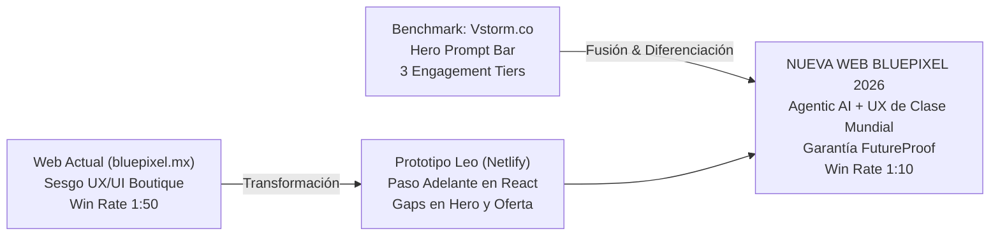
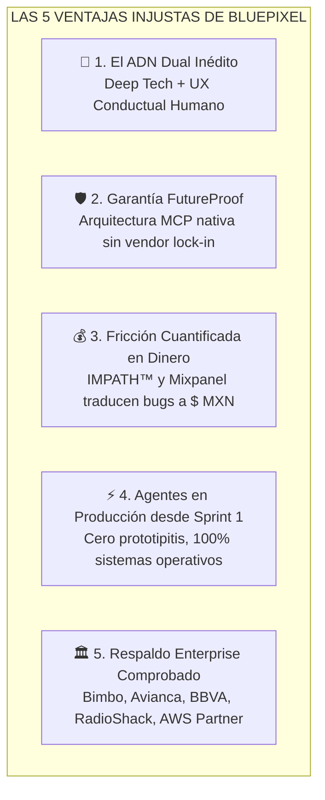
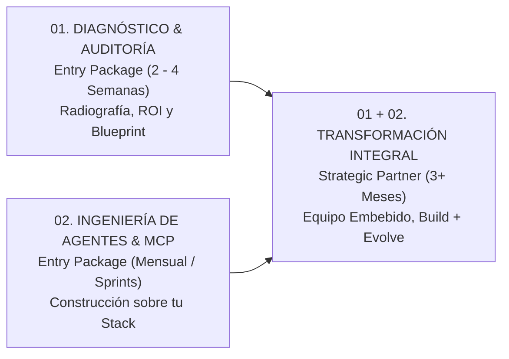
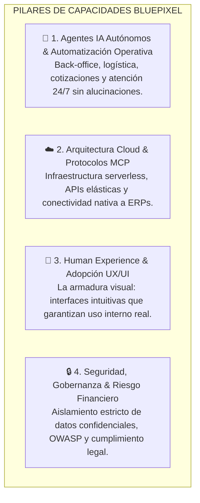

# 🌐 AUDITORÍA MAESTRA, BENCHMARKING Y PLAN DE REDISEÑO WEB BLUEPIXEL 2026
**De Despacho UX/UI a Consultora de Deep Tech, Ingeniería Agentica y Garantía FutureProof**

> **Documento Estratégico y Técnico para la Reunión de Alineación con Leonardo Flores (Leo), Pablo Gómez y Dirección.**  
> *Versión:* 1.0 (Oficial) · *Fecha:* Septiembre 2026 · *Área:* Dirección de Estrategia, Tecnología y Producto B2B.

---



---

## 📑 ÍNDICE GENERAL

1. [El Diagnóstico Forense: El "Desfase de Información" y la Caída de Conversión](#1-el-diagnóstico-forense-el-desfase-de-información-y-la-caída-de-conversión)
2. [Benchmarking Competitivo de Frontera: Qué Tomar de Vstorm.co y Competidores Globales](#2-benchmarking-competitivo-de-frontera-qué-tomar-de-vstormco-y-competidores-globales)
3. [Auditoría Forense Cruzada: bluepixel.mx (Actual) vs. Prototipo Netlify de Leo](#3-auditoría-forense-cruzada-bluepixelmx-actual-vs-prototipo-netlify-de-leo)
4. [La Nueva Narrativa y Storytelling Estratégico: "Creativos Tecnológicos y Tecnológicos Creativos"](#4-la-nueva-narrativa-y-storytelling-estratégico-creativos-tecnológicos-y-tecnológicos-creativos)
5. [Propuesta Integral de Copywriting: Rewrite Sección por Sección (Antes vs. Después)](#5-propuesta-integral-de-copywriting-rewrite-sección-por-sección-antes-vs-después)
6. [El Nuevo Modelo de Contratación: "Tres Formas de Trabajar con BluePixel"](#6-el-nuevo-modelo-de-contratación-tres-formas-de-trabajar-con-bluepixel)
7. [Plan de Arquitectura UX / UI & Diseño de Interacción](#7-plan-de-arquitectura-ux--ui--diseño-de-interacción)
8. [Hoja de Ruta y Guion de Presentación para la Junta con Leo (Semana Próxima)](#8-hoja-de-ruta-y-guion-de-presentación-para-la-junta-con-leo-semana-próxima)

---

## 1. EL DIAGNÓSTICO FORENSE: EL "DESFASE DE INFORMACIÓN" Y LA CAÍDA DE CONVERSIÓN

### 1.1. El Síntoma Comercial Crítico
En las sesiones de diagnóstico de ventas con Pablo Gómez y José de Buen se identificó un colapso en la tasa de cierre:
*   **Inicio de 2026:** Tasa histórica de conversión de **1 de cada 10 prospectos** (10% Win Rate).
*   **Situación Actual:** Caída a **1 de cada 50 prospectos** (2% Win Rate). Se requiere quintuplicar el esfuerzo comercial para lograr un solo cierre.

### 1.2. La Causa Raíz: El Desfase entre la Realidad Interna y la Percepción Externa
BluePixel completó una mutación radical en sus capacidades técnicas: pasó de ser una agencia boutique de diseño de interfaces a convertirse en una firma de **Ingeniería Deep Tech**, arquitecturas serverless, agentes de IA autónomos corriendo en producción y protocolos de conectividad abierta (**MCP - Model Context Protocol**).

Sin embargo, los activos digitales públicos de la empresa comunican lo opuesto:
1.  **La página web actual (`bluepixel.mx`):** Presume con orgullo insignias como *"#1 UX/UI Company in Mexico by DesignRush"*, encabezados de diseño de productos digitales y un tono que atrae a clientes buscando *"pantallitas en Figma"* con presupuestos de $20,000 a $40,000 MXN.
2.  **El impacto con Tomadores de Decisión Corporativos (CTOs, COOs, VPs de Transformación):** Cuando un Director de Operaciones o un CTO con un problema de automatización de $100,000+ USD entra a `bluepixel.mx`, concluye de inmediato: *"Esta es una agencia de creativos visuales, no un partner que pueda meterle mano a mi ERP, a mis bases de datos transaccionales o a la seguridad de mis servidores"*.
3.  **El resultado:** Fricción doble. Los prospectos pequeños no pueden pagar el servicio de ingeniería, y los prospectos corporativos descartan a BluePixel por considerarla *"demasiado agencia de diseño"*.

### 1.3. La Misión del Nuevo Sitio Web de Leo
La nueva web no es una simple actualización cosmética de textos; es el **ancla de reposicionamiento institucional de BluePixel**. Debe:
*   Proyectar solvencia técnica de ingeniería pesada y agentes en producción desde el primer segundo.
*   Presentar al diseño UX/UI no como un adorno cosmético, sino como la **ventaja competitiva injusta** de BluePixel (hacer que la tecnología compleja sea adoptada por humanos reales).
*   Alimentar y dar coherencia a las campañas de pauta B2B (Meta, LinkedIn, Google Ads) que actualmente sufren por aterrizar tráfico en páginas desalineadas.

---

## 2. BENCHMARKING COMPETITIVO DE FRONTERA: QUÉ TOMAR DE VSTORM.CO Y COMPETIDORES GLOBALES

### 2.1. Deconstrucción de `vstorm.co` (Por qué funciona tan bien)

Analizando las capturas compartidas y el benchmark técnico del sitio de Vstorm:

| Elemento Clave | Cómo lo ejecuta Vstorm.co | Por qué es letal en B2B | Qué debemos adoptar en BluePixel |
| :--- | :--- | :--- | :--- |
| **Kicker / Categoría** | `• AGENTIC AI COMPANY` en monospaced rojo sutil sobre fondo blanco/rejilla. | Define la categoría en 3 palabras; cero ambigüedad. | Adoptar `• AGENTIC AI & FUTUREPROOF ENGINEERING`. Cero términos vagos como "agencia digital". |
| **Hero Headline** | *"We build AI agents that run in production."* | Corto, asertivo, ataca el mayor dolor corporativo (los demos de IA que nunca llegan a producción). | *"Construimos agentes de Inteligencia Artificial que operan en producción."* |
| **Interactive Hero Prompt Bar** | `[ 900 quote requests a month, retype... ↗ ]`<br/>*"You're chatting with an AI versed in our content."* | **Product-Led Growth (PLG) inmediato:** En vez de pedir que agenden una llamada genérica, le permite al visitante teclear su problema operativo y recibir una respuesta arquitectónica al instante. | **Implementar la barra interactiva en el Hero:** Permitir seleccionar o teclear casos típicos (cotizaciones, logística, soporte, reconciliación contable) y mostrar solución técnica + caso real análogo. |
| **Trust Bar / Hard Proof** | `30+ PRODUCTION DEPLOYMENTS \| OFFICIAL PYDANTIC PARTNER \| FIRST IN AGENTIC AI FOUNDATION` | Métricas técnicas verificables, no frases motivacionales. | `200+ PLATAFORMAS EN PRODUCCIÓN \| AWS CLOUD PARTNER \| MCP PROTOCOL NATIVE \| SISTEMAS DE ALTA DISPONIBILIDAD`. |
| **Three Ways to Work With Us** | Divide la oferta en 3 escalones claros: 01 Advisory (4-8 sem), 02 Engineering (Mensual), 01+02 Transform (3+ meses). | Resuelve la objeción de entrada. Un cliente escéptico no te compra un contrato anual de primera intención; entra por un diagnóstico pagado. | **Estructurar la oferta de BluePixel en 3 niveles:**<br/>1. Diagnóstico & Auditoría FutureProof (2-4 sem)<br/>2. BUILD: Ingeniería de Agentes & MCP (8-12 sem)<br/>3. EVOLVE: Transformación & Escala Continua (Retainer). |
| **Diseño Visual** | Tipografía nítida, rejilla técnica con puntos, tarjetas con bordes finos, acentos de color sobrios (rojo/negro/blanco), **cero ilustraciones de IA con cerebros de neón**. | Comunica seriedad de ingeniería. No parece plantilla de ThemeForest ni render de Midjourney. | Mantener el dark mode sofisticado de Leo (`#080C16`), tipografía Inter/Onest + JetBrains Mono, líneas estructurales de 1px y diagramas interactivos de procesos. |

### 2.2. Benchmarking contra Otros Jugadores B2B de Frontera

*   **QuantumBlack (McKinsey) / BCG X:** Venden estrategia de IA a precios de $500k+ USD, pero su implementación técnica suele ser lenta y tercerizada en presentaciones ejecutivas. BluePixel gana en **velocidad de despliegue en producción (sprint 1)**, agilidad de ingeniería y costos 10x más eficientes.
*   **Braintrust / Turing AI:** Venden talento de desarrollo ("bodyshop" o asignación de horas de programadores). BluePixel no vende horas hombre ni desarrolladores sueltos; vende un **equipo interdisciplinario integrado con responsabilidad directa sobre el resultado y ROI del negocio**.
*   **Consultoras tradicionales de software (BairesDev, Globant, fábricas de software locales):** Hacen código a la medida pero son ciegas en UX y carecen de arquitectura agentica nativa: entregan sistemas toscos que los empleados rechazan y abandonan. BluePixel cuenta con 6 años de maestría en **psicología conductual y usabilidad (IMPATH / Mixpanel)** para asegurar que el sistema se use desde el día 1.
*   **Agencias Creativas y Boutiques de Diseño UX/UI:** Hacen maquetas visualmente atractivas en Figma, pero carecen por completo de músculo de ingeniería cloud, bases de datos o arquitectura de IA. Sus entregables son cascarones que colapsan al intentar conectarse a un ERP real.

---

### 2.3. Las 5 Ventajas Competitivas Injustas de BluePixel sobre la Competencia (Moats)

Esta matriz estratégica sintetiza por qué un tomador de decisión (CTO, COO, Director General) elige a BluePixel frente a cualquier alternativa del mercado:



| Dimensión de Negocio | 🏢 Consultoras de Estrategia (Big 4 / MBB) | 🤖 Consultoras Puras de IA (Python / ML) | 💻 Fábricas Tradicionales de Software | 🎨 Despachos y Agencias UX/UI | 🛡️ VENTAJA INJUSTA BLUEPIXEL |
| :--- | :--- | :--- | :--- | :--- | :--- |
| **1. Adopción del Usuario Final** | Nula (solo entregan diapositivas). | **Crítica (< 30%):** Interfaces toscas que los empleados rechazan para volver a Excel. | Baja: Sistemas rígidos y complejos con curvas de aprendizaje de meses. | Alta en pantalla, pero **no funciona en código real**. | **Extrema (> 95%):** Diseñado con psicología conductual para adopción inmediata sin manuales de 100 páginas. |
| **2. Conexión con Sistemas Reales** | Tercerizada o ausente. | Demos aislados en Jupyter Notebooks que no tocan producción. | Conexiones monolíticas caras y difíciles de mantener. | Cero capacidad de conexión a APIs o bases de datos. | **Nativa y Desacoplada (MCP):** Agentes conectados a SAP, Salesforce, ERPs y bancos sin alucinaciones. |
| **3. Obsolescencia Tecnológica** | No aplica. | Alta dependencia a librerías propietarias y wrappers frágiles. | **Alta deuda técnica:** Código spaghetti que se rompe al actualizar librerías. | No aplica (solo hacen diseño estático). | **Garantía FutureProof:** Arquitectura modular. Al salir un nuevo LLM (GPT-5, Claude 4), solo se conmuta una API key. |
| **4. Medición del Impacto Financiero** | Proyecciones teóricas a 3 años. | Métricas técnicas abstractas (F1-score, loss, latencia). | Horas hombre facturadas (incentivo perverso a demorar). | Métricas cosméticas (clicks, visitas, estética). | **ROI Cuantificado en Pesos:** IMPATH y Mixpanel miden el costo real de la fricción antes y el dinero liberado después. |
| **5. Tiempo de Despliegue en Producción** | 6 a 12 meses de diagnóstico. | Demos en semanas, **pero nunca llegan a producción**. | 6 a 9 meses para un MVP funcional. | 4 a 8 semanas (solo maquetas en Figma). | **Sistemas Operativos en 4 a 8 semanas:** Diagnóstico inicial (2-4 sem) y agentes en producción desde el sprint 1. |

#### Desglose Detallado de las 5 Ventajas:

1.  **El Matrimonio Inédito entre Deep Tech y Experiencia Humana ("Creativos Tecnológicos & Tecnológicos Creativos"):**
    *   *El problema del mercado:* Las firmas de IA escriben algoritmos potentes pero entregan interfaces ásperas e incomprensibles. El 70% del software corporativo fracasa por rechazo del personal. Por otro lado, las agencias de diseño solo entregan pantallas estáticas en Figma sin entender de latencia, seguridad o lógica de bases de datos.
    *   *El Moat de BluePixel:* Fusionamos 6 años de maestría en diseño conductual con ingeniería serverless de vanguardia. La tecnología más compleja se siente invisible, fluida e intuitiva para el usuario final.
2.  **Arquitectura Abierta MCP (Model Context Protocol) & Garantía FutureProof:**
    *   *El problema del mercado:* Muchas empresas caen en el "vendor lock-in" de plataformas propietarias o en código spaghetti parcheado que se vuelve obsoleto cada vez que OpenAI o Anthropic actualizan sus modelos.
    *   *El Moat de BluePixel:* Diseñamos sobre estándares y protocolos abiertos. El cliente es dueño de su código y de su infraestructura (VPC privada). Su inversión está blindada contra la obsolescencia durante los próximos 5 años.
3.  **Inteligencia de Fricción Propietaria Cuantificada en Dinero (IMPATH™ + Mixpanel UX Health Score):**
    *   *El problema del mercado:* Nadie sabe con certeza cuánto dinero le cuesta un proceso ineficiente o un error en la plataforma digital.
    *   *El Moat de BluePixel:* Con IMPATH creamos gemelos digitales de usuarios reales que recorren los flujos de la empresa y detectan exactamente en qué punto se pierde dinero: *"Detectamos que el paso 3 del checkout le cuesta $1.4M MXN al trimestre"* o *"El proceso manual de cotización le cuesta 120 horas hombre al mes"*. Resolvemos el problema con ROI documentado trimestre a trimestre.
4.  **Certidumbre Operativa: Agentes en Producción desde el Sprint 1 (Antídoto a la "Prototipitis"):**
    *   *El problema del mercado:* El 85% de las iniciativas corporativas de IA se quedan estancadas en prototipos de laboratorio que nunca tocan datos reales ni atienden clientes reales.
    *   *El Moat de BluePixel:* No hacemos experimentos de laboratorio. Diseñamos con reglas de negocio determinísticas, capas RAG blindadas y servidores MCP para que los agentes operen sobre procesos reales desde el primer mes de trabajo.
5.  **Historial Enterprise Comprobado en México y LATAM:**
    *   *El problema del mercado:* La mayoría de las agencias de IA se fundaron hace 6 meses y carecen de estabilidad financiera, procesos de calidad o experiencia con corporativos regulados.
    *   *El Moat de BluePixel:* 10+ años de trayectoria institucional, 200+ plataformas en producción, AWS Advanced Partner, y un portafolio auditado con líderes de la industria como **Grupo Bimbo, Avianca, BBVA, Cemex, RadioShack, LifeMiles, DiDi y PepsiCo**.

---

## 3. AUDITORÍA FORENSE CRUZADA: BLUEPIXEL.MX (ACTUAL) VS. PROTOTIPO NETLIFY DE LEO

### 3.1. Qué Rescatar del Sitio Web Actual (`bluepixel.mx`)
No todo lo anterior debe descartarse. El sitio actual contiene activos de credibilidad institucional de inmenso valor que deben trasladarse a la nueva web:

1.  **El Marquee de Clientes Triple-A:** La presencia verificable de marcas globales como **Grupo Bimbo, BBVA, Avianca, PepsiCo, Cemex, DiDi, Subaru, RadioShack, Marriott y LifeMiles**. Muy pocas consultoras de IA en LATAM pueden mostrar esa lista de clientes.
2.  **Las Métricas Históricas Reales:**
    *   *10+ años creando plataformas digitales.*
    *   *200+ plataformas evolucionadas.*
    *   *60+ profesionales multidisciplinarios.*
3.  **Los Estándares de Certificación:** AWS Partner, ScrumStudy, CyberVadis (seguridad y responsabilidad corporativa).
4.  **Casos de Estudio con Datos:** El caso de estandarización analítica para Bimbo, la optimización de fidelidad para LifeMiles y el rediseño transaccional para RadioShack.

### 3.2. Qué Debemos Eliminar o Cambiar de Raíz
1.  **Eliminar de inmediato:** El badge *"#1 UX/UI Company in Mexico by DesignRush"*. Nos ancla en el pasado de agencia creativa decorativa.
2.  **Eliminar:** El uso exclusivo de inglés en la versión para México y LATAM. La web de Leo debe estar en un español impecable, técnico y corporativo para el mercado hispano, con switch a inglés para clientes transfronterizos.
3.  **Eliminar:** Titulares genéricos como *"We Build, Evolve, and Scale AI-Powered Digital Platforms"* o *"A long-term technology partner"*. Dicen mucho sin decir nada.
4.  **Eliminar:** La venta suelta de "Diseño UX/UI" como servicio independiente.

### 3.3. Auditoría Crítica del Prototipo de Leo (`relaxed-sundae-899484.netlify.app`)

#### Aciertos Notables de Leo:
*   **Base Tecnológica Ágil:** Componentes React con Tailwind bien estructurados, animaciones suaves en CSS (`fadeUp`, carrusel marquee sin saltos).
*   **Visuales Interactivos de Producto:** El módulo `IMPATHVisual` y el simulador de `Mixpanel Platform Health` demuestran visualmente que la empresa mide métricas de negocio reales (Score 78/100, Revenue en riesgo de $4.7M MXN).
*   **Landing de Agentes IA (`agentes-ia-landing.html`):** Contiene copys excelentes redactados por Leo:
    *   *"La IA se aprueba en el consejo. Rara vez llega a producción."* (Hook demoledor).
    *   *"Un chatbot responde preguntas. Un agente ejecuta procesos completos."*
    *   La explicación de la capa RAG (Retrieval-Augmented Generation) y conexión al stack empresarial (Salesforce, SAP, Stripe).

#### Gaps y Deficiencias Críticas que Debemos Subsanar con Leo:
1.  **El Hero Principal Sigue Siendo Débil y Conservador:**
    *   *Copy de Leo:* *"Evolucionamos tu plataforma digital en ventaja competitiva."*
    *   *Diagnóstico:* Es una frase corporativa vacía. No menciona agentes de IA, no menciona automatización, no menciona arquitectura técnica ni habla de resolver dolores operacionales urgentes.
2.  **Falta la Barra Interactiva en el Hero (El mayor acierto de Vstorm):**
    *   Actualmente el Hero de Leo tiene dos botones estáticos: `[ Hablemos ]` y `[ Conoce cómo trabajamos ]`. No hay un enganche de producto inmediato que demuestre la IA en acción.
3.  **El Modelo "FutureProof" Salta Directo a BUILD y EVOLVE, Omitiendo la Auditoría:**
    *   Leo presenta únicamente BUILD (para quien arranca desde cero) y EVOLVE (para quien ya tiene plataforma).
    *   *El gran gap:* Ningún director de operaciones o CTO que no conoce a BluePixel firma un contrato de desarrollo de 3 meses ($30,000+ USD) sin haber pasado por una **Auditoría o Diagnóstico Técnico inicial de bajo riesgo (2 a 4 semanas)**.
4.  **Desbalance Visual hacia UX en el Home:**
    *   Aunque Leo agregó un cintillo morado en BUILD y EVOLVE (*"Incluye capa de Agentes IA"*), la sección principal se siente como un dashboard de analítica de usabilidad web, no como el centro de mando de una empresa que automatiza operaciones complejas.
5.  **Las 6 Tarjetas de Capabilities Diluyen el Mensaje:**
    *   Poner 6 tarjetas iguales (UX/UI, Software, Agentes, Data, Security, Consulting) transmite la impresión de *"hacemos de todo un poco"*. Deben agruparse en una arquitectura cohesiva de 3 o 4 pilares donde la ingeniería y los agentes sean el motor central.

---

## 4. LA NUEVA NARRATIVA Y STORYTELLING ESTRATÉGICO: "CREATIVOS TECNOLÓGICOS Y TECNOLÓGICOS CREATIVOS"

### 4.1. El Eje Conceptual de BluePixel
El reposicionamiento no significa renegar de los 6 años de historia en diseño; significa **elevar el diseño a su máxima expresión funcional**.

```
                           ┌────────────────────────────────────────────────────────┐
                           │               EL POSICIONAMIENTO BLUEPIXEL             │
                           │                                                        │
                           │   "Creativos Tecnológicos & Tecnológicos Creativos"    │
                           └───────────────────────────┬────────────────────────────┘
                                                       │
                           ┌───────────────────────────┴────────────────────────────┐
                           ▼                                                        ▼
┌──────────────────────────────────────────────────────┐  ┌──────────────────────────────────────────────────────┐
│                  EL CEREBRO TÉCNICO                  │  │                  EL ROSTRO HUMANO                    │
│           (Ingeniería Deep Tech & Agentes)           │  │             (UX Conductual & Adopción)               │
├──────────────────────────────────────────────────────┤  ├──────────────────────────────────────────────────────┤
│ • Agentes autónomos que ejecutan procesos 24/7.      │  │ • Cero curvas de aprendizaje para el equipo interno. │
│ • Protocolos abiertos MCP (cero código spaghetti).   │  │ • Interfaces que la gente ama usar en vez de Excel.  │
│ • Conexión directa a ERPs, CRMs y bases de datos.    │  │ • Reducción de fricción cognitiva en checkout/ops.   │
│ • Blindaje de privacidad y aislamiento de datos.     │  │ • Métricas de usabilidad ligadas a impacto contable. │
└──────────────────────────────────────────────────────┘  └──────────────────────────────────────────────────────┘
                                                       │
                                                       ▼
                                   ┌──────────────────────────────────────┐
                                   │         GARANTÍA FUTUREPROOF         │
                                   │  Sistemas modulares preparados para  │
                                   │ los modelos de IA de los próximos    │
                                   │ 5 años sin quedar obsoletos jamás.   │
                                   └──────────────────────────────────────┘
```

### 4.2. El Storytelling del Sitio Web: Los 4 Actos

1.  **Acto 1: La Revelación del Problema Oculto (The Pain):**
    *   La mayoría de las empresas aprueban iniciativas de IA en el consejo, pero el 85% de los proyectos nunca pasa de un prototipo en Python o un chatbot de juguete.
    *   Las empresas que intentaron automatizar con herramientas baratas o "hacerlo en casa con un becario y ChatGPT" terminaron con código spaghetti inmantenible, fuga de datos confidenciales y sistemas que colapsan cuando entran 50 usuarios.
2.  **Acto 2: La Tesis de BluePixel (The Antidote):**
    *   La IA solo genera valor si **opera sobre tus procesos reales**, con datos blindados, y si los humanos que la operan la adoptan sin fricción.
    *   BluePixel integra en un solo equipo la **ingeniería de frontera (Agentes + MCP)** y el **diseño de experiencia humana (UX/UI)**.
3.  **Acto 3: La Certeza Operativa (The Proof):**
    *   No experimentamos con tu dinero. Mostramos métricas en producción: horas hombre liberadas, millones de pesos en fricción eliminados, casos reales con Bimbo, Avianca y RadioShack.
4.  **Acto 4: El Camino Claro hacia la Transformación (The Call to Action):**
    *   No te pedimos un salto de fe de 1 año. Empezamos con una **Auditoría y Diagnóstico Operativo de 2 a 4 semanas** donde te entregamos el plano arquitectónico y el ROI proyectado antes de escribir código.

---

## 5. PROPUESTA INTEGRAL DE COPYWRITING: REWRITE SECCIÓN POR SECCIÓN (ANTES VS. DESPUÉS)

A continuación se detalla la propuesta exacta de copys para reemplazar el contenido del prototipo de Leo:

### 5.1. Header & Hero Section

```
[ HEADER SUPERIOR ]
Logo: BluePixel (Isotipo minimalista blanco/azul)
Nav Links: Capacidades ▾ | Modelo FutureProof | Tres Formas de Trabajar | Casos de Estudio | Blog
CTA Navbar: [ Diagnóstico de Automatización → ] (Botón con acento azul #2563EB)
```

#### Hero: Comparativa Directa

| Elemento | Copy Actual de Leo (Netlify) | NUEVA PROPUESTA BLUEPIXEL 2026 (Inspirada en Vstorm) | Justificación Estratégica |
| :--- | :--- | :--- | :--- |
| **Kicker / Badge** | *Ninguno (o genérico)* | `● INGENIERÍA DE AGENTES IA & PLATAFORMAS FUTUREPROOF` *(Estilo mono espaciado, punto verde esmeralda parpadeante)* | Establece de inmediato la categoría de Deep Tech. |
| **Headline Principal (H1)** | *Evolucionamos tu plataforma digital en ventaja competitiva.* | **Construimos agentes de Inteligencia Artificial que operan procesos reales en producción.** | Demoledor, asertivo y directo. Cero rodeos poéticos. Comunica exactamente lo que los directores de operaciones y CTOs buscan resolver. |
| **Subheadline** | *Un solo equipo de estrategia, UX, ingeniería e IA que diseña, construye y escala tu plataforma, trimestre a trimestre.* | **BluePixel es la consultora de ingeniería agentica y arquitectura cloud para empresas en crecimiento en México y LATAM. Conectamos agentes autónomos a tus sistemas y datos reales, blindados con diseño UX de clase mundial para garantizar adopción inmediata.** | Explica quiénes somos, qué hacemos, para quién y por qué el UX es nuestra ventaja para garantizar la adopción. |
| **Barra Interactiva (Prompt Hero)** | *(No existe en el prototipo de Leo)* | **Componente Interactivo:**<br/>`[ 💬 Ejemplo: "Procesamos 3,000 cotizaciones al mes en hojas de cálculo y demoramos 48 hrs..." ]` `[ Ver Solución Técnica ↗ ]`<br/>*Texto al pie:* *"Interactúa con nuestra arquitectura de diagnóstico. Te mostramos el flujo de agentes y casos de estudio análogos."* | Réplica adaptada del Hero de Vstorm. Atrae al tomador de decisión invitándolo a ingresar su problema y demostrando tecnología viva desde el segundo cero. |
| **Botones de Acción** | `[ Hablemos ]` / `[ Conoce cómo trabajamos ]` | Primario: `[ Solicitar Diagnóstico Operativo (Sin Costo) → ]`<br/>Secundario: `[ Ver Cómo Trabajamos (3 Modelos) ↓ ]` | "Diagnóstico" tiene un valor percibido 10 veces mayor que "Hablemos". Reduce la fricción de contacto. |
| **Trust Bar (Métricas Duras)** | *(Solo el logo de clientes en marquee)* | `200+ PLATAFORMAS EN PRODUCCIÓN  |  30+ AGENTES Y WORKFLOWS DESPLEGADOS  |  AWS ADVANCED PARTNER  |  ARQUITECTURA NATIVA MCP` | Métricas técnicas verificables que generan autoridad inmediata a nivel corporativo. |

---

### 5.2. Sección de Social Proof & Logos de Clientes

```
[ COPY DE ENTRADA ]
Título: "Empresas líderes en México y Norteamérica operan sobre ingeniería desarrollada por BluePixel"
```

*   **Logos en Marquee:** Bimbo, Avianca, BBVA, Cemex, PepsiCo, DiDi, Subaru, RadioShack, Marriott, LifeMiles, Naturgy, MoradaUno, FR Medical.
*   **Métricas Cuantitativas (Reemplazo del Badge de DesignRush):**

| Métrica Anterior | NUEVA Métrica Justificada |
| :--- | :--- |
| `10+ años creando plataformas` | **10+ Años de Ingeniería & Plataformas Robustas** |
| `#1 empresa UX/UI por DesignRush` ❌ *(Eliminar)* | **99.9% Disponibilidad y Cero Deuda Técnica Garantizada** *(Resalta confiabilidad de misión crítica)* |
| `200+ plataformas evolucionadas` | **200+ Sistemas Empresariales Desplegados** |
| `60+ profesionales en producto y tech` | **60+ Especialistas en Arquitectura Cloud, Agentes IA y UX Conductual** |

---

### 5.3. Sección: "La Realidad de la IA Empresarial" (Pain Agitation)

Esta sección debe ubicarse inmediatamente después del Social Proof para educar al mercado y neutralizar el "espejismo de la IA DIY":

```markdown
### ⚠️ LA IA SE APRUEBA EN EL CONSEJO. EL 85% DE LOS PROYECTOS NUNCA LLEGA A PRODUCCIÓN.
Por qué los experimentos internos y las herramientas genéricas están fracasando en la empresa mexicana:

1. El Espejismo del "Hazlo Tú Mismo con IA":
   Cualquiera puede crear un prototipo en 10 minutos con un generador de código. Pero cuando se intenta conectar al ERP, manejar 500 solicitudes concurrentes o auditar la seguridad, el sistema colapsa en "código spaghetti".

2. Riesgo Financiero y Fuga de Información Confidencial:
   Conectar datos de clientes o balances financieros a modelos públicos sin gobernanza ni protocolos de sanitización viola la regulación mexicana (LFPDPPP) y expone a tu empresa a responsabilidades legales graves.

3. Rechazo de los Empleados por Falta de UX:
   El software construido por ingenieros tradicionales sin empatía humana es tosco y difícil de usar. Si la herramienta le complica el día a tu equipo, volverán a operar en hojas de Excel.
```

---

## 6. EL NUEVO MODELO DE CONTRATACIÓN: "TRES FORMAS DE TRABAJAR CON BLUEPIXEL"
*(Inspirado en la estructura de engagement de Vstorm.co, adaptado a la fortaleza de BluePixel)*

Esta sección resuelve el vacío de la **oferta de entrada** que detectamos en el prototipo de Leo.

```
┌────────────────────────────────────────────────────────────────────────────────────────────────────────┐
│                                    TRES FORMAS DE TRABAJAR CON BLUEPIXEL                               │
│  Dos paquetes de entrada para empresas que buscan certidumbre técnica inmediata, y un programa integral │
│          end-to-end para transformar tu operación completa con gobernanza y propiedad tuya.            │
└────────────────────────────────────────────────────────────────────────────────────────────────────────┘
```



### Paquete 01: Diagnóstico & Auditoría FutureProof (Entry Package · 2 a 4 Semanas)
*   **Kicker:** `ENTRY PACKAGE · CERTIDUMBRE TÉCNICA`
*   **Titular:** **Auditoría de Procesos, Fricción y Viabilidad de IA**
*   **Subtítulo:** *"Te mostramos exactamente el camino, identificamos qué automatizar y calculamos el retorno financiero antes de que inviertas un solo peso en desarrollo."*
*   **Qué incluye:**
    *   Diagnóstico de operaciones y mapeo de procesos manuales costosos.
    *   Análisis de fricción con gemelos digitales e inteligencia IMPATH™.
    *   Matriz de viabilidad de agentes IA (dónde sí genera ROI y dónde no invertir aún).
    *   Blueprint de arquitectura técnica y plan de gobernanza de datos.
    *   Reporte ejecutivo con estimación de horas hombre y dinero a liberar.
*   **Para quién es:** Directores generales, COOs y CTOs que necesitan validar la factibilidad técnica y económica antes de comprometer presupuestos grandes.
*   **CTA:** `[ Solicitar Diagnóstico Inicial ↗ ]`

---

### Paquete 02: Agentic Engineering & MCP (Entry Package · Sprints Mensuales)
*   **Kicker:** `ENTRY PACKAGE · INGENIERÍA PURA`
*   **Titular:** **Ingeniería de Agentes & Automatización sobre tu Stack**
*   **Subtítulo:** *"Ya tienes claro qué proceso necesitas automatizar. Nosotros diseñamos la arquitectura, programamos los agentes y los integramos dentro de tu infraestructura."*
*   **Qué incluye:**
    *   Diseño de flujos de trabajo autónomos y reglas de negocio determinísticas.
    *   Integración mediante servidores MCP seguros a tu stack (Salesforce, SAP, ERPs, HubSpot, WhatsApp).
    *   Capa RAG (Retrieval-Augmented Generation) para responder estrictamente con tus manuales y bases de datos reales.
    *   Pruebas de estrés, seguridad OWASP y despliegue en tu nube privada (AWS / GCP / Azure).
*   **Para quién es:** Empresas que ya cuentan con un equipo técnico interno pero carecen de la especialización de frontera para construir agentes de IA que funcionen de manera segura en producción.
*   **CTA:** `[ Explorar Ingeniería de Agentes ↗ ]`

---

### Paquete 01 + 02: Transformación Digital Continua (Full Programme · 3+ Meses · Destacado en Dark Navy)
*   **Kicker:** `● FULL TRANSFORMATION · SOCIO ESTRATÉGICO CONTINUO`
*   **Titular:** **FutureProof: BUILD + EVOLVE**
*   **Subtítulo:** *"De cero a una capa operativa de agentes inteligentes y plataforma de alta disponibilidad. Un solo equipo multidisciplinario que diseña, construye, opera y escala trimestre a trimestre."*
*   **Qué incluye:**
    *   **Todo lo contenido en los Paquetes 01 y 02.**
    *   Equipo senior dedicado y embebido: Tech Lead, AI Engineer, UX/UI Lead y QA.
    *   Desarrollo completo de la plataforma en 90 días (Fase BUILD).
    *   Monitoreo continuo de salud técnica y UX Health Score trimestral (Fase EVOLVE).
    *   Transferencia gradual de conocimiento y código para que tu equipo sea dueño absoluto de lo que opera.
*   **Para quién es:** Empresas medianas y corporativos que requieren un brazo tecnológico de élite que asuma la responsabilidad total de su evolución digital.
*   **CTA:** `[ Agendar Sesión de Transformación ↗ ]`

---

### 5.4. Sección Capabilities Rediseñada (Los 4 Pilares de Solución)

En lugar de las 6 tarjetas dispersas del prototipo actual, proponemos agrupar las capacidades en **4 pilares de ingeniería y adopción** de alto impacto:



1.  **Agentes IA Autónomos & Automatización Operativa:**
    *   *Promesa:* Operación continua, reducción drástica de tiempos de ciclo y eliminación de errores manuales.
    *   *Entregables:* Agentes de cotización instantánea, agentes de reconciliación administrativa, agentes de atención transaccional conectados a WhatsApp y CRM.
2.  **Arquitectura Cloud & Protocolos Abiertos (MCP):**
    *   *Promesa:* Sistemas sin deuda técnica preparados para no quedar obsoletos con los próximos modelos de IA.
    *   *Entregables:* Microservicios en AWS, pipelines de datos en tiempo real, integración desacoplada con SAP, Salesforce, Oracle y sistemas legados.
3.  **Human Experience (UX/UI) & Adopción Conductual:**
    *   *Promesa:* Tecnología compleja que cualquier persona en tu empresa puede operar desde el primer día sin manuales de 100 páginas.
    *   *Entregables:* Design systems empresariales, gemelos digitales de usuarios (IMPATH™), flujos de trabajo sin fricción cognitiva.
4.  **Seguridad, Gobernanza & Blindaje de Riesgo:**
    *   *Promesa:* Tu información confidencial nunca entrena modelos públicos ni sale de tu perímetro seguro.
    *   *Entregables:* Aislamiento de tenants, auditorías OWASP, cumplimiento de la LFPDPPP, trazabilidad total de decisiones de los agentes.

---

### 5.5. Sección de Preguntas Frecuentes (FAQ): El Antídoto a las Objeciones

Reemplazar las preguntas genéricas por el **Battlecard Comercial de Pablo y José**:

1.  **"¿Por qué no podemos desarrollar estos agentes internamente con nuestro equipo o con herramientas de IA gratuitas?"**
    *   *Respuesta:* La IA hoy escribe código muy rápido, pero no diseña arquitecturas seguras ni previene fugas de datos confidenciales. El 80% de las empresas que intentan armar sistemas con IA en casa terminan con código spaghetti que nadie puede mantener y sistemas que colapsan al salir a producción. En BluePixel no cobramos por escribir líneas de código; entregamos certidumbre técnica, blindaje de seguridad, conexión limpia a tus sistemas y una interfaz que tus empleados realmente van a adoptar.
2.  **"¿Qué garantías tengo de que los agentes no inventen respuestas (alucinaciones) ni cometan errores financieros?"**
    *   *Respuesta:* Nuestros agentes no operan con "creatividad abierta". Implementamos arquitecturas RAG y servidores MCP con reglas de negocio estrictamente determinísticas: el agente solo puede consultar tus bases de datos verificadas y aplicar las fórmulas matemáticas que tú autorices. Si un dato no existe en tus fuentes oficiales, el agente no lo inventa; escala el caso a un supervisor humano.
3.  **"¿Nuestros datos confidenciales o de clientes se comparten con OpenAI o terceros?"**
    *   *Respuesta:* Cero. Diseñamos bajo protocolos de aislamiento de grado empresarial. Utilizamos instancias privadas en nube (Azure OpenAI / AWS Bedrock) con acuerdos explícitos de no retención de datos, donde tus prompts y tus bases de datos jamás se utilizan para entrenar ningún modelo. Cumplimos con la regulación mexicana de protección de datos (LFPDPPP).
4.  **"¿Qué es la filosofía y garantía FutureProof?"**
    *   *Respuesta:* Es nuestro principio de ingeniería para evitar que tu inversión quede obsoleta en 12 meses. Diseñamos con arquitecturas modulares desacopladas. Cuando dentro de un año se lance un nuevo modelo de lenguaje con el doble de velocidad y la mitad de costo, tu empresa solo tiene que cambiar una llave de API, sin tener que reconstruir la plataforma desde cero.
5.  **"¿Cuál es el primer paso para empezar a trabajar?"**
    *   *Respuesta:* No te pedimos firmar un contrato anual ni comprometer meses de presupuesto a ciegas. Iniciamos con un **Diagnóstico & Auditoría de Automatización (2 a 4 semanas)** donde nuestro equipo técnico evalúa tus procesos, identifica cuellos de botella y te entrega un plano de arquitectura con el retorno de inversión cuantificado antes de escribir la primera línea de código.

---

## 7. PLAN DE ARQUITECTURA UX / UI & DISEÑO DE INTERACCIÓN

### 7.1. Especificación del Componente: "Hero Prompt Bar" (Interactivo)

Para replicar el éxito de Vstorm y adaptarlo a la realidad mexicana de BluePixel, diseñaremos un componente de **Product-Led Growth (PLG)** en el Hero:

```
┌─────────────────────────────────────────────────────────────────────────────────────────────────────────┐
│                                       PROMPT BAR INTERACTIVO EN EL HERO                                 │
│                                                                                                         │
│  [ 🔍 Describe un cuello de botella de tu empresa (o selecciona un ejemplo)...                 [ Probar ↗ ] ]
│                                                                                                         │
│  Píldoras de selección rápida:                                                                          │
│  [ Cotizaciones manuales lentas ] [ Conciliación de pagos / ERP ] [ Atención a clientes 24/7 ]          │
│  [ Fuga de prospectos en checkout ] [ Reportes directivos en hojas de Excel ]                           │
└─────────────────────────────────────────────────────────────────────────────────────────────────────────┘
```

#### Flujo de Interacción:
1.  **Estado 1 (Reposo):** Muestra un placeholder dinámico (máquina de escribir): *"Procesamos 1,200 facturas a mano cada semana..."*, *"Nuestros ejecutivos tardan 3 días en enviar una cotización técnica..."*.
2.  **Estado 2 (Acción):** El usuario teclea su problemática o hace clic en una de las píldoras de la industria.
3.  **Estado 3 (Modal / Expansión de Arquitectura):**
    *   Se abre un panel lateral o modal limpio con animación técnica (Dark mode):
        *   **El Diagnóstico del Problema:** *"Cuello de botella en captura manual y validación cruzada con ERP."*
        *   **La Arquitectura de Agente Recomendada:** Diagrama de bloques (Agente Extractor + Validador MCP + API SAP/Salesforce).
        *   **Caso Análogo de BluePixel:** *"Caso Grupo Bimbo / RadioShack: Reducción del 75% en tiempo de ciclo."*
        *   **Llamado a la Acción Directo:** `[ Quiero esta solución en mi empresa: Agendar Diagnóstico → ]`

### 7.2. Dirección Visual & Estilo de Diseño (UI Design System)

*   **Fondo & Atmósfera:** Paleta Dark Mode técnica `#060A14` (Deep Space Navy), con acentos de luz sutiles en degradados azul cobalto (`#2563EB`) y púrpura agentic (`#8B5CF6`). Cero fondos negros planos sin profundidad.
*   **Tipografía de Grado de Ingeniería:**
    *   *Titulares & Textos:* **Inter** o **Onest** (geometría limpia, alta legibilidad en pantallas retina).
    *   *Metadatos Técnicos, Badges y Etiquetas:* **JetBrains Mono** o **SF Mono** en tracking amplio (0.15em a 0.25em) y caja alta (`text-xs uppercase font-mono`).
*   **Elementos Gráficos:**
    *   **Prohibición Expresa:** Cero fotografías de stock genéricas de ejecutivos sonriendo frente a laptops, cero renders de robots plateados o manos tocando chispas de luz.
    *   **Uso de Artefactos de Ingeniería:** Rejillas sutiles (grid lines de 1px con opacidad al 4%), diagramas de arquitectura en SVG nítido, monitores de latencia y dashboards con métricas financieras reales.
*   **Micro-animaciones:**
    *   Luz respiratoria en bordes (`ambient pulse` en las tarjetas de FutureProof).
    *   Puntos de estado de servidores parpadeando en verde esmeralda (`#10B981`) para indicar "sistemas activos en producción".

---

## 8. HOJA DE RUTA Y GUION DE PRESENTACIÓN PARA LA JUNTA CON LEO (SEMANA PRÓXIMA)

Para la reunión con Leo de la próxima semana, el objetivo no es criticar su trabajo, sino **felicitarlo por la base técnica en React que ya construyó y elevarla a su máximo potencial de conversión comercial**:

### 8.1. Estructura de la Reunión con Leo (Agenda de 45 Minutos)

1.  **Minuto 0 - 10: Reconocimiento del Trabajo Realizado**
    *   Resaltar que la transición técnica a React/Tailwind y la limpieza del código en Netlify es un gran salto cualitativo frente al Webflow actual.
    *   Elogiar la landing `agentes-ia-landing.html` y los visuales interactivos de IMPATH y Mixpanel.
2.  **Minuto 10 - 25: El Diagnóstico Comercial & El Referente Vstorm.co**
    *   Compartir con Leo la problemática de ventas de Pablo y José (la caída a 1:50 y el desfase de información).
    *   Mostrar las capturas de `vstorm.co`: explicar por qué su Hero ("We build AI agents that run in production") y sus "Three ways to work with us" son el estándar de oro que debemos emular.
3.  **Minuto 25 - 40: Revisión de los Ajustes Clave Propuestos**
    *   **Ajuste 1 (El Hero):** Cambiar el titular abstracto por el titular contundente de agentes en producción.
    *   **Ajuste 2 (El Prompt Bar):** Proponer la integración de la barra interactiva en el Hero como elemento diferenciador de producto.
    *   **Ajuste 3 (El Modelo en 3 Escalones):** Agregar la oferta de entrada de **Diagnóstico & Auditoría (Paquete 01)** antes de BUILD y EVOLVE.
    *   **Ajuste 4 (Las 4 Capabilities):** Simplificar la cuadrícula de 6 a 4 pilares tecnológicos claros.
4.  **Minuto 40 - 45: Plan de Implementación Conjunto**
    *   Definir los entregables: nosotros le suministramos los copys finales en Markdown listos para pegar en el código de React, y Leo lidera la integración visual en Netlify.

### 8.2. Argumentario para Convencer a Leo (Manejo de Objeciones Internas)

*   *Si Leo dice: "¿Por qué no dejamos el titular de 'Evolucionamos tu plataforma digital en ventaja competitiva' que suena más corporativo?"*
    *   **Respuesta:** "Ese titular suena bien en una junta con amigos, pero en Google y LinkedIn nadie busca 'evolución digital'. Los directores buscan cómo automatizar su operación, cómo bajar costos con IA y cómo evitar que sus sistemas queden obsoletos. Si el Hero no dice en 3 segundos qué construimos, el visitante rebota y el dinero de pauta se tira a la basura."
*   *Si Leo dice: "¿No es muy complejo programar la barra de prompt del Hero?"*
    *   **Respuesta:** "Podemos arrancar con una versión V1 súper limpia basada en estados de React y un JSON con las 5 respuestas y diagramas clave para los casos típicos (cotizaciones, facturación, soporte, etc.). Luego lo conectamos con una API o MCP. Lo importante para el lanzamiento es el impacto visual y la experiencia de usuario inmediata."
*   *Si Leo dice: "¿Qué pasa con la landing de Agentes IA que ya tengo hecha?"*
    *   **Respuesta:** "Tu landing de Agentes IA es una joya; de hecho, tomamos tus mejores copys ('La IA se aprueba en el consejo...') para enriquecer todo el sitio web. Lo único que haremos será alinearla con el nuevo modelo de los 3 paquetes para que cierre leads calificados de forma consistente."

---

## 📌 RESUMEN DE COMPROMISOS Y PRÓXIMOS PASOS

1.  **Archivos Guardados en Repositorio:** Toda esta auditoría, copys y arquitectura quedan respaldados permanentemente en `02_Estrategia_B2B/AUDITORIA_Y_REDISEÑO_WEB_BLUEPIXEL_2026.md`.
2.  **Siguiente Acción:** Presentar este plan estratégico en la sesión de alineación con Leo y comenzar la integración en la rama de desarrollo del sitio web.
3.  **Sincronización Git:** Se procede a crear el commit institucional y push a `origin main`.
