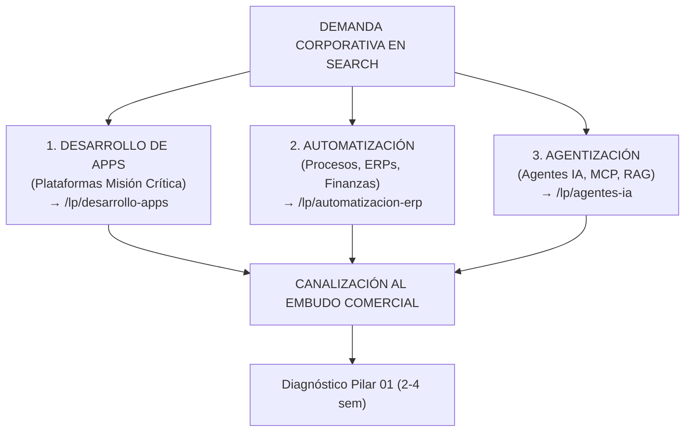

# 🚀 NUEVA ARQUITECTURA DE CAMPAÑAS GOOGLE ADS — BLUEPIXEL 2026
## Deck Ejecutivo para Junta de Alineación · Agencia de Pauta (Marpia / Rocketing)
**Fecha:** 21 de Septiembre 2026 · **Hora:** 16:00 hrs  
**Participantes:** Dirección General, Producto, Marpia (Rocketing), Equipo Comercial  
**Objetivo:** Revisar la auditoría de campañas actuales, presentar la nueva arquitectura del sitio web y definir el mapeo de reactivación en 3 Clusters B2B.

---

## ⏱️ HOOK DE APERTURA (2 MINUTOS)

> *«El problema no es el presupuesto de Google Ads. El problema es la arquitectura.*
>
> *Hoy tenemos 35 campañas aisladas compitiendo entre sí con un presupuesto de $1,000 MXN diarios. Esto atomiza el gasto y confunde al algoritmo. Resultado: 5 meses con cero ventas, clics de casi $200 pesos en App Dev sin conversiones y tráfico de estudiantes.*
>
> *Nuestra solución no es eliminar servicios ni culpar a la agencia. Es organizar la oferta bajo los 3 grandes dolores por los que los CTOs y COOs realmente buscan en Google.*
>
> *Marpia, para ayudarte a optimizar, reestructuramos todo el sitio web y creamos Landings Herméticas. Con esta estructura logramos 3 impactos inmediatos:*
> 1. *Concentramos tu presupuesto en campañas con volumen y relevancia real.*
> 2. *Blindamos tu Quality Score con Message Match exacto.*
> 3. *Canalizamos el 100% de leads calificados al Diagnóstico (Pilar 01).»*

---

## 📊 PARTE 1: DIAGNÓSTICO FORENSE — LO QUE ENCONTRAMOS (AUDITORÍA ROCKETING)

### El Error: Fragmentación y Sangrado de Presupuesto

Analizamos los datos de Q2/Q3 y el comportamiento del algoritmo:
*   **La Realidad de Ventas:** ROI de Q2/Q3 = **-100%**. De abril a agosto se enviaron 21 cotizaciones y se cerraron CERO.
*   **Caída de Contactabilidad:** En septiembre, la tasa de contacto cayó a **16.67%** (5 de cada 6 personas ni contestan). El algoritmo está comprando tráfico basura por falta de negativas estrictas.
*   **La Fragmentación:** 35 campañas activas para $30,000 MXN mensuales ($1,000 MXN/día). Promedio: **$28 pesos al día por campaña**. El algoritmo jamás sale de fase de aprendizaje.

### Desglose de Campañas Problemáticas (Sangrado Actual)

| Campaña | Clics | CPC Promedio | Conv. | Diagnóstico Técnico y Acción |
| :--- | :---: | :---: | :---: | :--- |
| **`IA Operacional Enterprise`** | **199** | **$22.80 MXN** | 1 | **La joya desaprovechada:** Atrae clics baratos, pero la landing genérica vieja convierte al 0.5%. **Se salva y se redirige.** |
| **`WebDev BP | RCKT`** | 25 | **$111.33 MXN** | **0** | Sangrado de dinero: casi $3,000 MXN quemados para cero conversiones. **Apagar.** |
| **`Competidores | RCKT`** | 23 | **$87.73 MXN** | **0** | CTR pésimo y clics caros de prospectos evaluando otras herramientas. **Apagar.** |
| **`App Dev BP | RCKT`** | 13 | **$196.10 MXN** | 1 | CPC desorbitado: casi $200 pesos por clic (y un solo lead de calidad dudosa). **Apagar temporalmente.** |
| **`BluePixel (Brand)`** | 45 | $11.10 MXN | 1 | Gasto de $6,000 MXN defendiendo marca ante búsquedas directas. **Optimizar.** |

---

## 🗺️ PARTE 2: MAPEO PARA MARPIA — CÓMO EL NUEVO SITIO SALVA LA PAUTA

**Marpia, sabemos que sin buenas landing pages es imposible mantener un Quality Score alto.** Por eso hicimos los siguientes ajustes estructurales en el sitio web para reactivar tus campañas:

### 1. Reestructuración de la Oferta Comercial (Sin "Shock de Precio")
*   Antes, el usuario veía presupuestos mínimos de $25,000 USD y rebotaba. 
*   **Ahora:** Tenemos 4 Pilares Modulares. Todo lead calificado de tus campañas entra primero a un **Diagnóstico de 2 a 4 semanas (Ticket bajo, altísima conversión)**.

### 2. Creación de Landings Herméticas (`/lp/*`)
*   Antes mandábamos tráfico a `bluepixel.mx/es/inicio` o `/desarrollo-web`, páginas con menú, distracciones y textos en inglés/mal formateados.
*   **Ahora:** Construimos landings `/lp/` con directiva `noindex, nofollow`, sin menú, sin enlaces externos, con "Message Match" idéntico a tu anuncio y **Quality Score objetivo de 9-10/10**.

### 3. Simuladores de Arquitectura (Proof of Capability)
*   En lugar de prometer "diseño bonito", las nuevas landings muestran simuladores de microservicios y RAG. Esto califica al decisor técnico (CTO/CFO) inmediatamente.

---

## 🎯 PARTE 3: LOS 3 CLUSTERS DE DEMANDA REAL B2B

Marpia, vamos a colapsar las 35 campañas en **3 grandes Clusters con volumen real**. Los decisores (>$300k MXN) buscan por dolores macro, no por nichos aislados:

---

## 🏗️ PARTE 4: ARQUITECTURA DE CAMPAÑAS PARA REACTIVACIÓN

| Capa Estratégica | % Presupuesto | Campañas | Audiencia / Objetivo |
| :--- | :---: | :--- | :--- |
| **Capa 1: Captura de Intención** | **75%** | Search C1: Apps & Plataformas B2B · Search C2: Automatización & ERPs · Search C3: Agentización & IA Enterprise | Decisores con dolor activo (CTO, COO, CFO) |
| **Capa 2: Nutrición & Retargeting** | **15%** | Demand Gen / Meta Ads Retargeting | Reimpacto a visitantes y decisores. Cero Meta frío. |
| **Capa 3: Brand & Protección** | **10%** | Search Branded: BluePixel | Directivos referidos y en cierre |

**Estrategia de Puja:**
*   **Semanas 1-4:** *Maximizar Clics* (Acumular datos).
*   **Semana 5+:** *Maximizar Conversiones tCPA* (Al alcanzar 30+ conversiones consolidadas).

---

## 📋 PARTE 5: GRUPOS DE ANUNCIOS Y COPYS (LISTOS PARA CARGAR)

Marpia, aquí tienes la estructura base para configurar. **Solo Exact Match `[]` y Phrase Match `""`.**

### CLUSTER 1: DESARROLLO DE APPS & PLATAFORMAS DIGITALES
**Destino:** `/lp/desarrollo-apps-enterprise`

*   **G1: Apps Móviles Empresariales**
    *   *Keywords:* `[desarrollo de apps empresariales]`, `"desarrollo aplicaciones moviles corporativas"`, `[empresa de software para apps mexico]`
    *   *Copy:* Titular 1: Desarrollo de Apps Empresariales | BluePixel. Titular 2: Arquitectura Nativa Offline-First & SLA 99.9%.
*   **G2: Portales B2B & Modernización Legacy**
    *   *Keywords:* `[desarrollo plataformas web b2b]`, `"desarrollo software saas corporativo"`, `[modernizacion de sistemas legacy]`
    *   *Copy:* Titular 1: Portales Web y Extranets B2B | BluePixel. Titular 2: Sustituye Hojas de Cálculo por Software Seguro.

### CLUSTER 2: AUTOMATIZACIÓN OPERATIVA & MIDDLEWARE
**Destino:** `/lp/automatizacion-procesos-erp`

*   **G1: Integración ERP (SAP/Oracle)**
    *   *Keywords:* `[integracion sap erp a la medida]`, `"conectar crm con sap s4hana"`, `[automatizacion procesos sap mexico]`
    *   *Copy:* Titular 1: Integración Segura con SAP & ERPs | BluePixel. Titular 2: Conecta tus Sistemas Sin Alterar el Core.
*   **G2: Conciliación Financiera Autónoma**
    *   *Keywords:* `[automatizacion conciliacion bancaria]`, `"software conciliacion facturas sat"`, `"cierre contable automatico empresas"`
    *   *Copy:* Titular 1: Conciliación Bancaria Autónoma | Cierre en 40 Min. Titular 2: Cruce Automático Facturas SAT CFDI 4.0.

### CLUSTER 3: AGENTIZACIÓN & IA CORPORATIVA (Reactivar "IA Operacional")
**Destino:** `/lp/agentes-ia-produccion`

*   **G1: Agentes MCP en Producción**
    *   *Keywords:* `[agentes de inteligencia artificial para empresas]`, `"model context protocol mcp mexico"`, `[agentes autonomos produccion]`
    *   *Copy:* Titular 1: Agentes de IA en Producción | Protocolo MCP Nativo. Titular 2: Cero Alucinaciones · Datos en tu Nube Privada.
*   **G2: Análisis Legal / RAG Empresarial**
    *   *Keywords:* `[analisis documental con inteligencia artificial]`, `"software ia revision de contratos"`, `[asistente rag empresarial]`
    *   *Copy:* Titular 1: Análisis de Contratos & Licitaciones con IA. Titular 2: Audita Expedientes de 200 Páginas en Minutos.

---

## 🛑 PARTE 6: LISTA MAESTRA DE NEGATIVAS (FILTRO ANTI-PYME URGENTE)

Marpia, el gran problema actual son los términos de búsqueda que se filtran por concordancia amplia. Por favor, **carga esto a nivel cuenta HOY**:

| Categoría | Términos a Bloquear | Razón |
| :--- | :--- | :--- |
| **Bajo Presupuesto / Gratis** | gratis, free, economico, barato, bajo costo, software libre, open source gratis, plantilla, demo gratis | Elimina prospectos < $300k MXN |
| **Académico / Educativo** | curso, tutorial, capacitacion, diplomado, certificacion, que es, pdf, tesis, definicion, wikipedia, como funciona | Bloquea estudiantes |
| **Laboral / Freelancers** | vacantes, empleo, trabajo, contratacion jr, sueldo, cuanto gana, bolsa de trabajo, fiverr, freelancer, workana | Elimina tráfico buscando empleo |
| **Herramientas No-Code B2C** | make gratis, zapier tutorial, chatgpt login, app creator gratis, wix, canva, botpress basico | Descarta soluciones sin ingeniería |

---

## ⚡ PARTE 7: ACCIONES INTERINAS (SI LAS LANDINGS NO ESTÁN LISTAS HOY)

Si necesitamos activar campañas **ya** antes del despliegue del nuevo sitio:
1.  **Redirección de IA:** La campaña `IA Operacional` debe apuntar a `cotiza.bluepixel.mx/consultoria-inteligencia-artificial` (no al home genérico).
2.  **Apagar Sangrado:** Pausar "WebDev" y "Competidores" inmediatamente.
3.  **Activar LinkedIn Lead Gen:** Gastar los $8,000 MXN en LinkedIn usando Formularios Nativos (Lead Gen Forms) regalando un "Blueprint de Arquitectura". No necesitamos landing para captar CTOs ahí.
4.  **Meta Ads a Retargeting:** Apagar campañas frías en Meta y pasarlo todo a Retargeting de casos de éxito B2B (Bimbo/RadioShack) a visitantes web.

---

## 🔌 PARTE 8: ATRIBUCIÓN CERRADA (PRÓXIMO PASO)

Marpia, para que dejes de optimizar por "formularios brutos" (que luego no contestan), vamos a conectarnos a la **Google Ads Offline Conversion API**.

1. Las nuevas landings guardan el **GCLID** y UTMs.
2. Lo pasan a nuestro servidor MCP (Notion + Scoring).
3. Cuando Ventas cierra un diagnóstico o proyecto, el servidor devuelve la señal de valor real a Google.
4. **Acuerdo Técnico:** Necesitamos que nos compartas el **Developer Token** y el **Customer ID** de Google Ads para hacer la tubería.

---

## 🤝 PARTE 9: ACUERDOS A CERRAR HOY CON ROCKETING

1.  **Aprobación de la Arquitectura de 3 Clusters** y consolidación de las 35 campañas atomizadas.
2.  **Apagado Inmediato** de las campañas sangrantes (App Dev, Web Dev, Competidores) y reubicación de presupuesto.
3.  **Carga Inmediata** de la lista de negativas nivel cuenta.
4.  **Redirección de Landing actual** para IA Operacional a `cotiza...` mientras se despliegan las `/lp/*` nuevas.
5.  **Pivote de Redes Sociales:** Activar LinkedIn (Lead Gen Forms) y pasar Meta a Retargeting puro.
6.  **Entrega de API Tokens** para empezar a armar la atribución de conversiones offline.
