# 🚀 ESTRATEGIA MAESTRA DE CRECIMIENTO, REVOPS Y ABSORCIÓN B2B (BLUEPIXEL 2026)
*Documento vivo de arquitectura comercial, agentización web, orquestación de agencia, analítica forense y modelo de retención continua.*

**Autor:** Fabián Flores | Head of Growth & RevOps  
**Organización:** BluePixel (`bluepixel.mx` | `cotiza.bluepixel.mx`)  
**Fecha de Consolidación:** Septiembre, 2026 (Operación Día 1)  
**Repositorio GitHub:** [`jahflavio/bluepixel`](https://github.com/jahflavio/bluepixel.git) | Rama `main`  

---

## 🏛️ CAPÍTULO 0: TESIS DE IDENTIDAD Y POSICIONAMIENTO B2B: DE AGENCIA UX/UI A INGENIERÍA FUTUREPROOF

### 0.1 La Metamorfosis Histórica y el "Desfase de Información"
BluePixel nació y se consolidó en el mercado como una destacada **agencia boutique de Diseño UX/UI** (creación de interfaces limpias, wireframes, diseño visual y branding digital).  
Sin embargo, en su evolución reciente, BluePixel integró capacidades de **Deep Tech**: arquitectura de software de misión crítica, infraestructura en la nube, microservicios, inteligencia artificial aplicada y servidores MCP (*Model Context Protocol*).

**El gran dolor actual:** Existe un **desfase crítico de información** entre lo que BluePixel ES HOY y lo que comunican sus canales públicos:
*   **La Página Web (`bluepixel.mx`), los medios y las 9 Landings de pauta (`cotiza.bluepixel.mx`):** Siguen proyectando y comunicando a la empresa como "agencia de diseño y desarrollo web".
*   **El resultado comercial perverso:** Atrae leads de bajo ticket ($20k – $40k MXN), curiosos o coordinadores junior que buscan un "rediseño estético", mientras que los tomadores de decisión corporativos (CEOs, CTOs y Directores de Innovación con presupuestos de +$500k MXN) asumen que BluePixel es "solo un equipo de diseño" y no les confían el corazón de sus operaciones críticas.
*   **La caída de conversión:** Este desfase es la causa raíz directa de que la tasa de cierre se haya desplomado de **1:10 a 1:50**. El tráfico que llega no corresponde al servicio que BluePixel necesita y sabe vender.

### 0.2 El Manifiesto del Perfil Híbrido: "Los Creativos son Tecnológicos, los Tecnológicos son Creativos"
En el mercado tradicional de software existen dos mundos rotos:
1.  **Las consultoras de software corporativo (grises y frías):** Tienen ingenieros que dominan bases de datos pero carecen de sensibilidad humana; entregan sistemas inusables que parecen hojas de cálculo de 1995 y sufren rechazo masivo de usuarios.
2.  **Las agencias de marketing y diseño:** Crean maquetas hermosas en Figma pero no saben de escalabilidad, APIs ni seguridad de datos; su software se cae los viernes.

**La ventaja competitiva injusta de BluePixel:**  
En BluePixel se rompió la frontera entre el arte y la ingeniería: **los creativos ahora son tecnológicos y los tecnológicos ahora son creativos**.  
*   El diseño UX/UI **no es un producto aislado que se vende por kilo**: es la armadura y la experiencia humana con la que vestimos nuestra arquitectura de ingeniería pesada.
*   Entregamos **código de grado militar con la experiencia visual y conductual más pulida del mercado**.

### 0.3 La Filosofía "FutureProof"
En la era de la Inteligencia Artificial, los directivos viven con el temor de invertir en software que quede obsoleto en seis meses con cada nuevo lanzamiento de modelos fundacionales.  
La bandera de marca de BluePixel es la filosofía **FutureProof**:
*   **Sistemas Preparados para el Futuro:** Arquitecturas desacopladas, modulares y estandarizadas (mediante protocolos abiertos como MCP) que permiten incorporar nuevos modelos de IA, APIs o cambios de mercado sin tener que tirar el sistema a la basura ni rehacerlo desde cero.
*   **Acompañamiento Continuo (Build & Evolve):** No entregamos un desarrollo y desaparecemos; nos convertimos en el socio tecnológico que acompaña la evolución del negocio mes a mes con analítica conductual y soporte de SLA.

### 0.4 Plan de Alineación Estratégica en Tres Frentes:
1.  **Pauta Pagada y Adquisición B2B (Rocketing / Diana Cardoso):**
    *   Sustituir micro-nichos dispersos por los **3 Clusters de Demanda Real B2B**:
        *   **Desarrollo de Apps:** Plataformas cloud, apps web/móvil empresariales y modernización de software de misión crítica en 90 días.
        *   **Automatización:** Procesos de negocio (BPA/RPA), flujos entre sistemas y conexión determinística con SAP, Salesforce y ERPs.
        *   **Agentización:** Ingeniería de Agentes IA autónomos en producción con protocolos MCP y RAG privado blindado contra alucinaciones.
    *   Cargar la lista maestra de keywords negativas (anti-PyMEs < $300k, estudiantes y búsquedas gratuitas).
2.  **Conversión en Web y Landings (`bluepixel.mx` y Blueprint Library):**
    *   Canalizar el tráfico hacia los **3 Pilares Oficiales de Contratación**:
        *   **01: Diagnóstico & Auditoría FutureProof** (*Entry Package | 2 a 4 semanas | CTA: Solicitar Diagnóstico*).
        *   **02: Ingeniería de Agentes & MCP** (*Entry Package | Sprints mensuales | CTA: Explorar Ingeniería*).
        *   **01+02: Transformación: BUILD + EVOLVE** (*Full Transformation | 3+ meses / continuo | CTA: Agendar Sesión*).
    *   Uso de las 10 landing pages y blueprints interactivos como **Proof of Capability** (demostración tangible de soluciones ya probadas en producción).
3.  **Discurso Comercial y Cierre (Pablo Gómez y José de Buen):**
    *   Vender certidumbre operativa, soberanía de datos en nube privada y arquitectura FutureProof en lugar de "pantallas decorativas u horas hombre".
    *   Enrutar cada llamada de descubrimiento al paquete exacto de la imagen según la madurez técnica del cliente.

---

## 🧭 CAPÍTULO 1: CONTEXTO ORGANIZACIONAL REAL, STAKEHOLDERS Y MATRIZ DE EQUIPO

A partir de las reuniones de inducción con Dirección y la agencia externa (**Rocketing**), se consolida el mapa de actores, responsabilidades y vías de comunicación:

### 1.1 Equipo Interno de BluePixel y Estructura Organizacional

BluePixel cuenta con un equipo multidisciplinario senior con sólida trayectoria interna, combinando ingeniería de software, diseño de producto, revenue operations y un área comercial especializada:

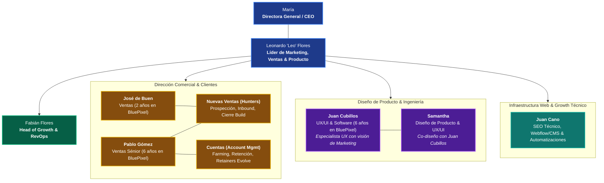

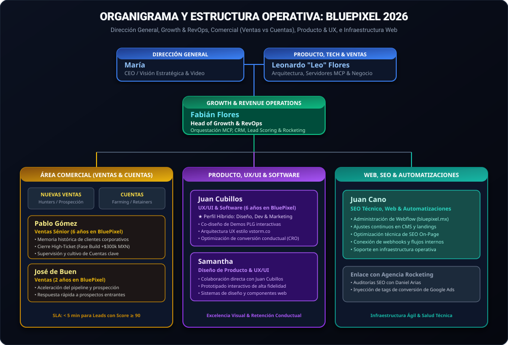

#### 👑 Dirección General & C-Level
*   **María (Directora General / CEO):**
    *   Liderazgo corporativo, relaciones institucionales y visión de negocio de alto nivel.
    *   Presencia digital propia y figura de autoridad empresarial en formatos audiovisuales (*"Pixel contra el mundo"*).
*   **Leonardo "Leo" Flores (Líder de Marketing, Ventas & Producto / Socio Fundador):**
    *   Cabeza de producto, ingeniería y arquitectura tecnológica.
    *   **Su visión clave:** Resolver los cuellos de botella de **Adquisición** y **Conversión**, posicionar a BluePixel como partner a largo plazo (*modelo Evolve / Retainers*), y liderar la vanguardia de **agentes y servidores MCP (Model Context Protocol)** implementados con herramientas como *Claude Code*.

#### 📈 Revenue Operations & Growth
*   **Fabián Flores (Head of Growth & RevOps):**
    *   Orquestación omnicanal, implementación del CRM, automatización de flujos con Python y MCP, Lead Scoring algorítmico y gobernanza de la agencia Rocketing.

#### 💼 Área Comercial (Estructura Dual: Nuevas Ventas vs. Cuentas)
El área de ventas opera bajo una división estratégica para no mezclar la prospección de nuevos contratos con el cuidado de la cartera:
1.  **Nuevas Ventas (New Business / Hunters):**
    *   Atención inmediata de prospectos inbound calificados (Lead Score ≥ 90, presupuesto > $300k MXN) y prospección outbound activa.
    *   Ejecución de Discovery Calls, diagnóstico técnico-financiero y estructuración de contratos de la **Fase Build**.
2.  **Cuentas (Account Management / Farming):**
    *   Acompañamiento post-venta, satisfacción del cliente, entrega continua de valor y venta cruzada/upselling.
    *   Transición de proyectos finalizados hacia retainers recurrentes de evolución y soporte (**Fase Evolve** mensual de $60k - $90k MXN).
*   **Pablo Gómez (Ventas Sénior — 6 años en BluePixel):**
    *   Pilar comercial histórico con seis años de trayectoria en la empresa. Posee el entendimiento más profundo de los clientes corporativos, las curvas de negociación, el histórico de proyectos y los patrones de compra del mercado B2B. Clave tanto en el cierre de nuevas cuentas de alta envergadura como en la relación estratégica de cuentas clave.
*   **José de Buen (Ventas — 2 años en BluePixel):**
    *   Ejecutivo comercial enfocado en acelerar el pipeline de ventas, prospección activa, calificación ágil de prospectos y seguimiento riguroso de prospectos calificados.

#### 🎨 Diseño de Producto, UX/UI & Software
*   **Juan Cubillos (UX/UI & Software — 6 años en BluePixel):**
    *   Perfil híbrido senior de altísimo valor: combina seis años de experiencia en diseño de interacción (UX/UI) y desarrollo de software con un **profundo conocimiento y sensibilidad de Marketing**.
    *   Es el puente natural entre estética, usabilidad, código y conversión (CRO). Pieza clave para el co-diseño de los prototipos interactivos PLG y la nueva interfaz de la web inspirada en `vstorm.co`.
*   **Samantha (Diseño de Producto & UX/UI):**
    *   Diseñadora clave que colabora directamente con Juan Cubillos en la conceptualización, prototipado de alta fidelidad, flujos de usuario, diseño de componentes y entrega de experiencias visuales de clase mundial para clientes y plataformas internas.

#### ⚙️ Infraestructura Web, SEO & Automatizaciones
*   **Juan Cano (SEO Técnico, Web & Automatizaciones):**
    *   Especialista a cargo del SEO técnico, optimización de rendimiento, estructura e implementación continua de cambios en el sitio web (Webflow y CMS).
    *   Responsable del soporte técnico interno y de la configuración de automatizaciones operativas. Aliado directo de RevOps para inyección de scripts, webhooks y metadatos.

---

### 1.2 Directorio y Roles del Equipo de la Agencia (Rocketing)

| Especialista | Rol en Rocketing | Funciones y Entregables Clave | Canal de Interacción |
| :--- | :--- | :--- | :--- |
| **Roberto Carro Maciel** | **Director General (Rocketing)** | Jefe de todo el equipo de la agencia. Alineación de alto nivel, contrato comercial y fee. | Contacto directo con María y Leo. |
| **Lydia Marisela Calderón ("Marily")** | **Líder de Cuenta (Account Lead)** | **Tu contacto primario.** Gestión de pendientes diarios, entrega de minutas, coordinación interna de especialistas y entregas semanales. | Comunicación directa y continua con Fabián. |
| **Diana Cardoso** | **Especialista en Pauta Pagada (Paid Media)** | Manejo y optimización de campañas en Google Ads (Search), Meta Ads (Facebook/Instagram) y presupuestos mensuales. | Vía Marily / Juntas técnicas de Ads. |
| **Daniel Arias** | **Especialista SEO & Search Console** | Optimización en motores de búsqueda, keywords técnicas, salud del sitio web y auditorías de Search Console. | Vía Marily / Auditorías técnicas de tráfico orgánico. |
| **Jessica Blanco** | **Creativa y Contenidos** | Estrategia de contenidos, guiones para redes sociales, formatos *"Pixel News"* y *"Pixel contra el mundo"*. | Vía Marily / Sesiones creativas y grabaciones. |
| **Sergio Blanco** | **Fotógrafo y Videógrafo (Hermano de Jessica)** | Grabación presencial en oficinas/talleres, cobertura de video con clientes, edición de video y cápsulas para YouTube/TikTok/LinkedIn. | Vía Jessica y Marily durante jornadas de producción. |
| **René** | **Diseñador Gráfico** | Creación de identidades visuales, gráficos publicitarios, banners y assets estáticos para pauta y landings. | Vía Marily (tickets de diseño). |

---

### 1.3 Matriz de Comunicación y Gobernanza: BluePixel ⇄ Rocketing

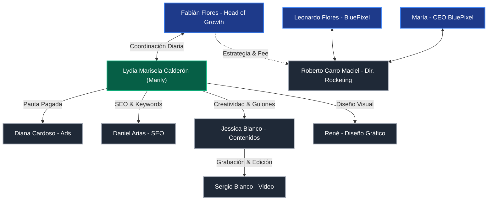

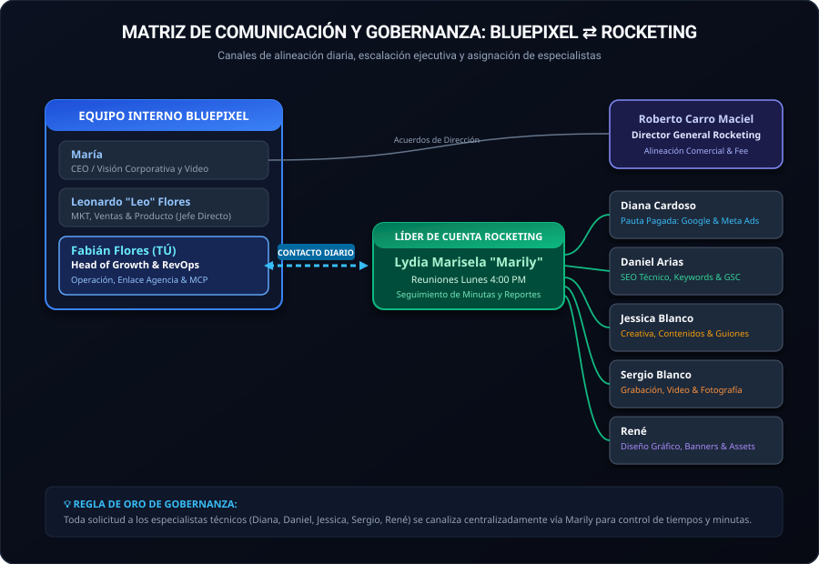

> [!IMPORTANT]
> **Regla de Gobernanza:** Para evitar cruces de órdenes o desgaste de tiempo, todo requerimiento a los especialistas técnicos de Rocketing (Diana, Daniel, Jessica, Sergio, René) se canaliza centralizadamente a través de **Lydia Marisela ("Marily")**.

---

### 1.4 Rituales Operativos y Fechas Críticas
*   **Lunes 4:00 PM:** Entrega y revisión del reporte de rendimiento semanal en Looker Studio ([Dashboard de Campañas](https://datastudio.google.com/u/0/reporting/b825c361-9afe-4db0-a656-8a93d6106392/page/p_bg1t74vpzd)) con Marily, Diana y el equipo.
*   **Viernes 11:00 AM - 2:00 PM (Taller de Agentización con FR Medical):** Sesión de 3 horas con el cliente real **FR Medical** ([`frmedical.com.mx`](https://frmedical.com.mx/) - tecnología cardiotorácica y vía aérea). Objetivo: estructurar la agentización de sus cotizaciones quirúrgicas y gestión médica con IA. Grabación con Sergio y Jessica para extraer VOC y cápsulas de video. Ver guía detallada: [PLAYBOOK_TALLER_FR_MEDICAL.md](file:///c:/Users/usarioBP/.gemini/antigravity-ide/scratch/bluepixel/01_Onboarding_y_Guias/PLAYBOOK_TALLER_FR_MEDICAL.md).

---

### 1.5 Checklist Estratégico de Definición con el Equipo Interno y Leo

- [ ] **Pablo Gómez & José de Buen (Comercial - Nuevas Ventas & Cuentas):**
  - Mapear el flujo actual de llamadas de prospección y acordar el **SLA de contacto inmediato (< 5 min)** para prospectos con Lead Score ≥ 90.
  - Definir la segmentación en Notion entre proyectos nuevos (**Fase Build**) y seguimiento/expansión de cartera existente (**Fase Evolve / Cuentas**).
- [ ] **Juan Cubillos & Samantha (Producto, UX/UI & Software):**
  - Revisar y co-diseñar los componentes de los **11 Prototipos PLG interactivos** para elevar su estética y usabilidad al estándar de clase mundial de BluePixel.
  - Planear la integración de la visión de marketing en la navegación del sitio web inspirada en `vstorm.co`.
- [ ] **Juan Cano (Web, SEO & Automatizaciones):**
  - Sincronización técnica sobre la estructura de Webflow Designer (`bluepixel.mx` y `cotiza.bluepixel.mx`) para la inyección de scripts, widgets interactivos y optimización de SEO on-page.
  - Auditar las automatizaciones existentes (Make, Zapier, Webhooks) para articularlas con el servidor MCP.
- [ ] **Google Search Console (GSC):** Permiso de Administrador/Propietario delegado (existen 3 registros TXT verificados en el dominio `bluepixel.mx`).
- [ ] **Webflow Designer:** Acceso completo a los proyectos de `bluepixel.mx` y `cotiza.bluepixel.mx` para inyectar scripts, widgets interactivos y corregir etiquetas SEO junto con Juan Cano.
- [ ] **El CRM Oficial:** Definir la adopción de **HubSpot** (Starter/Pro) o Brevo/Airtable para centralizar el pipeline y retroalimentar a la agencia.
- [ ] **Enriquecimiento B2B:** Activar cuenta de desarrollador en **Apollo.io API** (Organization tier) o **Clearbit Reveal** para desanonimizar IPs en Webflow.
- [ ] **Gestión de Proyectos Operativos:** Confirmar si el equipo de ingeniería usa **Jira o Trello** para automatizar el traspaso de *Closed/Won*.
- [ ] **Licencias de IA:** Inventario de licencias corporativas (**Claude Anthropic Team**, ChatGPT Plus/Team, o API Keys de OpenAI).
- [ ] **Control de DNS:** Acceso a GoDaddy/Cloudflare para configurar el subdominio del servidor MCP (`api.bluepixel.mx`) y corregir el registro SPF/DMARC de Mandrill.

---

## 🔍 CAPÍTULO 2: DIAGNÓSTICO FORENSE DE INFRAESTRUCTURA Y CANALES

### 2.1 Auditoría Forense del Código Fuente de `bluepixel.mx`
Al analizar a fondo el código fuente y la arquitectura web de `bluepixel.mx`, se detectaron 5 ventajas técnicas clave:

1. **Infraestructura Ágil en Webflow (`data-wf-domain`):**
   * *El hallazgo:* El sitio está construido en Webflow y sus assets corren sobre CDN global.
   * *La ventaja:* No requerimos semanas de desarrollo ni tocar código compilado para iterar. Podemos inyectar los widgets de nuestro **Asistente MCP y Demos PLG** directamente mediante un script ligero en el Header/Footer de Webflow.
2. **Cultura de Analítica Conductual (Mixpanel + GTM):**
   * *El hallazgo:* Tienen un script nativo de inicialización de Mixpanel configurado para rastrear eventos como `"CTA Clicked"`, además de Google Tag Manager.
   * *La ventaja:* Practican el *Dogfooding*. Venden analítica y la consumen. Conectaremos Mixpanel con el CRM vía webhooks de Python para detonar alertas inmediatas cuando un prospecto visite la página de un Caso de Éxito.
3. **Atribución B2B con UTMs en LocalStorage:**
   * *El hallazgo:* Tienen un script en Vanilla JS que extrae los parámetros UTM de la URL, los almacena en el `localStorage` del navegador y los inyecta dinámicamente en los formularios de contacto.
   * *La ventaja:* Entienden la atribución del primer toque (*First-Touch Attribution*). Conectaremos este script a las conversiones fuera de línea (*Offline Conversion Tracking*) para devolver señales de contratos ganados a Google y LinkedIn Ads.
4. **Filtro Enterprise Activo (Self-Qualification):**
   * *El hallazgo:* El formulario actual tiene como opciones de presupuesto mínimo `"$300K - $800K MXN"` hasta `"$5M+ MXN"`.
   * *La ventaja:* BluePixel descarta activamente proyectos chicos. Su target es 100% Mid-Market y Enterprise, lo que valida nuestro sistema de **Lead Scoring de 100 puntos**.
5. **Arquitectura SEO Semántica JSON-LD y Ventaja GEO / AEO:**
   * *El hallazgo:* Implementan un esquema de `application/ld+json` (Schema.org) listando su catálogo de ofertas (`OfferCatalog`).
   * *La oportunidad GEO (Generative Engine Optimization):* En 2026, los directivos B2B investigan en **Perplexity, Claude y ChatGPT**. Las IAs priorizan sitios con JSON-LD estructurado porque extraen respuestas técnicas sin alucinar. Enriqueceremos este código inyectando `aggregateRating` (ROI de Casos de Éxito) y `FAQPage` (arquitecturas Cloud), logrando que los motores generativos recomienden a BluePixel como la máxima autoridad técnica en México.

---

### 2.2 Auditoría OSINT DNS de Dominio
*   **Servidor de Correo (MX):** Google Workspace (`aspmx.l.google.com`). La empresa opera sobre Google Drive, Gmail y Meet.
*   **Plataformas de Envío (SPF / TXT):** `v=spf1 include:_spf.google.com include:spf.mandrillapp.com ~all`.
    *   *Riesgo detectado:* El registro SPF usa SoftFail (`~all`) y está vinculado a **Mandrill (Mailchimp Transactional)**. Se debe auditar la reputación y configurar DMARC estricto para evitar que correos de prospección caigan en la bandeja de SPAM de corporativos.
*   **Verificación SEO:** Existen 3 registros TXT independientes de verificación de Google Search Console. Solo se requiere solicitar acceso con permisos de lectura para auditar keywords orgánicas.

---

### 2.3 Diagnóstico de la Infraestructura de Captación Actual: El Servidor MCP de Leo, Notion y el Dilema del CRM

*   **El Hallazgo Clave:** Leonardo ("Leo") automatizó la captación de prospectos utilizando **Claude Code** (el CLI agentic de Anthropic) para construir y desplegar un **servidor MCP (Model Context Protocol)** que escucha los envíos desde la página web (Webflow), inserta los registros automáticamente en una base de datos de **Notion**, y detona correos electrónicos de notificación al área de ventas.
*   **Por qué esto es una enorme ventaja competitiva:** 
    1. Demuestra que Leo posee una visión técnica de frontera, adopta herramientas de última generación (Claude Code y arquitectura MCP) y cree profundamente en la automatización.
    2. Valida que BluePixel practica el ***Dogfooding*** (usar internamente la misma tecnología de agentes y MCPs que vende a corporativos). Esta es una credencial de venta de inmenso valor para el taller de mañana con FR Medical.
*   **El Síntoma Operativo en la Agencia:** A pesar de que los leads caen en Notion y ventas recibe un correo, la agencia Rocketing sigue pautando "a ciegas": optimizan para conseguir formularios brutos, pero no saben qué campañas, anuncios o palabras clave generan contratos reales de **+$300,000 MXN**.

#### 2.3.1 Los 3 Cuellos de Botella Ocultos de la Arquitectura Notion + Notificación por Correo

Aunque el desarrollo de Leo resuelve con elegancia la ingesta inicial a costo cero, desde la perspectiva de **Revenue Operations (RevOps)** y escalabilidad B2B, existen 3 brechas críticas que impiden convertir esa automatización en una máquina predecible de ingresos:

1. **Ceguera Algorítmica de Google Ads y LinkedIn (Falta de *Closed-Loop Attribution*):**
   * *El problema:* Notion es un repositorio de datos aislado. Cuando un cerrador cambia el estatus de un prospecto a *"Ganado / Firmado"* por $400,000 MXN, Notion **no tiene capacidad nativa para devolver el identificador de clic (`GCLID`) ni el valor de la conversión a la API de Google Ads**.
   * *El impacto:* El algoritmo de Smart Bidding de Google sigue optimizando por "usuarios que llenan formularios baratos" (estudiantes, cotizaciones pequeñas, proveedores). Sin retroalimentación de contratos ganados, Rocketing seguirá atrayendo clics de baja calidad aunque duplique el presupuesto.
2. **La Fosa Común del 80% (Inexistencia de Nurturing Automático Multi-Touch a 90 Días):**
   * *El problema:* En servicios de software y arquitectura tecnológica High-Ticket, el **80% de los directores no compran el primer día**: están esperando la aprobación de presupuesto del próximo trimestre o afinando su alcance interno.
   * *El impacto:* La automatización actual envía *un solo correo* de aviso a ventas. Si ventas llama y el cliente dice *"háblame en 2 meses"*, el lead queda sepultado en Notion. Notion no puede ejecutar secuencias automáticas de correo para nutrir al CTO con casos de éxito STAR-ROI (Avianca, Bimbo, RadioShack) a los 15, 30 y 60 días sin intervención humana.
3. **Latencia en *Speed-to-Lead* y Falta de Enriquecimiento en Vivo:**
   * *El problema:* Un correo electrónico al área de ventas compite con decenas de correos diarios en el inbox.
   * *El impacto:* Según *Harvard Business Review*, contactar a un prospecto B2B en **menos de 5 minutos** incrementa en **21 veces (2,100%)** la tasa de calificación exitosa frente a contactarlo 30 minutos después. La notificación por correo no incluye datos enriquecidos (LinkedIn del decisor, tecnologías instaladas, facturación estimada) ni alertas push de alta prioridad para llamada inmediata.

| Capacidad Crítica para Escalar B2B | ⚙️ Arquitectura Actual (Notion + MCP Básico) | 🚀 Arquitectura Híbrida Propuesta (MCP Orquestador + CRM) |
| :--- | :--- | :--- |
| **Ingesta de la Web** | ✅ Automatizada vía MCP / Claude Code | ✅ Automatizada vía el MCP de Leo |
| **Visualización del Pipeline** | ✅ Base de datos y tableros en Notion | ✅ Base de datos en Notion (se conserva 100%) |
| **Notificación a Ventas** | ⚠️ Correo tradicional (se pierde en el inbox) | 🔥 Alerta instantánea en Discord/WhatsApp (&lt; 5 min) si Score ≥ 90 |
| **Lead Scoring Predictivo** | ❌ Inexistente (se trata igual a un estudiante que a un VP) | 🎯 Algorítmico (100 pts) evaluado en el MCP |
| **Conexión Bidireccional con Ads** | ❌ Nula (Rocketing pauta a ciegas) | 📈 Conversiones Offline enviadas a Google Ads API con GCLID |
| **Nurturing de Ciclo Largo (90 días)**| ❌ Nulo (el 80% de los leads se enfría y muere) | ✉️ Secuencia automatizada de Casos STAR-ROI a $0 MXN |

#### 2.3.2 La Propuesta de Sinergia: El Servidor MCP de Leo como Orquestador Maestro

> [!TIP]
> **Principio de Consultoría y Alianza Interna:** Jamás se debe plantear a Leo desechar su automatización en Notion. Al contrario: **su servidor MCP desarrollado con Claude Code es el cimiento perfecto**. Lo que haremos es **expandir las capacidades del MCP** para que opere como el enrutador maestro del ecosistema:

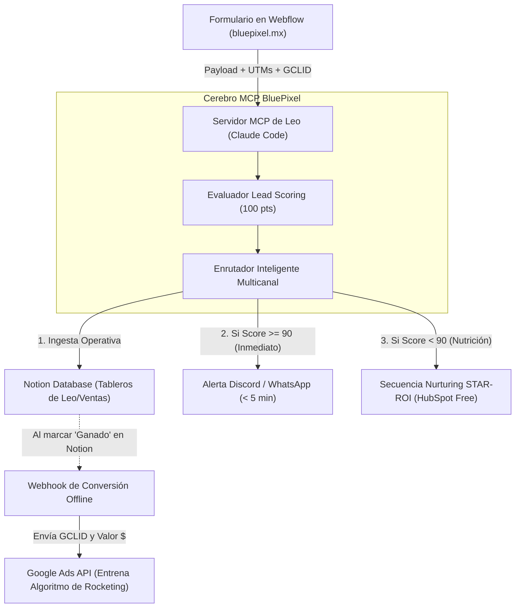

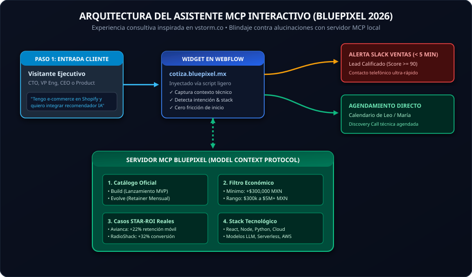

1. **Ruta 1 (Operación Interna en Notion):** El servidor MCP continúa escribiendo en la base de datos de Notion exactamente como lo diseñó Leo. El equipo comercial (**Pablo Gómez y José de Buen**) mantiene sus tableros Kanban, notas de Discovery y flujo de trabajo habitual sin disrupción alguna, direccionando el prospecto a la columna de **Nuevas Ventas** si es un lead nuevo de desarrollo (**Build**) o a **Cuentas** si es un cliente existente solicitando ampliación de servicios o soporte (**Evolve**).
2. **Ruta 2 (Alerta Priorizada en Discord a Nuevas Ventas):** Si el MCP calcula que el Lead Score es **≥ 90** (empresa corporativa + decisor técnico + presupuesto estimado > $300k MXN), dispara una alerta push inmediata a Discord/WhatsApp etiquetando al equipo de **Nuevas Ventas (Pablo Gómez / José de Buen)** con el perfil de LinkedIn y teléfono verificado para llamada en menos de 5 minutos (SLA Speed-to-Lead).
3. **Ruta 3 (Cierre del Bucle Publicitario - *Closed-Loop*):** Cuando Leo, Pablo o José marcan un trato como *"Calificado"* o *"Ganado"* en Notion, el MCP o un webhook ligero captura ese cambio de estado y envía el `GCLID` a la API de Conversiones Fuera de Línea de Google Ads y LinkedIn Ads. Esto elimina la ceguera de Rocketing y entrena a los algoritmos para traer clientes de +$300,000 MXN.
4. **Ruta 4 (Nurturing Automático a $0 MXN):** Para prospectos con Score **< 90** o sin presupuesto inmediato, el MCP los envía a **HubSpot Free CRM**, detonando la secuencia de 4 correos con los casos de éxito de Avianca, Bimbo y RadioShack espaciados a lo largo de 60 días.


#### 2.3.3 Argumentación Estratégica para Presentar a Leo:
* *"Leo, analicé a fondo cómo integraste Claude Code con el servidor MCP para alimentar Notion y notificar a ventas. Me parece una genialidad técnica y la prueba viva de que BluePixel practica el dogfooding de agentes y MCPs antes de vendérselo a clientes como FR Medical."*
* *"Para llevar tu desarrollo al siguiente nivel y resolver el reclamo de Rocketing sobre la calidad de leads, propongo conectar tu MCP a un bucle de conversiones offline hacia Google Ads y activar un goteo de nutrición para los prospectos que tardan 90 días en comprar. De esta forma, tu MCP se convierte en el corazón de todo nuestro Revenue Operations sin tocar tu flujo en Notion."*

---

### 2.4 La Segunda Gran Fuga: Inexistencia de Mailing y Nurturing B2B

*   **El Hallazgo Crítico:** BluePixel actualmente **no cuenta con ninguna herramienta ni operación de email marketing o mailing activo**.
    *   El registro de Mandrill detectado en los registros DNS es un rezago técnico legado sin uso operativo actual.
    *   No existen listas segmentadas, newsletters técnicas, ni secuencias de seguimiento post-formulario.
*   **El Impacto Directo en la Adquisición y Conversión:**
    *   En consultoría de software y proyectos B2B de +$300,000 MXN, el **95% de los prospectos no compran en su primer contacto**. Tienen que evaluar presupuestos, consultar con sus socios o esperar la liberación de capital del siguiente trimestre.
    *   Al no existir mailing, **el 100% de los leads que genera Rocketing con Google Ads y que no cierran de inmediato se pierden para siempre**. Cada peso invertido en ese clic se evapora porque nadie vuelve a tocar a ese prospecto.
*   **La Solución Inmediata (Sin Comprar Herramientas Adicionales):**
    *   **No se necesita contratar Mailchimp, Sendgrid ni ActiveCampaign:** Al adoptar **HubSpot Free CRM**, se desbloquea de manera nativa y gratuita su herramienta de **Email Marketing B2B** (hasta 2,000 correos mensuales incluidos, con editor visual y analítica de aperturas/clics).
    *   **Correos 1 a 1 vía Google Workspace (Gmail):** Se conecta directo a la cuenta corporativa de Leo o Ventas. Los correos de seguimiento no parecerán newsletters comerciales de spam, sino mensajes directos y profesionales de un consultor de ingeniería, logrando tasas de apertura superiores al 45%.

---

### 2.5 Auditoría de Canales de Rocketing

| Canal | Estado Actual | Diagnóstico de Growth | Acción Inmediata |
| :--- | :--- | :--- | :--- |
| **Google Ads** | Solo campañas de **Search**. Wallets de presupuesto sin Display. | Es el canal con mayor intención de compra directa, pero redirige a 9 landings estáticas en `cotiza.bluepixel.mx`. | Auditar términos de búsqueda (*Search Terms*), añadir palabras clave negativas y optimizar el CRO con Demos PLG. |
| **LinkedIn Ads** | **Inactivo.** La agencia alegó que *"no llegaban leads"*. | Fracaso de agencia tradicional: intentan vender software de $300k+ con formularios fríos sin lead magnets ni segmentación ABM a CTOs. | Diseñar estrategia **ABM (Account-Based Marketing)** con segmentación por cargo (CTO/VP Engineering/CEO). |
| **Meta Ads (FB/IG)** | Contenido *Always-On* de remarketing con micro-presupuesto. | Adecuado como canal de soporte y frecuencia de marca, pero ineficiente para captura inicial de grandes cuentas B2B. | Mantenerlo estrictamente para retargeting a visitantes web y difusión de video corporativo. |
| **TikTok / YouTube** | Propuesta para clips de *Pixel News*. | TikTok genera alcance masivo pero baja conversión Enterprise; YouTube es ideal para autoridad técnica y SEO a largo plazo. | Enfocar esfuerzo en YouTube (Search de ingeniería) y reciclar shorts para LinkedIn y TikTok. |
| **Herramientas** | Semrush, Ubersuggest (Agencia) + Hotjar y Clarity (BluePixel). | Stack completo para SEO y mapas de calor. | Analizar grabaciones de Clarity en las 9 landings para medir caídas y fricción de scroll. |

---

### 2.6 La Tercera Gran Fuga: Caída en Conversión Comercial (de 1:10 a 1:50) y el Espejismo del "Hágalo Usted Mismo con IA"

*   **El Hallazgo Comercial (Reunión con Pablo Gómez y José de Buen):** A inicios de 2026, BluePixel vivió su mejor época en ventas cerrando **1 de cada 10 prospectos (10% Win Rate)**. Actualmente la conversión se desplomó a **1 de cada 50 prospectos (2% Win Rate)**, multiplicando el esfuerzo del equipo comercial por cinco para cerrar el mismo volumen.
*   **Las Dos Causas Raíz Identificadas:**
    1.  **Disonancia en la Comunicación de Marca:** El intento de transicionar abruptamente de una *"agencia amigable y cercana de UX/UI"* a una *"consultora corporativa seria"* generó un vacío: los clientes históricos sienten que BluePixel se volvió fría y distante, mientras que los prospectos nuevos aún no ven la justificación de tarifas premium si suena genérica.
    2.  **El Espejismo de la IA ("AI DIY"):** La falsa creencia del mercado de que con ChatGPT, Claude o Cursor cualquier becario o persona interna puede programar un software corporativo sin contratar a una consultora.
*   **El Antídoto Estratégico:**
    *   No renunciar al UX/UI: posicionar el diseño empático y humano como el vehículo indispensable para que el software sea adoptado, montado sobre arquitectura Cloud e IA de grado militar.
    *   Evidenciar en las llamadas de venta la matriz de riesgos del "código spaghetti", la fuga de datos confidenciales y la falta de gobernanza de los desarrollos improvisados con IA.
    *   📘 **Manual de Combate y Guiones Oficiales:** Consulta la [TESIS_ANTIDOTO_IA_Y_BATTLECARD_COMERCIAL.md](file:///c:/Users/usarioBP/.gemini/antigravity-ide/scratch/bluepixel/02_Estrategia_B2B/TESIS_ANTIDOTO_IA_Y_BATTLECARD_COMERCIAL.md) con las respuestas exactas ante objeciones.

---

## 🤖 CAPÍTULO 3: AGENTIZACIÓN DE LA WEB (MODELO VSTORM.CO + MCP BLUEPIXEL)

Leo (Líder de Tech/Ventas) identificó acertadamente que el formulario tradicional de contacto es el culpable de la fuga de conversión. Desarrollaremos un asistente interactivo respaldado por un servidor **MCP (Model Context Protocol)** local.

### 3.1 Benchmark de Vstorm.co vs BluePixel
*   **Vstorm (`vstorm.co`):** Consultora boutique de IA para medianas empresas (*Mid-market*). Su propuesta web no es "somos una agencia más", sino "somos ingenieros de IA con metodología propia (TriStorm)". Su web cuenta con desanonimización de IPs (Radar/Clearbit) y un flujo donde el cliente consulta y recibe un diagnóstico técnico personalizado antes de hablar con un humano.
*   **La Adaptación para BluePixel:** Transformar las secciones de contacto de `bluepixel.mx` y `cotiza.bluepixel.mx` en un **"Diagnóstico Inteligente de Arquitectura & IA"**.

---

### 3.2 Arquitectura del Asistente MCP BluePixel

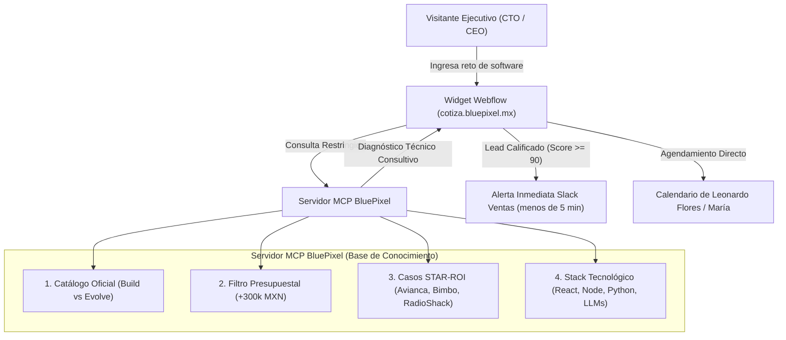


El agente está blindado contra alucinaciones mediante un servidor MCP que **únicamente responde con información oficial y casos de éxito de BluePixel**:
*   **Base de Conocimiento 1:** Catálogo de servicios oficiales (**Build vs Evolve**).
*   **Base de Conocimiento 2:** Filtro presupuestal estricto (Ticket mínimo +$300,000 MXN).
*   **Base de Conocimiento 3:** Casos de Éxito reales bajo framework STAR-ROI (Avianca, Bimbo, RadioShack).
*   **Base de Conocimiento 4:** Stack tecnológico avalado (React, Node, Python, Serverless, AWS, LLMs).

---

### 3.3 Reestructuración del Portafolio Técnico (Framework STAR-ROI)
Los directores de tecnología (CTOs) no compran estética B2C; compran reducción de riesgos y escalabilidad de software. Reestructuramos los casos de estudio bajo la fórmula militar **STAR-ROI**:
*   **S (Situación):** El cuello de botella operativo o dolor financiero que tenía la empresa.
*   **T (Tarea):** El reto técnico de ingeniería asignado a BluePixel.
*   **A (Arquitectura):** El stack de software, microservicios y diagramas Cloud desplegados.
*   **R (ROI):** Impacto financiero inobjetable.

**Aplicación a Clientes Emblemáticos de BluePixel:**
*   **Avianca (LifeMiles):** *"Optimización Conductual (UX/UI) que incrementó la retención de usuarios móviles en +22%"*.
*   **RadioShack:** *"Evolución de Arquitectura E-Commerce y Pasarelas Flexibles que aumentó la tasa de conversión en +32%"*.
*   **Bimbo:** *"Estandarización de Infraestructura de Datos Multinacional y Deuda Técnica: Despliegue de 3 plataformas críticas en 6 meses"*.

---

### 3.4 Modelo de Atribución W-Shaped (Para Ciclos B2B Largos)
En ciclos de venta Enterprise de 3 a 6 meses, el modelo de "último clic" es obsoleto. Se implementa un **Modelo W-Shaped**:
*   **30% del crédito:** Primer contacto (*First Touch*, ej. clic en LinkedIn Ads o Google Search).
*   **30% del crédito:** Conversión inicial a lead (*Lead Creation*, diagnóstico con el Agente MCP o descarga de Demo).
*   **30% del crédito:** Creación de oportunidad técnica (*Opportunity Creation*, llamada de Discovery con Leo).
*   **10% del crédito:** Toques intermedios de nutrición (*Nurturing*, emails de casos de éxito y re-visitas).

---

## ⚡ CAPÍTULO 4: EL EMBUDO B2B Y MOTOR REVOPS (FULL-FUNNEL)

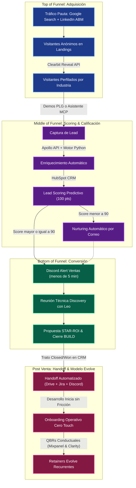

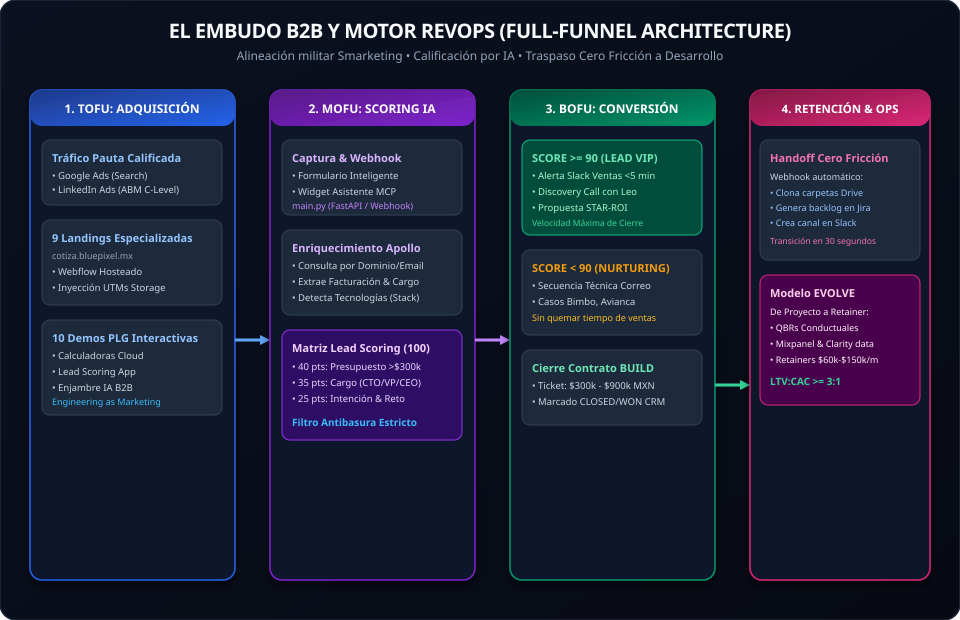

---

### 4.1 Flujo de Handoff Técnico y Cero Fricción


---

### 4.2 Inventario de Inyección Interactiva en las 9 Landings (`cotiza.bluepixel.mx`)

| Landing Page Activa | Servicio Core | Problema Actual | Inyección Interactiva (Demo PLG) |
| :--- | :--- | :--- | :--- |
| [/desarrollo-web](https://cotiza.bluepixel.mx/desarrollo-web) | Plataformas y Web Apps | Texto estático genérico. Cero interactividad. | Inyectar selector de arquitectura y cotizador de MVP rápido. |
| [/desarrollo-apps](https://cotiza.bluepixel.mx/desarrollo-apps) | Apps Nativas e Híbridas | No muestra capacidades en tiempo real. | Inyectar [Demo Inventario Colaborativo](file:///c:/Users/usarioBP/.gemini/antigravity-ide/scratch/bluepixel/03_Prototipos_y_Codigo/Demos_PLG/3_Inventario_Colaborativo/index.html) (sincronización multi-usuario en ms). |
| [/diseno-ux-ui](https://cotiza.bluepixel.mx/diseno-ux-ui) | Diseño de Producto Digital | No cuantifica el valor del buen diseño. | Inyectar [Auditor de Fricción Web](file:///c:/Users/usarioBP/.gemini/antigravity-ide/scratch/bluepixel/03_Prototipos_y_Codigo/Demos_PLG/6_Auditor_Friccion_Web/index.html) (cálculo de dinero perdido por segundo de carga). |
| [/consultoria-inteligencia-artificial](https://cotiza.bluepixel.mx/consultoria-inteligencia-artificial) | Diagnóstico & Estrategia IA | Promesa abstracta sin demostración en vivo. | **Inyectar el Widget de Diagnóstico MCP.** Demostrar IA usándola en el propio sitio. |
| [/servicios-de-automatizacion](https://cotiza.bluepixel.mx/servicios-de-automatizacion) | Workflows e Integraciones | No cuantifica el ahorro de horas hombre. | Inyectar [Onboarding Cero-Touch](file:///c:/Users/usarioBP/.gemini/antigravity-ide/scratch/bluepixel/03_Prototipos_y_Codigo/Demos_PLG/5_Onboarding_Cero_Touch/index.html) (aprovisionamiento de Jira/Slack en 1s). |
| [/soluciones-agentes-ia](https://cotiza.bluepixel.mx/soluciones-agentes-ia) | Agentes Autónomos | Describe agentes sin permitir probarlos. | Inyectar [Enjambre IA B2B](file:///c:/Users/usarioBP/.gemini/antigravity-ide/scratch/bluepixel/03_Prototipos_y_Codigo/Demos_PLG/10_Enjambre_IA/index.html) (ingreso de dominio ➔ análisis autónomo). |
| [/futureproof](https://cotiza.bluepixel.mx/futureproof) | Mantenimiento y Refactor | Concepto abstracto para quien tiene deuda técnica hoy. | Inyectar [Optimizador FutureProof](file:///c:/Users/usarioBP/.gemini/antigravity-ide/scratch/bluepixel/03_Prototipos_y_Codigo/Demos_PLG/9_Optimizador_FutureProof/index.html) (refactorización JS a TS en vivo). |
| [/desarrollo-de-software](https://cotiza.bluepixel.mx/desarrollo-de-software) | Ingeniería Custom | Mismo discurso que agencias tradicionales. | Inyectar [Generador de MVP Build](file:///c:/Users/usarioBP/.gemini/antigravity-ide/scratch/bluepixel/03_Prototipos_y_Codigo/Demos_PLG/8_Generador_MVP_Build/index.html) (idea ➔ Tech Stack y Backlog). |
| [/servicios-arquitectura-datos-escalable](https://cotiza.bluepixel.mx/servicios-arquitectura-datos-escalable) | Data Warehousing & ETL | Complejidad técnica sin visualización de valor. | Inyectar [Chat-With-Your-Data](file:///c:/Users/usarioBP/.gemini/antigravity-ide/scratch/bluepixel/03_Prototipos_y_Codigo/Demos_PLG/7_Chat_With_Your_Data/index.html) (consultas en lenguaje natural a bases de datos). |

---

### 4.3 Implementación de Nurturing desde Cero (Activación con HubSpot Free + Gmail)

Dado que BluePixel actualmente **carece de plataforma y operación de mailing activa**, activaremos esta capacidad crítica desde cero sin costo adicional utilizando el motor de email marketing nativo de HubSpot Free conectado a Google Workspace (Gmail):

1. **Flujo 1: Leads Fríos o No Calificados Inmediatamente (Score < 90):**
   * *Problema resuelto:* Evita que los prospectos que hoy no tienen presupuesto se olviden de BluePixel.
   * *Mecánica:* Secuencia de 4 correos espaciados (cada 12 días) enviando casos técnicos puros bajo framework STAR-ROI (Avianca, Bimbo, RadioShack). Cero insistencia comercial, 100% autoridad técnica.
2. **Flujo 2: Onboarding Operativo Cero Fricción (Closed/Won):**
   * *Problema resuelto:* Reduce la ansiedad post-compra del cliente (*Buyer's Remorse*).
   * *Mecánica:* Bienvenida en video de María y Leo, y entrega automática de accesos a tableros de Jira y canales de Slack mediante webhook de Python.
3. **Flujo 3: Retención Consultiva y Modelo Evolve (Clientes Activos):**
   * *Problema resuelto:* Convierte proyectos cerrados de desarrollo en ingresos recurrentes mensuales ($60k - $150k MXN/mes).
   * *Mecánica:* Convocatorias a QBRs (Quarterly Business Reviews) trimestrales mostrando mapas de calor de Clarity/Mixpanel y justificación técnica de nuevas features.

---

## 🎬 CAPÍTULO 5: ESTRATEGIA DE CONTENIDOS Y FORMATOS EN VIDEO

La propuesta de Jessica Blanco de producir *"Pixel contra el mundo"* y *"Pixel News"* se canaliza hacia la generación de autoridad técnica para cerrar contratos B2B.

### 5.1 La Tríada de Voces
*   **María (Visión de Negocio / CEO):** Perspectiva estratégica, retorno de inversión y transformación corporativa. Conecta con CEOs y CFOs.
*   **Leo (Autoridad de Ingeniería / Head of Tech):** Arquitectura de software, deuda técnica e implementación real de IA a nivel código. Conecta con CTOs y VPs de Ingeniería.
*   **Jessica Blanco (Anfitriona Dinámica):** Dinamismo, ganchos de retención en los primeros 3 segundos y preguntas aterrizadas que los clientes se hacen comúnmente.

### 5.2 Formatos y Dinámica de Producción
*   **"Pixel contra el mundo":** Debates y desmitificación técnica (ej. *"Microservicios vs Monolito: Cuándo estás tirando tu dinero"*, *"Por qué el 80% de los proyectos de IA en corporativos fracasan"*). Formato largo en YouTube (8-15 min) + clips de 60s en LinkedIn.
*   **"Pixel News":** Cápsulas ágiles de actualidad sobre OpenAI, Anthropic, Google Cloud y AWS aplicadas a negocios. Formato YouTube Shorts, TikTok y carruseles en LinkedIn.

### 5.3 Extracción del Taller con el Cliente (Viernes 11:00 AM - 2:00 PM)
*   **Voz del Cliente (VOC):** Registrar frases textuales sobre dolores y frustraciones operativas para reutilizarlas como títulos de anuncios y ganchos de video.
*   **Protocolo de Grabación:** Cortar al menos **5 micro-cápsulas de 45 segundos** con estructura: *Problema del cliente ➔ Solución arquitectónica de Leo/María ➔ Resultado medible*.

---

## 📈 CAPÍTULO 6: ROADMAP DE ABSORCIÓN GRADUAL DE ROCKETING (12 MESES)

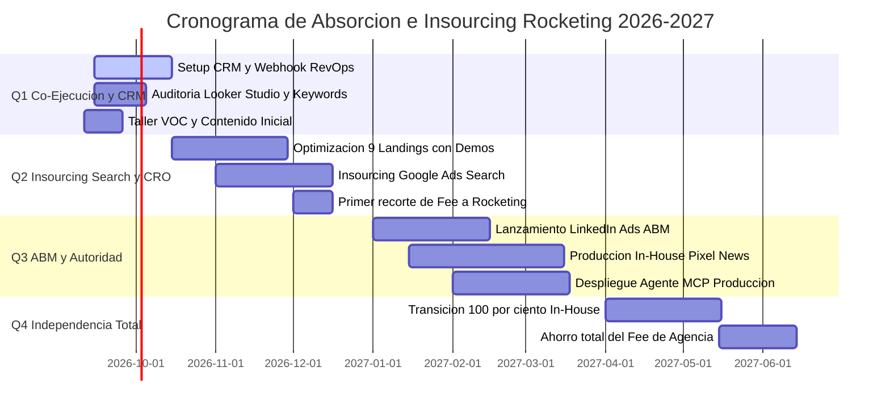

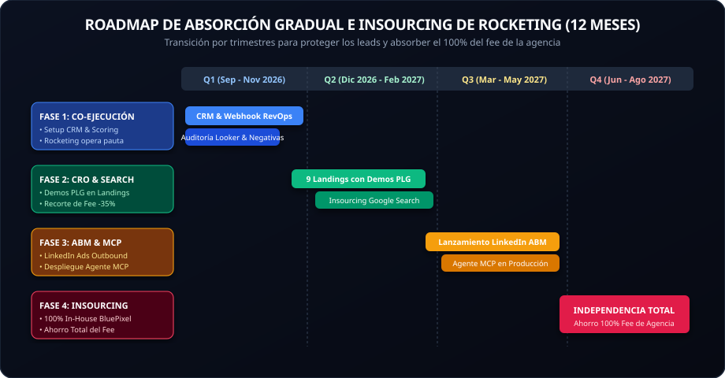

Para cumplir la meta directiva de absorber las funciones de Rocketing protegiendo la generación de ingresos, se ejecuta la transición por fases:

1. **Q1 (Mes 1 a 3) - Co-Ejecución, Control de Datos y Setup de CRM:**
   * Rocketing opera la pauta actual en Google y Meta.
   * Se implementa el CRM unificado y el webhook de Lead Scoring ([main.py](file:///c:/Users/usarioBP/.gemini/antigravity-ide/scratch/bluepixel/03_Prototipos_y_Codigo/bluepixel_engine/main.py)).
   * Retroalimentación semanal a la agencia para eliminar keywords basura en Google Search.
2. **Q2 (Mes 4 a 6) - CRO en Landings e Insourcing de Google Search:**
   * Inyección de Demos PLG en las 9 landings de `cotiza.bluepixel.mx`.
   * El equipo interno asume la gestión directa de Google Search (ahorro de comisiones de gestión).
   * **Primer recorte del 35% del fee de Rocketing**, manteniéndolos solo para video y soporte gráfico.
3. **Q3 (Mes 7 a 9) - Activación de LinkedIn Ads (ABM) y Contenido de Autoridad:**
   * Reactivación de LinkedIn Ads operado internamente, segmentado a CTOs.
   * Producción in-house de los formatos *"Pixel contra el mundo"*.
   * Despliegue del Asistente MCP en producción.
4. **Q4 (Mes 10 a 12) - Independencia Absoluta:**
   * Finalización del contrato con Rocketing.
   * Operación 100% In-House liderada por la Célula de Growth & RevOps interna.
   * **Ahorro del 100% del fee de la agencia externa para BluePixel.**

---

## 💰 CAPÍTULO 7: FINANZAS, OPEX TECNOLÓGICO Y PRESUPUESTOS

### 7.1 Distribución Estratégica del Presupuesto Pauta (ABM)

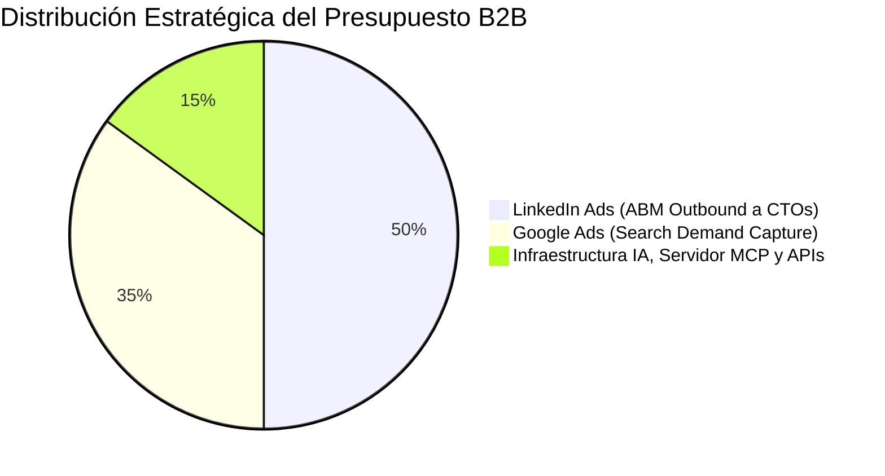

---

### 7.2 Costos Mensuales de Software (OPEX de RevOps)
Para operar la maquinaria con código propio en lugar de costosas plataformas empresariales de caja cerrada:
*   **Apollo.io API (Enriquecimiento B2B):** ~$149 USD/mes (Tier Organization con acceso API para que el motor en Python perfile leads en milisegundos).
*   **Clearbit Reveal (Desanonimización de IPs):** ~$150 - $250 USD/mes (Personalización dinámica de landings según la empresa visitante).
*   **Fireflies.ai (Inteligencia Conversacional):** ~$18 - $29 USD/mes (Transcripción y extracción de objeciones técnicas en llamadas de venta).
*   **Servidor MCP & Consumo OpenAI/Anthropic:** ~$20 - $50 USD/mes (Al construir el servidor en Python con código propio, solo se paga el consumo real de tokens).
*   **HubSpot CRM (Base de Datos Comercial):** Tier Starter/Pro para centralizar el pipeline.

---

### 7.3 Escenarios de Inversión Mensual (Pauta + Software)

1. **Escenario Mínimo ($1,500 - $3,000 USD/mes) - "Validación y Eficiencia":**
   * *Alcance:* Herramientas base + pauta quirúrgica en Google Search.
   * *Resultado:* Validación del Asistente MCP y Lead Scoring. Generación de **3 a 5 SQLs Enterprise al mes**. Cero riesgo de capital.
2. **Escenario Medio ($5,000 - $8,000 USD/mes) - "Maquinaria B2B Completa" (RECOMENDADO):**
   * *Alcance:* Ecosistema completo + LinkedIn Ads (ABM Outbound a CTOs) + Google Search optimizado.
   * *Resultado:* Flujo constante y predecible de **10 a 15 SQLs calificados al mes**. Volumen exacto para cerrar de 1 a 3 contratos High-Ticket ($300k - $900k MXN) por trimestre.
3. **Escenario Máximo ($12,000+ USD/mes) - "Dominio de Categoría":**
   * *Alcance:* Dominio de pujas en Google Ads frente a consultoras multinacionales + pauta masiva en LinkedIn LATAM/USA.
   * *Resultado:* Saturación positiva con **+30 SQLs al mes**, requiriendo contratar cerradores adicionales.

---

## ⚡ CAPÍTULO 8: GUÍA TÁCTICA PARA LA PRIMERA SEMANA (DÍAS 2 A 5)

### Día 2 (Viernes): El Taller de Agentización con FR Medical (11:00 AM - 2:00 PM)
- [ ] Consultar el [PLAYBOOK_TALLER_FR_MEDICAL.md](file:///c:/Users/usarioBP/.gemini/antigravity-ide/scratch/bluepixel/01_Onboarding_y_Guias/PLAYBOOK_TALLER_FR_MEDICAL.md) con la radiografía de implantes quirúrgicos (MedXpert, Redax, Boston) y las 4 preguntas de consultor preparadas.
- [ ] Llevar documento abierto para transcribir textualmente los dolores, tiempos de cotización y quejas operativas de FR Medical (*Voice of Customer*).
- [ ] Coordinar con Sergio y Jessica la grabación asegurando planos estables de Leo y María explicando soluciones arquitectónicas (capturar el *"Momento Ajá"*).

### Días 3 y 4 (Fin de Semana / Lunes Mañana): Análisis de Datos de Campañas
- [ ] Inspeccionar el dashboard de Looker Studio previo a la sesión de las 4:00 PM.
- [ ] Identificar: ¿Cuáles son las 10 palabras clave que más presupuesto consumen en Search? ¿Cuáles términos traen búsquedas irrelevantes?

### Día 5 (Lunes 4:00 PM): Junta de Rendimiento con Rocketing y Leo
- [ ] **Postura:** Estratégica y de alianza. Validar el esfuerzo de la agencia pero establecer la conexión con ventas:
  > *"Equipo Rocketing, revisamos el reporte de Looker Studio. Para ayudarlos a optimizar el algoritmo de Google Ads, a partir de esta semana implementaremos nuestro Lead Scoring para devolverles qué clics se tradujeron en reuniones reales de negocio."*

---
*Este documento consolida la estrategia canónica de BluePixel 2026 y servirá como la brújula técnica y comercial de la compañía.*

---

## 🏗️ CAPÍTULO 5: LA TRANSICIÓN A "PRODUCTIZED SERVICES" Y LA MATRIZ DE 3 CLUSTERS × 3 PILARES

### 5.1 El Fin de "Vender Horas" y el Fin de las "10 Landings Aisladas"
El mercado B2B corporativo ha madurado. Ya no compran "bolsas de horas de desarrollo" ni leen páginas estáticas con promesas genéricas de agencia. La estrategia BluePixel 2026 erradica dos vicios operativos:
1.  **Venta por horas:** Se sustituye por **Soluciones Productizadas** a precio y tiempo fijo.
2.  **Fragmentación de Pauta (10 landings aisladas):** El error histórico de Rocketing fue crear 10 URLs independientes (`cotiza.bluepixel.mx/desarrollo-web`, `/diseno-ux-ui`, etc.) con texto plano. Esto pulverizó el presupuesto de Ads, diluyó el Quality Score y derrumbó la tasa de cierre comercial de 1:10 a 1:50 al atraer tráfico descalificado.

### 5.2 La Matriz Maestra 3×3: El QUÉ (Clusters) × El CÓMO (Pilares de Colaboración)

Para absorber el 100% de los servicios de BluePixel sin perder foco ni presupuesto, estructuramos una matriz comercial perfecta donde **El Dolor del Cliente (Cluster)** se conecta de inmediato con **La Forma de Contratar (Pilar)**:

```
                              ┌────────────────────────────────────────────────────────┐
                              │           3 FORMAS DE COLABORAR (EL CÓMO)              │
                              │  01 Diagnóstico & Aud. │ 02 Ingeniería & Sprints │ 01+02 BUILD + EVOLVE │
┌─────────────────────────────┼────────────────────────┼─────────────────────────┼──────────────────────┤
│ CLUSTER 1: APPS B2B         │ Auditoría Arq. & UX    │ Squad Senior Dedicado   │ Entrega en 90 días   │
│ (/desarrollo-apps)          │ (2-4 semanas)          │ (Sprints Mensuales)     │ + SLA continuo       │
├─────────────────────────────┼────────────────────────┼─────────────────────────┼──────────────────────┤
│ CLUSTER 2: AUTOMATIZACIÓN   │ Mapeo Fricción Procesos│ Conectores Middleware   │ Reingeniería Total   │
│ (/automatizacion)           │ (2-4 semanas)          │ y APAs resilientes      │ End-to-End en Nube   │
├─────────────────────────────┼────────────────────────┼─────────────────────────┼──────────────────────┤
│ CLUSTER 3: AGENTIZACIÓN     │ Viabilidad RAG & LFPDPPP│ Agentes MCP en Prod.   │ Capa Agéntica Corp.  │
│ (/agentizacion)             │ (2-4 semanas)          │ sobre datos reales      │ y Gobernanza Total   │
└─────────────────────────────┴────────────────────────┴─────────────────────────┴──────────────────────┘
```

### 5.3 Mapeo del 100% de Servicios e Inventario de Rocketing

Ningún servicio se elimina; se reubican como capacidades interactivas dentro de los 3 Clusters:

1.  **Cluster 1: Apps & Plataformas B2B (`/desarrollo-apps`):**
    *   *Plataformas Web & Portales B2B* (Ex `/desarrollo-web`).
    *   *Apps Nativas e Híbridas iOS / Android* (Ex `/desarrollo-apps`).
    *   *Diseño de Producto Digital & UX/UI* (Ex `/diseno-ux-ui` con Auditor de Fricción).
    *   *MVPs de Alta Fidelidad en 90 días* (Ex `/desarrollo-mvp`).
    *   *Modernización de Software Legacy* (Ex `/software-a-la-medida`).
2.  **Cluster 2: Automatización Operativa (`/automatizacion`):**
    *   *Integración de ERPs SAP/Oracle* (Ex `/erp-bridge`).
    *   *Conciliación Financiera y Bancaria Autónoma* (Ex `/finance-matcher`).
    *   *Agentic Process Automation - APA* (Ex `/apa`).
    *   *Middleware y Conectores de Datos* (Ex `/servicios-de-automatizacion`).
3.  **Cluster 3: Agentización & IA Corporativa (`/agentizacion`):**
    *   *Asistentes RAG Soporte y Ventas WhatsApp* (Ex `/triage-rag`).
    *   *Legal KYC & Licitaciones RFPs* (Ex `/legal-onboarding` y `/rfp-analyst`).
    *   *Agentic Operations Center - AOC* (Ex `/aoc`).
    *   *Data Privacy & Cumplimiento LFPDPPP* (Ex `/data-privacy`).
    *   *Consultoría Estratégica de IA* (Ex `/consultoria-inteligencia-artificial`).

### 5.4 La Blueprint Library (`/architectures`)
El catálogo interactivo central donde habitan las 10 soluciones en forma de "App Store B2B". El usuario filtra por su dolor de negocio (`[Finanzas]`, `[Operaciones]`, `[CX]`, `[Infraestructura]`) y abre un *Solution Drawer* lateral interactivo sin salir de la página, detonando la solicitud de un **01 Diagnóstico**.
