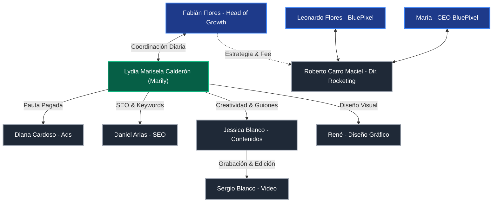
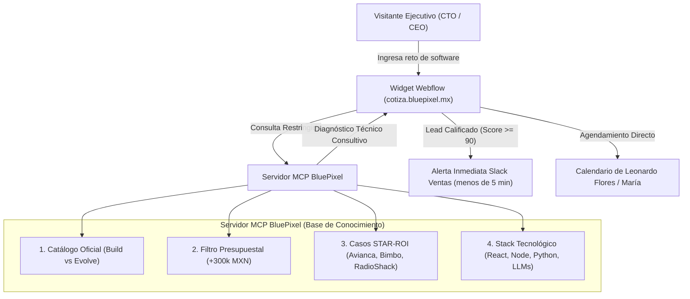
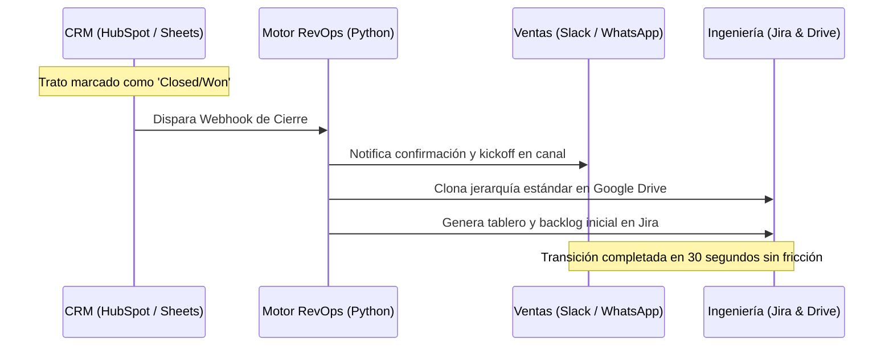
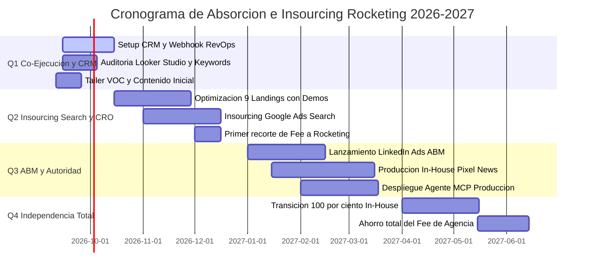
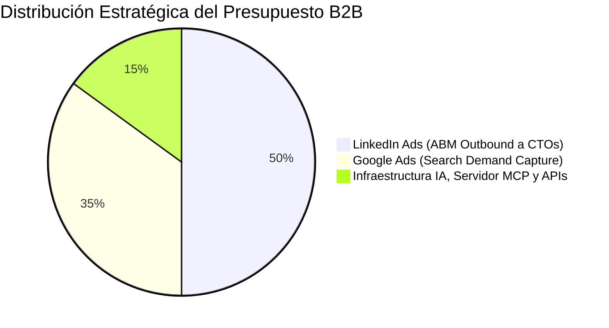

# 🚀 ESTRATEGIA MAESTRA DE CRECIMIENTO, REVOPS Y ABSORCIÓN B2B (BLUEPIXEL 2026)
*Documento vivo de arquitectura comercial, agentización web, orquestación de agencia, analítica forense y modelo de retención continua.*

**Autor:** Fabián Flores | Head of Growth & RevOps  
**Organización:** BluePixel (`bluepixel.mx` | `cotiza.bluepixel.mx`)  
**Fecha de Consolidación:** Septiembre, 2026 (Operación Día 1)  
**Repositorio GitHub:** [`jahflavio/bluepixel`](https://github.com/jahflavio/bluepixel.git) | Rama `main`  

---

## 🧭 CAPÍTULO 1: CONTEXTO ORGANIZACIONAL REAL, STAKEHOLDERS Y MATRIZ DE EQUIPO

A partir de las reuniones de inducción con Dirección y la agencia externa (**Rocketing**), se consolida el mapa de actores, responsabilidades y vías de comunicación:

### 1.1 Equipo Interno de BluePixel
*   **María (Directora General / CEO):**
    *   Liderazgo corporativo y visión estratégica. Cuenta con canales y presencia digital propia.
    *   Voz de autoridad empresarial en los nuevos formatos de video (*"Pixel contra el mundo"*).
*   **Leonardo "Leo" (Líder de Marketing, Ventas & Producto / Jefe Directo):**
    *   Enfoque en negocio, ingeniería y arquitectura de software.
    *   **Su visión clave:** Resolver los dos grandes cuellos de botella (**Adquisición** y **Conversión**), transformar a BluePixel en un **partner a largo plazo** para los clientes (*modelo Evolve / Retainers*), y **agentizar la web** con un UX interactivo inspirado en `vstorm.co` conectado a un servidor **MCP (Model Context Protocol)**.
*   **Juan Cano (Operaciones & Tecnología):**
    *   Socio operativo clave dentro de BluePixel. Responsable de infraestructura interna, soporte técnico y dinámicas de producto.
*   **Fabián Flores (Tú - Head of Growth & RevOps):**
    *   Líder de orquestación omnicanal, implementación del CRM, automatizaciones vía Python/MCP, Lead Scoring y supervisor de la entrega de Rocketing.

---

### 1.2 Directorio y Roles del Equipo de la Agencia (Rocketing)

| Especialista | Rol en Rocketing | Funciones y Entregables Clave | Canal de Interacción |
| :--- | :--- | :--- | :--- |
| **Roberto Carro Maciel** | **Director General (Rocketing)** | Jefe de todo el equipo de la agencia. Alineación de alto nivel, contrato comercial y fee. | Contacto directo con María y Leo. |
| **Lydia Marisela Calderón ("Marily")** | **Líder de Cuenta (Account Lead)** | **Tu contacto primario.** Gestión de pendientes diarios, entrega de minutas, coordinación interna de especialistas y entregas semanales. | Comunicación directa y continua con Fabián. |
| **Diana Cardoso** | **Especialista en Pauta Pagada (Paid Media)** | Manejo y optimización de campañas en Google Ads (Search), Meta Ads (Facebook/Instagram) y presupuestos mensuales. | Vía Marily / Juntas técnicas de Ads. |
| **Daniel Arias** | **Especialista SEO & Search Console** | Optimización en motores de búsqueda, keywords técnicas, salud del sitio web y auditorías de Search Console. | Vía Marily / Auditorías técnicas de tráfico orgánico. |
| **Jessica Blanco** | **Creativa y Contenidos** | Estrategia de contenidos, guiones para redes sociales, formatos *"Pixel News"* y *"Pixel contra el mundo"*. | Vía Marily / Sesiones creativas y grabaciones. |
| **Sergio Blanco** | **Fotógrafo y Videógrafo (Hermano de Jessica)** | Grabación presencial en oficinas/talleres, cobertura de video con clientes, edición de video y cápsulas para YouTube/TikTok/LinkedIn. | Vía Jessica y Marily durante jornadas de producción. |
| **René** | **Diseñador Gráfico** | Creación de identidades visuales, gráficos publicitarios, banners y assets estáticos para pauta y landings. | Vía Marily (tickets de diseño). |

---

### 1.3 Matriz de Comunicación y Gobernanza: BluePixel ⇄ Rocketing

> [!IMPORTANT]
> **Regla de Gobernanza:** Para evitar cruces de órdenes o desgaste de tiempo, todo requerimiento a los especialistas técnicos de Rocketing (Diana, Daniel, Jessica, Sergio, René) se canaliza centralizadamente a través de **Lydia Marisela ("Marily")**.

---

### 1.4 Rituales Operativos y Fechas Críticas
*   **Lunes 4:00 PM:** Entrega y revisión del reporte de rendimiento semanal en Looker Studio ([Dashboard de Campañas](https://datastudio.google.com/u/0/reporting/b825c361-9afe-4db0-a656-8a93d6106392/page/p_bg1t74vpzd)) con Marily, Diana y el equipo.
*   **Viernes 11:00 AM - 2:00 PM (Taller de Agentización):** Sesión presencial/remota de 3 horas con un cliente real para agentizar procesos, definir KPIs y extraer la voz del cliente (*Voice of Customer*). Grabación íntegra con Sergio y Jessica para extracción de micro-contenidos.

---

### 1.5 Checklist Estratégico de Definición con Leo

- [ ] **Juan Cano:** Sincronización de dinámicas de trabajo conjunto y soporte en infraestructura.
- [ ] **Google Search Console (GSC):** Permiso de Administrador/Propietario delegado (existen 3 registros TXT verificados en el dominio `bluepixel.mx`).
- [ ] **Webflow Designer:** Acceso completo a los proyectos de `bluepixel.mx` y `cotiza.bluepixel.mx` para inyectar scripts, widgets interactivos y corregir etiquetas SEO.
- [ ] **El CRM Oficial:** Definir la adopción de **HubSpot** (Starter/Pro) o Brevo/Airtable para centralizar el pipeline y retroalimentar a la agencia.
- [ ] **Enriquecimiento B2B:** Activar cuenta de desarrollador en **Apollo.io API** (Organization tier) o **Clearbit Reveal** para desanonimizar IPs en Webflow.
- [ ] **Gestión de Proyectos Operativos:** Confirmar si el equipo de ingeniería usa **Jira o Trello** para automatizar el traspaso de *Closed/Won*.
- [ ] **Licencias de IA:** Inventario de licencias corporativas (**Claude Anthropic Team**, ChatGPT Plus/Team, o API Keys de OpenAI).
- [ ] **Control de DNS:** Acceso a GoDaddy/Cloudflare para configurar el subdominio del servidor MCP (`api.bluepixel.mx`) y corregir el registro SPF/DMARC de Mandrill.

---

## 🔍 CAPÍTULO 2: DIAGNÓSTICO FORENSE DE INFRAESTRUCTURA Y CANALES

### 2.1 Auditoría Forense del Código Fuente de `bluepixel.mx`
Al analizar a fondo el código fuente y la arquitectura web de `bluepixel.mx`, se detectaron 5 ventajas técnicas clave:

1. **Infraestructura Ágil en Webflow (`data-wf-domain`):**
   * *El hallazgo:* El sitio está construido en Webflow y sus assets corren sobre CDN global.
   * *La ventaja:* No requerimos semanas de desarrollo ni tocar código compilado para iterar. Podemos inyectar los widgets de nuestro **Asistente MCP y Demos PLG** directamente mediante un script ligero en el Header/Footer de Webflow.
2. **Cultura de Analítica Conductual (Mixpanel + GTM):**
   * *El hallazgo:* Tienen un script nativo de inicialización de Mixpanel configurado para rastrear eventos como `"CTA Clicked"`, además de Google Tag Manager.
   * *La ventaja:* Practican el *Dogfooding*. Venden analítica y la consumen. Conectaremos Mixpanel con el CRM vía webhooks de Python para detonar alertas inmediatas cuando un prospecto visite la página de un Caso de Éxito.
3. **Atribución B2B con UTMs en LocalStorage:**
   * *El hallazgo:* Tienen un script en Vanilla JS que extrae los parámetros UTM de la URL, los almacena en el `localStorage` del navegador y los inyecta dinámicamente en los formularios de contacto.
   * *La ventaja:* Entienden la atribución del primer toque (*First-Touch Attribution*). Conectaremos este script a las conversiones fuera de línea (*Offline Conversion Tracking*) para devolver señales de contratos ganados a Google y LinkedIn Ads.
4. **Filtro Enterprise Activo (Self-Qualification):**
   * *El hallazgo:* El formulario actual tiene como opciones de presupuesto mínimo `"$300K - $800K MXN"` hasta `"$5M+ MXN"`.
   * *La ventaja:* BluePixel descarta activamente proyectos chicos. Su target es 100% Mid-Market y Enterprise, lo que valida nuestro sistema de **Lead Scoring de 100 puntos**.
5. **Arquitectura SEO Semántica JSON-LD y Ventaja GEO / AEO:**
   * *El hallazgo:* Implementan un esquema de `application/ld+json` (Schema.org) listando su catálogo de ofertas (`OfferCatalog`).
   * *La oportunidad GEO (Generative Engine Optimization):* En 2026, los directivos B2B investigan en **Perplexity, Claude y ChatGPT**. Las IAs priorizan sitios con JSON-LD estructurado porque extraen respuestas técnicas sin alucinar. Enriqueceremos este código inyectando `aggregateRating` (ROI de Casos de Éxito) y `FAQPage` (arquitecturas Cloud), logrando que los motores generativos recomienden a BluePixel como la máxima autoridad técnica en México.

---

### 2.2 Auditoría OSINT DNS de Dominio
*   **Servidor de Correo (MX):** Google Workspace (`aspmx.l.google.com`). La empresa opera sobre Google Drive, Gmail y Meet.
*   **Plataformas de Envío (SPF / TXT):** `v=spf1 include:_spf.google.com include:spf.mandrillapp.com ~all`.
    *   *Riesgo detectado:* El registro SPF usa SoftFail (`~all`) y está vinculado a **Mandrill (Mailchimp Transactional)**. Se debe auditar la reputación y configurar DMARC estricto para evitar que correos de prospección caigan en la bandeja de SPAM de corporativos.
*   **Verificación SEO:** Existen 3 registros TXT independientes de verificación de Google Search Console. Solo se requiere solicitar acceso con permisos de lectura para auditar keywords orgánicas.

---

### 2.3 El Gran Cuello de Botella: Ausencia de CRM y el Dilema Notion vs. HubSpot

*   **El Diagnóstico:** BluePixel actualmente **no cuenta con un CRM estructurado**. Hay automatizaciones aisladas y hojas de cálculo, pero no un pipeline unificado donde ventas registre el estatus de las oportunidades comerciales.
*   **El Síntoma en la Agencia:** Rocketing solicitó formalmente retroalimentación sobre la calidad de los prospectos. Al no existir CRM, la agencia pauta "a ciegas": optimizan para conseguir clics o formularios brutos, pero no saben qué campañas, anuncios o palabras clave generan contratos reales de **+$300,000 MXN**.
*   **Impacto Financiero:** Desconexión total entre la inversión publicitaria en Google Ads / Meta y las ventas cerradas por el equipo comercial.

#### 2.3.1 El Dilema Tecnológico: ¿Por qué Notion NO sirve como CRM para BluePixel?

A menudo surge la tentación de utilizar **Notion** como CRM por su facilidad de uso inicial. Sin embargo, para una consultora de ingeniería y software B2B con tickets High-Ticket, **usar Notion como CRM es un error costoso y una trampa operativa**:

| Capacidad Crítica para BluePixel | ❌ Notion (Base de Datos / Notas) | ✅ HubSpot (CRM Especializado B2B) |
| :--- | :--- | :--- |
| **Conexión con Google & LinkedIn Ads** | **Nula.** No puede enviar conversiones offline a Google Ads para optimizar el algoritmo. | **Nativa.** Envía señales de Closed/Won (*Offline Conversions*) para que los anuncios dejen de traer clics basura. |
| **Historial de Correos con Clientes** | **Manual.** El cerrador debe copiar y pegar correos a mano en una página. | **Automática.** Sincronización nativa con Gmail/Google Workspace; registra aperturas, respuestas y clics en automático. |
| **Seguimiento Web (Comportamiento del CTO)** | **Imposible.** No detecta si un prospecto visitó la web o páginas de precios. | **En tiempo real.** Notifica a Ventas: *"El CTO de Bimbo está navegando en la web ahora mismo"*. |
| **Lead Scoring (Calificación por IA)** | Requiere fórmulas complejas y manuales sin contexto de interacción real. | **Algorítmico.** Asigna puntos en vivo por cargo, tamaño de empresa, presupuesto y eventos. |
| **Automatización de Correos (Nurturing)** | No puede enviar secuencias de mailing automatizadas nativamente. | **Nativo.** Ejecuta flujos automatizados de casos de estudio (Avianca, Bimbo) espaciados en días. |
| **Velocidad de Respuesta (Speed-to-Lead)** | Pasivo. Alguien debe entrar a Notion a ver si cayó un registro. | **Alertas activas.** Dispara webhooks a Slack y WhatsApp en menos de 5 segundos. |

#### 2.3.2 Los 5 Mecanismos por los cuales un CRM (HubSpot) Mejora Radicalmente los Leads Calificados

1. **Entrenamiento de los Algoritmos Publicitarios (Closed-Loop Attribution):**
   * Al conectar HubSpot con Google Ads, cada vez que un prospecto avanza a etapa **SQL** (Sales Qualified Lead) o se firma un contrato de **Closed/Won** ($300k+ MXN), el CRM envía el identificador de clic (`GCLID`) de vuelta a Google.
   * El algoritmo publicitario deja de buscar usuarios que llenan formularios baratos y empieza a buscar clones estadísticos de directores con alto poder adquisitivo.
2. **Filtro Automático de 100 Puntos (Protección de la Agenda de Leo):**
   * La matriz de Lead Scoring evalúa al prospecto en tiempo real: Firmográfico (+40 pts), Cargo (+35 pts) y Presupuesto (+25 pts).
   * Si el Score es **≥ 90**, detona alerta en Slack para llamar en < 5 minutos. Si es **< 90**, el prospecto va a nutrición por correo sin quemar horas del cerrador.
3. **Formularios Cortos con Enriquecimiento Invisible (Apollo.io / Clearbit):**
   * El formulario en Webflow solo solicita *Nombre y Correo Corporativo* (fricción mínima, +40% en tasa de conversión).
   * La API de enriquecimiento extrae de fondo: facturación anual, número de empleados, tecnologías instaladas (React, AWS, Node) y perfil de LinkedIn, inyectándolos en HubSpot en 2 segundos.
4. **Reducción Drástica del Tiempo de Respuesta (Speed-to-Lead < 5 min):**
   * Según *Harvard Business Review*, contactar a un prospecto en los primeros 5 minutos incrementa en **21 veces (2,100%)** la probabilidad de calificarlo con éxito frente a responder en 30 minutos. El CRM automatiza la asignación inmediata y el agendamiento directo.
5. **Nurturing de Ciclo Largo (Recuperar el 70% que no compra hoy):**
   * En tickets corporativos, el 70% de los prospectos no tienen presupuesto en el mes 1, pero sí en el mes 3 o 4. El CRM los mantiene calientes automáticamente con los casos de éxito STAR-ROI de BluePixel hasta que abren presupuesto.

#### 2.3.3 Definición de Roles de Herramientas en BluePixel:
* 📘 **Notion:** Para la **documentación interna de la empresa** (manuales operativos, wikis de ingeniería, minutas internas y bitácoras técnicas de proyectos).
* 🎯 **HubSpot:** Como el **cerebro comercial y de adquisición** (gestión de tratos, pipeline de ventas, atribución de pauta y calificación automática de prospectos).
* 💡 **Estrategia de Adopción Inmediata con Leo:** Iniciar con **HubSpot Free CRM ($0 MXN)** para eliminar el riesgo financiero y comenzar a brindar feedback a Rocketing desde la primera semana.

---

### 2.4 Auditoría de Canales de Rocketing

| Canal | Estado Actual | Diagnóstico de Growth | Acción Inmediata |
| :--- | :--- | :--- | :--- |
| **Google Ads** | Solo campañas de **Search**. Wallets de presupuesto sin Display. | Es el canal con mayor intención de compra directa, pero redirige a 9 landings estáticas en `cotiza.bluepixel.mx`. | Auditar términos de búsqueda (*Search Terms*), añadir palabras clave negativas y optimizar el CRO con Demos PLG. |
| **LinkedIn Ads** | **Inactivo.** La agencia alegó que *"no llegaban leads"*. | Fracaso de agencia tradicional: intentan vender software de $300k+ con formularios fríos sin lead magnets ni segmentación ABM a CTOs. | Diseñar estrategia **ABM (Account-Based Marketing)** con segmentación por cargo (CTO/VP Engineering/CEO). |
| **Meta Ads (FB/IG)** | Contenido *Always-On* de remarketing con micro-presupuesto. | Adecuado como canal de soporte y frecuencia de marca, pero ineficiente para captura inicial de grandes cuentas B2B. | Mantenerlo estrictamente para retargeting a visitantes web y difusión de video corporativo. |
| **TikTok / YouTube** | Propuesta para clips de *Pixel News*. | TikTok genera alcance masivo pero baja conversión Enterprise; YouTube es ideal para autoridad técnica y SEO a largo plazo. | Enfocar esfuerzo en YouTube (Search de ingeniería) y reciclar shorts para LinkedIn y TikTok. |
| **Herramientas** | Semrush, Ubersuggest (Agencia) + Hotjar y Clarity (BluePixel). | Stack completo para SEO y mapas de calor. | Analizar grabaciones de Clarity en las 9 landings para medir caídas y fricción de scroll. |

---

## 🤖 CAPÍTULO 3: AGENTIZACIÓN DE LA WEB (MODELO VSTORM.CO + MCP BLUEPIXEL)

Leo (Líder de Tech/Ventas) identificó acertadamente que el formulario tradicional de contacto es el culpable de la fuga de conversión. Desarrollaremos un asistente interactivo respaldado por un servidor **MCP (Model Context Protocol)** local.

### 3.1 Benchmark de Vstorm.co vs BluePixel
*   **Vstorm (`vstorm.co`):** Consultora boutique de IA para medianas empresas (*Mid-market*). Su propuesta web no es "somos una agencia más", sino "somos ingenieros de IA con metodología propia (TriStorm)". Su web cuenta con desanonimización de IPs (Radar/Clearbit) y un flujo donde el cliente consulta y recibe un diagnóstico técnico personalizado antes de hablar con un humano.
*   **La Adaptación para BluePixel:** Transformar las secciones de contacto de `bluepixel.mx` y `cotiza.bluepixel.mx` en un **"Diagnóstico Inteligente de Arquitectura & IA"**.

---

### 3.2 Arquitectura del Asistente MCP BluePixel

El agente está blindado contra alucinaciones mediante un servidor MCP que **únicamente responde con información oficial y casos de éxito de BluePixel**:
*   **Base de Conocimiento 1:** Catálogo de servicios oficiales (**Build vs Evolve**).
*   **Base de Conocimiento 2:** Filtro presupuestal estricto (Ticket mínimo +$300,000 MXN).
*   **Base de Conocimiento 3:** Casos de Éxito reales bajo framework STAR-ROI (Avianca, Bimbo, RadioShack).
*   **Base de Conocimiento 4:** Stack tecnológico avalado (React, Node, Python, Serverless, AWS, LLMs).

---

### 3.3 Reestructuración del Portafolio Técnico (Framework STAR-ROI)
Los directores de tecnología (CTOs) no compran estética B2C; compran reducción de riesgos y escalabilidad de software. Reestructuramos los casos de estudio bajo la fórmula militar **STAR-ROI**:
*   **S (Situación):** El cuello de botella operativo o dolor financiero que tenía la empresa.
*   **T (Tarea):** El reto técnico de ingeniería asignado a BluePixel.
*   **A (Arquitectura):** El stack de software, microservicios y diagramas Cloud desplegados.
*   **R (ROI):** Impacto financiero inobjetable.

**Aplicación a Clientes Emblemáticos de BluePixel:**
*   **Avianca (LifeMiles):** *"Optimización Conductual (UX/UI) que incrementó la retención de usuarios móviles en +22%"*.
*   **RadioShack:** *"Evolución de Arquitectura E-Commerce y Pasarelas Flexibles que aumentó la tasa de conversión en +32%"*.
*   **Bimbo:** *"Estandarización de Infraestructura de Datos Multinacional y Deuda Técnica: Despliegue de 3 plataformas críticas en 6 meses"*.

---

### 3.4 Modelo de Atribución W-Shaped (Para Ciclos B2B Largos)
En ciclos de venta Enterprise de 3 a 6 meses, el modelo de "último clic" es obsoleto. Se implementa un **Modelo W-Shaped**:
*   **30% del crédito:** Primer contacto (*First Touch*, ej. clic en LinkedIn Ads o Google Search).
*   **30% del crédito:** Conversión inicial a lead (*Lead Creation*, diagnóstico con el Agente MCP o descarga de Demo).
*   **30% del crédito:** Creación de oportunidad técnica (*Opportunity Creation*, llamada de Discovery con Leo).
*   **10% del crédito:** Toques intermedios de nutrición (*Nurturing*, emails de casos de éxito y re-visitas).

---

## ⚡ CAPÍTULO 4: EL EMBUDO B2B Y MOTOR REVOPS (FULL-FUNNEL)

---

### 4.1 Flujo de Handoff Técnico y Cero Fricción

---

### 4.2 Inventario de Inyección Interactiva en las 9 Landings (`cotiza.bluepixel.mx`)

| Landing Page Activa | Servicio Core | Problema Actual | Inyección Interactiva (Demo PLG) |
| :--- | :--- | :--- | :--- |
| [/desarrollo-web](https://cotiza.bluepixel.mx/desarrollo-web) | Plataformas y Web Apps | Texto estático genérico. Cero interactividad. | Inyectar selector de arquitectura y cotizador de MVP rápido. |
| [/desarrollo-apps](https://cotiza.bluepixel.mx/desarrollo-apps) | Apps Nativas e Híbridas | No muestra capacidades en tiempo real. | Inyectar [Demo Inventario Colaborativo](file:///c:/Users/usarioBP/.gemini/antigravity-ide/scratch/bluepixel/03_Prototipos_y_Codigo/Demos_PLG/3_Inventario_Colaborativo/index.html) (sincronización multi-usuario en ms). |
| [/diseno-ux-ui](https://cotiza.bluepixel.mx/diseno-ux-ui) | Diseño de Producto Digital | No cuantifica el valor del buen diseño. | Inyectar [Auditor de Fricción Web](file:///c:/Users/usarioBP/.gemini/antigravity-ide/scratch/bluepixel/03_Prototipos_y_Codigo/Demos_PLG/6_Auditor_Friccion_Web/index.html) (cálculo de dinero perdido por segundo de carga). |
| [/consultoria-inteligencia-artificial](https://cotiza.bluepixel.mx/consultoria-inteligencia-artificial) | Diagnóstico & Estrategia IA | Promesa abstracta sin demostración en vivo. | **Inyectar el Widget de Diagnóstico MCP.** Demostrar IA usándola en el propio sitio. |
| [/servicios-de-automatizacion](https://cotiza.bluepixel.mx/servicios-de-automatizacion) | Workflows e Integraciones | No cuantifica el ahorro de horas hombre. | Inyectar [Onboarding Cero-Touch](file:///c:/Users/usarioBP/.gemini/antigravity-ide/scratch/bluepixel/03_Prototipos_y_Codigo/Demos_PLG/5_Onboarding_Cero_Touch/index.html) (aprovisionamiento de Jira/Slack en 1s). |
| [/soluciones-agentes-ia](https://cotiza.bluepixel.mx/soluciones-agentes-ia) | Agentes Autónomos | Describe agentes sin permitir probarlos. | Inyectar [Enjambre IA B2B](file:///c:/Users/usarioBP/.gemini/antigravity-ide/scratch/bluepixel/03_Prototipos_y_Codigo/Demos_PLG/10_Enjambre_IA/index.html) (ingreso de dominio ➔ análisis autónomo). |
| [/futureproof](https://cotiza.bluepixel.mx/futureproof) | Mantenimiento y Refactor | Concepto abstracto para quien tiene deuda técnica hoy. | Inyectar [Optimizador FutureProof](file:///c:/Users/usarioBP/.gemini/antigravity-ide/scratch/bluepixel/03_Prototipos_y_Codigo/Demos_PLG/9_Optimizador_FutureProof/index.html) (refactorización JS a TS en vivo). |
| [/desarrollo-de-software](https://cotiza.bluepixel.mx/desarrollo-de-software) | Ingeniería Custom | Mismo discurso que agencias tradicionales. | Inyectar [Generador de MVP Build](file:///c:/Users/usarioBP/.gemini/antigravity-ide/scratch/bluepixel/03_Prototipos_y_Codigo/Demos_PLG/8_Generador_MVP_Build/index.html) (idea ➔ Tech Stack y Backlog). |
| [/servicios-arquitectura-datos-escalable](https://cotiza.bluepixel.mx/servicios-arquitectura-datos-escalable) | Data Warehousing & ETL | Complejidad técnica sin visualización de valor. | Inyectar [Chat-With-Your-Data](file:///c:/Users/usarioBP/.gemini/antigravity-ide/scratch/bluepixel/03_Prototipos_y_Codigo/Demos_PLG/7_Chat_With_Your_Data/index.html) (consultas en lenguaje natural a bases de datos). |

---

### 4.3 Arquitectura de Nurturing Automatizado (3 Flujos de Mailing)
1. **Flujo 1: Leads No Calificados o Fríos (Score < 90):**
   * *Objetivo:* Mantener a BluePixel en el Top of Mind sin gastar el tiempo del cerrador.
   * *Contenido:* Casos técnicos de arquitectura STAR-ROI (Avianca, Bimbo), whitepapers sobre arquitecturas Serverless y guías Headless.
2. **Flujo 2: Onboarding Operativo Cero Fricción (Closed/Won):**
   * *Objetivo:* Reducir la ansiedad post-compra del cliente (*Buyer's Remorse*).
   * *Contenido:* Bienvenida en video de María y Leo, y entrega automática de accesos a tableros de Jira y canales de Slack mediante webhook.
3. **Flujo 3: Retención Consultiva y Modelo Evolve (Clientes Activos):**
   * *Objetivo:* Generar upselling y retención mensual recurrente ($60k - $150k MXN/mes).
   * *Contenido:* Convocatorias a QBRs (Quarterly Business Reviews) trimestrales mostrando mapas de calor de Clarity/Mixpanel y justificación técnica de nuevas features.

---

## 🎬 CAPÍTULO 5: ESTRATEGIA DE CONTENIDOS Y FORMATOS EN VIDEO

La propuesta de Jessica Blanco de producir *"Pixel contra el mundo"* y *"Pixel News"* se canaliza hacia la generación de autoridad técnica para cerrar contratos B2B.

### 5.1 La Tríada de Voces
*   **María (Visión de Negocio / CEO):** Perspectiva estratégica, retorno de inversión y transformación corporativa. Conecta con CEOs y CFOs.
*   **Leo (Autoridad de Ingeniería / Head of Tech):** Arquitectura de software, deuda técnica e implementación real de IA a nivel código. Conecta con CTOs y VPs de Ingeniería.
*   **Jessica Blanco (Anfitriona Dinámica):** Dinamismo, ganchos de retención en los primeros 3 segundos y preguntas aterrizadas que los clientes se hacen comúnmente.

### 5.2 Formatos y Dinámica de Producción
*   **"Pixel contra el mundo":** Debates y desmitificación técnica (ej. *"Microservicios vs Monolito: Cuándo estás tirando tu dinero"*, *"Por qué el 80% de los proyectos de IA en corporativos fracasan"*). Formato largo en YouTube (8-15 min) + clips de 60s en LinkedIn.
*   **"Pixel News":** Cápsulas ágiles de actualidad sobre OpenAI, Anthropic, Google Cloud y AWS aplicadas a negocios. Formato YouTube Shorts, TikTok y carruseles en LinkedIn.

### 5.3 Extracción del Taller con el Cliente (Viernes 11:00 AM - 2:00 PM)
*   **Voz del Cliente (VOC):** Registrar frases textuales sobre dolores y frustraciones operativas para reutilizarlas como títulos de anuncios y ganchos de video.
*   **Protocolo de Grabación:** Cortar al menos **5 micro-cápsulas de 45 segundos** con estructura: *Problema del cliente ➔ Solución arquitectónica de Leo/María ➔ Resultado medible*.

---

## 📈 CAPÍTULO 6: ROADMAP DE ABSORCIÓN GRADUAL DE ROCKETING (12 MESES)

Para cumplir la meta directiva de absorber las funciones de Rocketing protegiendo la generación de ingresos, se ejecuta la transición por fases:

1. **Q1 (Mes 1 a 3) - Co-Ejecución, Control de Datos y Setup de CRM:**
   * Rocketing opera la pauta actual en Google y Meta.
   * Se implementa el CRM unificado y el webhook de Lead Scoring ([main.py](file:///c:/Users/usarioBP/.gemini/antigravity-ide/scratch/bluepixel/03_Prototipos_y_Codigo/bluepixel_engine/main.py)).
   * Retroalimentación semanal a la agencia para eliminar keywords basura en Google Search.
2. **Q2 (Mes 4 a 6) - CRO en Landings e Insourcing de Google Search:**
   * Inyección de Demos PLG en las 9 landings de `cotiza.bluepixel.mx`.
   * El equipo interno asume la gestión directa de Google Search (ahorro de comisiones de gestión).
   * **Primer recorte del 35% del fee de Rocketing**, manteniéndolos solo para video y soporte gráfico.
3. **Q3 (Mes 7 a 9) - Activación de LinkedIn Ads (ABM) y Contenido de Autoridad:**
   * Reactivación de LinkedIn Ads operado internamente, segmentado a CTOs.
   * Producción in-house de los formatos *"Pixel contra el mundo"*.
   * Despliegue del Asistente MCP en producción.
4. **Q4 (Mes 10 a 12) - Independencia Absoluta:**
   * Finalización del contrato con Rocketing.
   * Operación 100% In-House liderada por la Célula de Growth & RevOps interna.
   * **Ahorro del 100% del fee de la agencia externa para BluePixel.**

---

## 💰 CAPÍTULO 7: FINANZAS, OPEX TECNOLÓGICO Y PRESUPUESTOS

### 7.1 Distribución Estratégica del Presupuesto Pauta (ABM)

---

### 7.2 Costos Mensuales de Software (OPEX de RevOps)
Para operar la maquinaria con código propio en lugar de costosas plataformas empresariales de caja cerrada:
*   **Apollo.io API (Enriquecimiento B2B):** ~$149 USD/mes (Tier Organization con acceso API para que el motor en Python perfile leads en milisegundos).
*   **Clearbit Reveal (Desanonimización de IPs):** ~$150 - $250 USD/mes (Personalización dinámica de landings según la empresa visitante).
*   **Fireflies.ai (Inteligencia Conversacional):** ~$18 - $29 USD/mes (Transcripción y extracción de objeciones técnicas en llamadas de venta).
*   **Servidor MCP & Consumo OpenAI/Anthropic:** ~$20 - $50 USD/mes (Al construir el servidor en Python con código propio, solo se paga el consumo real de tokens).
*   **HubSpot CRM (Base de Datos Comercial):** Tier Starter/Pro para centralizar el pipeline.

---

### 7.3 Escenarios de Inversión Mensual (Pauta + Software)

1. **Escenario Mínimo ($1,500 - $3,000 USD/mes) - "Validación y Eficiencia":**
   * *Alcance:* Herramientas base + pauta quirúrgica en Google Search.
   * *Resultado:* Validación del Asistente MCP y Lead Scoring. Generación de **3 a 5 SQLs Enterprise al mes**. Cero riesgo de capital.
2. **Escenario Medio ($5,000 - $8,000 USD/mes) - "Maquinaria B2B Completa" (RECOMENDADO):**
   * *Alcance:* Ecosistema completo + LinkedIn Ads (ABM Outbound a CTOs) + Google Search optimizado.
   * *Resultado:* Flujo constante y predecible de **10 a 15 SQLs calificados al mes**. Volumen exacto para cerrar de 1 a 3 contratos High-Ticket ($300k - $900k MXN) por trimestre.
3. **Escenario Máximo ($12,000+ USD/mes) - "Dominio de Categoría":**
   * *Alcance:* Dominio de pujas en Google Ads frente a consultoras multinacionales + pauta masiva en LinkedIn LATAM/USA.
   * *Resultado:* Saturación positiva con **+30 SQLs al mes**, requiriendo contratar cerradores adicionales.

---

## ⚡ CAPÍTULO 8: GUÍA TÁCTICA PARA LA PRIMERA SEMANA (DÍAS 2 A 5)

### Día 2 (Viernes): El Taller de Agentización (11:00 AM - 2:00 PM)
- [ ] Llevar documento abierto para transcribir textualmente los dolores, dudas de privacidad y quejas del cliente (*Voice of Customer*).
- [ ] Coordinar con Sergio y Jessica la grabación asegurando planos estables de Leo y María explicando soluciones arquitectónicas.

### Días 3 y 4 (Fin de Semana / Lunes Mañana): Análisis de Datos de Campañas
- [ ] Inspeccionar el dashboard de Looker Studio previo a la sesión de las 4:00 PM.
- [ ] Identificar: ¿Cuáles son las 10 palabras clave que más presupuesto consumen en Search? ¿Cuáles términos traen búsquedas irrelevantes?

### Día 5 (Lunes 4:00 PM): Junta de Rendimiento con Rocketing y Leo
- [ ] **Postura:** Estratégica y de alianza. Validar el esfuerzo de la agencia pero establecer la conexión con ventas:
  > *"Equipo Rocketing, revisamos el reporte de Looker Studio. Para ayudarlos a optimizar el algoritmo de Google Ads, a partir de esta semana implementaremos nuestro Lead Scoring para devolverles qué clics se tradujeron en reuniones reales de negocio."*

---
*Este documento consolida la estrategia canónica de BluePixel 2026 y servirá como la brújula técnica y comercial de la compañía.*
