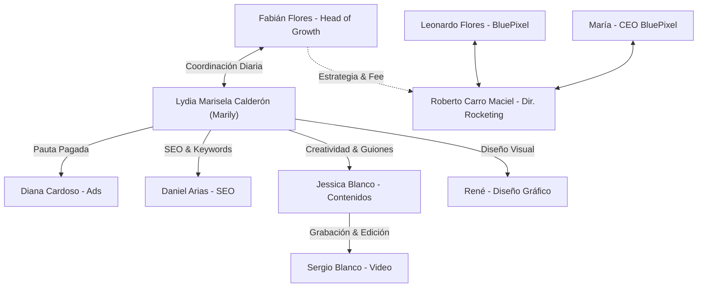
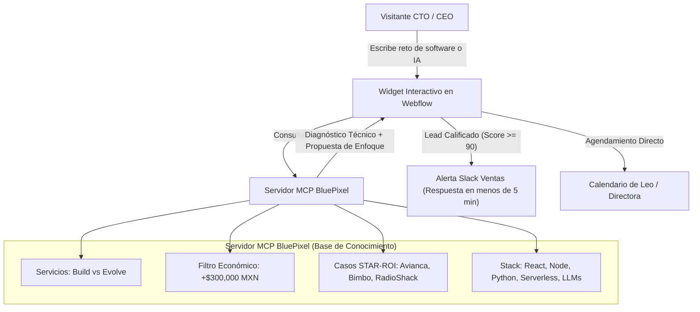
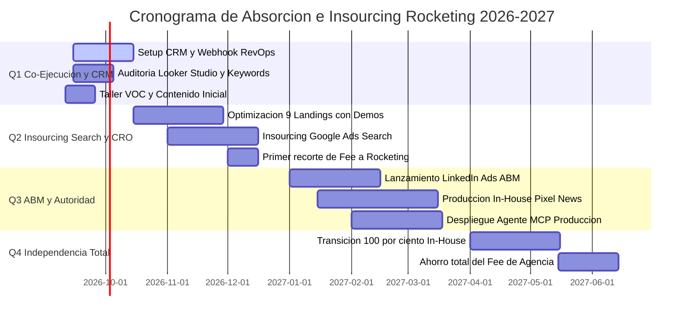

# 🚀 ESTRATEGIA MAESTRA DE CRECIMIENTO, REVOPS Y ABSORCIÓN B2B (BLUEPIXEL 2026)
*Documento vivo de arquitectura comercial, agentización web, orquestación de agencia y modelo de retención continua.*

**Autor:** Fabián Flores | Head of Growth & RevOps  
**Organización:** BluePixel (`bluepixel.mx` | `cotiza.bluepixel.mx`)  
**Fecha de Actualización:** 10 de Septiembre, 2026 (Día 1 de Operaciones)

---

## 🧭 CAPÍTULO 1: CONTEXTO ORGANIZACIONAL REAL, STAKEHOLDERS Y MATRIZ DE EQUIPO

A partir de las reuniones del Día 1 con Dirección y con la agencia externa (**Rocketing**), se consolida el mapa real de actores, responsabilidades y vías de comunicación:

### 1.1 Equipo Interno de BluePixel
*   **María (Directora General / CEO):**
    *   Liderazgo corporativo y visión estratégica. Cuenta con canales y presencia digital propia.
    *   Voz de autoridad empresarial en los nuevos formatos de video (*"Pixel contra el mundo"*).
*   **Leonardo "Leo" (Líder de Marketing, Ventas & Producto / Jefe Directo):**
    *   Enfoque en negocio, ingeniería y arquitectura de software.
    *   **Su visión clave:** Resolver los dos grandes cuellos de botella (**Adquisición** y **Conversión**), transformar a BluePixel en un **partner a largo plazo** para los clientes (*modelo Evolve / Retainers*), y **agentizar la web** con un UX interactivo inspirado en `vstorm.co` conectado a un servidor **MCP (Model Context Protocol)**.
*   **Juan Cano (Operaciones & Tecnología / Aliado Interno Clave):**
    *   Colaborador estratégico interno en BluePixel con quien se trabajará codo a codo en la ejecución técnica y operativa diaria.
*   **Fabián Flores (Tú - Head of Growth & RevOps):**
    *   Director de orquesta técnico y estratega de adquisición. Responsable de implementar el CRM, optimizar CRO, auditar la pauta de Rocketing y planificar la absorción (*insourcing*) paulatina hacia la empresa.
*   **Mario (Recursos Humanos):**
    *   Facilitador administrativo y de accesos a equipos/permisos locales.

---

### 1.2 Directorio y Roles de la Agencia Externa (Rocketing)

| Nombre | Rol / Especialidad | Responsabilidad en la Cuenta | Canal de Interacción |
| :--- | :--- | :--- | :--- |
| **Roberto Carro Maciel** | **Director General / Jefe de Agencia** | Responsable máximo de la relación comercial entre Rocketing y BluePixel. Validación de contratos, fees y estrategia macro. | Reuniones de cuenta de alto nivel con Leo y María. |
| **Lydia Marisela Calderón Garza ("Marily")** | **Account Manager / Project Manager** | **Punto de contacto principal (Liaison).** Con ella se gestionan todos los pendientes diarios, entregas, minutas y solicitudes entre BluePixel y Rocketing. | Slack / Correo / WhatsApp operativo diario. |
| **Diana Cardoso** | **Paid Media Specialist** | Gestión de campañas pagadas (Google Ads Search y Meta Ads remarketing). Manejo de wallets de presupuesto. | Vía Marily (y juntas semanales de pauta). |
| **Daniel Arias** | **SEO Specialist** | Optimización de posicionamiento orgánico en buscadores, auditorías con Semrush y Ubersuggest. | Vía Marily (y juntas de SEO técnico). |
| **Jessica Blanco** | **Directora Creativa & Contenidos** | Propuesta y guionización de *"Pixel contra el mundo"* y *"Pixel News"*. Co-conductora en video con tono fresco/cómico. | Vía Marily / Sesiones de grabación y guion. |
| **Sergio Blanco** | **Videógrafo, Fotógrafo & Editor** | Grabación de video, captura de fotografía y edición de piezas audiovisuales (long-form y shorts). Hermano de Jessica. | Vía Jessica / Sesiones de producción en set o taller. |
| **René** | **Diseñador Gráfico** | Creación de identidades visuales, gráficos publicitarios, banners y assets estáticos para pauta y redes. | Vía Marily (tickets de diseño). |

---

### 1.3 Matriz de Comunicación y Escalación con Rocketing



---

### 1.4 Rituales Operativos y Fechas Críticas
*   **Lunes 4:00 PM:** Entrega y revisión del reporte de rendimiento semanal en Looker Studio ([Dashboard de Campañas](https://datastudio.google.com/u/0/reporting/b825c361-9afe-4db0-a656-8a93d6106392/page/p_bg1t74vpzd)) con Marily, Diana y el equipo.
*   **Viernes 11:00 AM - 2:00 PM (Taller de Agentización):** Sesión presencial/remota de 3 horas con un cliente real para agentizar procesos, definir KPIs y escuchar la voz del cliente (*Voice of Customer*). Grabación íntegra con Sergio y Jessica para extracción de micro-contenidos.

---

### 1.5 Cuestionario y Checklist Estratégico de Pendientes con Leo

Para afinar la maquinaria técnica durante esta primera semana, agenda 20 minutos con Leo para desahogar esta lista de definiciones críticas:

#### A. Accesos y Personas:
- [ ] **Juan Cano:** Presentación formal y sincronización de dinámicas de trabajo conjunto.
- [ ] **Google Search Console (GSC):** Permiso de Administrador/Propietario delegado (existen 3 registros TXT verificados en el dominio `bluepixel.mx`).
- [ ] **Webflow Designer:** Acceso completo a los proyectos de `bluepixel.mx` y `cotiza.bluepixel.mx` para inyectar scripts, widgets interactivos y corregir etiquetas SEO.

#### B. Definición de Ecosistema Tecnológico (CRM & Tooling):
- [ ] **El CRM Oficial:** *"Leo, la agencia nos está pidiendo feedback de leads y no podemos seguir sin CRM. ¿Iniciamos con **HubSpot** (Free/Starter) o aprobamos **Brevo / Airtable Pipelines** para centralizar los prospectos desde ya?"*
- [ ] **Enriquecimiento B2B:** *"Para nuestro Lead Scoring en Python necesitamos una API que investigue empresas por su correo. ¿Aprobamos cuenta de desarrollador en **Apollo.io** (Organization API) o **Clearbit Reveal** para desanonimizar IPs en Webflow?"*
- [ ] **Gestión de Proyectos Operativos:** *"¿En BluePixel utilizan **Jira o Trello** para los sprints de desarrollo con clientes? Queremos automatizar el traspaso de Trato Ganado directo a su tablero de ingeniería."*
- [ ] **Licencias de IA:** *"¿Cuentan con licencias corporativas de **Claude** (Anthropic Team), ChatGPT Plus/Team o API Keys de OpenAI para desplegar el servidor MCP de la web?"*

#### C. Preguntas Recomendadas de Alto Impacto (Tus Ases bajo la Manga):
- [ ] **Control de DNS:** *"¿Quién tiene el acceso a GoDaddy/Cloudflare? Si queremos desplegar el subdominio `api.bluepixel.mx` para el Agente MCP o corregir el registro SPF/DMARC de Mandrill para que los correos no se vayan a spam, ¿a quién le pido el cambio?"*
- [ ] **Inventario de Automatizaciones Existentes:** *"Mencionaste que ya tienen algunas automatizaciones corriendo. ¿Están en Zapier, Make.com o scripts de Python en un servidor interno? Necesito mapearlas para no duplicar flujos."*
- [ ] **Grabaciones de Llamadas de Ventas (Inteligencia de Negocio):** *"¿Tienen grabadas llamadas comerciales recientes con clientes Enterprise (en Google Meet, Fathom o Fireflies)? Quiero escuchar las últimas 3 llamadas para afinar los textos del Agente IA y de los anuncios."*
- [ ] **Tope de Pauta Mensual (Wallets):** *"¿Cuál es el presupuesto mensual exacto (en MXN o USD) que tiene asignado Diana en Google Ads y Meta? Así calculo el Costo por Adquisición objetivo."*

---

## 🔍 CAPÍTULO 2: DIAGNÓSTICO FORENSE DE LA OPERACIÓN ACTUAL

### 2.1 El Gran Cuello de Botella: Ausencia de CRM
*   **El Descubrimiento Crítico:** BluePixel actualmente **no cuenta con un CRM estructurado**. Existen automatizaciones aisladas, pero no hay un pipeline unificado donde ventas registre el estatus de las oportunidades.
*   **El Síntoma en la Agencia:** Rocketing solicitó retroalimentación sobre la calidad de los leads por medio de un CRM. Al no existir esta herramienta, la agencia pauta "a ciegas" (solo miden clics o formularios brutos, pero no saben qué campañas generan contratos reales de +$300,000 MXN).
*   **Impacto Financiero:** Desconexión entre pauta y facturación. El dinero invertido en Google Ads y Meta no alimenta algoritmos de conversión porque no se devuelven señales de *Offline Conversion Tracking*.
*   **Plan de Acción Inmediato (Días 1 a 7):**
    1.  Desplegar un CRM ágil (HubSpot Starter o Brevo / Airtable Pipelines).
    2.  Conectar el motor en Python ([main.py](file:///c:/Users/usarioBP/.gemini/antigravity-ide/scratch/bluepixel/03_Prototipos_y_Codigo/bluepixel_engine/main.py)) a los formularios para recibir leads, enriquecerlos con Apollo.io y clasificarlos con el Lead Scoring de 100 puntos.
    3.  Proveer a Rocketing una vista semanal de: *Leads Totales ➔ MQLs ➔ SQLs ➔ Clientes Ganados*.

### 2.2 Auditoría de Canales de Rocketing

| Canal | Estado Actual con Rocketing | Diagnóstico Técnico de Growth | Acción Estratégica Inmediata |
| :--- | :--- | :--- | :--- |
| **Google Ads** | Solo campañas de **Search** (búsqueda). Wallets de presupuesto. Sin Display. | Es el canal con mayor intención de compra directa, pero manda todo a 9 landings estáticas en `cotiza.bluepixel.mx`. | Auditar términos de búsqueda (*Search Terms*), agregar palabras clave negativas y optimizar el CRO de las landings. |
| **LinkedIn Ads** | **Inactivo.** La agencia alega que *"no les han llegado leads"*. | Fracaso típico de agencias tradicionales: intentan vender desarrollo de software de $300K+ con formularios fríos sin lead magnets ni segmentación ABM por cargo (CTO/CEO). | Diseñar estrategia **ABM (Account-Based Marketing)** con segmentación hiper-específica a directores de tecnología ofreciendo auditorías o demos PLG. |
| **Meta Ads (FB/IG)** | Contenido *Always-On* de remarketing con micro-presupuesto. | Adecuado como canal de soporte y frecuencia de marca, pero ineficiente para captura inicial de grandes cuentas B2B. | Mantenerlo estrictamente para retargeting a visitantes de las landings y engagement con el nuevo contenido en video. |
| **TikTok / YouTube** | Propuesta para clips de *Pixel News*. | TikTok genera alcance masivo pero baja conversión Enterprise; YouTube Shorts y videos largos en YouTube son ideales para autoridad técnica y SEO a largo plazo. | Enfocar los esfuerzos de video largo en YouTube (Search de ingeniería) y reciclar shorts para LinkedIn y TikTok como subproducto sin sobre-inversión. |
| **Herramientas** | Semrush, Ubersuggest (Agencia) + Hotjar y Clarity (BluePixel). | Stack completo para SEO y mapas de calor. Ya tenemos acceso a Clarity. | Analizar grabaciones de Clarity en las 9 landings de `cotiza.bluepixel.mx` para medir caídas y fricción de scroll. |

---

## 🤖 CAPÍTULO 3: AGENTIZACIÓN DE LA WEB (MODELO VSTORM.CO + MCP BLUEPIXEL)

Leo (Jefe) ha identificado con precisión que el formulario tradicional de contacto es el principal culpable de la baja tasa de conversión. Para resolverlo, implementaremos una experiencia interactiva basada en el benchmark de **`vstorm.co`** y el protocolo **MCP**.

### 3.1 Benchmark de Vstorm.co vs BluePixel
*   **Vstorm (`vstorm.co`):** Consultora boutique de ingeniería en IA aplicada para medianas empresas (*Mid-market*). Su propuesta no es "somos una agencia más", sino "somos ingenieros de IA con metodología propia (TriStorm)". Su experiencia web incorpora desanonimización de IPs (Radar/Clearbit), medición rigurosa de eventos y una interfaz donde el cliente puede consultar y diagnosticar sus necesidades directamente con un sistema inteligente.
*   **La Adaptación para BluePixel:**
    *   Transformar la sección de contacto de `bluepixel.mx` y las landings de `cotiza.bluepixel.mx` de un simple *"Déjanos tu mensaje"* a un **"Diagnóstico Inteligente de Arquitectura & IA"**.

### 3.2 Arquitectura del Agente MCP BluePixel
El objetivo es que el agente esté blindado contra alucinaciones y **únicamente responda con información oficial y metodologías de BluePixel**:



### 3.3 Experiencia de Usuario en el Formulario Agentizado
1.  **Entrada Conversacional:** *"Cuéntanos qué reto digital, plataforma o automatización quieres construir o escalar"*.
2.  **Procesamiento MCP en Tiempo Real:** El visitante escribe: *"Tengo un e-commerce en Shopify pero nos cuesta integrar inventarios y queremos meter un recomendador con IA"*.
3.  **Respuesta Consultiva Inmediata:** El agente responde:
    > *"Para ese caso, en BluePixel recomendamos un enfoque **Headless** desacoplando el frontend para no comprometer velocidad, conectando microservicios en Node.js y un modelo de recomendación vía embeddings. Ya resolvimos un reto similar con RadioShack (+32% en conversión). Nuestro engagement promedio de BUILD para esta escala inicia en el rango de $300k-$500k MXN."*
4.  **Captura de Contacto Natural:** *"Para estructurar tu backlog técnico y alcances exactos con Leonardo Flores (nuestro Lead de Producto), ingresa tu correo corporativo."*
5.  **Handoff RevOps:** El motor en Python ([main.py](file:///c:/Users/usarioBP/.gemini/antigravity-ide/scratch/bluepixel/03_Prototipos_y_Codigo/bluepixel_engine/main.py)) extrae el correo, Apollo lo valida y Ventas recibe en Slack la transcripción completa del diagnóstico.

---

## 🛠️ CAPÍTULO 4: AUDITORÍA Y OPTIMIZACIÓN DE LAS 9 LANDING PAGES (`cotiza.bluepixel.mx`)

Las 9 landing pages activas en Google Ads presentan un diseño limpio, pero sufren de un problema clásico de conversión B2B: **son informativas y pasivas**. El usuario debe leer 15 pantallas de texto antes de llegar a un formulario estático al fondo.

### 4.1 Inventario y Estrategia de Inyección Interactiva (Demos PLG)

| Landing Page Activa | Servicio Core | Problema Actual de Conversión | Solución de Alto Impacto (Inyección PLG) |
| :--- | :--- | :--- | :--- |
| [/desarrollo-web](https://cotiza.bluepixel.mx/desarrollo-web) | Plataformas y Web Apps | Demasiado texto genérico sobre React/Node. Cero interactividad. | Inyectar un cotizador de MVP rápido o selector de arquitectura con badge de retorno a consulta. |
| [/desarrollo-apps](https://cotiza.bluepixel.mx/desarrollo-apps) | Apps Nativas e Híbridas | No muestra capacidades en tiempo real ni costos estimados. | Inyectar el [Demo Inventario Colaborativo](file:///c:/Users/usarioBP/.gemini/antigravity-ide/scratch/bluepixel/03_Prototipos_y_Codigo/Demos_PLG/3_Inventario_Colaborativo/index.html) para demostrar experiencia móvil multi-usuario en milisegundos. |
| [/diseno-ux-ui](https://cotiza.bluepixel.mx/diseno-ux-ui) | Diseño de Producto Digital | No demuestra la metodología científica de UX/UI. | Inyectar el [Auditor de Fricción Web](file:///c:/Users/usarioBP/.gemini/antigravity-ide/scratch/bluepixel/03_Prototipos_y_Codigo/Demos_PLG/6_Auditor_Friccion_Web/index.html) que calcula dinero perdido por segundo de carga. |
| [/consultoria-inteligencia-artificial](https://cotiza.bluepixel.mx/consultoria-inteligencia-artificial) | Diagnóstico & Estrategia IA | Promesa abstracta de IA sin evidencia funcional en vivo. | **Inyectar el Widget de Diagnóstico MCP / Chat Inteligente.** Demostrar IA usándola en el sitio. |
| [/servicios-de-automatizacion](https://cotiza.bluepixel.mx/servicios-de-automatizacion) | Workflows e Integraciones | No cuantifica el ahorro de horas hombre. | Inyectar el [Onboarding Cero-Touch](file:///c:/Users/usarioBP/.gemini/antigravity-ide/scratch/bluepixel/03_Prototipos_y_Codigo/Demos_PLG/5_Onboarding_Cero_Touch/index.html) mostrando aprovisionamiento de Slack/Jira en 1 segundo. |
| [/soluciones-agentes-ia](https://cotiza.bluepixel.mx/soluciones-agentes-ia) | Agentes Autónomos | Describe agentes sin permitir probarlos. | Inyectar el [Enjambre IA B2B](file:///c:/Users/usarioBP/.gemini/antigravity-ide/scratch/bluepixel/03_Prototipos_y_Codigo/Demos_PLG/10_Enjambre_IA/index.html) donde el prospecto introduce un email y ve a la IA trabajar. |
| [/futureproof](https://cotiza.bluepixel.mx/futureproof) | Mantenimiento y Evolución | El concepto "FutureProof" es abstracto para quien tiene deuda técnica hoy. | Inyectar el [Optimizador FutureProof](file:///c:/Users/usarioBP/.gemini/antigravity-ide/scratch/bluepixel/03_Prototipos_y_Codigo/Demos_PLG/9_Optimizador_FutureProof/index.html) mostrando refactorización JS ➔ TS en vivo. |
| [/desarrollo-de-software](https://cotiza.bluepixel.mx/desarrollo-de-software) | Ingeniería Custom | Compite contra cientos de agencias con el mismo discurso. | Inyectar el [Generador de MVP Build](file:///c:/Users/usarioBP/.gemini/antigravity-ide/scratch/bluepixel/03_Prototipos_y_Codigo/Demos_PLG/8_Generador_MVP_Build/index.html) (ingresa idea ➔ devuelve Tech Stack). |
| [/servicios-arquitectura-datos-escalable](https://cotiza.bluepixel.mx/servicios-arquitectura-datos-escalable) | Data Warehousing & ETL | Mensaje técnico complejo sin visualización de valor. | Inyectar el [Chat-With-Your-Data](file:///c:/Users/usarioBP/.gemini/antigravity-ide/scratch/bluepixel/03_Prototipos_y_Codigo/Demos_PLG/7_Chat_With_Your_Data/index.html) demostrando consultas analíticas conversacionales. |

---

## 🎬 CAPÍTULO 5: ESTRATEGIA DE CONTENIDOS Y PERSONAL BRANDING

La propuesta de Jessica Blanco de crear *"Pixel contra el mundo"* y *"Pixel News"* es una excelente vía para humanizar la marca, siempre que esté anclada a la generación de autoridad técnica para cerrar contratos B2B.

### 5.1 La Tríada de Voces en Pantalla
*   **María (La Visión de Negocio / CEO):** Aporta la perspectiva estratégica de alta dirección, retorno de inversión y transformación organizacional. Conecta con CEOs, CFOs y directores generales.
*   **Leo (La Autoridad de Ingeniería / Head of Tech):** Desmenuza la tecnología, explica por qué fallan las arquitecturas legadas y cómo la IA se aplica a nivel código y operaciones. Conecta directamente con los CTOs y VPs de Ingeniería.
*   **Jessica Blanco (La Anfitriona Dinámica):** Rompe la solemnidad técnica, hace las preguntas que el cliente común tiene y agrega el toque fresco y de comedia inteligente para enganchar retención en los primeros 3 segundos de video.

### 5.2 Formatos y Dinámica de Producción

```
      [ Taller con Cliente / Casos Reales ] (Fuente de Verdad)
                       │
         ┌─────────────┴─────────────┐
         ▼                           ▼
[ Pixel contra el mundo ]     [ Pixel News ]
   Debates y dolores            Cápsulas ágiles de
   técnicos reales              actualidad Tech e IA
   (Video largo YouTube)        (Shorts, TikTok, LI)
         │                           │
         └─────────────┬─────────────┘
                       ▼
    [ Célula de Captación B2B (Lead Magnets & CTA) ]
```

1.  **"Pixel contra el mundo":**
    *   *Enfoque:* Desmentir mitos de software y debatir decisiones técnicas complejas. Ejemplos: *"Microservicios vs Monolito: Cuándo estás tirando tu dinero"*, *"Por qué el 80% de los proyectos de IA en empresas fracasan antes de producción"*.
    *   *Canales:* YouTube (Video largo 8-15 min) + Clips de 60s en LinkedIn.
2.  **"Pixel News":**
    *   *Enfoque:* Análisis semanal rápido de noticias clave de IA (OpenAI, Anthropic, Google, AWS) aplicado a negocios reales.
    *   *Canales:* YouTube Shorts, TikTok y carruseles en LinkedIn.

### 5.3 Extracción del Taller con el Cliente (Viernes 11:00 AM - 2:00 PM)
El taller de 3 horas para "agentizar servicios con un cliente" es la mina de oro más valiosa de tu primera semana:
*   **Mapeo de la Voz del Cliente (VOC):**
    *   Anota textualmente: ¿Cuáles son las palabras exactas que usa el cliente para quejarse de sus procesos actuales? (Ej. *"Perdemos 4 horas pasando datos a mano"*).
    *   Esas frases exactas deben convertirse en los títulos de los anuncios de Google Ads y ganchos (*hooks*) de los videos.
*   **Protocolo de Grabación para Micro-Contenido:**
    *   Asegurar buen audio en la sala/llamada.
    *   Buscar momentos de "revelación" (*el momento Ajá* del cliente) cuando se le explica cómo la IA resolverá su problema en minutos.
    *   Cortar al menos **5 clips de 45 segundos** con estructura: *Problema real del cliente ➔ Propuesta arquitectónica de Leo/María ➔ Resultado medible*.

---

## 📈 CAPÍTULO 6: ROADMAP DE ABSORCIÓN GRADUAL DE ROCKETING (12 MESES)

Para responder al mandato de Dirección de absorber las funciones de Rocketing hacia BluePixel, seguiremos este cronograma por fases:



### Detalle de Fases de Absorción:
1.  **Q1 (Mes 1-3) - Co-Ejecución, Control de Datos y Setup de CRM:**
    *   Rocketing sigue operando la pauta y contenidos actuales.
    *   Tú implementas el CRM básico y el webhook de Lead Scoring para medir qué leads realmente valen la pena.
    *   Les das retroalimentación semanal para que ellos dejen de gastar en palabras clave basura en Google Search.
2.  **Q2 (Mes 4-6) - CRO en Landings e Insourcing de Google Ads:**
    *   Se inyectan los Demos interactivos PLG en las landings de `cotiza.bluepixel.mx`.
    *   El equipo interno toma el control directo de las cuentas de Google Ads (ahorro de comisión de pauta).
    *   Se renegocia a la baja el fee mensual de Rocketing, dejándoles solo la edición y apoyo en redes sociales.
3.  **Q3 (Mes 7-9) - Activación de LinkedIn Ads (ABM) y Contenido de Autoridad:**
    *   Se reactiva LinkedIn Ads operado internamente, apuntando a decisores de empresas medianas y grandes con los Lead Magnets y videos de María y Leo.
    *   Se integra el Servidor MCP en `bluepixel.mx` para que el tráfico entrante interactúe con la IA de la empresa.
4.  **Q4 (Mes 10-12) - Independencia Absoluta:**
    *   Cierre definitivo del engagement con Rocketing.
    *   El 100% de la adquisición, contenido, analítica y optimización técnica queda en manos de la Célula de Growth & RevOps interna de BluePixel.

---

## ⚡ CAPÍTULO 7: GUÍA TÁCTICA PARA TUS PRÓXIMOS 4 DÍAS

### Día 2 (Viernes): El Taller de Agentización (11:00 AM - 2:00 PM)
- [ ] Llevar libreta o documento abierto para transcribir los dolores y objeciones textuales del cliente.
- [ ] Identificar qué dudas tiene el cliente sobre privacidad de datos, tiempos de implementación y costos de IA.
- [ ] Coordinar con Jessica la grabación del taller asegurando planos cerrados de Leo y María explicando soluciones.

### Día 3 y 4 (Sábado y Domingo / Lunes mañana): Preparación del Análisis de Campañas
- [ ] Inspeccionar el dashboard de Looker Studio previo a la junta de las 4:00 PM.
- [ ] Anotar: ¿Cuál es el canal con peor costo por adquisición? ¿Cuántos prospectos de Google Ads llegaron a llamada de ventas el último mes?

### Día 5 (Lunes 4:00 PM): Junta de Rendimiento con Rocketing y Leo
- [ ] **Tu postura:** Estratégica y colaborativa. Felicitar lo que funcione, pero poner sobre la mesa la necesidad de conectar la retroalimentación de ventas:
  > *"Equipo Rocketing, revisé el dashboard. Queremos ayudarlos a que el algoritmo aprenda más rápido. Esta semana comenzaremos a filtrar los prospectos mediante nuestro nuevo flujo de calificación para decirles exactamente cuáles de sus clics se convirtieron en oportunidades reales."*

---
*Este documento consolida la visión completa de la compañía y servirá como la brújula operativa de BluePixel.*
