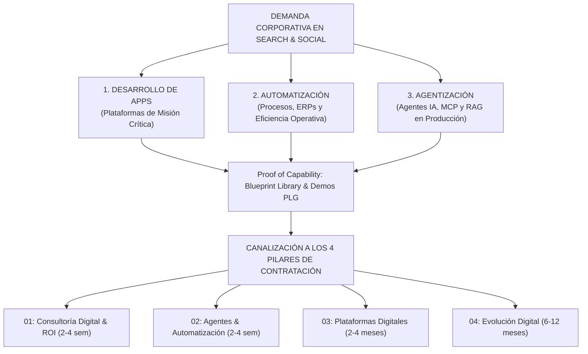

# 🎯 ESTRATEGIA MAESTRA DE PAUTA PAGADA & ADQUISICIÓN B2B (BLUEPIXEL 2026)
**Directiva Oficial para Dirección General, Producto y la Agencia de Pauta (Rocketing)**

---

## 🏛️ 1. DIAGNÓSTICO DEL CAMBIO ESTRATÉGICO: DE MICRO-NICHOS A DEMANDA REAL B2B

### 1.1. El Error de la Estrategia Previa (Micro-Nichos Aislados)
La aproximación anterior sugería pautar términos ultra-específicos vinculados a productos individuales (ej. *"software para licitaciones RFP"*, *"agente para reclutamiento HR"*, *"software de conciliación bancaria SAP"*).
*   **El problema técnico:** En México y LATAM, el volumen de búsqueda mensual exacto de estos términos en Google Search es prácticamente nulo o extremadamente disperso.
*   **El impacto financiero:** Campañas que no gastan presupuesto, o que terminan abriendo concordancias amplias que atraen estudiantes o búsquedas informativas irrelevantes.

### 1.2. Los 3 Clusters de Demanda Real y Volumen B2B
Los tomadores de decisión con presupuestos de **+$300,000 MXN** (CEOs, CTOs, Directores de Operaciones, CFOs) buscan soluciones en Google y LinkedIn a través de **tres grandes dolores macro**:



1.  **Cluster 1: Desarrollo de Apps (Modernización y Plataformas Escalables):**
    *   Empresas medianas y grandes que necesitan desarrollar una aplicación móvil, plataforma web transaccional o portal B2B, pero que huyen de agencias boutique que solo entregan diseños de Figma y de consultoras tradicionales lentas que cobran por hora sin certidumbre.
2.  **Cluster 2: Automatización (Eficiencia de Procesos & Conexión de Sistemas):**
    *   Directores de Operaciones y Finanzas ahogados en tareas manuales, conciliaciones en Excel, captura de facturas y traspasos rotos entre su ERP (SAP, Salesforce, Oracle) y su equipo humano.
3.  **Cluster 3: Agentización (Ingeniería de Agentes de IA & Model Context Protocol):**
    *   Líderes de tecnología y directores generales que ya superaron el entusiasmo inicial de ChatGPT, entienden el riesgo del "hágalo usted mismo" y exigen **agentes autónomos corriendo en producción**, integrados a sus bases de datos bajo protocolos seguros (**MCP**) y sin fugas de información.

---

## 🧭 2. MATRIZ DE PALABRAS CLAVE, INTENCIÓN Y NEGATIVAS CRÍTICAS

### CLUSTER 1: DESARROLLO DE APPS & PLATAFORMAS DIGITALES
*   **Objetivo:** Captar tomadores de decisión que buscan construir software robusto de grado corporativo.
*   **Keywords Core (Exact & Phrase Match):**
    *   `[desarrollo de apps empresariales]` | `"desarrollo de aplicaciones corporativas"`
    *   `[desarrollo de software a la medida mexico]` | `"empresa de desarrollo de plataformas digitales"`
    *   `[desarrollo de aplicaciones web y moviles]` | `"arquitectura de software cloud b2b"`
    *   `[modernizacion de sistemas legacy]` | `"desarrollo de plataformas cloud aws"`
*   **Ángulo del Anuncio (Ad Copy):**
    *   *Titular 1:* Desarrollo de Apps Empresariales | Cero Deuda Técnica
    *   *Titular 2:* Software de Grado Corporativo con Adopción Garantizada
    *   *Descripción:* Tu plataforma digital lista en 2 a 4 meses. Diseñamos con arquitectura FutureProof y desplegamos en tu nube privada con SLA 99.9%. Conoce los 4 modelos de colaboración.
*   **URL de Destino:** `/lp/desarrollo-apps-enterprise` (Landing hermética `noindex, nofollow` con Quality Score 10/10).

---

### CLUSTER 2: AUTOMATIZACIÓN DE PROCESOS & SISTEMAS (BPA / RPA)
*   **Objetivo:** Atraer a COOs, CFOs y Gerentes de Operaciones que buscan eliminar cuellos de botella operativos y conectar sus herramientas.
*   **Keywords Core (Exact & Phrase Match):**
    *   `[automatizacion de procesos empresariales]` | `"automatizar flujos de trabajo empresa"`
    *   `[automatizacion sap mexico]` | `"integracion erp y crm a la medida"`
    *   `[consultoria en automatizacion operativa]` | `"automatizacion inteligente de procesos b2b"`
    *   `[software de conciliacion automatica]` | `"eliminar procesos manuales empresa"`
*   **Ángulo del Anuncio (Ad Copy):**
    *   *Titular 1:* Automatización de Procesos Críticos | BluePixel
    *   *Titular 2:* Conecta tu ERP sin Tirar tu Software Actual
    *   *Descripción:* Elimina horas de captura manual y errores de conciliación. Diseñamos flujos determinísticos con arquitectura FutureProof y ROI cuantificado en pesos.
*   **URL de Destino:** `/lp/automatizacion-procesos-erp` (Landing hermética `noindex, nofollow` con Quality Score 10/10).

---

### CLUSTER 3: AGENTIZACIÓN & INGENIERÍA DE AGENTES IA (MCP)
*   **Objetivo:** Posicionarse como la máxima autoridad técnica de Inteligencia Artificial aplicada y en producción en México.
*   **Keywords Core (Exact & Phrase Match):**
    *   `[agentes de inteligencia artificial para empresas]` | `"ingenieria de agentes ia"`
    *   `[agentes autonomos produccion]` | `"model context protocol mexico"`
    *   `[implementacion rag empresarial]` | `"ia en nube privada aws azure"`
    *   `[consultoria agentica b2b]` | `"automatizacion con agentes llm"`
*   **Ángulo del Anuncio (Ad Copy):**
    *   *Titular 1:* Agentes de IA en Producción | Protocolo MCP Nativo
    *   *Titular 2:* Cero Alucinaciones en tu Nube Privada
    *   *Descripción:* Construimos y desplegamos agentes autónomos conectados a tus datos reales bajo estándares OWASP y LFPDPPP. Tu equipo es dueño del 100% de la infraestructura.
*   **URL de Destino:** `/lp/agentes-ia-produccion` (Landing hermética `noindex, nofollow` con Quality Score 10/10).

---

### 🛑 LISTA MAESTRA DE KEYWORDS NEGATIVAS (El Filtro Anti-PyME y Anti-Basura)
Para evitar el colapso de conversión y bloquear clics de personas sin presupuesto (< $300k MXN) o con intención educativa, **Rocketing debe cargar obligatoriamente esta lista a nivel cuenta en Google Ads**:

| Categoría Negativa | Términos a Bloquear en Exacta y Frase | Razón Técnica |
| :--- | :--- | :--- |
| **Bajo Presupuesto / Gratis** | *gratis, free, economico, barato, bajo costo, cotizador casero, software libre, open source gratis* | Filtra prospectos que no alcanzan el ticket mínimo de $300,000 MXN. |
| **Académico / Educativo** | *curso, tutorial, capacitacion, diplomado, certificacion, que es, pdf, tesis, definicion, wikipedia* | Evita pagar por estudiantes o profesionales investigando conceptos teóricos. |
| **Empleo / Freelancers** | *vacantes, sueldo, empleo, trabajo, contratacion jr, freelancer, fiverr, workana, figma gratis* | Bloquea tráfico de búsqueda laboral y ofertas de servicios individuales. |
| **Herramientas No-Code B2C** | *make gratis, zapier tutorial, botpress basico, chatgpt gratis, app creator gratis* | Evita aficionados buscando soluciones caseras sin infraestructura de ingeniería. |

---

## 📦 3. CONEXIÓN DIRECTA CON LOS 4 PILARES DE CONTRATACIÓN (LA OFERTA REAL)

Toda la pauta y las landing pages deben canalizar el tráfico hacia los **4 modelos de servicio oficiales de BluePixel**:

```
┌──────────────────────────────────────────────────────────────────────────────────────────────────────────────────────────────────────┐
│                                                 4 FORMAS DE COLABORAR CON BLUEPIXEL                                                  │
├──────────────────────────────────┬──────────────────────────────────┬─────────────────────────────────┬──────────────────────────────┤
│ 01 · CONSULTORÍA DIGITAL         │ 02 · AGENTES & AUTOMATIZACIÓN    │ 03 · PLATAFORMAS DIGITALES      │ 04 · EVOLUCIÓN DIGITAL       │
├──────────────────────────────────┼──────────────────────────────────┼─────────────────────────────────┼──────────────────────────────┤
│ "Claridad estratégica,          │ "Automatización inteligente      │ "Construcción de plataformas    │ "Tu equipo tecnológico       │
│  arquitectura técnica y          │  sobre lo que ya tienes          │  y MVPs desde cero con UX       │  extendido para sostener     │
│  cálculo de ROI antes de código."│  funcionando, sin tirarlo."      │  validado que convierte."       │  el crecimiento."            │
│                                  │                                  │                                 │                              │
│ • Diagnóstico IMPATH™ y ROI      │ • Agentic RAG sin alucinaciones  │ • Product Strategy (PS) y UX UI │ • Squad multidisciplinario   │
│ • Blueprint de arquitectura      │ • Protocolo MCP determinístico   │ • Full Stack Cloud-Native       │ • Monitoreo UX Health Score  │
│ • Matriz de priorización         │ • Despliegue en VPC privada      │ • Arquitectura desacoplada      │ • Reducción deuda técnica    │
│ • Costo de inacción cuantificado │ • Cumplimiento OWASP/LFPDPPP     │ • Despliegue prod con SLA 99.9% │ • Soporte continuo con SLA   │
├──────────────────────────────────┼──────────────────────────────────┼─────────────────────────────────┼──────────────────────────────┤
│ ⏳ 2 a 4 Semanas                 │ ⏳ 2 a 4 Semanas                 │ ⏳ 2 a 4 Meses a Producción     │ ⏳ Roadmap 6 a 12 Meses      │
│ 🔘 CTA: Solicitar Diagnóstico →  │ 🔘 CTA: Explorar Automatización →│ 🔘 CTA: Construir Plataforma →  │ 🔘 CTA: Activar Squad →      │
└──────────────────────────────────┴──────────────────────────────────┴─────────────────────────────────┴──────────────────────────────┘
```

### Cómo se enruta cada búsqueda hacia su paquete ideal:
1.  **Prospecto con dolor operativo pero sin requerimientos técnicos definidos:**
    *   *Búsqueda típica:* "automatización de procesos empresa", "como implementar IA en operaciones".
    *   *Canalización:* **Paquete 01 (Diagnóstico & Auditoría FutureProof)**. Se le vende claridad y el cálculo del costo de inacción antes de comprometer desarrollo.
2.  **Prospecto con requerimiento técnico claro o flujo específico a resolver:**
    *   *Búsqueda típica:* "agentes de IA para SAP", "implementar RAG en base de datos".
    *   *Canalización:* **Paquete 02 (Ingeniería de Agentes & MCP)**. Se le cotiza por sprints mensuales de entrega continua.
3.  **Prospecto corporativo con proyecto de transformación o plataforma completa:**
    *   *Búsqueda típica:* "desarrollo de apps empresariales a la medida", "desarrollo de plataforma cloud escalable".
    *   *Canalización:* **Paquete 01+02 (Transformación: BUILD + EVOLVE)**. Se le asigna un squad senior dedicado (Tech Lead, AI Engineer, UX Lead) con entrega en 90 días y soporte continuo.

---

## 🔌 4. INTEGRACIÓN CON EL SERVIDOR MCP DE LEO Y TELEMETRÍA DE REVOPS

Para resolver definitivamente el reclamo de la agencia de pauta (*"no sabemos cuáles conversiones cierran ventas reales"*), el flujo de datos se conectará a través del **servidor MCP de Leo**:

```
[ Click en Google / LinkedIn Ads ] (con GCLID / UTMs)
                 │
                 ▼
[ Landing Page / Home BluePixel ] (Captura de UTMs en LocalStorage)
                 │
                 ▼
[ Formulario Progresivo en 3 Pasos ] (Nombre, Empresa, Proceso)
                 │
                 ▼
[ Servidor MCP de Leo (Python / Claude Code) ]
                 ├──────────────────────────────┐
                 ▼                              ▼
      [ Base de Datos Notion ]         [ Lead Scoring Automático ]
    (Tablero Kanban de Ventas)           (Filtro de Ticket > $300k)
                 │                              │
                 ▼                              ▼
       [ Cierre Comercial ]           [ Conversión Offline Google Ads ]
    (Pablo / José cierran contrato)     (Se devuelve señal de valor real)
```

1.  **Captura de Identificadores:** El script del sitio web almacena el `gclid`, `fbclid` y UTMs en el navegador del usuario y los inyecta en el envío del formulario.
2.  **Ingesta Centralizada:** El servidor MCP recibe la solicitud, la evalúa con un modelo de IA para asignar el **Lead Score de 1 a 100 puntos**, y genera el registro en Notion con aviso instantáneo al equipo comercial.
3.  **Retorno de Conversiones Offline:** Al cerrarse un contrato (Fase Build o Retainer Evolve), el servidor MCP devuelve la señal a Google Ads vía Offline Conversion API. El algoritmo publicitario aprende a optimizar por **dinero ingresado** y no por formularios brutos.

---

## 📋 5. CHECKLIST DE EJECUCIÓN INMEDIATA PARA ROCKETING

- [ ] **Paso 1: Reestructurar Grupos de Anuncios:**
  - Dividir las campañas activas en los 3 clusters maestros: *Desarrollo de Apps*, *Automatización* y *Agentización*.
- [ ] **Paso 2: Implementar Negativas a Nivel Cuenta:**
  - Subir la lista maestra de palabras negativas (bloqueo de términos gratuitos, académicos, juniors y de bajo ticket).
- [ ] **Paso 3: Actualizar Anuncios y Extensiones:**
  - Cargar los copys orientados a "Arquitectura FutureProof", "Despliegue en Nube Privada" y los 3 modelos de colaboración.
  - Configurar extensiones de vínculos a sitio: `01 Diagnóstico (2-4 sem)`, `02 Ingeniería de Agentes`, `Casos de Éxito (Bimbo/Avianca)`.
- [ ] **Paso 4: Sincronizar UTMs y Rutas:**
  - Asegurar que todas las URLs de campaña lleven el marcado UTM completo para ser procesadas por el servidor MCP de BluePixel.
