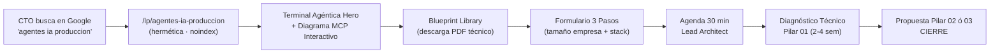
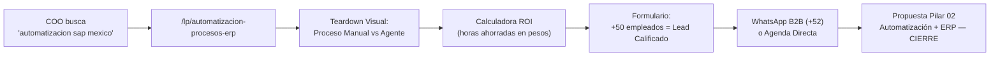
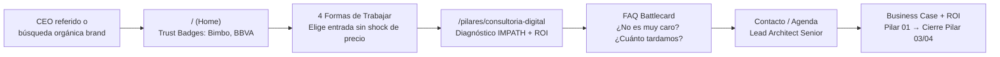
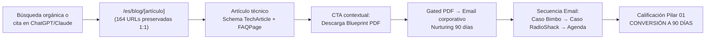
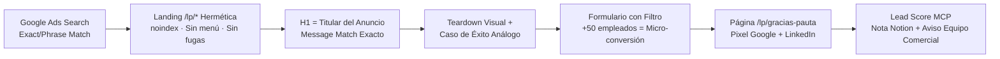
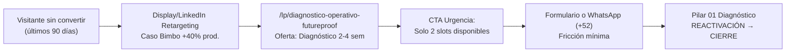
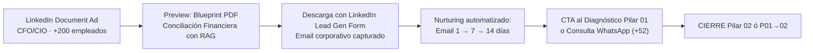
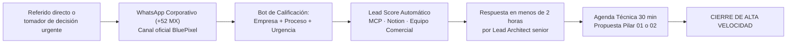
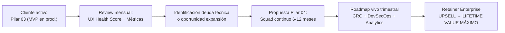

# 📋 REPORTE EJECUTIVO: SITIO WEB BLUEPIXEL 2026
## Junta de Alineación Estratégica · Dirección General y Producto
**Fecha:** 21 de Septiembre 2026 · **Hora:** 13:00 hrs  
**Objetivo:** Presentar el estado, arquitectura y justificación completa del nuevo sitio web, sitemap de 5 niveles y 9 flujos de conversión de BluePixel.

---

## 🎯 RESUMEN EJECUTIVO — EL PROBLEMA QUE RESOLVEMOS

```
┌──────────────────────────────────────────────────────────────────────────┐
│                    EL DESFASE DE INFORMACIÓN CRÍTICO                     │
├──────────────────────────────┬───────────────────────────────────────────┤
│ REALIDAD INTERNA (ACTUAL)    │ PERCEPCIÓN EXTERNA (LO QUE VE EL CLIENTE) │
├──────────────────────────────┼───────────────────────────────────────────┤
│ Ingeniería Agentica Deep     │ "Agencia de pantallitas en Figma"         │
│ Tech con MCP, RAG y Cloud    │ "#1 UX/UI Company" (DesignRush)          │
│ Native en producción real    │ Budget mínimo $25,000 USD en frío         │
│ Win Rate objetivo: 1:10      │ Win Rate actual: 1:50                     │
└──────────────────────────────┴───────────────────────────────────────────┘
```

**El nuevo sitio web es el ancla del reposicionamiento institucional.**
No es un rediseño cosmético. Es la corrección del desfase que colapsó
la tasa de cierre del 10% al 2%.

---

## 🧭 PARTE 1: ARQUITECTURA DEL NUEVO SITIO WEB

### La Identidad que Proyecta el Sitio

```
BluePixel NO es: Agencia de diseño estático · Fábrica de software
BluePixel   ES: Consultora de Ingeniería Agéntica, Desarrollo
                Cloud-Native y Garantía FutureProof™
```

**La Ventaja Injusta (diferenciación de mercado):**
El diseño UX/UI conductual (metodología **IMPATH™**) y la Product
Strategy (PS) son la **armadura de adopción humana** sobre arquitecturas
de ingeniería pesada.
_«Las consultoras de IA entregan algoritmos potentes con interfaces
toscas que el 70% abandona; las fábricas de software facturan horas a
ciegas. BluePixel entrega ingeniería grado enterprise con 95%+ de
adopción garantizada.»_

---

### Los 4 Pilares de Servicio (Oferta Canónica)

> **Regla de Oro:** Son 4 formas **independientes y modulares** de
> colaborar. Un cliente puede entrar por cualquiera sin haber pasado
> por las demás.

```
┌──────────────────────────────────────────────────────────────────────────────────┐
│                         4 PILARES DE SERVICIO BLUEPIXEL                          │
├────────────────────────┬─────────────────────────┬───────────────────────────────┤
│ 01 · Consultoría       │ 02 · Agentes &           │ 03 · Plataformas Digitales    │
│      Digital           │      Automatización      │ (MVPs con UX validado)        │
│ ⏳ 2 a 4 Semanas       │ ⏳ 2 a 4 Semanas         │ ⏳ 2 a 4 Meses a Producción   │
├────────────────────────┴─────────────────────────┴───────────────────────────────┤
│  04 · Evolución Digital · Roadmap vivo 6 a 12 meses · Squad dedicado continuo    │
└──────────────────────────────────────────────────────────────────────────────────┘
```

---

### Las 6 Capacidades Técnicas (El "Cómo" de Cada Pilar)

| Capacidad | Descripción | Badge Canónico |
| :--- | :--- | :--- |
| **1. UX/UI & PS** | Product Strategy, Psicología Conductual, Design Systems | `IMPATH™ Enabled` |
| **2. Software Engineering** | Full Stack Cloud-Native, Microservicios, Resiliencia | `Cloud-Native SOC2` |
| **3. IA & Automatización** | Agentic Automation, RAG Privado, Protocolo MCP | `Agentic Automation` |
| **4. Data & Analytics** | Telemetría Mixpanel, Pipelines, KPIs Directivos | `Mixpanel Telemetry` |
| **5. Security & Reliability** | ISO 27001, OWASP Top 10, DevSecOps, SLA 99.9% | `ISO 27001 & OWASP` |
| **6. Digital Consulting** | Business Case, ROI, FutureProof™ Framework | `FutureProof™ Framework` |

---

## 🗺️ PARTE 2: SITEMAP MAESTRO DE 5 NIVELES

### 2.1. Árbol Completo de URLs

```
bluepixel.mx/
│
├── [NIVEL 0: PROTOCOLOS & INFRAESTRUCTURA DE BÚSQUEDA]
│   ├── /robots.txt         → Reglas Googlebot, GPTBot, ClaudeBot, PerplexityBot
│   ├── /sitemap.xml        → Sincronizado con GSC y Bing Webmaster Tools
│   └── /llms.txt           → Ontología técnica B2B oficial para LLMs (AEO)
│
├── [NIVEL 1: ECOSISTEMA PÚBLICO INSTITUCIONAL — INDEXABLE]
│   ├── / (Home)
│   │   ├── Terminal Agéntica Interactiva (Hero)
│   │   ├── Trust Bar: Bimbo · BBVA · Cemex · SLA 99.9%
│   │   ├── "The Enterprise AI Reality" (Anti-maquila)
│   │   ├── Grid 4 Pilares → enlaces directos a landings de pilar
│   │   ├── 6 Capacidades Técnicas con badges canónicos
│   │   ├── Casos de Estudio (Evidence Hub)
│   │   └── Formulario Calificado 3 Pasos + FAQ Battlecard
│   │
│   ├── /pilares (4 Formas de Trabajar — Modulares e Independientes)
│   │   ├── /pilares/consultoria-digital    [2-4 sem · IMPATH™ · ROI]
│   │   ├── /pilares/agentes-automatizacion [2-4 sem · RAG · MCP · ERP]
│   │   ├── /pilares/plataformas-digitales  [2-4 meses · MVP Prod · SLA 99.9%]
│   │   └── /pilares/evolucion-digital      [6-12 m · Squad · CRO · UX Health]
│   │
│   ├── /servicios (6 Capacidades Técnicas — SEO por Capacidad)
│   │   ├── /servicios/ux-ui-product-strategy
│   │   ├── /servicios/software-engineering
│   │   ├── /servicios/agentic-ai-automation
│   │   ├── /servicios/data-analytics
│   │   ├── /servicios/security-reliability
│   │   └── /servicios/digital-consulting
│   │
│   ├── /blueprints (Biblioteca de Soluciones — Descarga Gated)
│   │   ├── /blueprints/conciliacion-financiera-erp
│   │   ├── /blueprints/triage-documental-rag
│   │   ├── /blueprints/onboarding-legal-kyc
│   │   └── /blueprints/sistemas-operativos-quirurgicos
│   │
│   ├── /casos-de-estudio (Evidence Hub — Prueba Social Dura)
│   │   ├── /casos-de-estudio/radioshack     [-60% fricción operativa]
│   │   ├── /casos-de-estudio/fr-medical
│   │   ├── /casos-de-estudio/grupo-bimbo    [+40% productividad directiva]
│   │   └── /casos-de-estudio/morada-uno
│   │
│   ├── /metodologia-impath (Filosofía FutureProof™)
│   ├── /nosotros (Squad Senior Anti-Maquila — sin nombres individuales)
│   └── /contacto (Diagnóstico & Calificación — Formulario + Agenda)
│
├── [NIVEL 2: LANDINGS DE PAUTA — noindex, nofollow — HERMÉTICAS]
│   ├── /lp/desarrollo-apps-enterprise       ← Google Ads C1 → Pilar 03
│   ├── /lp/automatizacion-procesos-erp      ← Google Ads C2 → Pilar 02
│   ├── /lp/agentes-ia-produccion            ← Google Ads C3 → Pilar 02
│   ├── /lp/blueprint-conciliacion-financiera ← LinkedIn Doc Ad · CFOs
│   ├── /lp/blueprint-triage-quirurgico      ← LinkedIn Doc Ad · COOs
│   ├── /lp/blueprint-onboarding-kyc         ← LinkedIn Doc Ad · CIOs
│   ├── /lp/diagnostico-operativo-futureproof ← Retargeting Display/LinkedIn
│   └── /lp/gracias-pauta                    ← Pixel de Conversión Google+LinkedIn
│
├── [NIVEL 3: BLOG HISTÓRICO PRESERVADO 1:1 — 164 URLs — MANDATORIO]
│   ├── /es/blog/*  (84 URLs en Español — Top: /diseno-ux-ui-que-es-guia)
│   └── /post/*     (80 URLs en Inglés — Top: /user-interface-types)
│        ↑ GENERA EL 100% DE LOS 21 LEADS ORGÁNICOS MENSUALES
│        ↑ FUENTE DEL 100% DE CITAS EN ChatGPT / Perplexity / Claude
│
└── [NIVEL 4: LEGAL & TRANSACCIONAL]
    ├── /gracias        → Confirmación orgánica (Pixel conversión)
    ├── /privacidad     → LFPDPPP México
    └── /terminos       → Condiciones de Servicio Enterprise
```

---

### 2.2. Justificación Multidimensional del Sitemap

#### 💼 DIMENSIÓN COMERCIAL — Los 4 Pilares sin Shock de Precio
- **Problema:** El selector de presupuesto con $25,000 USD mínimo rechazaba decisores corporativos que querían un piloto acotado.
- **Solución:** 4 puntos de entrada modulares. Un COO puede entrar por `/pilares/agentes-automatizacion` sin comprometer contratos de 6 cifras.
- **Impacto proyectado:** Win Rate de **1:50 actual → 1:10 objetivo**.

#### 🎯 DIMENSIÓN DE VENTAS — Pipeline y Calificación Automática
- **Trifecta de conversión según temperatura del prospecto:**
  1. **Decisor urgente:** Agenda técnica 30 min directa con Lead Architect.
  2. **Lead calificado:** Formulario progresivo 3 pasos con selector de tamaño de empresa (`10-50 | 50-200 | 200+`).
  3. **Research lead:** Descarga de Blueprints PDF a cambio de email corporativo → Nurturing a 90 días.
- **WhatsApp B2B:** Canal único oficial México (+52). Eliminados números con prefijos internacionales obsoletos (+1 510).

#### 🔍 DIMENSIÓN SEO & AEO — Motores Tradicionales y de IA
- **El activo más valioso:** 164 URLs de blog generan **100% de los 21 leads orgánicos/mes** y **100% de las citas en ChatGPT, Perplexity y Claude**.
- **Mandato:** Los slugs del blog se preservan **idénticos 1:1**. Cero migraciones que destruyan indexación.
- **AEO (Answer Engine Optimization):**
  - `/llms.txt` → ontología estructurada para GPTBot, ClaudeBot, PerplexityBot.
  - `sitemap.xml` sincronizado con **Bing Webmaster Tools** (alimenta ChatGPT: 62.6% del tráfico referido por IA en B2B).
  - Schema.org: `Organization`, `Service`, `TechArticle`, `FAQPage`.

#### 🛡️ DIMENSIÓN DE IMAGEN & POSICIONAMIENTO — Anti-Maquila
- **Se elimina:** Badge "DesignRush #1 UX/UI" que atraía proyectos de $20k–$40k MXN.
- **Se refuerza:** Identidad de Consultora de Ingeniería Agéntica con evidencia técnica directa.
- **Seniority técnico directo:** Cada proyecto supervisado por Lead Architect senior. Cero intermediarios comerciales en sesiones de arquitectura.

#### ⚙️ DIMENSIÓN TÉCNICA — Soberanía y Cumplimiento
- **Soberanía total:** Protocolo MCP, despliegue en VPC privada del cliente (AWS/Azure/GCP). Propiedad del código e IP desde el primer release.
- **Blindaje:** ISO 27001 · OWASP Top 10 · LFPDPPP.
- **Landings herméticas:** `/lp/*` con directiva `noindex, nofollow`. Sin menús de fuga. Quality Score 9–10/10.

---

## 🔠 PARTE 3: TIPOGRAFÍA Y SISTEMA DE DISEÑO

### Sistema Tipográfico (Font Stack Oficial)

| Rol | Fuente | Pesos | Uso |
| :--- | :--- | :--- | :--- |
| **Body & UI Principal** | `Plus Jakarta Sans` | 300, 400, 500, 600, 700, 800 | Texto de interfaz, párrafos, navegación |
| **Código & Terminal** | `JetBrains Mono` | 400, 600 | Terminal Hero, snippets técnicos, badges de stack |
| **Display (impacto)** | `Inter` | 700, 800, 900 | H1 y headings de máximo impacto |

**Justificación de la selección:**
- **`Plus Jakarta Sans`**: Geométrica moderna, excelente legibilidad. Comunica precisión técnica sin frialdad corporativa. Usada en productos SaaS enterprise de frontera.
- **`JetBrains Mono`**: Estándar de facto en herramientas de desarrollo (VS Code, JetBrains IDE). Su presencia en el Hero con la terminal agéntica valida identidad técnica ante CTOs en los primeros 3 segundos.

### El Punto en Cuadro — Kicker del Hero

El símbolo `✦` (Black Four Pointed Star, U+2726) se usa como kicker de categoría:

```
✦ AGENTIC AI & FUTUREPROOF ENGINEERING
```

**No es una imagen ni un badge pesado.** Es un carácter Unicode puro, renderizado en `JetBrains Mono`, que comunica la categoría de la empresa en 4 palabras. Sin cápsulas. Sin bordes. Tipografía limpia y directa.

Inspiración directa de Vstorm.co: `• AGENTIC AI COMPANY` — cero ambigüedad de categoría.

### Paleta de Color (Tokens CSS)

```css
--bg-dark:        #050814   /* Fondo principal — profundidad técnica */
--bg-card:        #0c1224   /* Cards y módulos */
--primary-cyan:   #38bdf8   /* Acento primario — energía y precisión */
--accent-blue:    #2563eb   /* CTAs primarios — conversión */
--accent-emerald: #10b981   /* Blog, éxito, confirmaciones */
--accent-amber:   #f59e0b   /* Alertas, landings SEM */
--accent-purple:  #a855f7   /* Pilares, capacidades técnicas */
--text-main:      #f1f5f9   /* Texto principal */
--text-muted:     #94a3b8   /* Texto secundario */
```

---

## 🔄 PARTE 4: LOS 9 FLUJOS DE CONVERSIÓN (USER JOURNEYS)

### Flujo 1: CTO / VP de Ingeniería — Buyer Técnico (Solvencia y Arquitectura)



**KPI:** Tiempo al formulario < 3 min. Conversión objetivo: **8% de visitantes**.

---

### Flujo 2: COO / CFO — Buyer de Eficiencia (Dolor ERP y ROI)



---

### Flujo 3: CEO / Director General — Buyer Estratégico (Riesgo y Certeza)



---

### Flujo 4: Investigador Técnico — Blog Orgánico y Citas en LLMs



---

### Flujo 5: Tráfico Pauta SEM — Google Ads Alta Conversión



---

### Flujo 6: Retargeting — Reactivación de Leads Tibios



---

### Flujo 7: LinkedIn Document Ads — Blueprints Técnicos



---

### Flujo 8: WhatsApp B2B Corporativo — Buyer Inmediato



---

### Flujo 9: Expansión de Clientes — Pilar 03 MVP → Pilar 04 Retainer



---

### Matriz Resumen de los 9 Flujos

| Flujo | Buyer Persona | Canal de Entrada | CTA Principal | Pilar Destino | Conversión Esperada |
| :---: | :--- | :--- | :--- | :--- | :--- |
| **1** | CTO / VP Ingeniería | Google Ads C3 | Agenda Técnica 30 min | P02 / P03 | 8% visitantes |
| **2** | COO / CFO | Google Ads C2 | Calculadora ROI → WA | P02 | 6% visitantes |
| **3** | CEO / Director General | Orgánico / Brand | Contacto Lead Architect | P01 → P03/04 | 4% visitantes |
| **4** | Investigador Técnico | Blog / LLMs (ChatGPT) | Descarga Blueprint PDF | P01 (nurturing 90d) | 2% visitantes |
| **5** | Decisor Activo | Google Ads Search | Formulario Calificado | P01 / P02 | 10% visitantes |
| **6** | Lead Tibio | Retargeting Display/LI | /lp/diagnostico + WA | P01 | 12% retargeting |
| **7** | CFO / CIO | LinkedIn Document Ads | Descarga Blueprint Email | P02 | 15% del alcance |
| **8** | Referido Urgente | WhatsApp Directo | Bot calificación < 2h | P01 / P02 | >80% calificados |
| **9** | Cliente Activo P03 | Review Mensual | Propuesta Pilar 04 | P04 Retainer | >60% clientes P03 |

---

## 🎯 PARTE 5: LANDING PAGES DE PAUTA — ANATOMÍA Y REGLAS

### Regla de Oro de las Landings `/lp/*`

> El tráfico pagado **jamás** aterriza en páginas generales de navegación.
> Los menús de fuga y textos extensos = rebote + desperdicio presupuestal.

### Anatomía de Alta Conversión (Quality Score 9–10/10)

```
┌─────────────────────────────────────────────────────────────────────┐
│ HEADER: [Logo BluePixel]                   [WhatsApp (+52 MX) →]    │
├─────────────────────────────────────────────────────────────────────┤
│ H1: MENSAJE IDÉNTICO AL TITULAR DEL ANUNCIO (Message Match exacto)  │
│ Subtítulo: Propuesta de valor técnica diferenciada (2 líneas)        │
├─────────────────────────────────────────────────────────────────────┤
│ TEARDOWN VISUAL:                                                     │
│ Proceso Manual (roto/lento) ◄──► Solución BluePixel (determinística)│
├─────────────────────────────────────────────────────────────────────┤
│ CASO DE ÉXITO ANÁLOGO:                                              │
│ "Grupo Bimbo: +40% productividad directiva con analítica en tiempo  │
│  real" / "RadioShack: -60% fricción operativa en pagos"             │
├─────────────────────────────────────────────────────────────────────┤
│ FORMULARIO PROGRESIVO 3 PASOS:                                      │
│  Paso 1: Nombre + email corporativo (no Gmail, no Hotmail)          │
│  Paso 2: Empresa + Sector + Tamaño [10-50 | 50-200 | 200+ emp.]    │
│  Paso 3: Describe tu flujo o proceso a resolver                     │
├─────────────────────────────────────────────────────────────────────┤
│ COMPROMISOS VISIBLES:                                               │
│  ✓ NDA Bilateral en minuto 0   ✓ Diagnóstico en 24 horas           │
│  ✓ Contacto directo Lead Architect Senior (sin intermediarios)      │
│  ✓ SLA 99.9% · ISO 27001 · OWASP Top 10                            │
├─────────────────────────────────────────────────────────────────────┤
│ FOOTER: Privacidad LFPDPPP | © BluePixel 2026                      │
│ SIN MENÚ DESPLEGABLE · SIN LINKS EXTERNOS · CERO FUGAS             │
└─────────────────────────────────────────────────────────────────────┘
```

### Inventario de Landings Activas

| URL | Campaña Origen | Audiencia | Pilar Destino |
| :--- | :--- | :--- | :--- |
| `/lp/desarrollo-apps-enterprise` | Google Ads C1 | CTO / VP Producto | Pilar 03 |
| `/lp/automatizacion-procesos-erp` | Google Ads C2 | COO / CFO | Pilar 02 |
| `/lp/agentes-ia-produccion` | Google Ads C3 | CTO / CDO | Pilar 02 |
| `/lp/blueprint-conciliacion-financiera` | LinkedIn Doc Ad | CFO / Contralor | Pilar 01→02 |
| `/lp/blueprint-triage-quirurgico` | LinkedIn Doc Ad | COO / Salud | Pilar 01→02 |
| `/lp/diagnostico-operativo-futureproof` | Retargeting | Todos buyers | Pilar 01 |
| `/lp/gracias-pauta` | Pixel conversión | Post-formulario | — |

---

## 📈 PARTE 6: ESTADO ACTUAL DEL SITIO Y PROYECCIÓN DE IMPACTO

### Estado del Sitio en Producción

| Elemento | Estado | Detalle |
| :--- | :---: | :--- |
| Sitio React en GitHub Pages | ✅ Live | [https://jahflavio.github.io/bluepixel/](https://jahflavio.github.io/bluepixel/) |
| Build (npm run build) | ✅ 0 errores | Build en ~4 segundos |
| Stack tecnológico | ✅ | React + Vite · CSS Variables · Plus Jakarta Sans + JetBrains Mono |
| `HeroSection` (Terminal Agéntica) | ✅ | Kicker `✦`, H1 posicionamiento, animación de escritura |
| `FourWaysToWork` (4 Pilares) | ✅ | Grid con links directos a landings de pilar |
| `SixCapabilitiesGrid` | ✅ | 6 capacidades con badges canónicos |
| `CasesOfStudy` | ✅ | Bimbo, RadioShack, FR Medical, Morada Uno |
| `ServiceLandingTemplate` | ✅ | Template por cada una de las 6 capacidades |
| `PilarLandingTemplate` | ✅ | Template por cada uno de los 4 Pilares |
| Blog preservado 1:1 (164 URLs) | ⚙️ Pendiente | Migración Webflow preservando slugs |
| `/llms.txt` | ⚙️ Pendiente | Ontología técnica para GPTBot, ClaudeBot |
| Formulario calificado 3 pasos | ⚙️ Pendiente | Con GCLID capture + selector tamaño empresa |
| WhatsApp Corporativo (+52 MX) | ⚙️ Pendiente | Reemplazar número obsoleto +1 510 |

### Proyección de Impacto Operativo

| Métrica | Estado Actual | Objetivo Post-Lanzamiento |
| :--- | :---: | :---: |
| Win Rate Comercial | 1:50 (2%) | 1:10 (10%) → **+400%** |
| Leads calificados >$300k MXN | ~1/mes | +3 a 5 leads calificados/mes |
| Leads orgánicos Blog | 21/mes | 30+/mes (preservados y creciendo) |
| Quality Score Google Ads | 4–6 / 10 | **9–10 / 10** (Landings herméticas) |
| Citas en ChatGPT/Perplexity/Claude | Actuales | Preservadas 100% vía llms.txt + Bing |
| Tasa de Bounce (pauta) | ~70% | < 40% (Message Match exacto) |
| Costo por Lead Calificado | Referencia | Reducción estimada **50%** |
| Tiempo promedio de cierre | ~90 días | ~45 días (Pilar 01 como puerta de entrada) |

---

## ✅ PARTE 7: PREGUNTAS ESTRATÉGICAS PARA VALIDAR EN LA JUNTA

1. **¿Se aprueba el Sitemap de 5 Niveles** con la protección 1:1 del blog y las landings `/lp/*` herméticas como arquitectura canónica?

2. **¿Se autoriza la migración del blog** desde Webflow preservando los 164 slugs existentes (mandatorio para no destruir los 21 leads orgánicos/mes)?

3. **¿Se aprueba GitHub Pages** (`jahflavio/bluepixel`) como base de producción del nuevo sitio con despliegue continuo?

4. **¿Cuál es la fecha límite** para activar las 3 campañas de Google Ads que requieren las landings herméticas `/lp/*`?

5. **¿Se elimina formalmente** la insignia DesignRush y el selector de presupuesto de $25,000 USD mínimo del sitio actual en Webflow?

---

*Documento generado: 21 de Septiembre 2026 · BluePixel Strategic Intelligence · Confidencial*
*Fuentes: SITEMAP_MAESTRO_Y_ARQUITECTURA_WEB_BLUEPIXEL_2026.md · AUDITORIA_Y_REDISEÑO_WEB_BLUEPIXEL_2026.md · BLUEPIXEL_FRAMEWORK_4_PILARES_Y_CAPACIDADES.md*
