# 🗺️ SITEMAP ACTUAL DEL SITIO NUEVO Y ANÁLISIS DE BRECHAS vs. ESTRATEGIA
## Levantamiento del código de `bluepixel-app` contra el Sitemap Maestro 2026

> **Fecha de levantamiento:** 24 de septiembre de 2026 · **última actualización:** 24 de septiembre de 2026 (correcciones de código aplicadas, ver historial al final).
> **Fuente analizada:** `03_Prototipos_y_Codigo/Componentes_Nueva_Web/bluepixel-app/src` (enrutamiento en `App.jsx`, `Navbar.jsx`, `Footer.jsx`, secciones y datos).
> **Referencia estratégica:** `AGENTS.md` y `02_Estrategia_B2B/SITEMAP_MAESTRO_Y_ARQUITECTURA_WEB_BLUEPIXEL_2026.md`.
> **Alcance:** el sitio nuevo en React. Este documento sirve como brief de referencia para que diseño construya el sitio final en Lovable; no describe Lovable en sí. El sitio vivo en Webflow (`bluepixel.mx`) no se volvió a verificar en esta revisión; lo que se menciona de él proviene de `hallazgos/lee_auditoria-web.md` (15-sep-2026).

---

## 1. RESUMEN EJECUTIVO

* **El sitio nuevo tiene 20 vistas** (Home, hub de 4 pilares + 4 pilares, hub + 6 capacidades, casos, filosofía FutureProof, showroom, 3 clusters heredados y 404). El Sitemap Maestro define **41 URLs propias** (sin contar las 164 del blog), de las cuales hoy existen 18 con algún equivalente. **Cobertura: ~44 %.**
* **Lo que está resuelto:** los 4 Pilares y las 6 Capacidades existen como páginas completas, con sus slugs ya alineados al Sitemap Maestro, y están enlazados desde Navbar, Footer y Home. Es el núcleo comercial y está bien cubierto. Las 3 landings de pauta de Google Search (`/lp/desarrollo-apps-enterprise`, `/lp/automatizacion-procesos-erp`, `/lp/agentes-ia-produccion`) también tienen una primera versión funcional, reutilizando los 3 clusters heredados.
* **Lo que falta es todo lo que convierte y todo lo que indexa:** no hay `/contacto`, `/gracias`, `/privacidad`, `/terminos`, ni `/lp/gracias-pauta`, ni `/nosotros`, ni `/blueprints`, ni páginas individuales de casos, ni `robots.txt` / `sitemap.xml` / `llms.txt`.
* **Bloqueador estructural:** el enrutamiento es por hash (`#/servicios`). Para Google y los crawlers de LLMs todo el sitio es **una sola URL** (`/`) con un `<div id="root">` vacío. Ninguna página nueva que se cree podrá indexarse ni recibir pauta con Quality Score alto hasta migrar a rutas reales con prerender/SSG (Mandato §6.3 del Sitemap Maestro).

---

## 2. SITEMAP ACTUAL (LO QUE EXISTE HOY EN EL CÓDIGO)

### 2.1 Diagrama

```mermaid
%%{init: {'theme':'base', 'themeVariables': {'lineColor':'#94a3b8','primaryBorderColor':'#94a3b8','fontSize':'14px'}}}%%
graph TD
    classDef ok fill:#064e3b,stroke:#10b981,color:#ecfdf5;
    classDef warn fill:#451a03,stroke:#f97316,color:#fff7ed;
    classDef dead fill:#450a0a,stroke:#ef4444,color:#fef2f2;
    classDef internal fill:#1e1b4b,stroke:#818cf8,color:#e0e7ff;

    ROOT["#/ Home"]:::ok

    ROOT --> P["#/pilares<br/>Hub de 4 Pilares"]:::ok
    P --> P1["#/pilares/consultoria-digital<br/>Pilar 01 · Consultoría Digital<br/>alias: #/diagnostico"]:::ok
    P --> P2["#/pilares/agentes-automatizacion<br/>Pilar 02 · Agentes & Automatización"]:::ok
    P --> P3["#/pilares/plataformas-digitales<br/>Pilar 03 · Plataformas Digitales"]:::ok
    P --> P4["#/pilares/evolucion-digital<br/>Pilar 04 · Evolución Digital"]:::ok

    ROOT --> S["#/servicios<br/>Hub 6 Capacidades"]:::ok
    S --> S1["#/servicios/ux-ui-product-strategy"]:::ok
    S --> S2["#/servicios/software-engineering"]:::ok
    S --> S3["#/servicios/agentic-ai-automation"]:::ok
    S --> S4["#/servicios/data-analytics"]:::ok
    S --> S5["#/servicios/security-reliability"]:::ok
    S --> S6["#/servicios/digital-consulting"]:::ok

    ROOT --> C["#/casos-de-estudio<br/>Hub con modales, sin URL por caso"]:::ok
    C --> C1["Avianca / LifeMiles"]:::warn
    C --> C2["Grupo Bimbo"]:::warn
    C --> C3["RadioShack"]:::warn
    C --> C4["IQOS"]:::warn
    C --> C5["Stadibox"]:::warn
    ROOT --> F["#/metodologia-impath<br/>(solo desde banner del Home)"]:::ok

    ROOT --> CL["Clusters heredados"]:::warn
    CL --> CL1["#/apps"]:::warn
    CL --> CL2["#/automatizacion"]:::warn
    CL --> CL3["#/agentizacion"]:::warn

    ROOT --> LP["Landings herméticas de pauta<br/>sin Navbar/Footer, noindex"]:::ok
    LP --> LP1["/lp/desarrollo-apps-enterprise<br/>= cluster apps"]:::ok
    LP --> LP2["/lp/automatizacion-procesos-erp<br/>= cluster automatizacion"]:::ok
    LP --> LP3["/lp/agentes-ia-produccion<br/>= cluster agentizacion"]:::ok

    ROOT --> E["404 genérico"]:::ok
```



Verde: operativa. Naranja: existe con un problema (sin URL propia, huérfana o interna). Rojo: rota (ninguna en este momento).

### 2.2 Árbol textual

```
bluepixel-app (hash routing, una sola URL real: /)
│
├── #/                              Home
│   └── Secciones: Hero + Prompt, Social Proof, 4 Formas de Trabajar, 6 Capacidades,
│       Trust Badges, Industrias, IMPATH, Casos, FAQ, Engineering Leadership,
│       SLA post-contacto, Banner FutureProof, CTA final, Footer
│
├── PILARES (4 formas de trabajar)
│   ├── #/pilares/consultoria-digital       Pilar 01 · Consultoría Digital       (alias: consultoria-tecnologica, consultoria-digital, pilar/consultoria-digital, diagnostico)
│   ├── #/pilares/agentes-automatizacion    Pilar 02 · Agentes & Automatización  (alias: automatizacion-agentica, agentes-automatizacion, pilar/agentes-automatizacion)
│   ├── #/pilares/plataformas-digitales     Pilar 03 · Plataformas Digitales     (alias: producto-digital, plataformas-digitales, pilar/plataformas-digitales)
│   └── #/pilares/evolucion-digital         Pilar 04 · Evolución Digital         (alias: evolucion-digital, pilar/evolucion-digital)
│
├── CAPACIDADES
│   ├── #/servicios                             Hub de las 6 capacidades
│   ├── #/servicios/ux-ui-product-strategy      UX/UI & PS                (alias: servicio/ux-ui)
│   ├── #/servicios/software-engineering        Software Engineering      (alias: servicio/ai-engineering)
│   ├── #/servicios/agentic-ai-automation       IA & Automatización       (alias: servicio/ai-agents)
│   ├── #/servicios/data-analytics              Data & Analytics          (alias: servicio/data-analytics)
│   ├── #/servicios/security-reliability        Security & Reliability    (alias: servicio/security)
│   └── #/servicios/digital-consulting          Digital Consulting        (alias: servicio/business-ai)
│
├── EVIDENCIA Y TESIS
│   ├── #/casos-de-estudio          Hub filtrable: LifeMiles, Grupo Bimbo, RadioShack, IQOS, Stadibox (modal por caso) (alias: casos-de-exito)
│   └── #/metodologia-impath        Filosofía FutureProof (alias: filosofia-futureproof)
│
├── #/pilares                       Hub de los 4 Pilares (PilaresLandingPage), enlazado en Navbar y Footer
│
├── PAUTA (landings herméticas, sin Navbar/Footer del sitio, noindex)
│   ├── /lp/desarrollo-apps-enterprise      = cluster "apps" (Google Search C1 · Pilar 03)
│   ├── /lp/automatizacion-procesos-erp     = cluster "automatizacion" (Google Search C2 · Pilar 02)
│   └── /lp/agentes-ia-produccion           = cluster "agentizacion" (Google Search C3 · Pilar 02)
│
├── INTERNO
│   └── #/componentes               Showroom de prototipos (ya no está en Navbar ni Footer públicos; solo por URL directa)
│
├── HEREDADO (modelo de 3 clusters, ahora también sirven de contenido a las landings de pauta de arriba)
│   ├── #/apps
│   ├── #/automatizacion
│   └── #/agentizacion
│
├── ESTÁTICOS SUELTOS en /public/landings/ (sin enlace desde la app, sin noindex)
│   ├── index.html                  "Blueprint Library"
│   ├── finance_matcher.html        Conciliador autónomo
│   ├── erp_bridge.html             ERP Bridge
│   ├── legal_onboarding.html       Legal & Compliance Onboarding
│   ├── triage_rag.html             Triage RAG
│   ├── rfp_analyst.html            RFP & Tender Analyst
│   ├── apa.html                    Agentic Process Automation
│   ├── aoc.html                    Agentic Operations Center
│   ├── data_privacy.html           Data Privacy Anonymizer
│   ├── hr_recruiter.html           HR Autonomous Recruiter
│   └── smart_ads.html              Smart Ads Optimizer
│
└── ERRORES
    └── (cualquier ruta inválida)   404 con salida a Inicio / Servicios
```

### 2.3 Inventario ruta por ruta

| Ruta actual | Componente | Enlazada desde | Estado |
| :--- | :--- | :--- | :--- |
| `#/` | Home (en `App.jsx`) | Logo, breadcrumbs | ✅ Operativa |
| `#/pilares/consultoria-digital` | `ConsultoriaPilarPage` | Navbar, Footer, FourWaysToWork | ✅ Operativa · slug canónico (alias viejos conservados, incluido `#/diagnostico`) |
| `#/pilares/agentes-automatizacion` | `AutomatizacionPilarPage` | Navbar, Footer, FourWaysToWork | ✅ Operativa · slug canónico |
| `#/pilares/plataformas-digitales` | `PlataformasPilarPage` | Navbar, Footer, FourWaysToWork | ✅ Operativa · slug canónico |
| `#/pilares/evolucion-digital` | `EvolucionPilarPage` | Navbar, Footer, FourWaysToWork | ✅ Operativa · slug canónico |
| `#/pilares` | `PilaresLandingPage` | Navbar, Footer | ✅ Hub real construido: 4 tarjetas desde `pillarsData.js`, cada una enlaza a su pilar |
| `#/servicios` | `ServiciosLandingPage` | Navbar, Footer, plantillas de servicio | ✅ Operativa |
| `#/servicios/*` (6) | `ServiceLandingTemplate` + datos | Navbar, Footer, SixCapabilitiesGrid | ✅ Operativas · slugs canónicos |
| `#/casos-de-estudio` | `CasosEstudioLandingPage` | Navbar, Footer, Hero, Industrias | ✅ Operativa · sin URL por caso |
| `#/metodologia-impath` | `FutureproofLandingPage` | Solo `FutureproofCTABanner` | ⚠️ Poco enlazada (no está en Navbar ni Footer) |
| `#/componentes` | `ComponentShowcasePage` | Solo por URL directa | ✅ Corregido: ya no está en Navbar ni Footer públicos |
| `#/apps`, `#/automatizacion`, `#/agentizacion` | `ClusterLandingPage` | Solo entre sí | ⚠️ Huérfanas para tráfico orgánico; ahora sí sirven de contenido a las 3 landings de pauta de abajo |
| `/lp/desarrollo-apps-enterprise`, `/lp/automatizacion-procesos-erp`, `/lp/agentes-ia-produccion` | `ClusterLandingPage` (modo `hermetic`) | Ninguna todavía (pendiente enlazar desde campañas) | ✅ Nuevas: sin Navbar/Footer, `noindex` vía JS |

### 2.4 Activos construidos que no se usan

* **Componentes nunca renderizados:** `ComoTrabajamosLandingPage`, `HomeDirectorySection`, `ThreeClustersOverview`, `ThreeWaysToWork` / `ThreeWaysToWorkEN`, `FourWaysToWorkEN`, `WorkflowTeardown`, `AgenticTechStack`, `TechnicalSovereignty` (en reserva por decisión, ver AGENTS.md §6.5), `LeadMagnetSection` (retirado). `PilaresLandingPage` ya se conectó como hub real en `#/pilares` (ver §2.3).
* **11 landings HTML estáticas** en `public/landings/` que corresponden casi 1:1 al concepto `/blueprints/*` de la estrategia, pero no están enlazadas, no tienen `noindex` y cargan GTM con ID de marcador (`GTM-XXXXXXX`).

---

## 3. BRECHAS vs. ESTRATEGIA: PÁGINAS QUE FALTAN

Priorización:
* **P0:** sin esto no se puede recibir pauta, medir ni cumplir con la ley.
* **P1:** necesarias para los 9 flujos de conversión y para el posicionamiento anti-maquila.
* **P2:** amplían alcance o completan el sitemap.

### 3.1 Nivel 0 · Protocolos e indexación

| Página | Prioridad | Por qué falta y qué resuelve |
| :--- | :---: | :--- |
| **Rutas reales + prerender/SSG** (prerrequisito) | **P0** | Con hash routing, ninguna página existe para Google ni para GPTBot/ClaudeBot/PerplexityBot. Todo lo demás de esta sección depende de esto. |
| `/robots.txt` | P0 | Reglas para Googlebot y bots de IA; bloqueo de `/lp/*` y `/gracias`. |
| `/sitemap.xml` | P0 | Envío a Google Search Console y Bing Webmaster (fuente del índice de ChatGPT). |
| `/llms.txt` | P1 | Ontología de 4 Pilares + 6 Capacidades para citas en LLMs (Dimensión AEO §1.3). |

### 3.2 Nivel 1 · Ecosistema público

| Página | Prioridad | Estado actual | Qué falta |
| :--- | :---: | :--- | :--- |
| `/contacto` | **P0** | Solo modal global | Página propia con formulario de 3 pasos que **envíe a CRM** (hoy hace `console.log`), campo de **tamaño de empresa**, agenda de 30 min con Lead Architect, **WhatsApp corporativo +52** (hoy no hay ningún enlace de WhatsApp en el sitio) y captura de `gclid`/UTMs. |
| `/nosotros` | **P1** | No existe | Manifiesto anti-maquila, estructura del Squad Senior por roles (sin nombres personales), garantía de seniority. Es la parada clave del Flujo 3 (CEO/Board). `EngineeringLeadership` sirve de base. |
| `/blueprints` + 4 blueprints | **P1** | Material disperso en `public/landings/*.html` | Hub y páginas `conciliacion-financiera-erp`, `triage-documental-rag`, `onboarding-legal-kyc`, `sistemas-operativos-quirurgicos`. Es el antídoto al shock de precio y el destino de los Flujos 4 y 7. Reaprovechar `finance_matcher`, `triage_rag`, `legal_onboarding`. |
| `/casos-de-estudio/[caso]` | **P1** | Hub con modales, sin URL | Una página por caso para SEO y para compartir en ventas. No están Morada Uno ni Pakke, que sí aparecen en la estrategia. **FR Medical no debe publicarse:** aún no es cliente (`pillarsData.js:434-436`), aunque la estrategia lo usa como caso insignia; el Pilar 02 queda sin caso hasta tener uno real autorizado. |
| `/metodologia-impath` | P2 | Existe como `#/filosofia-futureproof` | Definir el slug canónico (el Sitemap Maestro usa `/metodologia-impath`) y enlazarla en Navbar/Footer. |

### 3.3 Nivel 2 · Landings de pauta (`/lp/*`, noindex, sin menú de fuga)

Son el destino obligatorio de toda la pauta (§2 del Sitemap Maestro). Las 3 de Google Search ya tienen una primera versión funcional, reutilizando los clusters heredados como contenido; todavía no reciben tráfico de campañas reales.

| Página | Prioridad | Campaña de origen | Pilar | Estado |
| :--- | :---: | :--- | :--- | :--- |
| `/lp/desarrollo-apps-enterprise` | P0 | Google Search C1 · Apps & Plataformas | 03 | ✅ Construida (contenido del cluster "apps", modo hermético) |
| `/lp/automatizacion-procesos-erp` | P0 | Google Search C2 · Automatización ERP | 02 | ✅ Construida (contenido del cluster "automatizacion") |
| `/lp/agentes-ia-produccion` | P0 | Google Search C3 · Agentes & MCP | 02 | ✅ Construida (contenido del cluster "agentizacion") |
| `/lp/gracias-pauta` | **P0** | Disparo de conversión Google/LinkedIn | — | ❌ Falta |
| `/lp/diagnostico-operativo-futureproof` | P1 | Retargeting multicanal | Agenda | ❌ Falta |
| `/lp/blueprint-conciliacion-financiera` | P2 | LinkedIn Document Ads · CFO | 01/02 | ❌ Falta |
| `/lp/blueprint-triage-quirurgico-operativo` | P2 | LinkedIn Document Ads · COO | 02 | ❌ Falta |
| `/lp/blueprint-onboarding-kyc-mcp` | P2 | LinkedIn Document Ads · CIO | 02 | ❌ Falta |

> Pendiente en las 3 ya construidas: el `noindex` se inyecta por JS (no lo verán crawlers que no ejecuten JS mientras falte prerender/SSG, §3.1) y todavía no hay campañas de Google Ads apuntando a ellas ni captura de `gclid`/UTMs.

### 3.4 Nivel 3 · Blog histórico

| Página | Prioridad | Qué falta |
| :--- | :---: | :--- |
| `/es/blog/*` (84) y `/post/*` (80) | **P0 al migrar** | No hay plan de servicio en la app nueva. Si el dominio se apunta a la app sin reverse proxy o preservación 1:1 de slugs, se pierden los 21 leads orgánicos mensuales y las citas en LLMs. No bloquea mientras Webflow siga sirviendo el dominio. |

### 3.5 Nivel 4 · Transaccional y legal

| Página | Prioridad | Por qué |
| :--- | :---: | :--- |
| `/privacidad` | **P0** | El formulario pide aceptar "la Política de Privacidad de BluePixel y la LFPDPPP", pero es un `<span>` sin enlace y el documento no existe en el sitio. Consentimiento sobre un aviso inaccesible. |
| `/gracias` | **P0** | Página de confirmación con URL propia para medir la conversión orgánica. Hoy solo hay un estado interno del modal. |
| `/terminos` | P1 | Condiciones de servicio enterprise. |

---

## 4. DISCREPANCIAS DE SLUGS Y NOMENCLATURA — ✅ CORREGIDO

Los slugs del código no coincidían con el Sitemap Maestro. Ya se corrigieron: Navbar, Footer, Home, las páginas de pilares/servicios y los datos (`pillarsData.js`, `ServiceLandingTemplate.jsx`) generan ahora el slug canónico. Los slugs viejos se mantienen como alias reconocidos por el router (nadie rompe un enlace ya compartido); cuando se migre a rutas reales con prerender, esos alias deberían resolverse con una redirección 301 en vez de aliasing en JS.

| Antes en código | Canónico del Sitemap Maestro (ya en uso) | Observación |
| :--- | :--- | :--- |
| `#/consultoria-tecnologica` | `/pilares/consultoria-digital` | "Tecnológica" contradecía el nombre oficial del Pilar 01. |
| `#/automatizacion-agentica` | `/pilares/agentes-automatizacion` | — |
| `#/producto-digital` | `/pilares/plataformas-digitales` | "Producto Digital" era nomenclatura previa al Pilar 03. |
| `#/evolucion-digital` | `/pilares/evolucion-digital` | Solo faltaba el prefijo. |
| `#/servicio/ux-ui` | `/servicios/ux-ui-product-strategy` | Singular vs. plural en el prefijo. |
| `#/servicio/ai-engineering` | `/servicios/software-engineering` | La página se titula Software Engineering; el slug decía AI Engineering. |
| `#/servicio/ai-agents` | `/servicios/agentic-ai-automation` | — |
| `#/servicio/data-analytics` | `/servicios/data-analytics` | Solo el prefijo. |
| `#/servicio/security` | `/servicios/security-reliability` | AGENTS.md §6.5 también la cita como `/servicio/security`; se unificó a la versión plural. |
| `#/servicio/business-ai` | `/servicios/digital-consulting` | "Business AI" no era el nombre oficial de la capacidad 6. |
| `#/casos-de-exito` | `/casos-de-estudio` | — |
| `#/filosofia-futureproof` | `/metodologia-impath` | Se optó por una sola página (no se separó FutureProof de IMPATH). |

Además, el hub de servicios agrupaba las capacidades en "Apps & Producto / Automatización / Gobernanza IA" (`ServiceLandingTemplate.jsx:150-155`), una taxonomía de 3 grupos que no existe en AGENTS.md. Se aplanó a un solo grupo ("Capacidades BluePixel") y de paso se corrigieron 3 nombres que no coincidían con AGENTS.md: "AI Engineering" → Software Engineering, "Agentes IA" → IA & Automatización, "Business AI Consulting" → Digital Consulting.

---

## 5. OTROS HALLAZGOS DEL LEVANTAMIENTO

1. ~~CTA principal roto: `#/diagnostico` (Hero y FinalCTA) no está en `validViews` de `App.jsx`.~~ **✅ Corregido:** se agregó a la lista de rutas reconocidas.
2. ~~Showroom interno público: `#/componentes` aparece en Navbar y Footer con indicador animado.~~ **✅ Corregido:** se retiró de Navbar (desktop y mobile) y Footer. La ruta sigue viva para el equipo.
3. **Footer sin datos de contacto:** sigue sin teléfono, correo, WhatsApp +52, LinkedIn ni enlaces legales.
4. **Sin instrumentación:** sigue sin `gclid`, UTMs, `dataLayer` ni `gtag` en la app React.
5. **Landings estáticas sin `noindex`:** los 11 HTML de `public/landings/` seguirían indexables al publicarse.
6. **Formulario de contacto sin envío real:** confirmado con el equipo que todavía no hay un destino definido (CRM, webhook o correo); queda documentado como pendiente hasta que exista.

---

## 6. SECUENCIA RECOMENDADA

| Orden | Entregable | Estado | Justificación |
| :---: | :--- | :---: | :--- |
| 1 | Arreglar `#/diagnostico` y retirar `#/componentes` de la navegación | ✅ Hecho | Cambios de minutos que ya afectan al visitante. |
| 2 | Fijar slugs canónicos (sección 4) | ✅ Hecho | Evita redirecciones posteriores al migrar a rutas reales. |
| 2b | Migrar a rutas reales con prerender + `robots.txt` + `sitemap.xml` | ❌ Falta | Prerrequisito de indexación y pauta. |
| 3 | `/contacto` con envío real a CRM, `/gracias`, `/privacidad`, `/terminos` | ❌ Falta | Sin esto cada lead se pierde y hay exposición legal LFPDPPP. El formulario de 3 pasos ya existe; falta el destino de envío (CRM/webhook/correo aún sin definir) y las 3 páginas legales/transaccionales. |
| 4 | Las 3 `/lp/*` de Google Search | ✅ Hecho (contenido) | Reutilizan los clusters heredados; falta noindex a prueba de crawlers sin JS y tráfico de campañas real. |
| 4b | `/lp/gracias-pauta` | ❌ Falta | Necesaria para medir conversión de pauta. |
| 5 | `/nosotros`, `/casos-de-estudio/[caso]` (con un caso real autorizado para el Pilar 02) | ❌ Falta (hub `/pilares` ✅ hecho) | Cierran los Flujos 1 y 3 (CTO y CEO). |
| 6 | `/blueprints` + 4 blueprints (reaprovechando `public/landings/`) y `/llms.txt` | ❌ Falta | Nurturing orgánico, antídoto al shock de precio y citas en LLMs. |
| 7 | `/lp/blueprint-*` de LinkedIn y `/lp/diagnostico-operativo-futureproof` | ❌ Falta | Pauta secundaria y retargeting. |
| 8 | Plan de blog 1:1 (reverse proxy o migración con slugs idénticos) | ❌ Falta | Obligatorio antes de apuntar el dominio a la app nueva. |

---

## 7. HISTORIAL DE CAMBIOS

* **24-sep-2026:** levantamiento inicial. El equipo confirmó que este documento es el brief de referencia para que diseño construya el sitio final en **Lovable**; describe el estado del código React actual, no de Lovable.
* **24-sep-2026 (misma fecha, después del levantamiento):** se aplicaron en `bluepixel-app` las correcciones de los puntos 1, 2 y 4 de la Secuencia Recomendada — detalladas en las secciones 2–5 de este documento. Pendiente: el destino de envío del formulario de contacto (punto 3), sin definir todavía.
