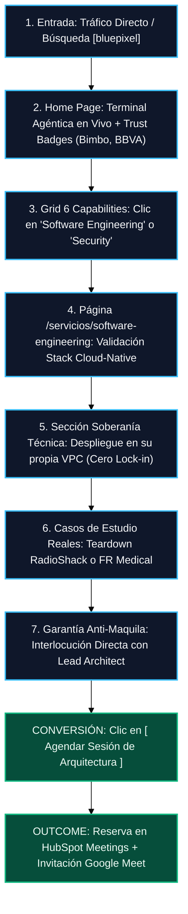

# 🗺️ Sitemap Visual Maestro y Flujos

Este diagrama es la fuente oficial para la estructura del sitio web de BluePixel.  
Contiene la arquitectura exacta de las páginas y la jerarquía de los 4 Pilares de Servicio.

*(Si deseas hacer zoom infinito o exportarlo como imagen, copia los bloques de código y pégalos en [Mermaid Live](https://mermaid.live/)).*

## 1. Arquitectura del Sitio Web (Sitemap)

```mermaid
%%{init: {'theme': 'base', 'themeVariables': { 'fontSize': '16px'}}}%%
graph TD
    classDef root fill:#050a19,stroke:#38bdf8,stroke-width:3px,color:#fff;
    classDef proto fill:#0f172a,stroke:#94a3b8,stroke-width:2px,color:#e2e8f0;
    classDef pub fill:#0c4a6e,stroke:#0284c7,stroke-width:2px,color:#f0f9ff;
    classDef pilar fill:#1e1b4b,stroke:#818cf8,stroke-width:2px,color:#e0e7ff;
    classDef cap fill:#172554,stroke:#3b82f6,stroke-width:2px,color:#eff6ff;
    classDef sem fill:#451a03,stroke:#f97316,stroke-width:2px,color:#fff7ed;
    classDef blog fill:#064e3b,stroke:#10b981,stroke-width:2px,color:#ecfdf5;
    classDef legal fill:#312e81,stroke:#a5b4fc,stroke-width:2px,color:#e0e7ff;

    BP["🌐 bluepixel.mx<br/>(Home Page & Dominio Principal)"]:::root

    %% Nivel 0
    BP --> N0["🤖 Nivel 0: Protocolos AI"]:::proto
    N0 --> R1["/robots.txt"]:::proto
    N0 --> R2["/sitemap.xml"]:::proto
    N0 --> R3["/llms.txt"]:::proto

    %% Nivel 1 (Público)
    BP --> N1["🏛️ Nivel 1: Ecosistema Principal"]:::pub
    
    N1 --> P["/pilares (4 Formas de Trabajar)"]:::pilar
    P --> P1["/pilares/consultoria-digital"]:::pilar
    P --> P2["/pilares/agentes-automatizacion"]:::pilar
    P --> P3["/pilares/plataformas-digitales"]:::pilar
    P --> P4["/pilares/evolucion-digital"]:::pilar

    N1 --> S["/servicios (6 Capabilities)"]:::cap
    S --> S1["/servicios/ux-ui-product-strategy"]:::cap
    S --> S2["/servicios/software-engineering"]:::cap
    S --> S3["/servicios/agentic-ai-automation"]:::cap
    S --> S4["/servicios/data-analytics"]:::cap
    S --> S5["/servicios/security-reliability"]:::cap
    S --> S6["/servicios/digital-consulting"]:::cap

    N1 --> B["/blueprints (Casos Técnicos)"]:::pub
    N1 --> C["/casos-de-estudio (Evidence Hub)"]:::pub
    N1 --> M["/metodologia-impath"]:::pub
    N1 --> N["/nosotros"]:::pub
    N1 --> CT["/contacto"]:::pub

    %% Nivel 2 (Pauta)
    BP --> N2["🎯 Nivel 2: Landings Pauta (/lp/)"]:::sem
    N2 --> LP1["/lp/desarrollo-apps-enterprise"]:::sem
    N2 --> LP2["/lp/automatizacion-procesos-erp"]:::sem
    N2 --> LP3["/lp/agentes-ia-produccion"]:::sem

    %% Nivel 3 (Blog)
    BP --> N3["📚 Nivel 3: Blog Histórico"]:::blog
    N3 --> BL1["/es/blog/*"]:::blog
    N3 --> BL2["/post/*"]:::blog

    %% Nivel 4 (Legal)
    BP --> N4["⚖️ Nivel 4: Legal"]:::legal
    N4 --> L1["/privacidad"]:::legal
    N4 --> L2["/terminos"]:::legal
```

---

## 2. Diagrama de Flujo Técnico (CTO / VP de Ingeniería)

Este flujo mapea cómo debe navegar un perfil técnico buscando seguridad y arquitectura dentro del nuevo sitio web para llegar a la conversión (agendar junta).

