# 🗺️ SITEMAP ACTUAL DEL SITIO NUEVO Y ANÁLISIS DE BRECHAS vs. ESTRATEGIA
## Levantamiento del código de `bluepixel-app` contra el Sitemap Maestro 2026

> **Fecha de levantamiento:** 24 de septiembre de 2026
> **Fuente analizada:** `03_Prototipos_y_Codigo/Componentes_Nueva_Web/bluepixel-app/src` (enrutamiento en `App.jsx`, `Navbar.jsx`, `Footer.jsx`, secciones y datos).
> **Referencia estratégica:** `AGENTS.md` y `02_Estrategia_B2B/SITEMAP_MAESTRO_Y_ARQUITECTURA_WEB_BLUEPIXEL_2026.md`.
> **Alcance:** el sitio nuevo en React. El sitio vivo en Webflow (`bluepixel.mx`) no se volvió a verificar en esta revisión; lo que se menciona de él proviene de `hallazgos/lee_auditoria-web.md` (15-sep-2026).

---

## 1. RESUMEN EJECUTIVO

* **El sitio nuevo tiene 19 vistas** (Home, 4 pilares, hub + 6 capacidades, casos, filosofía FutureProof, showroom, 3 clusters heredados y 404). El Sitemap Maestro define **41 URLs propias** (sin contar las 164 del blog), de las cuales hoy existen 14 con algún equivalente. **Cobertura: ~34 %.**
* **Lo que está resuelto:** los 4 Pilares y las 6 Capacidades existen como páginas completas y están enlazados desde Navbar, Footer y Home. Es el núcleo comercial y está bien cubierto.
* **Lo que falta es todo lo que convierte y todo lo que indexa:** no hay `/contacto`, `/gracias`, `/privacidad`, `/terminos`, ni landings de pauta `/lp/*`, ni `/nosotros`, ni `/blueprints`, ni páginas individuales de casos, ni `robots.txt` / `sitemap.xml` / `llms.txt`.
* **Bloqueador estructural:** el enrutamiento es por hash (`#/servicios`). Para Google y los crawlers de LLMs todo el sitio es **una sola URL** (`/`) con un `<div id="root">` vacío. Ninguna página nueva que se cree podrá indexarse ni recibir pauta con Quality Score alto hasta migrar a rutas reales con prerender/SSG (Mandato §6.3 del Sitemap Maestro).
* **Hay un enlace roto en el CTA principal:** "Diagnóstico" del Hero y del FinalCTA apunta a `#/diagnostico`, ruta que el manejador de hash no reconoce; el clic no hace nada.

---

## 2. SITEMAP ACTUAL (LO QUE EXISTE HOY EN EL CÓDIGO)

### 2.1 Diagrama

```mermaid
graph TD
    classDef ok fill:#064e3b,stroke:#10b981,color:#ecfdf5;
    classDef warn fill:#451a03,stroke:#f97316,color:#fff7ed;
    classDef dead fill:#450a0a,stroke:#ef4444,color:#fef2f2;
    classDef internal fill:#1e1b4b,stroke:#818cf8,color:#e0e7ff;

    ROOT["#/ Home"]:::ok

    ROOT --> P["Pilares (sin hub propio:<br/>#/pilares hace scroll en Home)"]:::warn
    P --> P1["#/consultoria-tecnologica<br/>Pilar 01 · Consultoría Digital"]:::ok
    P --> P2["#/automatizacion-agentica<br/>Pilar 02 · Agentes & Automatización"]:::ok
    P --> P3["#/producto-digital<br/>Pilar 03 · Plataformas Digitales"]:::ok
    P --> P4["#/evolucion-digital<br/>Pilar 04 · Evolución Digital"]:::ok

    ROOT --> S["#/servicios<br/>Hub 6 Capacidades"]:::ok
    S --> S1["#/servicio/ux-ui"]:::ok
    S --> S2["#/servicio/ai-engineering<br/>(= Software Engineering)"]:::ok
    S --> S3["#/servicio/ai-agents<br/>(= IA & Automatización)"]:::ok
    S --> S4["#/servicio/data-analytics"]:::ok
    S --> S5["#/servicio/security"]:::ok
    S --> S6["#/servicio/business-ai<br/>(= Digital Consulting)"]:::ok

    ROOT --> C["#/casos-de-exito<br/>Hub con modales, sin URL por caso"]:::ok
    ROOT --> F["#/filosofia-futureproof<br/>(solo desde banner del Home)"]:::ok
    ROOT --> SH["#/componentes<br/>Showroom interno (en Navbar público)"]:::internal

    ROOT --> CL["Clusters heredados (huérfanos)"]:::warn
    CL --> CL1["#/apps"]:::warn
    CL --> CL2["#/automatizacion"]:::warn
    CL --> CL3["#/agentizacion"]:::warn

    ROOT --> D["#/diagnostico<br/>CTA del Hero y FinalCTA — ROTO"]:::dead
    ROOT --> E["404 genérico"]:::ok
    ROOT --> M["Modal global de contacto<br/>(formulario sin envío real)"]:::warn
```



### 2.2 Árbol textual

```
bluepixel-app (hash routing, una sola URL real: /)
│
├── #/                              Home
│   └── Secciones: Hero + Prompt, Social Proof, 4 Formas de Trabajar, 6 Capacidades,
│       Trust Badges, Industrias, IMPATH, Casos, FAQ, Engineering Leadership,
│       SLA post-contacto, Banner FutureProof, CTA final, Footer
│
├── PILARES (4 formas de trabajar)
│   ├── #/consultoria-tecnologica   Pilar 01 · Consultoría Digital       (alias: consultoria-digital, pilar/consultoria-digital)
│   ├── #/automatizacion-agentica   Pilar 02 · Agentes & Automatización  (alias: agentes-automatizacion, pilar/agentes-automatizacion)
│   ├── #/producto-digital          Pilar 03 · Plataformas Digitales     (alias: plataformas-digitales, pilar/plataformas-digitales)
│   └── #/evolucion-digital         Pilar 04 · Evolución Digital         (alias: pilar/evolucion-digital)
│
├── CAPACIDADES
│   ├── #/servicios                 Hub de las 6 capacidades
│   ├── #/servicio/ux-ui            UX/UI & PS
│   ├── #/servicio/ai-engineering   Software Engineering
│   ├── #/servicio/ai-agents        IA & Automatización
│   ├── #/servicio/data-analytics   Data & Analytics
│   ├── #/servicio/security         Security & Reliability
│   └── #/servicio/business-ai      Digital Consulting
│
├── EVIDENCIA Y TESIS
│   ├── #/casos-de-exito            Hub filtrable: LifeMiles, Grupo Bimbo, RadioShack, IQOS, Stadibox (modal por caso)
│   └── #/filosofia-futureproof     Filosofía FutureProof
│
├── INTERNO
│   └── #/componentes               Showroom de prototipos (enlazado en Navbar y Footer públicos)
│
├── HEREDADO (modelo de 3 clusters, sin enlaces de entrada)
│   ├── #/apps
│   ├── #/automatizacion
│   └── #/agentizacion
│
├── ESTÁTICOS SUELTOS en /public/landings/ (sin enlace desde la app, sin noindex)
│   ├── index.html                  "Blueprint Library"
│   ├── finance_matcher.html        Conciliador autónomo
│   ├── erp_bridge.html             ERP Bridge
│   ├── legal_onboarding.html       Legal & Compliance Onboarding
│   ├── triage_rag.html             Triage RAG
│   ├── rfp_analyst.html            RFP & Tender Analyst
│   ├── apa.html                    Agentic Process Automation
│   ├── aoc.html                    Agentic Operations Center
│   ├── data_privacy.html           Data Privacy Anonymizer
│   ├── hr_recruiter.html           HR Autonomous Recruiter
│   └── smart_ads.html              Smart Ads Optimizer
│
└── ERRORES
    ├── #/diagnostico               ROTO: enlazado desde Hero y FinalCTA, no reconocido por el router
    └── (cualquier otra)            404 con salida a Inicio / Servicios
```

### 2.3 Inventario ruta por ruta

| Ruta actual | Componente | Enlazada desde | Estado |
| :--- | :--- | :--- | :--- |
| `#/` | Home (en `App.jsx`) | Logo, breadcrumbs | ✅ Operativa |
| `#/consultoria-tecnologica` | `ConsultoriaPilarPage` | Navbar, Footer, FourWaysToWork | ✅ Operativa · slug no canónico |
| `#/automatizacion-agentica` | `AutomatizacionPilarPage` | Navbar, Footer, FourWaysToWork | ✅ Operativa · slug no canónico |
| `#/producto-digital` | `PlataformasPilarPage` | Navbar, Footer, FourWaysToWork | ✅ Operativa · slug no canónico |
| `#/evolucion-digital` | `EvolucionPilarPage` | Navbar, Footer, FourWaysToWork | ✅ Operativa |
| `#/pilares` | — | HomeDirectorySection (no renderizada) | ⚠️ Hace scroll en Home; `PilaresLandingPage` es inalcanzable |
| `#/servicios` | `ServiciosLandingPage` | Navbar, Footer, plantillas de servicio | ✅ Operativa |
| `#/servicio/*` (6) | `ServiceLandingTemplate` + datos | Navbar, Footer, SixCapabilitiesGrid | ✅ Operativas · slugs no canónicos |
| `#/casos-de-exito` | `CasosEstudioLandingPage` | Navbar, Footer, Hero, Industrias | ✅ Operativa · sin URL por caso |
| `#/filosofia-futureproof` | `FutureproofLandingPage` | Solo `FutureproofCTABanner` | ⚠️ Poco enlazada (no está en Navbar ni Footer) |
| `#/componentes` | `ComponentShowcasePage` | Navbar, Footer | ⚠️ Herramienta interna expuesta al público |
| `#/apps`, `#/automatizacion`, `#/agentizacion` | `ClusterLandingPage` | Solo entre sí | ⚠️ Huérfanas; modelo de 3 clusters superado por los 4 Pilares |
| `#/diagnostico` | `ConsultoriaLandingPage` (en el render) | Hero, FinalCTA | ❌ Rota: falta en la lista `validViews` del router |

### 2.4 Activos construidos que no se usan

* **Componentes nunca renderizados:** `ComoTrabajamosLandingPage`, `PilaresLandingPage` (inalcanzable), `HomeDirectorySection`, `ThreeClustersOverview`, `ThreeWaysToWork` / `ThreeWaysToWorkEN`, `FourWaysToWorkEN`, `WorkflowTeardown`, `AgenticTechStack`, `TechnicalSovereignty` (en reserva por decisión, ver AGENTS.md §6.5), `LeadMagnetSection` (retirado).
* **11 landings HTML estáticas** en `public/landings/` que corresponden casi 1:1 al concepto `/blueprints/*` de la estrategia, pero no están enlazadas, no tienen `noindex` y cargan GTM con ID de marcador (`GTM-XXXXXXX`).

---

## 3. BRECHAS vs. ESTRATEGIA: PÁGINAS QUE FALTAN

Priorización:
* **P0:** sin esto no se puede recibir pauta, medir ni cumplir con la ley.
* **P1:** necesarias para los 9 flujos de conversión y para el posicionamiento anti-maquila.
* **P2:** amplían alcance o completan el sitemap.

### 3.1 Nivel 0 · Protocolos e indexación

| Página | Prioridad | Por qué falta y qué resuelve |
| :--- | :---: | :--- |
| **Rutas reales + prerender/SSG** (prerrequisito) | **P0** | Con hash routing, ninguna página existe para Google ni para GPTBot/ClaudeBot/PerplexityBot. Todo lo demás de esta sección depende de esto. |
| `/robots.txt` | P0 | Reglas para Googlebot y bots de IA; bloqueo de `/lp/*` y `/gracias`. |
| `/sitemap.xml` | P0 | Envío a Google Search Console y Bing Webmaster (fuente del índice de ChatGPT). |
| `/llms.txt` | P1 | Ontología de 4 Pilares + 6 Capacidades para citas en LLMs (Dimensión AEO §1.3). |

### 3.2 Nivel 1 · Ecosistema público

| Página | Prioridad | Estado actual | Qué falta |
| :--- | :---: | :--- | :--- |
| `/contacto` | **P0** | Solo modal global | Página propia con formulario de 3 pasos que **envíe a CRM** (hoy hace `console.log`), campo de **tamaño de empresa**, agenda de 30 min con Lead Architect, **WhatsApp corporativo +52** (hoy no hay ningún enlace de WhatsApp en el sitio) y captura de `gclid`/UTMs. |
| `/nosotros` | **P1** | No existe | Manifiesto anti-maquila, estructura del Squad Senior por roles (sin nombres personales), garantía de seniority. Es la parada clave del Flujo 3 (CEO/Board). `EngineeringLeadership` sirve de base. |
| `/blueprints` + 4 blueprints | **P1** | Material disperso en `public/landings/*.html` | Hub y páginas `conciliacion-financiera-erp`, `triage-documental-rag`, `onboarding-legal-kyc`, `sistemas-operativos-quirurgicos`. Es el antídoto al shock de precio y el destino de los Flujos 4 y 7. Reaprovechar `finance_matcher`, `triage_rag`, `legal_onboarding`. |
| `/casos-de-estudio/[caso]` | **P1** | Hub con modales, sin URL | Una página por caso para SEO y para compartir en ventas. **Falta FR Medical**, el caso insignia de los flujos (triage 1.8 s + ERP sync) y del Pilar 02. Tampoco están Morada Uno ni Pakke, que sí aparecen en la estrategia. |
| `/pilares` (hub) | P1 | Componente existe pero es inalcanzable | Habilitar la vista en el router en lugar de redirigir al scroll del Home. |
| `/metodologia-impath` | P2 | Existe como `#/filosofia-futureproof` | Definir el slug canónico (el Sitemap Maestro usa `/metodologia-impath`) y enlazarla en Navbar/Footer. |

### 3.3 Nivel 2 · Landings de pauta (`/lp/*`, noindex, sin menú de fuga)

Ninguna existe en la app. Son el destino obligatorio de toda la pauta (§2 del Sitemap Maestro).

| Página | Prioridad | Campaña de origen | Pilar |
| :--- | :---: | :--- | :--- |
| `/lp/desarrollo-apps-enterprise` | **P0** | Google Search C1 · Apps & Plataformas | 03 |
| `/lp/automatizacion-procesos-erp` | **P0** | Google Search C2 · Automatización ERP | 02 |
| `/lp/agentes-ia-produccion` | **P0** | Google Search C3 · Agentes & MCP | 02 |
| `/lp/gracias-pauta` | **P0** | Disparo de conversión Google/LinkedIn | — |
| `/lp/diagnostico-operativo-futureproof` | P1 | Retargeting multicanal | Agenda |
| `/lp/blueprint-conciliacion-financiera` | P2 | LinkedIn Document Ads · CFO | 01/02 |
| `/lp/blueprint-triage-quirurgico-operativo` | P2 | LinkedIn Document Ads · COO | 02 |
| `/lp/blueprint-onboarding-kyc-mcp` | P2 | LinkedIn Document Ads · CIO | 02 |

> Los clusters heredados (`#/apps`, `#/automatizacion`, `#/agentizacion`) ya tienen el enfoque por intención de búsqueda de C1, C2 y C3. Pueden servir como base de contenido para las tres `/lp/*` de Search, retirándoles la navegación.

### 3.4 Nivel 3 · Blog histórico

| Página | Prioridad | Qué falta |
| :--- | :---: | :--- |
| `/es/blog/*` (84) y `/post/*` (80) | **P0 al migrar** | No hay plan de servicio en la app nueva. Si el dominio se apunta a la app sin reverse proxy o preservación 1:1 de slugs, se pierden los 21 leads orgánicos mensuales y las citas en LLMs. No bloquea mientras Webflow siga sirviendo el dominio. |

### 3.5 Nivel 4 · Transaccional y legal

| Página | Prioridad | Por qué |
| :--- | :---: | :--- |
| `/privacidad` | **P0** | El formulario pide aceptar "la Política de Privacidad de BluePixel y la LFPDPPP", pero es un `<span>` sin enlace y el documento no existe en el sitio. Consentimiento sobre un aviso inaccesible. |
| `/gracias` | **P0** | Página de confirmación con URL propia para medir la conversión orgánica. Hoy solo hay un estado interno del modal. |
| `/terminos` | P1 | Condiciones de servicio enterprise. |

---

## 4. DISCREPANCIAS DE SLUGS Y NOMENCLATURA

Los slugs del código no coinciden con el Sitemap Maestro. Conviene fijar los canónicos **antes** de migrar a rutas reales, porque después cada cambio exige una redirección 301.

| Hoy en código | Canónico del Sitemap Maestro | Observación |
| :--- | :--- | :--- |
| `#/consultoria-tecnologica` | `/pilares/consultoria-digital` | "Tecnológica" contradice el nombre oficial del Pilar 01. |
| `#/automatizacion-agentica` | `/pilares/agentes-automatizacion` | Ya existe el alias, pero la navegación usa el slug viejo. |
| `#/producto-digital` | `/pilares/plataformas-digitales` | "Producto Digital" es nomenclatura previa al Pilar 03. |
| `#/evolucion-digital` | `/pilares/evolucion-digital` | Solo falta el prefijo. |
| `#/servicio/ux-ui` | `/servicios/ux-ui-product-strategy` | Singular vs. plural en el prefijo. |
| `#/servicio/ai-engineering` | `/servicios/software-engineering` | La página se titula Software Engineering; el slug dice AI Engineering. |
| `#/servicio/ai-agents` | `/servicios/agentic-ai-automation` | — |
| `#/servicio/data-analytics` | `/servicios/data-analytics` | Solo el prefijo. |
| `#/servicio/security` | `/servicios/security-reliability` | AGENTS.md §6.5 también la cita como `/servicio/security`; unificar. |
| `#/servicio/business-ai` | `/servicios/digital-consulting` | "Business AI" no es el nombre oficial de la capacidad 6. |
| `#/casos-de-exito` | `/casos-de-estudio` | — |
| `#/filosofia-futureproof` | `/metodologia-impath` | Decidir si es una página o dos (FutureProof ≠ IMPATH). |

Además, el hub de servicios agrupa las capacidades en "Apps & Producto / Automatización / Gobernanza IA" (`ServiceLandingTemplate.jsx:150-155`), una taxonomía de 3 grupos que no existe en AGENTS.md.

---

## 5. OTROS HALLAZGOS DEL LEVANTAMIENTO

1. **CTA principal roto:** `#/diagnostico` (Hero y FinalCTA) no está en `validViews` de `App.jsx`. Arreglo inmediato: agregarlo a la lista o apuntar el CTA a la ruta del Pilar 01.
2. **Showroom interno público:** `#/componentes` aparece en Navbar y Footer con indicador animado. Es una herramienta de trabajo; debería salir de la navegación pública.
3. **Footer sin datos de contacto:** no hay teléfono, correo, WhatsApp +52, LinkedIn ni enlaces legales.
4. **Sin instrumentación:** no hay `gclid`, UTMs, `dataLayer` ni `gtag` en la app React.
5. **Landings estáticas sin `noindex`:** los 11 HTML de `public/landings/` quedarían indexables al publicarse.

---

## 6. SECUENCIA RECOMENDADA

| Orden | Entregable | Justificación |
| :---: | :--- | :--- |
| 1 | Arreglar `#/diagnostico` y retirar `#/componentes` de la navegación | Cambios de minutos que ya afectan al visitante. |
| 2 | Fijar slugs canónicos (sección 4) y migrar a rutas reales con prerender + `robots.txt` + `sitemap.xml` | Prerrequisito de indexación y pauta; fijar slugs primero evita redirecciones posteriores. |
| 3 | `/contacto` con envío real a CRM, `/gracias`, `/privacidad`, `/terminos` | Sin esto cada lead se pierde y hay exposición legal LFPDPPP. |
| 4 | Las 3 `/lp/*` de Google Search + `/lp/gracias-pauta` | Habilitan las 3 macro-campañas. Base de contenido: clusters heredados. |
| 5 | `/nosotros`, `/casos-de-estudio/[caso]` (empezando por FR Medical), hub `/pilares` | Cierran los Flujos 1 y 3 (CTO y CEO). |
| 6 | `/blueprints` + 4 blueprints (reaprovechando `public/landings/`) y `/llms.txt` | Nurturing orgánico, antídoto al shock de precio y citas en LLMs. |
| 7 | `/lp/blueprint-*` de LinkedIn y `/lp/diagnostico-operativo-futureproof` | Pauta secundaria y retargeting. |
| 8 | Plan de blog 1:1 (reverse proxy o migración con slugs idénticos) | Obligatorio antes de apuntar el dominio a la app nueva. |
