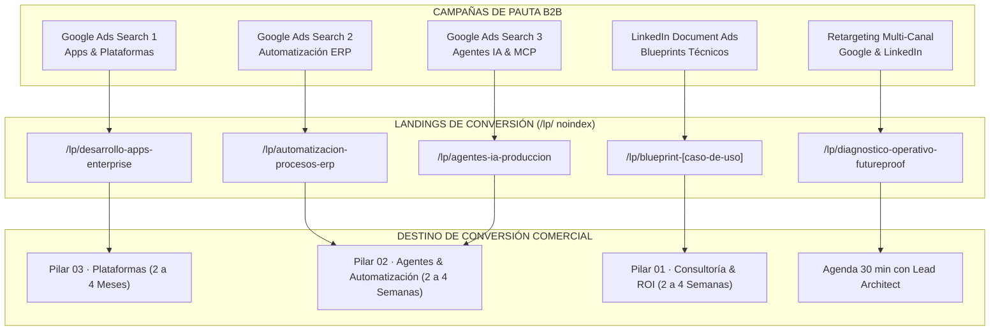
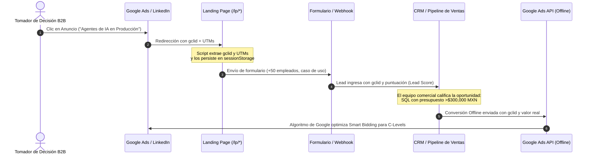
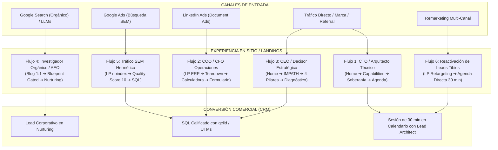

# 🌐 SITEMAP MAESTRO Y ARQUITECTURA DE INFORMACIÓN WEB BLUEPIXEL 2026
## Guía Canónica de Navegación, SEO B2B, AEO (Motores de IA), Campañas Pagadas (SEM) y Rutas de Conversión

> **PROPÓSITO DE ESTE DOCUMENTO:**  
> Este archivo constituye la fuente de verdad definitiva sobre la arquitectura de información, la estructura de URLs y los embudos de conversión para BluePixel. Resuelve el desfase histórico entre la capacidad técnica de la empresa (Ingeniería Deep Tech, Agentes Autónomos y Garantía FutureProof) y su presencia digital pública, con el objetivo directo de **elevar la tasa de cierre comercial (Win Rate) del 1:50 actual a 1:10**, proteger el 100% del tráfico orgánico y blindar las citas en modelos de Inteligencia Artificial (ChatGPT, Perplexity, Claude).

---

## 📑 ÍNDICE GENERAL

1. [Justificación Multidimensional de la Arquitectura](#1-justificación-multidimensional-de-la-arquitectura)
   - 1.1. Dimensión Comercial y Modelo de Negocio (Los 4 Pilares)
   - 1.2. Dimensión de Ventas y Pipeline B2B (Atribución y Calificación)
   - 1.3. Dimensión SEO, AEO y GEO (Preservación del Tráfico y Citas en LLMs)
   - 1.4. Dimensión de Imagen, Posicionamiento y Tesis de Marca (Anti-Maquila)
   - 1.5. Dimensión Técnica, Soberanía de Datos y Cumplimiento
2. [La Dimensión de Campañas Pagadas (Google Ads & LinkedIn B2B)](#2-la-dimensión-de-campañas-pagadas-google-ads--linkedin-b2b)
   - 2.1. Las 3 Macro-Campañas de Demanda Real B2B
   - 2.2. Filtro de Exclusión y Lista Negativa Anti-PyME
   - 2.3. Anatomía de Alta Conversión de una Landing SEM (`/lp/*`)
3. [El Sitemap Maestro de BluePixel (Árbol Completo de URLs)](#3-el-sitemap-maestro-de-bluepixel-árbol-completo-de-urls)
   - 3.1. Nivel 0: Protocolos y Motores de Búsqueda
   - 3.2. Nivel 1: Ecosistema Público Institucional e Indexable
   - 3.3. Nivel 2: Landings de Pauta Privadas (`/lp/*` noindex)
   - 3.4. Nivel 3: Hub de Conocimiento Orgánico y Citas en LLMs (Blog 1:1)
   - 3.5. Nivel 4: Páginas Transaccionales, Confirmación y Legales
4. [Matriz Estratégica URL por URL: Audiencia, Intención y CTA](#4-matriz-estratégica-url-por-url-audiencia-intención-y-cta)
5. [Infraestructura Técnica de Atribución Cerrada (Closed-Loop)](#5-infraestructura-técnica-de-atribución-cerrada-closed-loop)
   - 5.1. Captura Nativa de `gclid` y Parámetros UTM
   - 5.2. Estructura de Eventos en Google Tag Manager (GTM)
   - 5.3. Importación de Conversiones Offline a Google Ads API
6. [Protocolo de Migración Webflow ➔ Producción y Mitigación de Riesgos](#6-protocolo-de-migración-webflow-➔-producción-y-mitigación-de-riesgos)
   - 6.1. Regla de Oro del Blog y Cero Rotura de Enlaces
   - 6.2. Cierre y Redirección 301 de `cotiza.bluepixel.mx`
   - 6.3. Requisito de Static Site Generation (SSG) / Prerender
7. [Mapeo Maestro de Flujos de Navegación (User Journeys & Conversion Paths)](#7-mapeo-maestro-de-flujos-de-navegación-user-journeys--conversion-paths)
   - 7.1. Flujo 1: CTO / VP de Ingeniería (Buyer Técnico · Solvencia y Arquitectura)
   - 7.2. Flujo 2: COO / CFO / Director de Operaciones (Buyer de Eficiencia · Dolor ERP & ROI)
   - 7.3. Flujo 3: CEO / Board / Director General (Buyer Estratégico · Riesgo & Certeza)
   - 7.4. Flujo 4: Investigador Técnico / Nurturing (Blog Orgánico & Citas en LLMs)
   - 7.5. Flujo 5: Tráfico de Pauta SEM de Alta Conversión (Google Ads ➔ Landing Hermética)
   - 7.6. Flujo 6: Retargeting Multi-Canal y Reactivación de Leads Tibios (Agenda Directa)
   - 7.7. Matriz de Fricciones y Elementos de Transición por Paso de Flujo
8. [Resumen de Impacto Operativo y Comercial](#8-resumen-de-impacto-operativo-y-comercial)

---

## 🧭 1. JUSTIFICACIÓN MULTIDIMENSIONAL DE LA ARQUITECTURA

```
┌────────────────────────────────────────────────────────────────────────────────────────────────────────┐
│                                JUSTIFICACIÓN MULTIDIMENSIONAL DEL SITEMAP                              │
├───────────────────┬───────────────────┬──────────────────────┬───────────────────┬─────────────────────┤
│ 💼 COMERCIAL      │ 🎯 VENTAS         │ 🔍 SEO & AEO (LLMs)  │ 🛡️ IMAGEN & MARCA │ ⚙️ TÉCNICA          │
│ 4 Pilares         │ Captura gclid     │ Preservar 164 URLs   │ Anti-Maquila      │ Soberanía           │
│ modulares sin     │ + UTMs, agenda    │ blog, llms.txt,      │ UX = Armadura     │ VPC privada,        │
│ shock de $25k USD │ directa y routing │ sitemap a Bing       │ de Adopción       │ ISO 27001 & OWASP   │
└───────────────────┴───────────────────┴──────────────────────┴───────────────────┴─────────────────────┘
```

### 1.1. Dimensión Comercial y Modelo de Negocio (Los 4 Pilares)
* **Eliminación del "Shock de Precio" en Frío:**  
  Históricamente, un prospecto calificado que intentaba contactar a BluePixel se encontraba con un selector de presupuesto cuyo escalón más bajo era `$25,000 USD` (~$460,000 MXN). Esto provocaba el rechazo de tomadores de decisión corporativos que deseaban probar capacidades con un proyecto piloto acotado.
* **4 Formas Modulares e Independientes de Colaboración:**  
  La arquitectura de información NO presenta los servicios como fases obligatorias de un ciclo lineal cerrado. Un cliente puede ingresar directamente por cualquiera de las 4 modalidades:
  - **Pilar 01 · Consultoría Digital (2 a 4 semanas):** Diagnóstico de fricción operativa IMPATH™, cálculo de ROI proyectado y estimación del costo de inacción antes de comprometer capital en desarrollo ($5K–$8K USD).
  - **Pilar 02 · Agentes & Automatización (2 a 4 semanas):** Despliegue de agentes autónomos y RAG determinístico integrado al ERP/CRM actual (SAP, Salesforce) vía protocolo MCP sin reemplazar su infraestructura previa.
  - **Pilar 03 · Plataformas Digitales (2 a 4 meses):** Construcción y lanzamiento desde cero de MVPs corporativos y plataformas escalables con UX validado y SLA 99.9%.
  - **Pilar 04 · Evolución Digital (Roadmap vivo 6 a 12 meses):** Squad extendido dedicado (Tech Lead, AI Engineer, Senior Full Stack, UX/CRO Specialist) para optimización continua, reducción de deuda técnica y monitoreo del UX Health Score™.

### 1.2. Dimensión de Ventas y Pipeline B2B (Atribución y Calificación)
* **Trifecta de Conversión según Temperatura del Prospecto:**
  1. **High-Intent / Decisor Técnico con Dolor Urgente:** Enlace directo a agenda técnica de 30 minutos (HubSpot Meetings / Calendly) para un escaneo preliminar con un Lead Architect.
  2. **Qualified Lead / Evaluación de Proveedores:** Formulario progresivo en 3 pasos (Tú / Tu Empresa / Tu Flujo) que solicita obligatoriamente el **tamaño de empresa** (indispensable para el Lead Scoring de 100 puntos de BluePixel) y el caso de uso.
  3. **Research Lead / Nurturing a Mediano Plazo:** Descarga de Blueprints de Arquitectura técnica en PDF a cambio de correo corporativo para alimentar flujos de maduración a 90 días.
* **Canal Local Determinístico:**  
  Eliminación de números de WhatsApp con prefijos internacionales confusos (+1 510) y sustitución por canal oficial corporativo en México (+52).

### 1.3. Dimensión SEO, AEO y GEO (Preservación del Tráfico y Citas en LLMs)
* **Protección del Núcleo de Tráfico Orgánico (Regla de las 257 URLs):**  
  La auditoría técnica reveló que el dominio principal cuenta con 257 URLs indexadas en Webflow, de las cuales **164 URLs pertenecen al Blog** (80 en `/post/` y 84 en `/es/blog/`). **Este contenido genera el 100% de los 21 leads orgánicos mensuales y el 100% de las citas en ChatGPT, Perplexity y Claude.**  
  *Mandato:* Los slugs del blog se mantienen idénticos, garantizando indexación continua y evitando migraciones a ciegas que destruyan el posicionamiento.
* **Optimización para Motores de Inteligencia Artificial (AEO):**  
  - Creación de `/llms.txt` para proveer a los bots de IA (GPTBot, ClaudeBot, PerplexityBot) una ontología estructurada y veraz de los servicios de BluePixel.
  - Sincronización del `sitemap.xml` con **Bing Webmaster Tools**, plataforma primaria que alimenta el índice de búsqueda de ChatGPT (62.6% del tráfico referido por IA en B2B).
  - Marcado estructurado Schema.org en JSON-LD: `Organization`, `Service`, `TechArticle` y `FAQPage`.

### 1.4. Dimensión de Imagen, Posicionamiento y Tesis de Marca (Anti-Maquila)
* **Desactivación del Sesgo de "Fábrica de Pantallitas":**  
  Retiro de insignias decorativas (como *"#1 UX/UI Company by DesignRush"*) que atraían proyectos de $20,000 a $40,000 MXN y proyectaban a BluePixel como un taller visual superficial ante directores de tecnología.
* **La Ventaja Injusta de BluePixel:**  
  El diseño UX conductual y la Product Strategy (PS) bajo metodología **IMPATH™** se posicionan como la **armadura de adopción humana** de arquitecturas de ingeniería pesada:  
  *«Las consultoras puras de IA desarrollan algoritmos potentes pero interfaces toscas que el 70% de los usuarios abandona; las fábricas de software facturan horas a ciegas; BluePixel entrega ingeniería grado enterprise con el 95% de adopción garantizada.»*
* **Seniority Técnico Directo (Garantía Anti-Maquila):**  
  Sección institucional enfocada en certidumbre de entrega: cada proyecto está supervisado directamente por un *Lead Architect* con experiencia probada en arquitecturas enterprise, erradicando el modelo de las fábricas tradicionales que facturan juniors como seniors. Interlocución técnica directa y cero intermediarios comerciales en las sesiones de arquitectura.

### 1.5. Dimensión Técnica, Soberanía de Datos y Cumplimiento
* **Soberanía Técnica y Cero Lock-In:**  
  Páginas especializadas que explican la arquitectura basada en protocolos abiertos (**MCP**), despliegue exclusivo en la nube privada del cliente (AWS, Azure o GCP en su propia VPC) y propiedad total del código y la IP desde el primer release.
* **Blindaje Corporativo:**  
  Acreditación de estándares internacionales alineados con **ISO 27001**, mitigación de vulnerabilidades de **OWASP Top 10** y estricto apego a la regulación de protección de datos personales (**LFPDPPP**).

---

## 🎯 2. LA DIMENSIÓN DE CAMPAÑAS PAGADAS (GOOGLE ADS & LINKEDIN B2B)

El tráfico pagado **no debe aterrizar en páginas generales de navegación**, ya que los menús de fuga y los textos extensos provocan tasas de rebote elevadas y desperdicio presupuestal. Las campañas pagadas se canalizan exclusivamente a **Landing Pages Dedicadas (`/lp/*`) con directiva `noindex, nofollow`**.



### 2.1. Las 3 Macro-Campañas de Demanda Real B2B
Se colapsan las micro-campañas ineficientes en 3 grandes grupos de demanda con ticket superior a $300,000 MXN:

1. **Campaña 1: Desarrollo de Apps & Plataformas Digitales (Pilar 03)**
   - *Intención:* Búsquedas de software a la medida, plataformas web escalables y apps móviles de misión crítica sin deuda técnica.
   - *Keywords Core:* `[desarrollo de apps empresariales]`, `[desarrollo de software a la medida mexico]`, `"empresa desarrollo plataformas cloud"`, `[modernizacion de sistemas legacy]`.
   - *Destino SEM:* `/lp/desarrollo-apps-enterprise`.
2. **Campaña 2: Automatización de Procesos & Conectividad ERP (Pilar 02)**
   - *Intención:* COOs y CFOs buscando eliminar tareas manuales en Excel, conciliaciones contables y desconexión entre sistemas.
   - *Keywords Core:* `[automatizacion de procesos empresariales]`, `[automatizacion sap mexico]`, `"integracion erp y crm a la medida"`, `[software de conciliacion automatica]`.
   - *Destino SEM:* `/lp/automatizacion-procesos-erp`.
3. **Campaña 3: Agentización & Agentes de IA en Producción (Pilar 02 / MCP)**
   - *Intención:* CTOs y CIOs que requieren agentes autónomos seguros, RAG sin alucinaciones y ejecución determinística sobre bases corporativas.
   - *Keywords Core:* `[agentes de inteligencia artificial para empresas]`, `[agentes autonomos produccion]`, `"model context protocol mexico"`, `[implementacion rag empresarial]`.
   - *Destino SEM:* `/lp/agentes-ia-produccion`.
4. **Campaña 4 (Defensiva de Marca): Brand Mínima**
   - *Presupuesto:* Reducción de $103,957 MXN a **$3,000 MXN mensuales** en concordancia exacta pura sobre `[bluepixel]`, `[blue pixel]`, `[bluepixel mx]`, liberando más del 50% del capital para adquisición incremental.

### 2.2. Filtro de Exclusión y Lista Negativa Anti-PyME
Para evitar tráfico sin presupuesto (<$300,000 MXN) o con intención no comercial, se carga a nivel de cuenta la siguiente lista de negativas:
* **Bajo Presupuesto / Gratis:** *gratis, free, economico, barato, bajo costo, cotizador casero, software libre, open source gratis*.
* **Académico / Estudiantes:** *curso, tutorial, diplomado, certificacion, que es, tareas, tesis, definicion, wikipedia*.
* **Búsqueda Laboral / Freelance:** *vacantes, sueldo, empleo, bolsa de trabajo, contratacion jr, freelancer, fiverr, workana, figma gratis*.
* **Herramientas No-Code B2C:** *make gratis, zapier tutorial, botpress basico, chatgpt gratis, app creator gratis*.

### 2.3. Anatomía de Alta Conversión de una Landing SEM (`/lp/*`)
Cada landing de pauta está optimizada para alcanzar un **Quality Score de 9 a 10 en Google Ads**:
* **Navegación Hermética (Leak-Proof):** Sin barra de menú desplegable ni enlaces externos hacia el blog. Únicamente logotipo corporativo, enlace directo a WhatsApp B2B y formulario de contacto.
* **Message Match Estricto:** El título H1 replica de forma idéntica la promesa del anuncio.
* **Teardown Visual:** Comparativa gráfica entre el proceso manual ineficiente y la solución arquitectónica implementada.
* **Filtro de Tamaño de Empresa en Formulario:** Inclusión obligatoria del selector de colaboradores (`10-50`, `50-200`, `200+`) para activar la micro-conversión de valor en Google Ads (*"+50 empleados = Lead Calificado"*).
* **Compromiso SLA Visible:** NDA bilateral en minuto 0, auditoría en 24 horas y contacto directo con un Lead Architect senior.

---

## 🗺️ 3. EL SITEMAP MAESTRO DE BLUEPIXEL (ÁRBOL COMPLETO DE URLs)

```
bluepixel.mx/
│
├── [NIVEL 0: PROTOCOLOS & INFRAESTRUCTURA DE BÚSQUEDA]
│   ├── /robots.txt                        [Reglas para Googlebot, GPTBot, ClaudeBot, PerplexityBot]
│   ├── /sitemap.xml                       [Índice XML sincronizado con Google y Bing Webmaster Tools]
│   └── /llms.txt                          [Ontología técnica oficial y catálogo de servicios para LLMs]
│
├── [NIVEL 1: ECOSISTEMA PÚBLICO INSTITUCIONAL (INDEXABLE)]
│   │
│   ├── / (Home Page)
│   │   ├── Rol: Posicionamiento como Consultora de Ingeniería Agéntica + UX de Adopción + FutureProof.
│   │   ├── Secciones Clave: Hero con Terminal Agéntica, Trust Badges B2B (Bimbo, BBVA, Cemex),
│   │   │   The Enterprise AI Reality, Grid de 4 Pilares, Soberanía Técnica, 6 Capacidades,
│   │   │   Casos de Estudio, Garantía de Seniority (Lead Architects), FAQ Battlecard Corporativa y Formulario Calificado.
│   │   └── Conversión: Solicitud de Diagnóstico Operativo / Agenda Técnica.
│   │
│   ├── /pilares (Los 4 Pilares de Contratación)
│   │   ├── Rol: Presentación de las 4 modalidades modulares de contratación.
│   │   ├── Sub-páginas Dedicadas (Landings de Profundidad con Teardown y Widgets):
│   │   │   ├── /pilares/consultoria-digital
│   │   │   │   └── Plazo: 2 a 4 Semanas · Foco: Diagnóstico IMPATH™, ROI proyectado y Costo de Inacción.
│   │   │   ├── /pilares/agentes-automatizacion
│   │   │   │   └── Plazo: 2 a 4 Semanas · Foco: Flujos agénticos RAG sobre stack actual (SAP/Salesforce) vía MCP.
│   │   │   ├── /pilares/plataformas-digitales
│   │   │   │   └── Plazo: 2 a 4 Meses · Foco: MVPs y plataformas enterprise de 0 a producción con UX validado.
│   │   │   └── /pilares/evolucion-digital
│   │   │       └── Plazo: Roadmap 6 a 12 Meses · Foco: Squad continuo, UX Health Score™ y CRO.
│   │
│   ├── /servicios (Las 6 Capacidades Técnicas de BluePixel)
│   │   ├── Rol: Mapeo de capacidades técnicas para CTOs, VPs de Ingeniería y Comités de Evaluación.
│   │   ├── Sub-páginas Dedicadas (SEO Técnico & Capabilities):
│   │   │   ├── /servicios/ux-ui-product-strategy
│   │   │   │   └── Foco: Psicología conductual, Product Strategy, IMPATH™, Design Systems, 95% adopción.
│   │   │   ├── /servicios/software-engineering
│   │   │   │   └── Foco: Arquitecturas Cloud-Native, microservicios, React/Node/Python, resiliencia.
│   │   │   ├── /servicios/agentic-ai-automation
│   │   │   │   └── Foco: Orquestación multi-agente, RAG corporativo privado, protocolo MCP, guardrails.
│   │   │   ├── /servicios/data-analytics
│   │   │   │   └── Foco: Telemetría Mixpanel, pipelines de datos en tiempo real, dashboards ejecutivos.
│   │   │   ├── /servicios/security-reliability
│   │   │   │   └── Foco: Prácticas ISO 27001, hardening OWASP Top 10, DevSecOps, SLA 99.9%.
│   │   │   └── /servicios/digital-consulting
│   │   │       └── Foco: Priorización de backlog por impacto financiero, business case, framework FutureProof.
│   │
│   ├── /blueprints (Catálogo Técnico de Soluciones & Casos de Uso)
│   │   ├── Rol: Biblioteca de soluciones operativas con especificaciones técnicas duras (SLA, tiempo, ROI).
│   │   │        Mecanismo antídoto al shock de precio de $25k USD.
│   │   ├── Casos de Uso Destacados:
│   │   │   ├── /blueprints/conciliacion-financiera-erp
│   │   │   │   └── Dolor: Cierre contable manual de facturas y pasarelas de pago con ERP (SAP/NetSuite).
│   │   │   ├── /blueprints/triage-documental-rag
│   │   │   │   └── Dolor: Lectura y validación de expedientes, contratos e imágenes de alta complejidad.
│   │   │   ├── /blueprints/onboarding-legal-kyc
│   │   │   │   └── Dolor: Fricción en validación de identidad y documentación de proveedores B2B.
│   │   │   └── /blueprints/sistemas-operativos-quirurgicos
│   │   │       └── Dolor: Triage crítico de insumos hospitalarios en <2 segundos sincronizado a inventario.
│   │   └── Conversión: Descarga de Blueprint en PDF (captura de email corporativo) o agenda de escaneo técnico.
│   │
│   ├── /casos-de-estudio (Evidence Hub & Resultados de Negocio)
│   │   ├── Rol: Evidencia empírica de ROI, adopción y despliegue productivo en grandes corporativos.
│   │   ├── Casos Emblemáticos:
│   │   │   ├── /casos-de-estudio/radioshack      [Plataforma E-commerce móvil de alta conversión en 3 meses]
│   │   │   ├── /casos-de-estudio/fr-medical      [Sistema Quirúrgico: Triage en 1.8s y ERP sync con Agentes]
│   │   │   ├── /casos-de-estudio/grupo-bimbo     [Diseño UX/UI de plataforma transaccional de alta escala]
│   │   │   ├── /casos-de-estudio/morada-uno      [Optimización de checkout y funnel transaccional con CRO]
│   │   │   └── /casos-de-estudio/pakke           [Plataforma logística y tracking de paquetería B2B]
│   │
│   ├── /metodologia-impath (Filosofía FutureProof: El Antídoto al Software Desechable)
│   │   ├── Rol: Tesis de diferenciación. Explica por qué el diseño conductual es la garantía de adopción
│   │   │        de la IA y cómo se audita la deuda técnica y operativa.
│   │   └── Secciones: 5 Principios FutureProof, Soberanía de Datos, Cero Vendor Lock-In, Metodología IMPATH™.
│   │
│   ├── /nosotros (Cultura de Ingeniería & Manifiesto Anti-Maquila)
│   │   ├── Rol: Construcción de confianza ejecutiva C-Level.
│   │   └── Secciones: El Manifiesto Anti-Maquila, Estructura del Squad de Ingeniería Senior,
│   │                  Garantía de Seniority (cero juniors facturados como seniors) y SLA de entrega.
│   │
│   └── /contacto (Centro de Conversión & Diagnóstico B2B)
│       ├── Rol: Captura calificada de leads de alto valor sin fricción económica previa.
│       ├── Componentes: Formulario calificador en 3 pasos, agenda embebida de 30 min, WhatsApp B2B (+52),
│       │               compromiso SLA público (NDA minuto 0) y captura transparente de gclid y UTMs.
│
├── [NIVEL 2: LANDING PAGES DE PAUTA PRIVADAS (/lp/) (NOINDEX, NOFOLLOW)]
│   │
│   ├── /lp/desarrollo-apps-enterprise
│   │   ├── Origen: Google Ads · Campaña 1 (Apps & Plataformas).
│   │   ├── Titular H1: "Tu Plataforma Digital Enterprise en Producción en 2 a 4 Meses con SLA 99.9%."
│   │   └── Oferta: Estimación Técnica de Arquitectura (Preselección: Pilar 03).
│   │
│   ├── /lp/automatizacion-procesos-erp
│   │   ├── Origen: Google Ads · Campaña 2 (Automatización & BPA).
│   │   ├── Titular H1: "Conecta tu ERP y Elimina el 80% de la Fricción Operativa sin Reemplazar tu Software."
│   │   └── Oferta: Diagnóstico de Fricción Operativa IMPATH™ (Preselección: Pilar 02).
│   │
│   ├── /lp/agentes-ia-produccion
│   │   ├── Origen: Google Ads · Campaña 3 (Agentización & MCP).
│   │   ├── Titular H1: "Agentes de IA Autónomos en Producción sobre tu Nube Privada y sin Alucinaciones."
│   │   └── Oferta: Blueprint de Viabilidad Agéntica en tu VPC (Preselección: Pilar 02).
│   │
│   ├── /lp/blueprint-conciliacion-financiera  [LinkedIn Document Ad · CFOs y Finanzas]
│   ├── /lp/blueprint-triage-quirurgico-operativo [LinkedIn Document Ad · COOs y Operaciones]
│   ├── /lp/blueprint-onboarding-kyc-mcp       [LinkedIn Document Ad · CIOs y Cumplimiento]
│   │
│   ├── /lp/diagnostico-operativo-futureproof
│   │   ├── Origen: Remarketing Multi-Canal (Google Display, LinkedIn, Meta).
│   │   ├── Titular H1: "30 Minutos con un Lead Architect. Cero Vendedores. Un Blueprint Técnico de tu Sistema."
│   │   └── Oferta: Reserva directa en calendario con Lead Architect.
│   │
│   └── /lp/gracias-pauta
│       ├── Función: Disparo de evento de conversión final (AW-CONVERSION_ID) e Insight Tag de LinkedIn.
│       └── Mensaje: "Solicitud recibida. NDA bilateral en camino y opción de agendar sesión inmediata."
│
├── [NIVEL 3: ASSET HISTÓRICO SEO & CITAS LLM (PRESERVACIÓN 1:1)]
│   │
│   ├── /es/blog/ (84 Artículos Canónicos en Español)
│   │   ├── Estado: PRESERVADO 1:1 (Fuente de los 21 leads orgánicos y citas en Perplexity, Claude y ChatGPT).
│   │   ├── Top URLs de Tráfico y Citas:
│   │   │   ├── /es/blog/diseno-ux-ui-que-es-guia
│   │   │   ├── /es/blog/10-ejemplos-de-interfaces-de-usuario-que-demuestran-como-un-buen-diseno-cambia-todo
│   │   │   ├── /es/blog/desarrollo-apps-moviles-cuanto-cuestan-como-hacerlas
│   │   │   ├── /es/blog/etapas-desarrollo-web
│   │   │   └── /es/blog/mejores-agencias-diseno-ux-ui-mexico
│   │   └── Optimización B2B: Banners contextuales hacia los 4 Pilares y Blueprints Técnicos.
│   │
│   └── /post/ (80 Artículos Canónicos en Inglés)
│       ├── Estado: Preservados con canonical y alternate hreflang apuntando a la versión correspondiente.
│       └── Top URLs:
│           ├── /post/user-interface-types-classification-characteristics-uses
│           └── /post/front-end-back-end-meaning-uses
│
└── [NIVEL 4: PÁGINAS TRANSACCIONALES, CONFIRMACIÓN Y LEGALES]
    ├── /gracias                           [Página de confirmación orgánica post-envío de formulario]
    ├── /privacidad                        [Aviso de Privacidad Integral conforme a LFPDPPP]
    └── /terminos                          [Términos y Condiciones de Servicio Enterprise]
```

---

## 📊 4. MATRIZ ESTRATÉGICA URL POR URL: AUDIENCIA, INTENCIÓN Y CTA

| Ruta Canónica | Tipo de Tráfico | Audiencia Objetivo | Dolor / Búsqueda Principal | Llamado a la Acción (CTA Principal) |
| :--- | :--- | :--- | :--- | :--- |
| **`/`** | Orgánico / Directo | C-Level General (CEO, CTO, COO) | Desfase entre software que no escala y diseño cosmético | Solicitar Diagnóstico Operativo (Pilar 01 o 02) |
| **`/pilares/consultoria-digital`** | SEO / Referral | CFO, Director de Innovación | Incertidumbre técnica y temor a quemar capital a ciegas | Diagnóstico de Fricción & ROI (2 a 4 sem) |
| **`/pilares/agentes-automatizacion`**| SEO / Referral | COO, CIO, Gerente Operaciones | Procesos manuales lentos en ERPs sin querer cambiar software | PoC Agéntica en VPC Privada (2 a 4 sem) |
| **`/pilares/plataformas-digitales`** | SEO / Referral | CTO, VP Producto, Founder | Desarrollo lento de MVPs con alta deuda técnica acumulada | Plataforma Lista en Producción (2 a 4 meses) |
| **`/pilares/evolucion-digital`**     | SEO / Nurturing | CTO, Director de Producto | Plataforma existente que se degrada o pierde conversión | Retainer Mensual de Squad Dedicado (6-12 m) |
| **`/servicios/agentic-ai-automation`**| SEO Orgánico | CTO, Arquitecto de Software | Riesgo de alucinaciones de LLMs y fuga de datos privados | Especificación de Arquitectura MCP |
| **`/servicios/security-reliability`** | SEO Orgánico | CISO, Oficial de Cumplimiento | Auditorías de seguridad y requerimiento de ISO 27001 / OWASP | Validación de Arquitectura Zero-Trust |
| **`/blueprints/*`**                  | Orgánico / Social | Directores de Área Operativa | Casos de uso concretos con SLA y tiempo medible | Descargar Blueprint en PDF / Agendar Sesión |
| **`/casos-de-estudio/radioshack`**   | Social / Ventas | Directores de Retail / E-Commerce | Baja conversión móvil y carritos abandonados | Conocer Arquitectura de Desacoplamiento |
| **`/lp/desarrollo-apps-enterprise`** | Google Ads (C1) | CTO, VP Producto B2B | "desarrollo de apps empresariales", "software a medida" | Solicitar Estimación Técnica (Pilar 03) |
| **`/lp/automatizacion-procesos-erp`**| Google Ads (C2) | COO, CFO, Operaciones | "automatizacion procesos erp sap", "integracion crm" | Solicitar Diagnóstico IMPATH™ (Pilar 02) |
| **`/lp/agentes-ia-produccion`**      | Google Ads (C3) | CIO, CTO, Directores TI | "agentes inteligencia artificial empresas", "rag privado" | Solicitar Blueprint en tu VPC (Pilar 02) |
| **`/lp/blueprint-[caso]`**           | LinkedIn Ads (C4)| C-Level Segmentado | Interés en benchmarking técnico de su industria | Descargar Blueprint Técnico en PDF |
| **`/lp/diagnostico-operativo`**      | Retargeting (C5)| Leads Tibios / Remarketing | Dudas de viabilidad tras visitar el sitio | Agendar 30 min con Lead Architect |

---

## 🔌 5. INFRAESTRUCTURA TÉCNICA DE ATRIBUCIÓN CERRADA (CLOSED-LOOP)

Para garantizar la optimización algorítmica de Google Ads y calcular el ROI exacto de la inversión de pauta, se implementa el siguiente circuito cerrado de datos:



### 5.1. Captura Nativa de `gclid` y Parámetros UTM
En cada landing page (`/lp/*`) y página pública, se integra un script ligero que detecta parámetros de URL:
```javascript
// Captura determinística de parámetros de atribución
(function() {
  const params = new URLSearchParams(window.location.search);
  const keys = ['gclid', 'utm_source', 'utm_medium', 'utm_campaign', 'utm_term', 'utm_content'];
  keys.forEach(key => {
    if (params.has(key)) {
      sessionStorage.setItem('bp_' + key, params.get(key));
    }
  });
})();
```
Al momento de enviar cualquier formulario, estos valores se adjuntan en campos ocultos invisibles para el usuario pero indispensables para el CRM.

### 5.2. Estructura de Eventos en Google Tag Manager (GTM)
Sustitución del ID genérico `GTM-XXXXXXX` por el contenedor oficial de producción, disparando los siguientes eventos de capa de datos (`dataLayer`):
* `lead_form_step1_completed`: Micro-conversión de inicio de formulario.
* `lead_form_submitted`: Conversión principal de formulario completado.
* `blueprint_downloaded`: Descarga de documento técnico desde LinkedIn Ads.
* `calendar_meeting_scheduled`: Agendamiento directo en HubSpot / Calendly.

### 5.3. Importación de Conversiones Offline a Google Ads API
Cuando el equipo comercial y de preventa técnica califique un prospecto como **SQL (Sales Qualified Lead)** o cierre un contrato de los Pilares 01, 02 o 03, el sistema envía un Webhook a la API de Google Ads con el `gclid`, la fecha y el valor monetario real. Esto entrena el Smart Bidding de Google para priorizar clics de tomadores de decisión reales y suprimir tráfico basura.

---

## 🛡️ 6. PROTOCOLO DE MIGRACIÓN WEBFLOW ➔ PRODUCCIÓN Y MITIGACIÓN DE RIESGOS

```
┌─────────────────────────────────────────────────────────────────────────────┐
│                      PROTOCOLO DE MIGRACIÓN SIN RIESGO                      │
├──────────────────────────────────────┬──────────────────────────────────────┤
│ 1. BLOG CONGELADO EN SUBDIRECTORIO   │ Las 164 URLs del blog se mantienen   │
│    O REVERSE PROXY                   │ con sus slugs canónicos exactos.     │
├──────────────────────────────────────┼──────────────────────────────────────┤
│ 2. CIERRE DE COTIZA.BLUEPIXEL.MX     │ 301 directos hacia las nuevas        │
│                                      │ landings de pilares y blueprints.    │
├──────────────────────────────────────┼──────────────────────────────────────┤
│ 3. PRERENDER / SSR PARA EL APP REACT │ Eliminación de SPA en blanco para    │
│                                      │ buscadores y crawlers de LLM.        │
├──────────────────────────────────────┼──────────────────────────────────────┤
│ 4. MAPEO 1:1 DE METADATOS Y BING     │ robots.txt, llms.txt y sitemap.xml   │
│    WEBMASTER TOOLS                   │ enviado a Bing para citas ChatGPT.   │
└──────────────────────────────────────┴──────────────────────────────────────┘
```

1. **Preservación Canónica del Blog (Cero 404s):**  
   Bajo ninguna circunstancia se deben modificar los slugs históricos de las 164 URLs del blog (`/es/blog/diseno-ux-ui-que-es-guia`, `/post/user-interface-types-classification-characteristics-uses`, etc.). Deben servirse mediante reverse proxy o subdirectorio prerenderizado. Si se alteran estos slugs, se apagan de inmediato los 21 leads orgánicos y las citas en ChatGPT, Perplexity y Claude.
2. **Cierre y Redirección 301 de `cotiza.bluepixel.mx`:**  
   Para evitar la canibalización y unificar la autoridad de dominio en `bluepixel.mx`, se ejecutan redirecciones 301 permanentes:
   - `cotiza.bluepixel.mx/desarrollo-web` ➔ `bluepixel.mx/servicios/software-engineering`
   - `cotiza.bluepixel.mx/desarrollo-apps` ➔ `bluepixel.mx/pilares/plataformas-digitales`
   - `cotiza.bluepixel.mx/diseno-ux-ui` ➔ `bluepixel.mx/servicios/ux-ui-product-strategy`
   - `cotiza.bluepixel.mx/consultoria-inteligencia-artificial` ➔ `bluepixel.mx/pilares/agentes-automatizacion`
   - `cotiza.bluepixel.mx/` (Home) ➔ `bluepixel.mx/`
3. **Generación Estática (SSG) / Prerenderizado Obligatorio:**  
   El aplicativo no debe servirse como un cascarón vacío `<div id="root"></div>`. Google procesa JavaScript con retardo y los rastreadores de modelos de IA generalmente no ejecutan JS. Cada página del sitemap debe contar con HTML semántico pre-renderizado con sus respectivas etiquetas `<title>`, `<meta name="description">`, canonicals y marcado Schema.org JSON-LD.
4. **Validación de Enlaces de Redes de Contenido (CDN):**  
   Los logotipos de clientes (Bimbo, BBVA, Cemex, PepsiCo, etc.) y recursos gráficos deben hospedarse en el repositorio local de la nueva web, eliminando cualquier enlace dependiente del CDN de Webflow (`cdn.prod.website-files.com`) para garantizar independencia operativa absoluta.

---

## 🗺️ 7. MAPEO MAESTRO DE FLUJOS DE NAVEGACIÓN (USER JOURNEYS & CONVERSION PATHS)

Para que el sitio web institucional y el ecosistema de landing pages operen como una máquina de ventas determinística, cada perfil de visitante debe transitar por una secuencia calculada de pantallas que neutralice sus objeciones específicas y lo conduzca al siguiente paso del embudo.



---

### 7.1. Flujo 1: CTO / VP de Ingeniería (Buyer Técnico · Solvencia & Arquitectura)
* **Perfil & Trigger:** Líder técnico corporativo que evalúa un partner de desarrollo para modernizar sistemas o construir una plataforma de misión crítica. Llega por búsqueda directa, marca o referral de alto nivel.
* **Pregunta / Fricción Subconsciente:** *«¿Son otra agencia boutique que sólo hace pantallas bonitas en Figma y me va a dejar un código espagueti inmanejable, o de verdad tienen ingenieros senior que entienden microservicios, seguridad y escalabilidad?»*
* **Clickstream / Secuencia de Navegación Ideal:**
  ```
  [Paso 1: Home Page] ➔ Valida el Hero con Terminal Agéntica y Trust Badges (Bimbo, BBVA, Cemex).
        │
        ▼
  [Paso 2: 6 Capabilities Grid] ➔ Hace clic en "Software Engineering" o "Security & Reliability".
        │
        ▼
  [Paso 3: Página /servicios/software-engineering] ➔ Lee stack Cloud-Native (React/Node/Python), CI/CD y SOC2-Ready.
        │
        ▼
  [Paso 4: Sección de Soberanía Técnica] ➔ Descubre despliegue en su propia VPC (AWS/GCP), cero lock-in y protocolo MCP.
        │
        ▼
  [Paso 5: Casos de Estudio Reales] ➔ Lee el teardown técnico de RadioShack (desacoplamiento) o FR Medical (triage 1.8s).
        │
        ▼
  [Paso 6: Garantía de Seniority] ➔ Valida el estándar de ingeniería: interlocución técnica directa con un Lead Architect senior sin intermediarios comerciales.
        │
        ▼
  [CONVERSIÓN]: Clic en [ Agendar Sesión de Arquitectura de 30 min ] ➔ Selecciona slot en HubSpot Meetings.
  ```
* **Entregable en CRM:** Lead técnico calificado con agenda confirmada e invitación a Google Meet con Lead Architect.

---

### 7.2. Flujo 2: COO / CFO / Director de Operaciones (Buyer de Eficiencia · Dolor ERP & ROI)
* **Perfil & Trigger:** Director no-técnico pero con alto impacto en P&L, ahogado en tareas manuales, cuellos de botella en ERP (SAP/Salesforce/NetSuite) y retrasos en cierre de mes. Entra por Google Ads o LinkedIn Ads.
* **Pregunta / Fricción Subconsciente:** *«¿Tengo que tirar mi software actual a la basura e incurrir en una migración de millones de pesos? ¿Cuánto me va a costar y cuánto tiempo me va a ahorrar realmente?»*
* **Clickstream / Secuencia de Navegación Ideal:**
  ```
  [Paso 1: Landing de Pauta /lp/automatizacion-procesos-erp] ➔ Message Match 100%: "Conecta tu ERP sin cambiar tu software".
        │
        ▼
  [Paso 2: Teardown Visual Antes vs. Después] ➔ Ve el diagrama: Fricción actual en Excel vs. Flujo Agéntico en 2-4 semanas.
        │
        ▼
  [Paso 3: Calculadora Interactiva de ROI] ➔ Simula el volumen de transacciones y calcula el ahorro en horas-hombre.
        │
        ▼
  [Paso 4: Garantía de Seguridad Corporativa] ➔ Valida que los datos residen en México/nube privada y cumplen con LFPDPPP.
        │
        ▼
  [Paso 5: Formulario Progresivo (Tú / Tu Empresa / Tu Proceso)] ➔ Selecciona tamaño de empresa (+50 empleados) y caso ERP.
        │
        ▼
  [Paso 6: /lp/gracias-pauta] ➔ Confirmación inmediata con promesa de NDA en minuto 0 y auditoría en 24h.
  ```
* **Entregable en CRM:** MQL/SQL con `gclid`, caso de uso documentado y micro-conversión enviada a Google Ads API.

---

### 7.3. Flujo 3: CEO / Board / Director General (Buyer Estratégico · Riesgo & Certeza)
* **Perfil & Trigger:** Máximo tomador de decisiones que busca acelerar la innovación de la empresa pero teme el fracaso del software. Llega por recomendación de pares, prensa o mención en LinkedIn.
* **Pregunta / Fricción Subconsciente:** *«¿Por qué confiarle este proyecto a BluePixel en lugar de contratar a una Big 4 (Accenture/Deloitte) o una maquiladora tradicional de horas-hombre?»*
* **Clickstream / Secuencia de Navegación Ideal:**
  ```
  [Paso 1: Home Page] ➔ Lee "The Enterprise AI Reality": El 70% de las IAs fracasan por falta de adopción de los usuarios.
        │
        ▼
  [Paso 2: /metodologia-impath] ➔ Entiende la tesis: El diseño conductual es la armadura de adopción humana de la tecnología.
        │
        ▼
  [Paso 3: /pilares] ➔ Revisa los 4 Pilares: Claridad absoluta en tiempos (2 a 4 sem / 2 a 4 meses) y entregables cerrados.
        │
        ▼
  [Paso 4: /nosotros] ➔ Manifiesto Anti-Maquila: BluePixel asume corresponsabilidad de negocio, no venta de horas a ciegas.
        │
        ▼
  [Paso 5: Evidencia en Grandes Marcas] ➔ Confirma relaciones con Grupo Bimbo, BBVA, Cemex y Suerox.
        │
        ▼
  [CONVERSIÓN]: Clic en [ Solicitar Diagnóstico Operativo de Viabilidad ] ➔ Formulario corporativo o contacto directo por WhatsApp B2B.
  ```
* **Entregable en CRM:** Oportunidad enterprise de alto valor asignada de inmediato a Dirección General.

---

### 7.4. Flujo 4: Investigador Técnico / Nurturing (Blog Orgánico & Citas en LLMs)
* **Perfil & Trigger:** Profesional técnico o gerente de producto que busca respuestas en Google o recibe una cita referida por ChatGPT, Perplexity o Claude sobre metodologías UX o desarrollo de software.
* **Pregunta / Fricción Subconsciente:** *«Buscaba un artículo informativo sobre diseño o desarrollo. ¿Quién escribió esto y qué servicios ofrecen para resolver mi problema a nivel empresa?»*
* **Clickstream / Secuencia de Navegación Ideal:**
  ```
  [Paso 1: Artículo Canónico de Blog /es/blog/[slug]] ➔ Lee contenido de alta autoridad (ej. etapas de desarrollo web).
        │
        ▼
  [Paso 2: In-Article Smart Banner] ➔ Encuentra banner contextual: "¿Planeando un MVP? Descarga el Blueprint Técnico".
        │
        ▼
  [Paso 3: /blueprints/[caso-de-uso]] ➔ Explora el Blueprint interactivo con especificaciones técnicas (SLA, tiempo, ROI).
        │
        ▼
  [Paso 4: Micro-Conversión Gated] ➔ Ingresa correo corporativo para descargar el Blueprint en formato PDF.
        │
        ▼
  [Paso 5: Secuencia Automatizada de Nurturing (Día 1, 3, 7, 14)] ➔ Recibe teardowns técnicos adicionales por correo.
        │
        ▼
  [CONVERSIÓN A MEDIANO PLAZO]: Email 4 incluye invitación a sesión de diagnóstico sin costo ➔ Entra al Flujo 1.
  ```
* **Entregable en CRM:** Lead calificado en base de datos de nutrición con atribución de origen orgánico/IA.

---

### 7.5. Flujo 5: Tráfico de Pauta SEM de Alta Conversión (Google Ads ➔ Landing Hermética)
* **Perfil & Trigger:** Usuario con dolor activo e intención de compra inmediata que hace clic en un anuncio de Google Search.
* **Pregunta / Fricción Subconsciente:** *«Tengo un presupuesto asignado y necesito una solución seria. No quiero perder el tiempo navegando un sitio laberíntico.»*
* **Clickstream / Secuencia de Navegación Ideal:**
  ```
  [Paso 1: Clic en Anuncio de Google Ads] ➔ La URL incluye gclid y parámetros UTM.
        │
        ▼
  [Paso 2: Landing Page Dedicada /lp/[cluster]]
        ├── Sin menú superior desplegable (Cero fugas).
        ├── Titular H1 idéntico al texto del anuncio (Quality Score 10/10).
        ├── 3 viñetas con beneficios técnicos duras (Plazo 2-4 sem / 2-4 meses, SLA 99.9%, Nube Privada).
        ├── 1 teardown interactivo del flujo.
        └── Formulario visible en el primer scroll (above the fold).
        │
        ▼
  [Paso 3: Envío de Formulario] ➔ Captura automática de gclid y datos firmográficos.
        │
        ▼
  [Paso 4: /lp/gracias-pauta] ➔ Disparo de eventos de conversión y opción de auto-agendar en calendario.
  ```
* **Entregable en CRM:** SQL inmediato con datos de atribución listos para realimentar Google Ads Offline Conversions.

---

### 7.6. Flujo 6: Retargeting Multi-Canal y Reactivación de Leads Tibios (Agenda Directa)
* **Perfil & Trigger:** Visitante que navegó por el sitio web o descargó un Blueprint pero abandonó antes de agendar o completar el formulario. Es impactado por un anuncio de remarketing en LinkedIn o Google Display.
* **Pregunta / Fricción Subconsciente:** *«Ya los conozco, pero no tuve tiempo de llenar el formulario o dudé si me iban a presionar para vender.»*
* **Clickstream / Secuencia de Navegación Ideal:**
  ```
  [Paso 1: Anuncio de Retargeting en LinkedIn / Meta] ➔ Ángulo: "30 Minutos de Auditoría Técnica con un Lead Architect. Cero Vendedores."
        │
        ▼
  [Paso 2: /lp/diagnostico-operativo-futureproof]
        ├── Mensaje directo enfocado en resolver dudas técnicas sin compromiso comercial.
        ├── Widget de calendario embebido directamente en la página (HubSpot / Calendly).
        └── Testimoniales en video y logotipos corporativos como respaldo.
        │
        ▼
  [Paso 3: Selección de Fecha y Hora] ➔ El prospecto escoge su slot disponible en 2 clics.
        │
        ▼
  [Paso 4: Pantalla de Confirmación] ➔ Envío automático de invitación a Google Meet con NDA bilateral adjunto.
  ```
* **Entregable en CRM:** Lead tibio reactivado y transformado en sesión técnica con el Tech Lead en menos de 48 horas.

---

### 7.7. Matriz de Fricciones y Elementos de Transición por Paso de Flujo

| Paso del Flujo | Posible Fricción del Usuario | Elemento Arquitectónico que Resuelve la Fricción |
| :--- | :--- | :--- |
| **Hero / Entrada** | *"Parece otra agencia genérica que me hará perder el tiempo."* | Terminal Agéntica en vivo + Logotipos corporativos (Bimbo, BBVA) + Métricas duras (SLA 99.9%). |
| **Exploración de Oferta** | *"Seguro cobran por hora sin comprometerse a una fecha de entrega."* | Los 4 Pilares con plazos contractuales cerrados (2-4 sem / 2-4 meses / 6-12 m). |
| **Evaluación Técnica** | *"La IA va a inventar datos o van a usar mi información para entrenar modelos."* | Sección de Soberanía Técnica: Despliegue en VPC privada del cliente + Protocolo MCP sin alucinaciones. |
| **Formulario de Contacto** | *"Me van a pedir $25,000 USD de entrada o me va a llamar un vendedor agresivo."* | Formulario modular sin piso de $25k + Promesa pública: *"Hablas directo con un Lead Architect, no con un vendedor"*. |
| **Post-Envío** | *"Seguro tardan una semana en responder y se pierde el timing."* | Línea de tiempo PostContactSLA: Minuto 0 NDA bilateral ➔ 24h auditoría ➔ 48h sesión técnica de 30 min. |

---

## 📈 8. RESUMEN DE IMPACTO OPERATIVO Y COMERCIAL

| Dimensión | Situación Histórica (Previa) | Situación con Nuevo Sitemap Maestro |
| :--- | :--- | :--- |
| **Win Rate Comercial** | 1 de cada 50 prospectos (2%). | **1 de cada 10 prospectos (10%).** |
| **Percepción de Marca** | Taller boutique de pantallas UX/UI en Figma. | **Consultora de Ingeniería Agéntica y FutureProof.** |
| **Fricción de Entrada** | Shock de precio con filtro mínimo de $25k USD. | **4 Pilares modulares desde 2 a 4 sem (Consultoría/Agentes).** |
| **Tráfico Pagado (SEM)** | Pauta aterrizando en páginas genéricas sin medición. | **Landings dedicadas `/lp/*` sin fugas y Quality Score 10/10.** |
| **Atribución de Pauta** | Pérdida de `gclid` y contenedor GTM placeholder. | **Captura determinística y Offline Conversions a Google API.** |
| **Preservación SEO** | Riesgo de destruir 164 URLs de blog en la migración. | **Blog 1:1 congelado, cero 404s y citas de LLMs protegidas.** |
| **Presencia en Motores IA**| `llms.txt` inexistente (404) y sin sitemap en Bing. | **`/llms.txt` activo y sitemap sincronizado en Bing y Brave.** |
