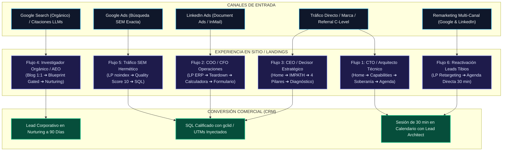

# 🗺️ Sitemap Visual (Arquitectura y Flujos)

Este documento contiene los diagramas visuales de la arquitectura web de BluePixel. Si los diagramas se ven muy grandes en HTML, puedes visualizar este archivo directamente en **GitHub**, **Notion**, o pegando el código en [Mermaid Live](https://mermaid.live/) para poder hacer zoom y moverte libremente.

## 1. Árbol Arquitectónico del Sitemap Maestro
Estructura jerárquica de 5 niveles que preserva URLs históricas y habilita el ecosistema B2B.

```mermaid
graph TD
    classDef root fill:#050a19,stroke:#38bdf8,stroke-width:2.5px,color:#fff;
    classDef proto fill:#0f172a,stroke:#94a3b8,stroke-width:1.5px,color:#e2e8f0;
    classDef pub fill:#0c4a6e,stroke:#0284c7,stroke-width:1.5px,color:#f0f9ff;
    classDef pilar fill:#1e1b4b,stroke:#818cf8,stroke-width:1.5px,color:#e0e7ff;
    classDef cap fill:#172554,stroke:#3b82f6,stroke-width:1.5px,color:#eff6ff;
    classDef sem fill:#451a03,stroke:#f97316,stroke-width:2px,color:#fff7ed;
    classDef blog fill:#064e3b,stroke:#10b981,stroke-width:1.5px,color:#ecfdf5;
    classDef legal fill:#312e81,stroke:#a5b4fc,stroke-width:1px,color:#e0e7ff;

    BP["🌐 bluepixel.mx<br/>(Dominio Principal)"]:::root

    %% Nivel 0
    BP --> N0["🤖 Nivel 0: Protocolos & Motores IA"]:::proto
    N0 --> R1["/robots.txt<br/>(Reglas GPTBot, ClaudeBot, Perplexity)"]:::proto
    N0 --> R2["/sitemap.xml<br/>(Sincronizado a GSC y Bing Webmaster)"]:::proto
    N0 --> R3["/llms.txt<br/>(Ontología B2B para Motores de IA)"]:::proto

    %% Nivel 1
    BP --> N1["🏛️ Nivel 1: Ecosistema Público & SEO (Indexable)"]:::pub
    N1 --> H["/ (Home Page Institucional)<br/>Terminal Agéntica · Trust Badges · SLA"]:::pub
    
    N1 --> P["/pilares (4 Formas de Trabajar)"]:::pilar
    P --> P1["/pilares/consultoria-digital<br/>(2 a 4 Semanas · ROI)"]:::pilar
    P --> P2["/pilares/agentes-automatizacion<br/>(2 a 4 Semanas · RAG & MCP)"]:::pilar
    P --> P3["/pilares/plataformas-digitales<br/>(2 a 4 Meses · MVP 99.9% SLA)"]:::pilar
    P --> P4["/pilares/evolucion-digital<br/>(Roadmap 6-12 Meses · Squad)"]:::pilar

    N1 --> S["/servicios (6 Capabilities Técnicas)"]:::cap
    S --> S1["/servicios/ux-ui-product-strategy"]:::cap
    S --> S2["/servicios/software-engineering"]:::cap
    S --> S3["/servicios/agentic-ai-automation"]:::cap
    S --> S4["/servicios/data-analytics"]:::cap
    S --> S5["/servicios/security-reliability"]:::cap
    S --> S6["/servicios/digital-consulting"]:::cap

    N1 --> B["/blueprints (Biblioteca de Casos Técnicos)"]:::pub
    B --> B1["/blueprints/conciliacion-financiera-erp"]:::pub
    B --> B2["/blueprints/triage-documental-rag"]:::pub
    B --> B3["/blueprints/onboarding-legal-kyc"]:::pub
    B --> B4["/blueprints/sistemas-operativos-quirurgicos"]:::pub

    N1 --> C["/casos-de-estudio (Evidence Hub)"]:::pub
    C --> C1["/casos-de-estudio/radioshack"]:::pub
    C --> C2["/casos-de-estudio/fr-medical"]:::pub
    C --> C3["/casos-de-estudio/grupo-bimbo"]:::pub
    C --> C4["/casos-de-estudio/morada-uno"]:::pub

    N1 --> M["/metodologia-impath"]:::pub
    N1 --> N["/nosotros (Squad Senior Anti-Maquila)"]:::pub
    N1 --> CT["/contacto (Formulario Calificado)"]:::pub

    %% Nivel 2: Pauta Privada
    BP --> N2["🎯 Nivel 2: Landings Pauta (/lp/)<br/>noindex, nofollow · QS 10/10"]:::sem
    N2 --> LP1["/lp/desarrollo-apps-enterprise<br/>(Google Search C1 ➔ Pilar 03)"]:::sem
    N2 --> LP2["/lp/automatizacion-procesos-erp<br/>(Google Search C2 ➔ Pilar 02)"]:::sem
    N2 --> LP3["/lp/agentes-ia-produccion<br/>(Google Search C3 ➔ MCP)"]:::sem
    N2 --> LP4["/lp/blueprint-conciliacion-financiera<br/>(LinkedIn Document Ad)"]:::sem
    N2 --> LP5["/lp/diagnostico-operativo-futureproof<br/>(Retargeting Display/LinkedIn)"]:::sem
    N2 --> LP6["/lp/gracias-pauta<br/>(Pixel Conversión Google/LinkedIn)"]:::sem

    %% Nivel 3: Blog 1:1
    BP --> N3["📚 Nivel 3: Blog Histórico Preservado 1:1<br/>164 URLs · Fuente de Leads & Citas IA"]:::blog
    N3 --> BL1["/es/blog/* (84 URLs en Español)"]:::blog
    N3 --> BL2["/post/* (80 URLs en Inglés)"]:::blog

    %% Nivel 4: Legal
    BP --> N4["⚖️ Nivel 4: Legal & Transaccional"]:::legal
    N4 --> L1["/gracias (Confirmación Orgánica)"]:::legal
    N4 --> L2["/privacidad (LFPDPPP México)"]:::legal
    N4 --> L3["/terminos (Condiciones Enterprise)"]:::legal
```

## 2. Macro-Embudo Multicanal
Mapeo integral de canales de entrada y destinos de calificación comercial.

