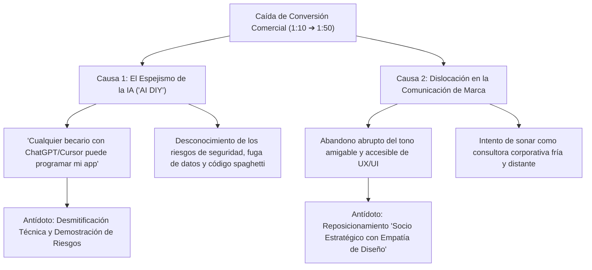

# 🛡️ TESIS ESTRATÉGICA Y BATTLECARD COMERCIAL: EL ANTÍDOTO AL ESPEJISMO DE LA IA
*Manual de Combate Comercial para Pablo Gómez, José de Buen, Leo y María: Cómo recuperar la tasa de conversión (de 1:50 de vuelta a 1:10), neutralizar la objeción del "hágalo usted mismo con IA" y resolver la crisis de identidad de marca.*

---

## 📉 1. EL DIAGNÓSTICO FORENSE: LA CAÍDA DE CONVERSIÓN (DE 1:10 A 1:50)

En las reuniones comerciales con Pablo Gómez (6 años en ventas) y José de Buen (2 años en ventas) se identificó un síntoma alarmante:
*   **Inicio de 2026:** Mejor época histórica de ventas de BluePixel. Tasa de cierre promedio de **1 de cada 10 prospectos** (10% Win Rate).
*   **Situación Actual:** Caída abrupta a **1 de cada 50 prospectos** (2% Win Rate). Se requiere un 400% más de reuniones para cerrar un contrato.

### Las Dos Causas Raíz Detectadas:

---

## 🎭 2. CAUSA 1: LA DISLOCACIÓN DE LA MARCA Y EL "DESFASE DE INFORMACIÓN"

### El Diagnóstico del Desfase:
*   **La Realidad Interna de BluePixel:** Pasó de ser una agencia boutique de diseño UX/UI a una firma de **Deep Tech**, arquitectura cloud, microservicios, inteligencia artificial aplicada y servidores MCP.
*   **La Percepción Externa:** La página web (`bluepixel.mx`), los medios y las 9 landing pages (`cotiza.bluepixel.mx`) siguen comunicando a la empresa como un despacho de "Diseño UX/UI y desarrollo de páginas web".
*   **La Falla en el Alcance:** Este desfase genera una doble fricción:
    1.  Atrae a prospectos de presupuesto bajo ($20k-$40k MXN) que solo buscan estética visual.
    2.  Provoca desconfianza en los tomadores de decisión corporativos (CTOs, CIOs, Directores de Innovación), quienes al ver una web de "diseño de interfaces" descartan a BluePixel para proyectos de misión crítica como modernizar un ERP o automatizar logística quirúrgica 24/7.

### La Nueva Tesis de Posicionamiento (La Tercera Vía):
> **"BluePixel no es una consultora corporativa fría, ni una agencia creativa decorativa. Somos el socio estratégico de ingeniería que resuelve problemas de negocio complejos mediante el matrimonio perfecto entre Diseño de Experiencia Humana (UX/UI) y Arquitectura Cloud e Inteligencia Artificial."**

*   **Los Creativos son Tecnológicos; los Tecnológicos son Creativos:** Se rompió la falsa dicotomía entre arte y programación. Los diseñadores de BluePixel entienden de APIs, lógica y bases de datos; los ingenieros entienden de psicología del usuario, ritmo visual y empatía conductual.
*   **El UX/UI no es un commodity que se vende suelto:** Es la armadura humana y la ventaja competitiva con la que vestimos nuestra ingeniería profunda.
*   **La Filosofía FutureProof:** Diseñamos arquitecturas modulares y desacopladas (mediante protocolos abiertos como MCP) preparadas para que cuando la IA evolucione, el sistema del cliente evolucione sin quedar obsoleto ni requerir ser reconstruido desde cero.

---

## 🤖 3. CAUSA 2: EL ESPEJISMO DE LA IA ("HÁGALO USTED MISMO")

El mercado B2B atraviesa el **Efecto Dunning-Kruger de la IA Generativa**: directores y dueños de empresas ven demos en Twitter de cómo crear una landing page en 2 minutos con Cursor o v0, y asumen erróneamente:
> *"¿Para qué voy a pagar $400,000 MXN a BluePixel si puedo poner a un becario con ChatGPT a programar el sistema de la empresa?"*

Este fenómeno paraliza las decisiones de compra o empuja a los prospectos a experimentar por su cuenta... **hasta que se estrellan contra la realidad operativa**.

---

## 💥 4. LA MATRIZ DE RIESGOS: "HÁGALO USTED MISMO CON IA" VS. "PARTNER BLUEPIXEL"

Esta tabla debe ser dominada por Pablo Gómez y José de Buen para desarmar a los clientes en las llamadas de Discovery:

| Dimensión Crítica | ⚠️ El Espejismo "DIY con IA / Becario" | 🛡️ La Solución de Ingeniería con BluePixel |
| :--- | :--- | :--- |
| **1. Arquitectura & Mantenimiento** | **Código Spaghetti y Deuda Técnica Explosiva:** La IA genera código parche sobre parche sin visión modular. A las 3 semanas nadie entiende cómo funciona el sistema; actualizar una sola librería rompe toda la aplicación. | **Arquitectura Limpia y Modular (Future-Proof):** Código documentado, desacoplado, escalable y mantenible a 5 años bajo estándares de la industria (AWS, Node, Python, Serverless). |
| **2. Privacidad y Fuga de Datos** | **Exposición Crítica de Datos (Data Leakage):** Al conectar APIs públicas sin gobernanza, los datos confidenciales de clientes, empleados o pacientes se envían en prompts a servidores de terceros, violando la LFPDPPP y acuerdos de confidencialidad. | **Aislamiento y Gobernanza de Grado Militar:** Protocolos de permisos estrictos, sanitización de datos antes de inferencia, servidores MCP aislados y cumplimiento regulatorio estricto (COFEPRIS, HIPAA, SAT). |
| **3. Estabilidad en Producción** | **"Funciona en mi laptop, colapsa con 50 usuarios":** Un script armado por un no-experto carece de manejo de concurrencia, balanceo de carga, cachés ni manejo de excepciones. En la primera venta real se cae el servidor. | **Resiliencia Cloud de Alta Disponibilidad:** Infraestructura serverless con balanceo elástico automático, monitoreo 24/7 y SLA de disponibilidad del 99.9%. |
| **4. Adopción de Usuarios (UX/UI)** | **Interfaces Confusas y Rechazo Interno:** El software generado por herramientas de código rápido es feo, tosco y contra-intuitivo. Los empleados se resisten a usarlo y vuelven a operar en hojas de Excel. | **Diseño UX Conductual de Clase Mundial:** 6 años de maestría en UX/UI (Juan Cubillos y Samantha). Diseñamos para humanos: cero fricción, curvas de aprendizaje nulas y deleite visual que garantiza adopción. |
| **5. El Riesgo del "Becario Orquesta"** | **Vulnerabilidad de Dependencia Individual:** Si el becario o la persona interna que "pegó el código con IA" renuncia o se enferma, la empresa queda ciega con un sistema que nadie más en el planeta puede descifrar. | **Equipo Institucional y Continuidad (Build + Evolve):** Un equipo multidisciplinario (Tech, UX, QA, RevOps) que respalda la operación, garantizando soporte continuo sin depender de una sola persona. |
| **6. Alucinaciones y Decisiones de Negocio** | **Errores Financieros Silenciosos:** Los LLMs inventan datos con total seguridad (alucinaciones). Un agente mal blindado puede cotizar productos con precios erróneos o prometer inventario inexistente. | **Grounding e Inferencia Blindada con MCP:** Los agentes de BluePixel operan estrictamente sobre bases de datos verificadas con reglas de negocio determinísticas; es matemáticamente imposible que inventen precios o stock. |

---

## 🎯 5. BATTLECARD COMERCIAL: GUIONES EXACTOS PARA PABLO GÓMEZ Y JOSÉ DE BUEN

### 🥊 Escenario 1: El cliente dice *"Eso lo podemos hacer internamente con nuestro equipo o con IA"*
*   **Lo que NO debes decir:** *"No, la IA no sirve, nosotros somos mejores"*. (Suena defensivo y obsoleto).
*   **La Respuesta Quirúrgica de Pablo / José:**
    > *"Licenciado / Ingeniero, estamos 100% de acuerdo con usted: hoy la IA escribe código más rápido que nunca. De hecho, nosotros en BluePixel usamos herramientas de frontera todos los días.*
    >
    > *Pero déjeme hacerle una pregunta muy sincera: **¿El problema de su empresa es escribir código rápido, o es que el sistema sea seguro, no tire sus servidores cuando se conecten 1,000 usuarios, y no fugue datos confidenciales de sus clientes?***
    >
    > *El 80% de los clientes que nos buscan hoy llegan después de haber pasado 4 meses intentando armar un sistema con IA o con un becario: terminaron con un prototipo que se ve bien en pantalla, pero que nadie puede auditar, que no se conecta con su ERP y que está lleno de 'código spaghetti' que nadie puede mantener.*
    >
    > *Con BluePixel no contratan programadores que teclean líneas; contratan un equipo que les entrega certidumbre técnica, blindaje de seguridad y una interfaz que sus clientes realmente van a adoptar desde el día uno."*

---

### 🥊 Escenario 2: El cliente siente que BluePixel *"se volvió muy seria, fría o corporativa"*
*   **La Respuesta de Reconexión Humana (El Legado de Diseño):**
    > *"Le agradezco muchísimo que me lo comparta con esa honestidad. Si algo nos ha caracterizado durante más de 6 años es que nacimos con el ADN de resolver los problemas de tecnología desde la empatía humana y el diseño UX/UI.*
    >
    > *No nos hemos vuelto una consultora aburrida de traje gris. Lo que pasa es que nos dimos cuenta de que nuestros clientes necesitaban algo más que maquetas bonitas: necesitaban que esa misma experiencia visual de clase mundial estuviera respaldada por una ingeniería capaz de aguantar millones de transacciones.*
    >
    > *Seguimos siendo el mismo equipo cercano y apasionado con el que te tomas un café para resolver un problema, pero hoy tenemos la capacidad técnica para que duermas tranquilo sabiendo que tu plataforma nunca se va a caer."*

---

### 🥊 Escenario 3: El cliente dice *"Queremos esperar a que la IA madure antes de invertir"*
*   **La Pregunta de Fricción Operativa:**
    > *"Totalmente comprensible la prudencia. Solo póngase a pensar en esto: mientras esperamos 6 meses a que la IA madure, ¿cuántas horas hombre sigue perdiendo su equipo todos los días cotizando a mano en hojas de cálculo o perdiendo clientes por responder tarde?*
    >
    > *La IA no va a madurar mágicamente para resolver los procesos de su empresa por sí sola; la IA solo es un motor. El valor está en la tubería que conecta ese motor con sus datos y sus clientes hoy. Ese es exactamente el proyecto de 6 semanas que estructuramos con nuestra fase Build."*

---

### 🥊 Escenario 4: El cliente pregunta *"¿Qué los hace diferentes a una fábrica de software tradicional o a una consultora como Accenture?"*
*   **El Pitch de la Filosofía FutureProof y la Ventaja Injusta:**
    > *"Ingeniero / Directora: En el mercado actual existen dos extremos que no funcionan: las consultoras de software tradicionales que entregan sistemas grises e inusables que parecen pantallas de 1995 (y que los empleados terminan rechazando), y las agencias creativas que hacen maquetas hermosas en Figma pero cuyo código no escala y se cae los viernes.*
    >
    > *En BluePixel rompimos esa barrera: **nuestros creativos son tecnológicos y nuestros ingenieros son creativos**. Le entregamos una infraestructura robusta de grado militar (desacoplada en la nube con servidores MCP y microservicios), pero vestida con una experiencia de usuario (UX/UI) tan intuitiva que su equipo la adopta al primer día sin semanas de capacitación.*
    >
    > *Y lo más importante: construimos bajo la filosofía **FutureProof**. No amarramos a su empresa a código rígido que quede obsoleto en seis meses con el siguiente lanzamiento de IA; diseñamos sistemas modulares listos para evolucionar junto con su negocio."*

---

## 🎬 6. CÁPSULAS PARA LA FILMACIÓN DE HOY ("PIXEL CONTRA EL MUNDO")

Aprovechando la sesión de grabación de la tarde con Leo, María, Sergio y Jessica, grabaremos 2 cápsulas de 60 segundos diseñadas específicamente para resolver esta objeción ante el mercado:

### Cápsula 1: "El mito del programador reemplazado por la IA"
*   **Personaje:** Leo Flores
*   **Hook (0 a 3 seg):** *"Creer que ChatGPT va a programar el software de tu empresa es como creer que tener un estetoscopio te convierte en cirujano cardiotorácico."*
*   **Mensaje central:** La IA escribe funciones sueltas; la ingeniería real consiste en seguridad, concurrencia, integración con sistemas legados y gobernanza de datos. Mostrar código spaghetti vs. arquitectura modular.
*   **Cierre:** *"En BluePixel no le tememos a la IA, la domesticamos para que sirva a tu negocio."*

### Cápsula 2: "Por qué el software feo destruye millones de dólares"
*   **Personaje:** Leo o María
*   **Hook (0 a 3 seg):** *"Puedes tener el algoritmo de Inteligencia Artificial más sofisticado del planeta, pero si tu pantalla parece una terminal de 1985, nadie lo va a usar."*
*   **Mensaje central:** La ventaja competitiva de BluePixel: matrimonio indisoluble entre UX/UI de élite y Cloud Architecture.

---

## 📊 7. PLAN DE ACCIÓN PARA RECUPERAR LA CONVERSIÓN DE 1:50 A 1:10

1.  **Ajuste Inmediato en las Discovery Calls (Pablo y José):** Aplicar las preguntas de diagnóstico de riesgo antes de dar precios.
2.  **Uso de los Prototipos PLG en Vivo:** En lugar de enviar un PDF con cotización abstracta, abrir en la llamada la [Demo Interactiva](file:///c:/Users/usarioBP/.gemini/antigravity-ide/scratch/bluepixel/03_Prototipos_y_Codigo/Demos_PLG/index.html) para que el cliente sienta el producto funcionando en tiempo real.
3.  **Calidez en los Correos y Mensajes:** Abandonar el lenguaje hiper-corporativo frío. Usar tono consultivo, amigable y directo al grano, firmado por humanos.
4.  **Campaña de Reactivación de Cuentas Pasadas:** Escribir a los clientes históricos que compraron por UX/UI para invitarlos a un diagnóstico gratuito de madurez de IA y arquitectura.

---

## 🚀 8. EL ARMA COMERCIAL LETAL: "PRODUCTIZED SERVICES"

**El Nuevo Modelo de Ventas:** Dejar de vender el proceso (horas de consultoría, discovery infinito) y empezar a vender **El Fin (El Producto Empaquetado)**.

**¿Por qué usar Productized Services?**
*   **Venta Impulsiva B2B:** Un CFO no quiere "Desarrollo de IA". Quiere un "Conciliador Automático de Facturas SAP".
*   **Certeza Presupuestal:** Ticket fijo, SLA fijo, y tiempo de entrega (3 semanas).
*   **Ataque Quirúrgico SEM:** Si un competidor busca "Automatizar cobranza corporativa", aterriza directamente en el Blueprint del *Agentic Operations Center* o el *Finance Matcher*, no en un "Menú de Servicios".

**El Rol del Equipo Comercial:** 
Tu trabajo es escuchar el dolor del cliente y, en lugar de decirle *"Claro, podemos desarrollar eso a medida"*, debes decirle: *"Ese es el dolor número uno de esta industria. Por eso tenemos la arquitectura probada en producción y los módulos pre-construidos de nuestra Blueprint Library. Podemos implementar la solución en tu empresa con certeza total de tiempo y presupuesto."*

---

## 🛡️ 9. BATTLECARDS POR MÓDULO & DOLOR CORPORATIVO (SOBERANÍA PRIVATE CLOUD)

Reglas de oro para los Closers (Pablo Gómez y José de Buen):
1. **Nunca vendas la tecnología, vende el impacto en P&L:** *"El módulo reduce 40 horas operativas semanales a 0, liberando margen operativo en el Q4"*.
2. **Mata la objeción SaaS de inmediato:** Si preguntan si esto es como ChatGPT o Salesforce, responde: *"No. Los SaaS públicos exponen tus datos a modelos de terceros. Nosotros desplegamos los agentes dentro de tu propia nube privada (AWS / Azure). Tú mantienes la Soberanía Absoluta de Datos bajo cumplimiento LFPDPPP y OWASP"*.

### 🃏 Módulo A: Finance Matcher (Conciliador Autónomo SAP)
*   **Target Ideal:** CFOs, Contralores, Directores de Finanzas.
*   **El Dolor:** El equipo contable pierde las primeras 2 semanas de cada mes cruzando Exceles, descargando PDFs bancarios y buscando facturas XML en SAP para cerrar el mes.
*   **Gancho:** *"Agente determinístico que lee tus estados de cuenta y hace match automático con tus XMLs de SAP en minutos, reduciendo el cierre contable de 12 días a 24 horas"*.
*   **Objeción:** *"No quiero que una IA tenga mis claves bancarias ni datos contables"*.
*   **Respuesta:** *"No las tiene. El despliegue es en tu nube privada, detrás de tus firewalls corporativos. El agente solo procesa los documentos que colocas en tu repositorio seguro"*.

### 🃏 Módulo B: Legal Onboarding KYC
*   **Target Ideal:** Directores de Compliance, Jurídico, Riesgo Corporativo (Fintechs, Sofipos, Corporativos).
*   **El Dolor:** Tardar 5 días en validar un nuevo proveedor o cliente institucional porque un abogado tiene que revisar actas constitutivas de 50 páginas y cotejar SAT y listas negras.
*   **Gancho:** *"El agente analiza el acta, consulta APIs del SAT y emite un semáforo de riesgo y matriz de poderes en 12 segundos"*.
*   **Objeción:** *"¿Y si la IA se equivoca y aprueba a una empresa fantasma?"*.
*   **Respuesta:** *"El agente no toma la decisión legal; aplica 'Human-in-the-Loop'. Genera el reporte de banderas rojas para que tu equipo jurídico dictamine en 5 minutos en lugar de 5 días"*.

### 🃏 Módulo C: RFP & Tender Analyst (Licitaciones)
*   **Target Ideal:** Directores Comerciales B2B, VPs de Ventas a Gobierno y Corporativos.
*   **El Dolor:** Pliegos de licitación de 300 páginas. El equipo comercial odia leerlos para armar la matriz de cumplimiento técnico y redactar la propuesta.
*   **Gancho:** *"Conéctalo a tu repositorio histórico de propuestas y casos de éxito. Sube las bases de la licitación y el agente RAG pre-redacta la propuesta técnica al 80% en minutos"*.
*   **Objeción:** *"Nuestras propuestas técnicas son secreto industrial confidencial"*.
*   **Respuesta:** *"Al ser Private Cloud, tu base vectorial queda estrictamente aislada en tu infraestructura. Cero entrenamiento de modelos públicos"*.

### 🃏 Módulo D: Triage RAG-Blindado (Atención Operativa L1)
*   **Target Ideal:** Directores de Operaciones, Customer Experience (CX).
*   **El Dolor:** Gasto excesivo en soporte L1 respondiendo una y otra vez consultas repetitivas de clientes o proveedores.
*   **Gancho:** *"Agente multicanal (WhatsApp/Web) con prohibición estricta de alucinar. Solo responde con base en tus manuales autorizados. Si detecta fricción, transfiere al humano con resumen estructurado"*.
*   **Objeción:** *"Los chatbots arruinan la experiencia y contestan tonterías"*.
*   **Respuesta:** *"Exacto, por eso usamos RAG determinístico con protocolos MCP. Si un dato no está en tu base oficial, el bot transfiere en lugar de inventar"*.

---

## 🧭 10. EL MAPA DE ENRUTAMIENTO HACIA LOS 3 PILARES DE CONTRATACIÓN

Cuando un prospecto entra por pauta o prospección, el equipo de ventas lo califica y lo conduce hacia uno de los **3 Pilares Oficiales de BluePixel**:

| Perfil del Prospecto | Pregunta de Diagnóstico | Paquete a Presentar | Entregable y Plazo |
| :--- | :--- | :--- | :--- |
| **"Tengo dolor operativo pero no sé por dónde empezar ni cuánto cuesta"** | *"¿Sabe cuánto dinero le cuesta hoy a su empresa la fricción de ese proceso antes de meterle código?"* | **01: Diagnóstico & Auditoría FutureProof** *(Entry Package)* | Diagnóstico IMPATH™, Matriz de priorización y ROI, Blueprint técnico y Costo de inacción cuantificado en pesos. ⏳ **2 a 4 Semanas**. |
| **"Ya sé qué flujo o agente necesito construir e integrar a mi ERP"** | *"¿Necesita un equipo senior que programe el agente, lo conecte a su stack y lo deje corriendo en producción?"* | **02: Ingeniería de Agentes & MCP** *(Entry Package)* | Arquitectura agéntica MCP, RAG sobre datos reales, integración SAP/Salesforce, pruebas cloud y blindaje OWASP. ⏳ **Sprints Mensuales**. |
| **"Necesito transformar la plataforma completa o construir la app de cero a producción"** | *"¿Busca un partner tecnológico senior que diseñe, construya y opere la plataforma completa con evolución continua?"* | **01+02: Transformación: BUILD + EVOLVE** *(Full Transformation)* | Squad dedicado (Tech Lead + AI Engineer + UX Lead), incluye 01 y 02, plataforma lista en 90 días y monitoreo trimestral de UX Health Score y ROI. ⏳ **3+ Meses / Continuo**. |

---

## 🎯 11. MANEJO COMERCIAL DE LOS 3 CLUSTERS DE ADS DE LEO

### A. Si el lead buscó "Desarrollo de Apps":
*   **El contexto mental del lead:** Quiere una app o plataforma moderna, pero teme contratar una fábrica tradicional que entregue software feo, o una agencia que solo entregue diseños de Figma inusables.
*   **La apertura de Pablo / José:**
    > *"Nosotros no somos una fábrica tradicional que te cobra horas infinitas para entregarte pantallas grises de 1995, ni una agencia que te vende maquetas de Figma que no escalan. Diseñamos con la armadura UX #1 en México y construimos con arquitectura FutureProof en tu nube privada para que tu plataforma quede en producción en 90 días."*

### B. Si el lead buscó "Automatización":
*   **El contexto mental del lead:** Tiene procesos rotos, fugas de tiempo entre su ERP y hojas de cálculo, y empleados sobrecargados.
*   **La apertura de Pablo / José:**
    > *"No venimos a pedirte que cambies de ERP ni a tirar tu software actual. Venimos a instalar una capa de integración y automatización determinística que conecta tus sistemas actuales (SAP, Salesforce, bancos) para eliminar las horas de captura manual y los errores humanos, cuantificando el retorno de inversión desde el primer mes."*

### C. Si el lead buscó "Agentización / Agentes IA":
*   **El contexto mental del lead:** Está saturado de demos y promesas de IA que vio en redes, pero tiene miedo a las alucinaciones, la fuga de datos y el código spaghetti.
*   **La apertura de Pablo / José:**
    > *"La diferencia entre un demo de IA en redes y un sistema en producción es la ingeniería de grado empresarial. Nuestros agentes operan con protocolos abiertos MCP nativos y RAG determinístico dentro de tu nube privada: tienen prohibido alucinar, cumplen con la ley de protección de datos y tu empresa mantiene el control y la soberanía total de la infraestructura."*

