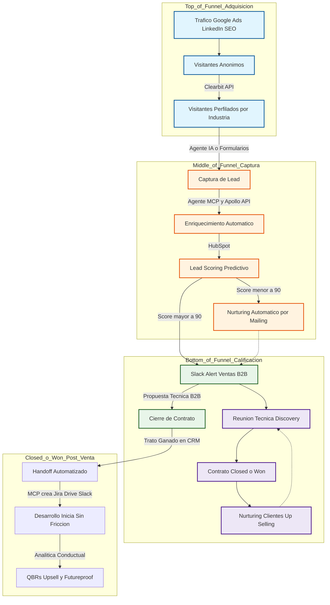
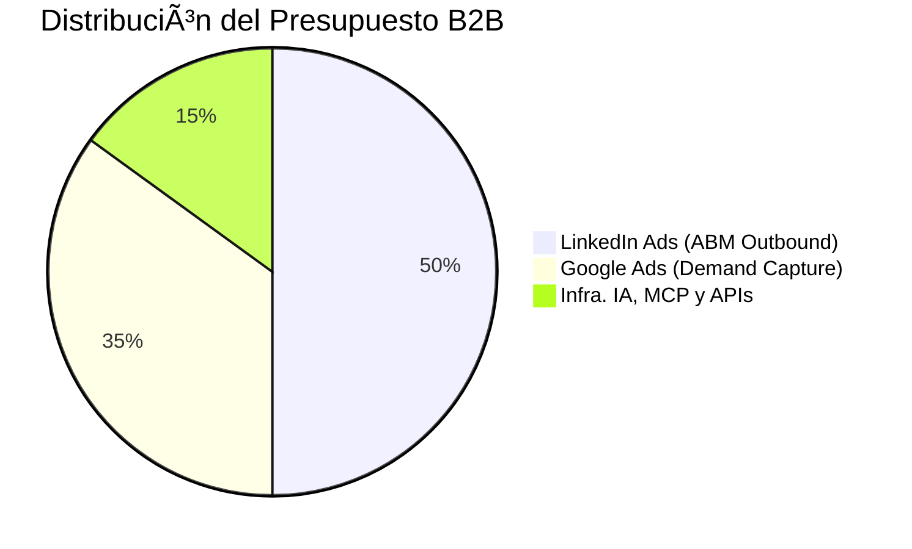

# Estrategia Integral de Captación y Crecimiento B2B (Business-to-Business / Empresa a Empresa)
*Arquitectura de Adquisición, Automatización y Land & Expand para BluePixel.*

**Autor:** Fabián Flores | MKT, Growth & Tech

---

## CAPÍTULO I: AUDITORÍA FORENSE DEL SITIO WEB (VENTAJA TÁCTICA)
Al realizar un análisis del código fuente de `bluepixel.mx`, extrajimos 5 descubrimientos clave que demuestran el nivel técnico de la empresa y cómo nuestra estrategia encaja perfectamente en su ecosistema:

**1. Infraestructura Ágil (Webflow)**
* **El hallazgo:** El sitio está construido en Webflow (`data-wf-domain`, assets en `cdn.prod.website-files.com`).
* **El Insight:** BluePixel valora la agilidad de marketing por encima de la complejidad técnica innecesaria. Nuestra estrategia con HubSpot, Apollo y Agentes MCP se integra sin fricción en ecosistemas ágiles, sin requerir meses de desarrollo.
* **🎯 Mejora Estratégica para la Operación:** Al estar en Webflow, podemos inyectar el widget de nuestro Agente IA B2B (Copiloto) directamente en el frontend usando un simple `<script>`. No requerimos que el equipo de desarrollo reconstruya la web, logrando un *time-to-market* de días para empezar a perfilar clientes automáticamente.

**2. Cultura de Datos (Mixpanel + GTM)**
* **El hallazgo:** Tienen un script nativo de inicialización de Mixpanel configurado para grabar el 100% de las sesiones, además de GTM.
* **El Insight:** Practican el *Dogfooding*. Venden analítica y la consumen. Sus eventos como "CTA Clicked" demuestran madurez de datos. Nuestra propuesta de Land & Expand usando analítica conductual resonará profundamente.
* **🎯 Mejora Estratégica para la Operación:** Conectaremos Mixpanel con HubSpot vía nuestro MCP. Si un lead Enterprise calificado (CTO) regresa al sitio web y visita la página de un Caso de Éxito, Mixpanel detonará una alerta en tiempo real a Slack: *"El CTO de Kavak está navegando ahora mismo, momento ideal para seguimiento"*.

**3. Atribución B2B Avanzada (UTMs en LocalStorage)**
* **El hallazgo:** Utilizan un script en vainilla JS que lee los parámetros UTM de la URL, los guarda en el LocalStorage y los inyecta dinámicamente en los formularios.
* **El Insight:** Tienen un equipo de Growth muy serio que entiende los ciclos largos de venta B2B y la atribución del primer toque (First-Touch Attribution). Nuestra estrategia de Smarketing y Calificación por IA potenciará esta infraestructura.
* **🎯 Mejora Estratégica para la Operación:** Extenderemos este script para implementar *Offline Conversion Tracking*. Cuando Ventas cierre un contrato de $100k USD 6 meses después, enviaremos el ID del click original de vuelta a LinkedIn Ads y Google Ads. Esto entrena al algoritmo publicitario para buscar perfiles financieramente idénticos.

**4. Filtro Enterprise Activo (Self-Qualification)**
* **El hallazgo:** En el HTML del formulario, el presupuesto mínimo aceptado es de "$300K - $800K MXN" y llega hasta "$5M+ MXN".
* **El Insight:** Están bloqueando activamente a prospectos pequeños. Su Target es 100% Mid-Market y Enterprise. Esto valida matemáticamente nuestro "Lead Scoring de 100 puntos" donde solo las cuentas de alto valor llegan a Ventas.
* **🎯 Mejora Estratégica para la Operación:** Integraremos *Clearbit Reveal* oculto en la web. Si la IP del visitante es de una PyME, verá el formulario normal. Si detectamos que la IP pertenece a un corporativo Fortune 500, la página mutará y le ofrecerá un "Fast-Track" (Vía Rápida VIP) para agendar directo con el Director Comercial, saltándose la fricción del formulario.

**5. Arquitectura SEO Semántica (JSON-LD)**
* **El hallazgo:** Implementan un script de `application/ld+json` (Schema.org) listando su catálogo de ofertas (`OfferCatalog`).
* **El Insight:** Tienen bien tipificados sus 12 servicios para Google. El SEO técnico base está dominado.
* **🎯 Mejora Estratégica en Ads:** Utilizaremos esta misma taxonomía para estructurar nuestros Grupos de Anuncios en Google Ads (SKAGs). Coincidencia perfecta = *Quality Score* de 10/10 = Clics más baratos.
* **🤖 Ventaja GEO / AEO (Generative & Answer Engine Optimization):** En 2026, los directivos B2B investigan en Perplexity o ChatGPT. Las IAs priorizan sitios con código JSON estructurado porque les permite extraer respuestas exactas sin riesgo a "alucinar".
* **⚙️ Cómo aplicarlo (Siguiente Nivel):** Enriqueceremos el JSON-LD actual inyectando los esquemas `aggregateRating` (Casos de Éxito y ROI demostrado) y `FAQPage` (respondiendo objeciones técnicas de CTOs). Así, cuando un prospecto le pregunte a Perplexity *"¿Qué agencia en México recomiendas para migración Serverless?"*, el motor generativo leerá nuestros datos estructurados directamente del código y nos citará como la autoridad número uno.

**9. "¿Y vas a necesitar que nuestro equipo de desarrollo te construya estas integraciones?"**
> "No. Mi metodología de trabajo incluye el uso de **Google Antigravity y Gemini** como mis copilotos de código. Yo mismo programo, configuro y despliego los Servidores MCP en la nube (Cloud) para la operación de Marketing. Su equipo de ingeniería debe estar 100% enfocado en los proyectos facturables de los clientes; mi departamento de Growth opera con autonomía técnica total."

**10. "¿Por qué propones usar código Python y Agentes MCP en lugar de herramientas visuales (No-Code) como n8n o Zapier que ya tenemos?"**
> "Las herramientas visuales como n8n son excelentes para automatizaciones simples, pero en una operación B2B avanzada se convierten en un cuello de botella. Al evolucionar a **Código Puro (Python + MCP)**, evitamos costos altos por volumen de ejecuciones (licencias), ganamos control absoluto sobre nuestros datos y podemos integrar Modelos de Lenguaje Avanzados directamente a las bases de datos de Blue Pixel. Además, es un tema de posicionamiento (*Dogfooding*): si vendemos ingeniería de software avanzada a corporativos, nuestro marketing debe operar con ingeniería avanzada, no con herramientas amateur."

---

## CAPÍTULO II: VISIÓN EJECUTIVA (AGENTIZACIÓN Y ENGINEERING AS MARKETING)

Esta es la visión a largo plazo para presentarle a Dirección General (CEO). El objetivo no es hacer "más campañas", sino transformar el área de Marketing en una Célula de Ingeniería Autónoma (Agentización) y captar clientes mediante productos gratuitos (Product-Led Growth).

### 1. Agentización Total del Marketing (El Enjambre IA)
Evolucionar de tareas operativas manuales a un equipo impulsado por código puro, donde la IA hace el 80% del trabajo de un SDR o Analista.
*   **Agente de Enriquecimiento (Data):** Un script en Python que escucha la entrada de un lead, consulta Apollo.io/Clearbit vía API, y en 2 segundos inyecta la facturación, tamaño y stack tecnológico de esa empresa directo en HubSpot.
*   **Agente de Outbound (SDR):** Rastrea noticias corporativas (ej. "Empresa X levanta capital") y redacta correos hiper-personalizados ofreciendo servicios de infraestructura.
*   **Agente de Contenidos (SEO Técnico):** Lee la documentación de React/AWS y genera *Whitepapers* técnicos impecables para nutrir a los CTOs en el embudo.

### 2. Engineering as Marketing (Demos Interactivos PLG)
Los CTOs y directivos no compran por discursos, compran cuando **prueban la tecnología**. En lugar de regalar PDFs (Lead Magnets tradicionales), desarrollaremos "Mini-SaaS" (Demos) internos que resuelvan problemas reales de las empresas. El cliente los usa gratis, y a cambio, nosotros obtenemos sus datos (Lead) y demostramos nuestra superioridad técnica.

**🔹 UX Clave: "Onboarding Guiado" (Pop-ups y Tooltips)**
Para garantizar que cualquier usuario (incluso los menos técnicos) entienda el valor del Demo al instante, integraremos un flujo de "Onboarding Interactivo". La primera vez que abran la herramienta, verán pequeños *Pop-ups* (letreritos) guiándolos paso a paso: *"Paso 1: Sube tu Excel aquí" -> "Paso 2: Haz clic para que la IA califique tus prospectos"*. Esto elimina la fricción y asegura que el cliente viva el "momento Ajá!" sin necesidad de tutoriales.

**Ejemplos de Demos de Alto Impacto:**
1.  **Lead Scoring Mini-App (Demo para Ventas B2B):**
    *   *El Problema:* Las empresas B2B pierden tiempo con prospectos basura porque no tienen cómo filtrarlos fácilmente.
    *   *El Demo:* Un dashboard web muy sencillo donde el gerente comercial sube su Excel de "prospectos" o conecta su CRM básico, y la herramienta le devuelve el Excel calificado con puntuaciones de 0 a 100, indicándole a quién llamar primero. Demuestra cómo automatizamos operaciones de clientes.
2.  **Agente de Agendamiento Inteligente (Demo para Marketing):**
    *   *El Problema:* Los formularios web tradicionales tienen alta tasa de abandono.
    *   *El Demo:* Un widget conversacional que las empresas pueden probar con su propia URL. La IA lee el sitio del cliente y genera un "recepcionista virtual" capaz de agendar citas en tiempo real. Demuestra adopción de IA para conversión.
3.  **Tablero de Inventario Colaborativo (Demo para Operaciones):**
    *   *El Problema:* Corporativos con almacenes sufren para sincronizar inventarios en tiempo real desde dispositivos móviles.
    *   *El Demo:* Una plantilla interactiva ligera (React + Supabase) que pueden abrir en 2 celulares a la vez. Al actualizar el inventario en un celular, se refleja en milisegundos en el otro. Demuestra nuestra capacidad para construir arquitecturas robustas en tiempo real.

### 3. Arquitectura RevOps y Sincronización Total (Pilotaje Automático)
No basta con visualizar datos en un Dashboard. El objetivo es conectar silos (Marketing, Ventas, Finanzas) para que la empresa opere en piloto automático mediante 4 capas tecnológicas:
*   **Centralización (El Cerebro):** Extracción automática de datos de HubSpot (CRM), Stripe (Pagos) y Google Analytics vía **ETL** (Airbyte/Fivetran). Todo converge en un **Data Warehouse** (BigQuery), logrando una única "verdad absoluta" financiera.
*   **Toma de Decisiones (Capa IA):** Modelos predictivos leen el Data Warehouse para detectar patrones invisibles. Ej: *"Los usuarios de LinkedIn que usan iOS tienen 40% menos Churn Rate"*.
*   **Ejecución Automática (Reverse ETL):** Devolvemos las decisiones del cerebro a las herramientas operativas. Si la IA detecta que un prospecto clave puede cancelar (Churn), dispara un webhook a HubSpot creando un ticket urgente para Customer Success, y a Meta Ads para excluirlo de campañas de retargeting de adquisición.
*   **Personalización UX en Tiempo Real:** Conectar Clarity/Hotjar a un CDP (Segment). Si se detecta fricción al pagar, la web muta dinámicamente ocultando campos del formulario para reducir la caída, sin intervención humana.

---

### Preguntas de Cierre (Tu turno de preguntar)
Al finalizar, cuando te pregunten si tienes dudas, utiliza estas 3 preguntas de "Consultor" para darle la vuelta a la entrevista:

**10. La Pregunta de Ventas (Para el Director Comercial)**
> "El corazón de mi estrategia es el SLA (Service Level Agreement / Acuerdo de Nivel de Servicio). Yo voy a programar a los Agentes IA para que filtren a los prospectos antes de que lleguen a tu equipo. Para calibrar mi matriz desde la primera semana: ¿Cuál es el factor número uno o la 'bandera roja' que hace que tus mejores vendedores descarten a un prospecto en los primeros 5 minutos de una llamada?"

**11. La Pregunta de Infraestructura (Para el CTO o el CEO)**
> "Diseñé esta operación asumiendo que mi departamento operará con total autonomía técnica usando Servidores MCP (Model Context Protocol / Protocolo de Contexto de Modelos), para no quitarle ni una sola hora a su equipo de ingeniería. Pensando en implementar esto el Día 1, ¿Existe actualmente alguna herramienta 'legada' en su ecosistema que represente un cuello de botella tecnológico y que debamos reemplazar urgentemente?"

**12. La Pregunta de Retención (Para el CEO)**
> "En mi plan, hablo de cómo retener clientes en igualas 'Evolve' usando reportes de Mixpanel. Hablando con total transparencia, del total de proyectos 'Build' que entregan hoy, ¿qué porcentaje logran retener a largo plazo y cuál es la objeción principal que les dan los clientes para no quedarse en un modelo mensual?"

### Bonus RRHH: "3 Cualidades y 3 Defectos" (Enfoque Growth)
Si la conversación se desvía hacia el terreno clásico de Recursos Humanos, utiliza estas respuestas diseñadas para resaltar tu perfil híbrido:

**🌟 3 Cualidades (Tus "Superpoderes")**
1. **Perfil Híbrido (Marketing + Ingeniería):** *"No solo hago pauta; hablo el idioma de los desarrolladores. Entiendo de APIs (Application Programming Interface / Interfaz de Programación de Aplicaciones), bases de datos y uso IA (Artificial Intelligence / Inteligencia Artificial) para automatizar mis procesos. Soy el puente perfecto entre Comercial y Tecnología."*
2. **Mentalidad Financiera (ROI sobre Vanidad):** *"No me importan los 'likes'. Mi cerebro opera en función del LTV:CAC (LifeTime Value : Customer Acquisition Cost / Valor de Vida del Cliente : Costo de Adquisición de Clientes). Pienso como operador de negocios: cada peso gastado en Ads debe regresar multiplicado."*
3. **Autonomía Operativa:** *"Si necesito un script o conectar plataformas, uso mis copilotos de IA y lo construyo yo mismo. No le robo horas facturables a su equipo de desarrollo para mis campañas."*

**⚠️ 3 Defectos (Estratégicos y reales)**
1. **Impaciencia con procesos manuales:** *"Me frustra ver a equipos copiando y pegando datos. Mi instinto es detener todo para programar una automatización. He tenido que aprender a tener paciencia y entender que la adopción tecnológica lleva tiempo humano."*
2. **Data-Driven Extremo:** *"Tiendo a ser frío con las decisiones. Si una campaña es creativa pero el dashboard dice que el Costo de Adquisición es negativo, la mato sin piedad. Trabajo en comunicar esto con más tacto a los perfiles artísticos."*
3. **Profundidad técnica al comunicar:** *"Al construir arquitecturas complejas (como MCPs o Atribución W-Shaped), a veces asumo que todos entienden el 'backend'. He tenido que aprender a 'traducir' mi trabajo técnico a un lenguaje puro de negocios para no abrumar a Ventas o Dirección."*

---

## CAPÍTULO III: INGENIERÍA DE ADQUISICIÓN Y UX (User Experience / Experiencia de Usuario)

### El Embudo B2B (Full-Funnel Architecture)

### 1. La Ciencia de los Formularios y ABM (Account-Based Marketing / Marketing Basado en Cuentas) por Industria
Para maximizar el volumen sin sacrificar la calidad comercial, implementaremos un modelo dual con personalización dinámica de alto nivel:

*   **Top of Funnel (Fricción Cero):** Formularios cortos (solo correo corporativo) para descargar Lead Magnets. Un Agente MCP en Python consulta la API de Apollo.io, extrae la industria, facturación y tamaño de la empresa, y enriquece el prospecto en HubSpot de forma invisible.
*   **Bottom of Funnel (Alta Intención):** Formularios largos ("Hablar con Ventas") que exigen Presupuesto, Rol y Reto Técnico. Actúan como el primer filtro de cualificación comercial para proteger la agenda de los cerradores.
*   **Personalización Web (ABM - Account Based Marketing):** Utilizar herramientas de desanonimización de IPs (como Clearbit) para que el sitio web de BluePixel sea dinámico. Si nos visita una IP de un banco, el *Hero Section* hablará de "Arquitectura Segura Fintech". Si es un retail, hablará de "Escalabilidad E-commerce".

### 2. Arquitectura del Portafolio B2B (Diseñado para CTOs)
Los tomadores de decisión técnicos (CTOs, VP of Engineering) no compran estética B2C, compran reducción de riesgos y escalabilidad técnica.
*   **Rediseño de 'Casos de Uso' (Ejemplos Reales):** En lugar de mostrar mockups de pantallas titulados "App de Delivery", el portafolio priorizará la arquitectura técnica y los resultados financieros. Los proyectos se presentarán con títulos financieros duros. Aplicando esto a nuestros clientes actuales:
    *   **Avianca (LifeMiles):** "+22% en Retención de Usuarios Móviles mediante Optimización Conductual (UX/UI)".
    *   **RadioShack:** "+32% en Tasa de Conversión (CR) mediante Evolución E-Commerce y Pasarelas Flexibles".
    *   **Bimbo:** "Reducción de Deuda Técnica: Estandarización de Infraestructura de Datos en 3 plataformas críticas en 6 meses".
    *   *(Ejemplo Cloud):* "-40% en costos de AWS mediante Migración Serverless".
*   **El Framework STAR-ROI:** Todos los PDFs y páginas de *Casos de Éxito* que utilice el equipo comercial serán reescritos bajo esta fórmula militar:
    *   **S (Situación):** El cuello de botella operativo o dolor financiero que tenía el cliente.
    *   **T (Tarea):** El reto técnico complejo que se le asignó a BluePixel.
    *   **A (Arquitectura):** El *Tech Stack* exacto y la infraestructura que nuestro equipo desplegó (Mostrando diagramas de AWS/GCP, no solo pantallas).
    *   **R (ROI (Return on Investment / Retorno de Inversión)):** El impacto de negocio (Ej. "Reducción del 30% en Churn", "Procesamiento 10x más rápido").

### 3. Lead Magnets de Alta Intención (Verticalizados)
No haremos PDFs genéricos. Crearemos herramientas que atraigan a nuestro Buyer Persona:
*   **Evaluador Interactivo de IA (React):** "AI Readiness Report". El prospecto ingresa sus procesos manuales y la web le calcula automáticamente el ahorro en FTEs (horas hombre) al implementar Agentes IA.
*   **Whitepapers Técnicos por Sector:** *"El Costo de la Deuda Técnica en Fintechs"* o *"Guía Headless para E-commerce"*.
*   **Ingeniería como Marketing:** Crear una calculadora gratuita de costos Cloud (AWS vs GCP) abierta en el sitio. Esto atrae *backlinks* de calidad (SEO) y tráfico directo.

---

## CAPÍTULO IV: ARQUITECTURA DE NURTURING Y MAILING (AUTOMATIZACIÓN)

En B2B Enterprise, rara vez la venta ocurre en el primer contacto. El correo electrónico automatizado (Mailing) es nuestro vendedor silencioso. Dividiremos la comunicación en 3 flujos (Workflows) principales operados desde HubSpot:

### 1. Nurturing a Leads No Calificados o Fríos (Score menor a 90)
*   **Objetivo:** Calentar prospectos (Warm-up) que aún no tienen el presupuesto o la necesidad urgente, sin gastar el tiempo valioso del equipo de Ventas.
*   **Contenido (Cero Promociones):** Enviaremos casos de estudio técnicos puros (ej. "Cómo reducimos costos operativos en un 40%"), whitepapers sobre arquitectura Headless y tendencias tecnológicas.
*   **Trigger (Desencadenador):** Lead que descargó un documento (Top of Funnel) pero no solicitó reunión, o una empresa que Apollo perfiló como demasiado pequeña por el momento.
*   **Resultado:** Mantiene a BluePixel en el "Top of Mind" como autoridad técnica hasta que la empresa crezca o consiga presupuesto.

### 2. Mailing de Onboarding Operativo (Clientes Nuevos)
*   **Objetivo:** Reducir la ansiedad post-compra del cliente (Buyer's Remorse) y educarlo sobre nuestra forma de trabajo.
*   **Contenido:** Bienvenida del CEO/CTO en video, explicación de nuestra metodología ágil, y entrega automática de credenciales/accesos a sus tableros de Jira y canales de Slack (configurados automáticamente por el Agente MCP).
*   **Trigger (Desencadenador):** Negocio marcado como "Closed o Won" (Trato Ganado) en el CRM.
*   **Resultado:** El cliente percibe de inmediato que contrató a una consultora de ingeniería de clase mundial (Fricción Cero en el Día 1).

### 3. Mailing Consultivo / Evolve (Clientes Antiguos y Actuales)
*   **Objetivo:** Generar recompra (Upselling y Cross-selling) basándonos en datos empíricos, no en insistencia de vendedores.
*   **Contenido:** Invitaciones automatizadas a las Sesiones QBR (Quarterly Business Reviews), alertas de anomalías ("Nuestro sistema detectó una caída en tu conversión móvil, agendemos una llamada").
*   **Trigger (Desencadenador):** Cliente que finalizó la etapa de construcción ("Build") o cliente que lleva 3 meses activo (Q1, Q2...).
*   **Resultado:** Transforma clientes de "un solo proyecto" en cuentas con ingresos recurrentes a largo plazo (Retención).

---

## CAPÍTULO V: OPERACIONES Y ALINEACIÓN (SMARKETING)
### 1. El Handoff Automatizado y Calificación IA

```mermaid
sequenceDiagram
    participant HubSpot as CRM (HubSpot)
    participant MCP as Agente MCP (Python)
    participant Slack as Ventas (Slack)
    participant Dev as Desarrollo (Jira/Drive)
    Note over HubSpot: Director Comercial marca<br/>trato como "Closed/Won"
    HubSpot->>MCP: Dispara Webhook
    MCP->>Slack: Crea canal #cliente-proyecto
    MCP->>Dev: Clona jerarquía en Google Drive
    MCP->>Dev: Genera tablero inicial en Jira
    Note over Slack,Dev: Transición Cero Fricción.
```

El proyecto inicia con claridad absoluta.

Eliminamos la brecha histórica entre Marketing, Ventas y Desarrollo:
*   **Lead Scoring Predictivo (Matriz de 100 pts):** La IA (vía Apollo.io) califica al prospecto en tiempo real para proteger el tiempo de Ventas basado en 3 pilares:
    1.  **Firmográfico (40 pts):** Tamaño de empresa (+100 empleados = 40pts) e industria core.
    2.  **Cargo del Contacto (30 pts):** C-Level o Director (30pts), Manager (10pts), Analista/Estudiante (Descalificado).
    3.  **Intención (30 pts):** Agendó llamada (30pts), descargó un PDF (10pts), visitó Casos de Éxito (+10pts).
    *Solo los leads con **Score > 90** detonan la alerta a Ventas en Slack. El resto va a Nurturing Automático.*
    
    **Ejemplos prácticos de calificación:**
    *   **El Unicornio (100 pts):** Corporativo (+40) + CTO (+30) + Agendó llamada (+30). *Pasa a Ventas de inmediato.*
    *   **Justo en la línea (90 pts):** Corporativo (+40) + CTO (+30) + No agendó, pero visitó Casos y Precios (+20). *Pasa a Ventas por alto interés.*
    *   **Al congelador (80 pts):** Corporativo (+40) + CTO (+30) + Solo descargó un PDF (+10). *Va a Nurturing automático.*
*   **Onboarding Operativo "Cero a Ciegas":** Cuando el Director Comercial marca un trato como "Ganado" (*Closed/Won*), un webhook dispara APIs simultáneas: crea el canal `#cliente-proyecto` en Slack, clona carpetas de arquitectura en Drive y genera el tablero inicial en Jira. El equipo técnico entra con requerimientos claros el Día 1.

### 2. Land & Expand: Upselling Sistematizado
Pasar de proyectos "Build" a retainers "Evolve" recurrentes.
*   **QBRs (Quarterly Business Reviews) Conductuales:** El equipo de Customer Success entregará reportes trimestrales al cliente mostrando cómo sus usuarios interactúan con la plataforma. Usamos esta data inobjetable para vender iteraciones de diseño UX o el desarrollo de nuevas *features*.
    *   **Plataformas de Analítica a usar:** **Mixpanel** o **Amplitude** (para rastreo de eventos de embudos internos) y **Microsoft Clarity** o **Hotjar** (para mapas de calor y grabación de sesiones).
    *   **Presupuesto Estimado:** $0 USD en etapas iniciales (Clarity es gratis y Mixpanel tiene un plan gratuito robusto).

## CAPÍTULO VI: DOMINIO DEL MERCADO Y SOCIAL SELLING
### 1. Social Selling 2.0 (Employee Advocacy)
En B2B técnico, la autoridad lo es todo. Haremos que nuestro talento técnico sea el mejor argumento de ventas.
*   **Captura y Orquestación:** Fireflies transcribe reuniones técnicas internas. Un Agente de IA extrae el problema, la solución arquitectónica y el impacto de negocio.
*   **Distribución Automática:** Se autoredactan posts técnicos en LinkedIn no solo para los Fundadores, sino para los Tech Leads y UX Leads de BluePixel. Demostramos que somos un *pool* de talento élite, escalando la confianza del prospecto antes de la primera llamada.

### 2. Roadmap Comercial de Ejecución (Q1 - Q4)

*   **Q1 (Enero - Marzo): Fundamentos, CRO y Dogfooding con IA**
    *   **Qué:** Refactorización del embudo de conversión e implementación de un "Agente IA Copiloto" (actualmente el sitio carece de un canal conversacional en tiempo real).
    *   **Por qué:** Antes de inyectar presupuesto publicitario, necesitamos tapar las fugas (mejorar el CRO). Si BluePixel vende IA, debemos demostrar su valor (*Dogfooding*) desde el primer contacto para elevar radicalmente la tasa de conversión de 'Visitante' a 'Reunión Agendada'.
    *   **Cómo:** Entrenaremos un LLM con los casos de éxito y *playbooks* de servicios de BluePixel. Este Agente se integrará a la web para hacer preguntas clave de calificación y, si el prospecto califica, le mostrará el calendario del vendedor.
    *   **Dónde:** En las *landing pages* principales y de servicios (bluepixel.mx).

*   **Q2 (Abril - Junio): Captura de Demanda Activa y SEO B2B**
    *   **Qué:** Lanzamiento de Google Ads transaccionales y creación de "Clusters de Contenido" (*Hub & Spoke*).
    *   **Por qué:** Con el embudo optimizado, ahora pagamos para capturar a quienes ya buscan servicios específicos. A la par, el SEO B2B tarda meses en madurar, así que la infraestructura de autoridad debe sembrarse ahora.
    *   **Cómo:** En Google Ads, usaremos concordancia exacta en términos *Bottom of Funnel*. En SEO, construiremos guías maestras que enlacen a artículos técnicos específicos, dominando las SERPs.
    *   **Dónde:** Google Search Network (Ads) y el Hub de Recursos/Blog.

*   **Q3 (Julio - Septiembre): Generación de Demanda y ABM**
    *   **Qué:** Promoción *Outbound* de Lead Magnets hiper-específicos dirigidos a cuentas Enterprise.
    *   **Por qué:** Para llegar a grandes corporativos que aún no saben que necesitan modernizarse, debemos irrumpir con contenido que evidencie financieramente sus dolores.
    *   **Cómo:** Campañas hiper-segmentadas en LinkedIn Ads. Filtraremos milimétricamente por Rol (CTO (Chief Technology Officer / Director de Tecnología), VP of Engineering) y Tamaño de Empresa (+100 empleados).
    *   **Dónde:** LinkedIn Ads como punta de lanza, respaldado por flujos de nutrición en HubSpot.

*   **Q4 (Octubre - Diciembre): Agentización Total del Scoring**
    *   **Qué:** Automatización total del *Lead Scoring* predictivo y flujos de enrutamiento comercial.
    *   **Por qué:** Con el volumen de prospectos en su pico, el equipo comercial corre riesgo de saturarse. Necesitamos que la infraestructura técnica decida quién amerita el tiempo de un cerrador.
    *   **Cómo:** Integración de Webhooks (Agentes MCP) hacia APIs de enriquecimiento (Apollo.io/Clearbit). Un LLM analizará a la empresa y la emparejará con el ICP (Ideal Customer Profile / Perfil de Cliente Ideal) de BluePixel.
    *   **Dónde:** Operará invisiblemente en el *backend* (HubSpot, MCP, Slack).

---

### 3. Estrategia Puente (Bridge Strategy) para Q1: Landing Pages Desacopladas
Mientras se aprueba o ejecuta el rediseño completo del sitio web principal, desplegaremos una arquitectura de captación paralela para no frenar la tracción comercial.

*   **Arquitectura Headless (Subdominio):** Alojaremos campañas en `go.bluepixel.mx` usando constructores ágiles (Framer / Unbounce) para dar autonomía total al equipo de Marketing sin depender de TI.
*   **Ingeniería como Marketing:** Las landings no serán estáticas; incrustarán los Demos Interactivos (como la Calculadora de ROI o el Agente IA) para que los CTOs experimenten nuestra capacidad técnica en tiempo real.
*   **Hiper-Segmentación (ABM):** Crearemos landings clonadas por vertical (Fintech, Retail) para que el mensaje resuene perfectamente con los anuncios de LinkedIn Ads.
*   **Recolección de Datos (CRO):** Conectaremos Mixpanel y Clarity a estas landings para hacer pruebas A/B. Los datos de conversión dictarán cómo se construirá el rediseño definitivo del sitio corporativo.

## CAPÍTULO VII: FINANZAS, MÉTRICAS Y TECH STACK

### 1. KPIs Core (Métricas de Éxito)
Nuestra estrategia no medirá "likes" ni tráfico vacío. Nos regiremos por métricas de negocio puro:
*   **LTV (LifeTime Value / Valor de Vida del Cliente):CAC (Customer Acquisition Cost / Costo de Adquisición de Clientes) Ratio (≥ 3:1):** El Valor de Vida del Cliente debe pagar al menos 3 veces su Costo de Adquisición.
*   **SQL (Sales Qualified Lead / Prospecto Calificado por Ventas) Conversion Rate:** Porcentaje de leads generados que Ventas acepta genuinamente como calificados (Sales Qualified Leads).
*   **Pipeline Velocity:** Reducción del ciclo de ventas en días, gracias a la educación técnica previa mediante los Lead Magnets y el Agente IA.

### 2. Distribución del Presupuesto (Budget Allocation)
Si invertimos en pauta, la distribución estratégica del capital será:

*   **50% - LinkedIn Ads (ABM):** Caza con arpón. Segmentación milimétrica para directivos Enterprise (alto ticket).
*   **35% - Google Ads (Search):** Captura de demanda activa. Usuarios buscando explícitamente "Desarrollo Headless" o "Agencia UX".
*   **15% - Infraestructura IA y APIs:** Pago de herramientas de automatización y enriquecimiento (Agentes MCP, Apollo, Clearbit, OpenAI).

### 3. El Tech Stack B2B (Y el propósito de cada herramienta)
La arquitectura tecnológica detrás de la máquina de ventas:

*   **Ecosistema Base (Google Stack):** 
    *   **Google Ads:** Captura la demanda transaccional (CTOs buscando agencias activamente).
    *   **Google Tag Manager (GTM):** Permite a Marketing inyectar píxeles (Clearbit, HubSpot) con agilidad sin depender de los desarrolladores.
    *   **Google Analytics 4 (GA4) & Search Console:** Miden micro-conversiones (descargas de PDFs) y auditan palabras clave técnicas (SEO).
*   **Orquestación Custom (Dogfooding avanzado):**
    *   **Python + Agentes MCP (Model Context Protocol):** En lugar de usar herramientas no-code, usaremos scripts en Python y Servidores MCP para conectar el CRM, Slack y Jira. Al construir automatizaciones con código propio e IA de vanguardia, demostramos superioridad técnica. Argumento de ventas: *"Automatizamos nuestro Marketing con MCPs en Python, podemos hacer lo mismo por su corporativo"*.
    *   **Apollo.io API:** Enriquecimiento de datos. Convierte un simple email en una radiografía corporativa (tamaño, facturación).
*   **Conversión, Analítica & UX:** 
    *   **Webflow (Infraestructura Actual):** El CMS nativo de BluePixel. Permite inyectar widgets (como el Agente Copiloto B2B) mediante tags sin depender de tiempos de desarrollo.
    *   **Mixpanel (Analítica Conductual):** Ya implementado en BluePixel. Se conectará con HubSpot vía MCP para disparar alertas a Ventas cuando un CTO regrese a la web.
    *   **React:** Para construir calculadoras de ROI y componentes interactivos rápidos.
    *   **Microsoft Clarity / Hotjar:** Grabaciones de sesión y mapas de calor. Cruciales para optimización iterativa (CRO).
    *   **Agentes LLM (Copiloto):** Para pre-calificar leads en la web simulando una conversación técnica humana.
*   **Captación & ABM:** 
    *   **LinkedIn Ads:** Para cazar prospectos corporativos específicos (Outbound B2B puro).
    *   **Clearbit (Reveal):** Para desanonimizar IPs, saber qué empresas nos visitan y personalizar la web en tiempo real.
*   **Ventas & CRM:** 
    *   **HubSpot:** La única fuente de verdad (CRM) para el pipeline, el modelo de atribución y reportes comerciales.
    *   **Fireflies.ai:** Transcribe llamadas de ventas para extraer *pain points* técnicos y redactar Casos de Éxito.
    *   **Slack:** Central de mando para recibir alertas de "Lead Enterprise" en < 5 minutos.

### 4. Desglose de Costos de Software (OPEX Tecnológico)
Para que esta maquinaria funcione, necesitamos licenciar las herramientas base (independientes del presupuesto de anuncios):
*   **Apollo.io (Enriquecimiento de Datos y Teléfonos):**
    *   *Free:* $0 (Para uso manual, sin acceso API).
    *   *Professional:* ~$99 USD / mes (Ideal para SDRs manuales, da cientos de teléfonos móviles al mes).
    *   *Organization (Recomendado):* ~$149 USD / mes. **Requerido** para tener acceso a la API que permite que nuestro Agente MCP en Python enriquezca los leads automáticamente en milisegundos.
*   **Clearbit (Desanonimización de IPs):** Rango de ~$100 a $250 USD / mes (Escala según el volumen de tráfico del sitio web).
*   **Fireflies.ai (Inteligencia Conversacional):** ~$18 a $29 USD / mes por vendedor. Captura y transcribe las llamadas comerciales para extraer los dolores técnicos del cliente y mandarlos al CRM.
*   **Agentes MCP & OpenAI (Dogfooding):** ~$20 - $50 USD / mes. Al hacerlo in-house con Python, solo pagamos el consumo de tokens (GPT-4) y el servidor (AWS/GCP), que es ridículamente barato frente a soluciones empresariales.
*   **HubSpot CRM:** Asumiendo que BluePixel ya tiene la licencia Pro/Enterprise, este costo ya está absorbido (Aprox. $800+ USD/mes si se adquiriera de cero).

### 5. Escenarios de Inversión Mensual (Ad Spend + Software)
Para arrancar esta maquinaria, he proyectado 3 escenarios de presupuesto operativo mensual, dependiendo de la agresividad con la que queramos escalar el *pipeline*:

*   **1. Escenario Mínimo ($1,500 - $3,000 USD / mes): "Validación y Eficiencia"**
    *   **Qué incluye:** Pago de herramientas SaaS (HubSpot, OpenAI) y pauta quirúrgica en Google Ads. La infraestructura MCP/Python se hostea a muy bajo costo en la nube.
    *   **Qué se logra:** Validar que el Agente IA y el *Handoff* automatizado funcionen sin fricción. Generará un volumen bajo (**~3 a 5 SQLs/mes**), pero altamente calificado. Es ideal para arrancar el *Q1* sin riesgo de capital.
*   **2. Escenario Medio ($5,000 - $8,000 USD / mes): "Maquinaria B2B Completa" (RECOMENDADO)**
    *   **Qué incluye:** Ecosistema tecnológico full + Activación de LinkedIn Ads (ABM) para cazar cuentas grandes Outbound + Google Ads para capturar demanda.
    *   **Qué se logra:** Generación predecible y consistente. Entregará de **~10 a 15 SQLs Enterprise/mes**. Da el volumen matemático exacto para que el equipo comercial cierre de 1 a 3 contratos *High-Ticket* recurrentes por trimestre.
*   **3. Escenario Máximo ($12,000+ USD / mes): "Dominio de Categoría"**
    *   **Qué incluye:** Presupuesto agresivo para dominar las pujas en Google frente a consultoras globales, LinkedIn Ads a nivel LATAM/USA (C-Levels), y pauta masiva para *Lead Magnets*.
    *   **Qué se logra:** Posicionamiento como líderes absolutos y saturación positiva del embudo (**+30 SQLs/mes**). Este escenario generaría tanto volumen que requeriría contratar más cerradores para absorber la demanda.

### 6. Topología del Equipo de Growth (Operación Lean)
Para ejecutar esta estrategia sin inflar la nómina corporativa, operaremos bajo un modelo *Lean Growth* potenciado por IA:
*   **Head of Growth (Yo - 10x Marketer):** Estrategia omnicanal, diseño del embudo y alineación comercial. Para la tecnología, **utilizo Google Antigravity y Gemini como mis copilotos de código**. Con ellos, programo y despliego mis propios Servidores MCP directamente en infraestructura **Cloud (GCP/AWS)** sin depender ni quitarle tiempo al equipo de ingeniería de BluePixel. Total autonomía técnica.
*   **Copywriter Técnico B2B (Freelance/In-House):** Producción de *Whitepapers*, posts técnicos para directivos y Casos de Éxito STAR-ROI.
*   **Traffic Manager B2B (Especializado):** Gestión milimétrica de pujas en Google Ads y LinkedIn ABM.
*   **Multiplicador de Fuerza (IA):** El 80% del trabajo operativo tradicional de perfilamiento (el trabajo de un ejército de SDRs humanos) será reemplazado por la infraestructura de **Agentes de IA y Webhooks**, manteniendo los costos operativos fijos al mínimo.

---

### CAPÍTULO VIII: SIMULACRO OFICIAL - DIRECTORA COMERCIAL
### Entrevista de Alto Impacto (Respuestas Estratégicas)

**1. "Marketing nos genera volumen, pero mi equipo de Ventas pierde el tiempo en llamadas con prospectos que no tienen presupuesto. ¿Cómo lo arreglas?"**
> "Implementando un SLA estricto de *Smarketing*. Firmaremos un contrato interno donde yo me comprometo a enviarte solo prospectos con presupuesto y rol de decisión, filtrados rígidamente por IA. A cambio, Ventas se compromete a llamar a esos prospectos en menos de 5 minutos y hacer 5 seguimientos. A tus cerradores solo les llegarán reuniones pre-calificadas; la IA desviará al resto hacia automatizaciones."

**2. "Vendemos plataformas complejas y automatización con IA. ¿Cómo demostramos nuestra capacidad técnica desde que el cliente pisa nuestro sitio web?"**
> "Haciendo *Dogfooding* (usar nuestro propio producto para vender). Si le vendemos 'Evolución Digital' a los clientes, nuestro propio marketing debe ser una obra de arte técnica. Implementaré un Agente IA en la web. Así, cuando tú (Directoraa Comercial) estés en una llamada intentando cerrar un contrato grande y el CTO te pregunte: *'¿Su tecnología realmente funciona?'*, le responderás: *'¿Cómo crees que llegaste a esta llamada? El Agente IA de nuestra web te perfiló y te agendó en mi calendario sin intervención humana. Eso es exactamente lo que te vamos a construir'*. El cliente experimentará nuestra tecnología antes de comprarla."

**3. "Una vez que entregamos un proyecto de desarrollo (Build), nos cuesta trabajo que nos contraten servicios mensuales continuos (Evolve). ¿Qué propones?"**
> "Sistematizar el *Land & Expand* basándonos en datos, no en intuición. Implementaremos Revisiones Trimestrales (QBRs) con todos los clientes activos usando nuestro servicio de Analítica Conductual. En lugar de llamarles para 'venderles algo más', les mostraremos un mapa de calor y métricas de dónde se están estancando sus propios usuarios en la app, justificando así la necesidad de una optimización UX o de nuevas features. Pasamos de ser vendedores a consultores de negocio."

**4. "Nuestros competidores también hacen desarrollo. ¿Cómo hacemos que un CTO nos elija a nosotros al ver nuestro portafolio?"**
> "Reestructurando cómo presentamos nuestros casos de éxito en la web. Ahora mismo mostramos nuestro trabajo como si le vendiéramos a consumidores finales (mockups de apps bonitas). Yo propongo reenfocar el portafolio B2B 100% hacia la infraestructura y el retorno de inversión. Le daremos a tu equipo comercial la evidencia de ingeniería dura que los CTOs necesitan para aprobar contratos grandes."

*Ejemplos Reales de la reestructura del Portafolio de BluePixel para atrapar CTOs:*
*   **Caso Avianca (LifeMiles):** En lugar de vender *"Rediseño del programa de lealtad"*, venderemos **"Optimización Conductual que incrementó el tiempo de sesión móvil en 22%"**.
*   **Caso RadioShack:** En lugar de vender *"App de Venta"*, venderemos **"Evolución de Arquitectura E-Commerce que aumentó la tasa de conversión transaccional en 32%"**.
*   **Caso Bimbo:** En lugar de vender *"Plataformas digitales"*, venderemos **"Estandarización de Infraestructura de Datos Multinacional (Despliegue de 3 plataformas en 6 meses)"**.

**5. "A veces el traspaso de información entre lo que tú y Ventas proponen y lo que el equipo de Desarrollo recibe es un caos. ¿Cómo lo evitamos?"**
> "Automatizando el Onboarding Operativo. Cuando marcas un negocio como 'Ganado' en HubSpot, nuestro Servidor MCP en Python configura todo vía API: Drive, Slack y Jira. Desarrollo inicia con 100% de claridad el Día 1."

**6. Atribución (El clásico debate): "A veces Ventas cierra un trato de 6 meses, y Marketing dice que fue gracias a ustedes por un anuncio. ¿Cómo vamos a medir quién trae el cliente?"**
> "Ese es el problema de usar el modelo obsoleto de 'último clic'. Para ciclos de venta B2B largos, implementaré un **Modelo de Atribución W-Shaped** en HubSpot. Le asignaremos 30% del crédito al primer contacto (ej. LinkedIn Ads), 30% a la conversión a lead (ej. Descarga del Whitepaper), 30% a la oportunidad creada (Llamada con tu equipo) y 10% a toques intermedios. Así dejaremos de pelearnos por los méritos y ambos equipos verán cómo sus esfuerzos conjuntos cerraron la cuenta."

**7. Velocidad (Speed-to-Lead): "Si un prospecto 'Enterprise' pide información, no podemos darnos el lujo de tardar horas en responder. ¿Cuál es tu postura aquí?"**
> "En B2B, las posibilidades de venta caen en picada si no respondes en los primeros 5 minutos. Por eso mi estrategia (Q1) elimina el 'paso de estafeta' manual. Al integrar el Agente IA, el prospecto calificado agenda directamente en el calendario del cerrador, en tiempo real. Para los que llenan el formulario tradicional, mi webhook enviará una alerta automática a tu canal de Slack en milisegundos con los datos de la empresa. Nuestra meta será: prospecto calificado, contacto en menos de 5 minutos."

**8. Presión de resultados a corto plazo: "Tengo metas trimestrales, no puedo sentarme a esperar 6 meses a que el SEO y el contenido técnico funcionen."**
> "Tienes toda la razón, el pipeline no puede esperar. Para el Q1, captaremos Demanda Activa con Google Ads (Bottom of Funnel) apuntando a directivos que ya tienen presupuesto y están buscando agencias hoy mismo. En paralelo, activaremos el Agente IA en la web para exprimir el tráfico que ya tenemos y convertirlo en reuniones esta misma semana, mientras el modelo Outbound madura."

---

#### 12. Pregunta de Operaciones (Escalabilidad)
"Si logro generar 15 leads altamente calificados (SQLs) al mes, ¿el equipo de ventas actual tiene el conocimiento técnico para atender a CTOs, o necesitamos entrenarlos en este nuevo perfil?"

#### 13. Pregunta de Expectativas (KPIs del Q1)
"Para considerar que mi estrategia fue un éxito rotundo en estos primeros 90 días, ¿cuál es el KPI exacto que esperas ver en tu dashboard comercial?"

## CAPÍTULO IX: DISCURSO DE CIERRE (ELEVATOR PITCH)
*Resumen ejecutivo para leer o memorizar al cierre de la presentación.*

**"Para resumir cómo vamos a transformar la adquisición de clientes en BluePixel, quiero que se queden con esta visión:**

**Primero, el Proceso (Qué haremos):** 
Vamos a dejar de pescar con red para empezar a cazar con arpón. Mi estrategia alinea Marketing, Ventas y Desarrollo bajo un solo embudo (*Smarketing*). Usaremos LinkedIn Ads para ir proactivamente tras los CTOs de cuentas Enterprise, y Google Ads para capturar a los que ya tienen presupuesto hoy. Todo filtrado por un Lead Scoring Predictivo de 100 puntos. A los cerradores solo les llegarán prospectos pre-calificados y de alto valor. Cero pérdida de tiempo.

**Segundo, Aprovechamiento Tecnológico y Nuevas Mejoras:**
No vengo a tirar a la basura lo que ya tienen; vengo a hackearlo. Tienen una gran base técnica: Webflow, Mixpanel y un SEO estructurado. Lo que haré será inyectar **Agentes IA (MCPs en Python)** directamente en esa infraestructura. 

Vamos a automatizar el *Speed-to-Lead* para responder en menos de 5 minutos, conectaremos el CRM con Jira y Slack para que el traspaso de proyectos sea automático, y enriqueceremos su código (JSON-LD) no solo para Google, sino para dominar el **GEO (Generative Engine Optimization)**. Cuando un directivo busque agencias en Perplexity o ChatGPT, la IA nos va a recomendar a nosotros como la máxima autoridad técnica, porque nuestro código estará diseñado para que las IAs lo lean perfectamente.

**Tercero, Los Logros a Obtener:**
1. **Volumen Predecible:** Flujo constante de 10 a 15 SQLs (Leads Calificados por Ventas) al mes, enfocados 100% en Mid-Market y Enterprise.
2. **Rentabilidad (LTV:CAC):** Al enfocarnos en cerrar proyectos 'Build' grandes y retenerlos con igualas 'Evolve' mediante analítica conductual, garantizaremos que por cada dólar invertido en marketing, recuperemos al menos 3 dólares en el ciclo de vida del cliente.
3. **Dogfooding:** Demostraremos nuestra capacidad técnica desde el primer clic. Si vendemos desarrollo y automatización B2B, nuestra propia máquina de marketing y ventas será el mejor caso de éxito.

**En conclusión:** No necesitamos meses de desarrollo ni inflar la nómina corporativa. Con mi perfil híbrido entre Growth y Tecnología, y el uso de automatización avanzada, estoy listo para operar esta maquinaria desde el Día 1."

---

## CAPÍTULO X: ESCALETA DE LA PRESENTACIÓN (CHEAT SHEET)
*Usa esta guía rápida (acordeón) durante tu presentación para no olvidar el flujo ni los conceptos clave (Buzzwords) que te harán sonar como un experto Enterprise.*

1. **El Problema Actual (Rompehielo)**
   *   *Conceptos clave a mencionar:* **Fricción Operativa**, **Speed-to-Lead** (Velocidad de respuesta), **Smarketing** (Alineación Ventas + Marketing).
   *   *Idea central:* Marketing trae basura, Ventas pierde el tiempo. Hay que unirlos con tecnología.
2. **Adquisición (Cazando CTOs)**
   *   *Conceptos clave a mencionar:* **ABM** (Account-Based Marketing), **Outbound** (Cazar en LinkedIn), **Inbound** (Pescar en Google Ads).
   *   *Idea central:* No le vendemos a todos. Le hablamos directo a empresas transnacionales usando sus propios lenguajes (Fintech, Retail).
3. **Calificación (El Filtro Anti-Basura)**
   *   *Conceptos clave a mencionar:* **Lead Scoring Predictivo**, **Firmográfico** (Datos de la empresa como facturación y tamaño), **SQL** (Sales Qualified Lead).
   *   *Idea central:* Usamos APIs como Apollo.io para que el sistema descarte prospectos sin presupuesto antes de que lleguen a Ventas.
4. **Nurturing (El Vendedor Silencioso)**
   *   *Conceptos clave a mencionar:* **Workflows**, **Top of Mind** (Estar en su cabeza), **Fricción Cero**.
   *   *Idea central:* El B2B toma meses. Si no compran hoy, los educamos automáticamente por correo hasta que tengan presupuesto. Al comprar, el Onboarding es automatizado.
5. **Retención (El Modelo de Negocio Real)**
   *   *Conceptos clave a mencionar:* **LTV:CAC** (LifeTime Value vs Costo de Adquisición), **QBRs** (Quarterly Business Reviews), **Evolve** (Mantenimiento continuo).
